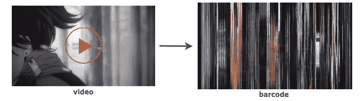
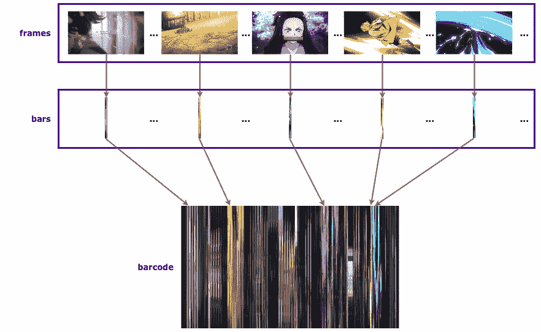
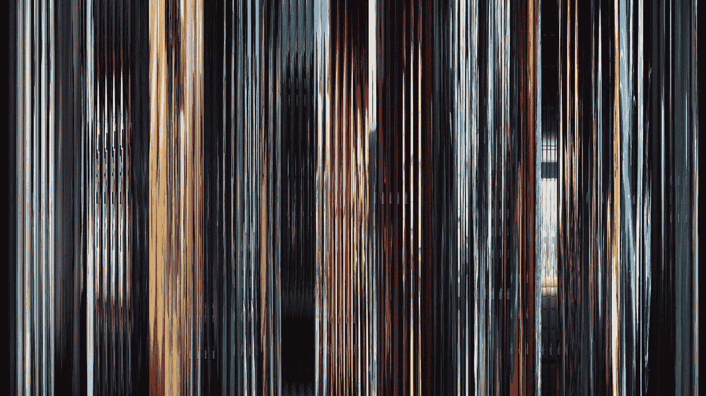

# 将视频制作成条形码

> 原文：<https://medium.com/geekculture/making-videos-into-barcode-graphics-c84f30d6d1fd?source=collection_archive---------37----------------------->

## 这是一个视频，在一个单一的图形中。



Generating a graphic from video frames, image by author

这个项目的灵感来自于在 [Reddit 上关于“电影条形码”](https://www.reddit.com/r/MovieBarcodes/)的一次偶遇，并认为这是一部非常天才的电影——一部本质上由一系列彩色条纹代表的电影(更多例子可以在[这里](https://moviebarcode.tumblr.com)找到)。在后来的想法中，我想尝试制作小规模的视频图形条形码。

# 制作条形码



Overview of the process to make a barcode from a video, image by author

该流程有 3 个步骤:

1.  从视频中获取每一帧
2.  将每一帧“缩小”成条
3.  组合这些条来制作条形码

*初步说明:*

*   *本文中使用的代码示例可以在* [*这里*](https://github.com/kaili-chen/writing-supplements/tree/master/video-barcodes) 找到
*   *示例中使用的视频不在 GitHub 上，您必须找到自己的视频文件*
*   *为了这个例子，我在本地保存了一个视频文件“video.mp4 ”,源文件是* [*这里是*](https://www.youtube.com/watch?v=pmanD_s7G3U)

## 步骤 1:从视频中获取每一帧

这一步使用 cv2 浏览视频，并将每一秒捕捉为图像，或文件夹中的“帧”。

## 步骤 2:将每一帧“缩小”成条

这只是指将每个框架的宽度缩小(调整大小)到类似于一个条形的大小(窄宽度，高高度)。插值设置为 INTER_AREA，根据 [cv2 的文档](https://docs.opencv.org/2.4/modules/imgproc/doc/geometric_transformations.html#void%20resize(InputArray%20src,%20OutputArray%20dst,%20Size%20dsize,%20double%20fx,%20double%20fy,%20int%20interpolation))，这是“图像抽取”或收缩的首选。

```
# reducing the size of image frame to a bar (1 x 920)bar_width = 1
barcode_height = 920bar = cv2.resize(frame, (bar_width, barcode_height), interpolation = cv2.INTER_AREA)
```

## 第三步:将条形组合成条形码

拿到杠后，剩下的就是把杠拼起来。在下面的代码片段中，每一帧(步骤 1 的结果)都被读取，缩减为一个条，并添加到一个空白图像上，以形成一个循环中的条形码。

组合所有片段:

生成的条形码:



Image by author

结果还不算太糟。

# 进一步发展的想法

该代码只是一个基础版本，可以在此基础上构建其他更有趣的东西，例如:

*   使用条形码作为背景(例如用于排版)
*   使用更频繁或更不频繁的帧提取间隔(例如，使每个帧相隔半秒/ 5 秒)
*   改变条的外观或布局(例如，水平、成角度、使用圆形、弧形)