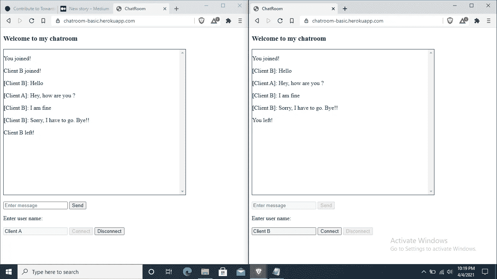

# 创建自己的聊天室:Python、JavaScript 和 HTML 中的套接字

> 原文：<https://medium.com/geekculture/making-your-own-chatroom-sockets-in-python-javascript-html-ac14c2870064?source=collection_archive---------8----------------------->


联系和沟通是成功的关键因素！我们生活的方方面面都离不开通信，从日常谈话到航空公司、国防，一切都严重依赖网络。

这是如此重要，没有定期的沟通，我们的生活将无法立足。所以今天我们将看看如何建立我们自己的聊天室，可以连接世界各地的多个用户！

我们将使用 python 制作服务器，HTML、Javascript 制作客户端。

所以让我们开始编码吧！(我只专注于实现而不是外表，你们比我更有创造力！:D)

让我们先来看看文件结构

```
Chatroom_Client_Server
|_____Static
|     |__js
|        |______socket.io.js
|        |______socket.io.js.map
|_____Templates
|     |_________client.html
|_____server.py
```

现在，我将实现服务器:

必要模块:

1.  瓶
2.  烧瓶浸泡
3.  小事件
4.  格尼科恩

```
from flask import Flask, request, render_template
from flask_socketio import SocketIO, emitapp = Flask(__name__)
socket = SocketIO(app)[@app](http://twitter.com/app).route('/')
def index():
    return render_template('client.html')[@socket](http://twitter.com/socket).on('connect')
def connect():
    print("[CLIENT CONNECTED]:", request.sid)[@socket](http://twitter.com/socket).on('disconnect')
def disconn():
    print("[CLIENT DISCONNECTED]:", request.sid)[@socket](http://twitter.com/socket).on('notify')
def notify(user):
    emit('notify', user, broadcast=True, skip_sid=request.sid)[@socket](http://twitter.com/socket).on('data')
def emitback(data):
    emit('returndata', data, broadcast=True)if __name__ == "__main__":
    socket.run(app)
```

我们创建了一个基本的 flask 应用程序，并在用户登陆 URL 时呈现 client.html 页面。(稍后我们将对此进行说明)；我们通过 app.route('/')来实现这一点，然后为它定义一个函数' index()'。

创建一个名为“socket”的套接字变量。因此，我们在这里处理事件，服务器和客户端都可以发出主要由两部分组成的信号(事件名称、数据)。因此，每当我们需要传输数据时，我们就会发出信号。

#当服务器收到来自客户端的连接信号请求时，它会在控制台中显示客户端已连接及其会话 id。

#断开信号请求的情况也是如此。

#当用户连接时，客户端将发送“通知”事件，表明他已加入聊天。因此，notify()函数从客户机获取一个字符串，并将其广播给除加入的客户机之外的所有客户机。我们使用 emit(event_name，data，broadcast，skip_sid)函数发出信号。

#每当任何用户发送消息时，该消息都使用“数据”事件发送到服务器。服务器使用接受字符串的函数 emitback(data)将数据发送回所有连接的客户端。在函数中，服务器发出一个事件“returndata ”,将数据返回给所有客户端。

#最后，我们使用 socket.run(app)运行应用程序。这里“socket”是在开始时创建的套接字变量，而“app”是 flask app 的变量。

现在我们的，服务器完成了！！

现在我们将使用基本的 HTML 和 Javascript 构建客户端。

```
<!DOCTYPE html>
<html lang="en">
<head>

    <title>ChatRoom</title>
</head>
<body><h3>Welcome to my chatroom</h3>
    <div id="chat" style="width: 500px; height: 400px; border: 1px solid black; overflow-y: scroll;"></div>
    <br>
    <input type="text" id="inp_message" placeholder="Enter message" disabled>
    <button type="submit" id="send" disabled>Send</button>
    <p>Enter user name: </p> <input type="text" id="username" placeholder="Enter an username">
    <button type="submit" id="connect">Connect</button>
    <button type="submit" id="disconnect" disabled>Disconnect</button>

    <script src="../static/js/jquery-3.6.0.min.js"></script>
    <script src="../static/js/socket.io.js"></script>
    <script>let chat = document.getElementById('chat');
        let inp_message = document.getElementById('inp_message');
        let send = document.getElementById('send');
        let username = document.getElementById('username');
        let btn_connect = document.getElementById('connect');
        let btn_disconnect = document.getElementById('disconnect');
        var user = username.value;
        let socket = io({autoConnect: false});btn_connect.onclick = function(){
            if(username.value != ""){
                socket.connect();
            }
            else{
                alert("Please enter an username!");
                console.log("Please enter an username!");
            }
        };

        socket.on('connect', function(){
            inp_message.disabled = false;               
            send.disabled = false;                      
            username.disabled = true;                   
            btn_connect.disabled = true;                
            user = username.value;                      
            socket.emit('notify', user + " joined!");   
            btn_disconnect.disabled = false;ptag = document.createElement('p');
            ptag.innerHTML = "You joined!";
            chat.appendChild(ptag);console.log("Connected to server!");
        });socket.on('disconnect', function(){
            ptag = document.createElement('p');
            ptag.innerHTML = "You left!";
            chat.appendChild(ptag);console.log('Disconnected to server!')
            inp_message.disabled = true;               
            send.disabled = true;                      
            username.disabled = false;              
            btn_connect.disabled = false;           
            btn_disconnect.disabled = true          
            socket.close();
        });socket.on('notify', function(status){
            ptag = document.createElement('p');
            ptag.innerHTML = status;
            chat.appendChild(ptag);
        });btn_disconnect.onclick = function(){
            socket.emit('notify', user + " left!");   
            socket.close();
        };send.onclick = function(){
            socket.emit('data', "["+user+"]: " + inp_message.value);
            inp_message.value = "";
        };socket.on('returndata', function(data){
            ptag = document.createElement('p');
            ptag.innerHTML = data;
            chat.appendChild(ptag);
        });</script>
</body>
</html>
```

HTML 代码对于脚本标签来说是不言自明的！

所以我从脚本标签解释。您必须同时包含 socket.io.js 和 socket.io.js.map 文件。我会给出下载链接。你必须通过右键点击来保存它。(如果您愿意，您可以包含 socket.io 的 CDN，那么您不需要包含 socket.io.js & socket.io.js.map 文件)。

socket.io.js 的链接:[https://raw . githubusercontent . com/socket io/socket . io-client/master/dist/socket . io . js](https://raw.githubusercontent.com/socketio/socket.io-client/master/dist/socket.io.js)

socket.io.js.map 的链接:[https://raw . githubusercontent . com/socket io/socket . io-client/master/dist/socket . io . js . map](https://raw.githubusercontent.com/socketio/socket.io-client/master/dist/socket.io.js.map)

#我们通过以下代码获取 HTML 元素和值:

```
let chat = document.getElementById('chat');
let inp_message = document.getElementById('inp_message');
let send = document.getElementById('send');
let username = document.getElementById('username');
let btn_connect = document.getElementById('connect');
let btn_disconnect = document.getElementById('disconnect');
var user = username.value;
```

#我们创建一个名为“socket”的套接字变量并传递一个参数，这样它就不会自动连接

```
let socket = io({autoConnect: false});
```

#输入用户名并单击连接按钮后，套接字必须连接到服务器，否则会弹出一个必须输入用户名的弹出窗口。我们通过以下代码来实现这一点:

```
btn_connect.onclick = function(){
    if(username.value != ""){
        socket.connect();
    }
    else{
        alert("Please enter an username!");
        console.log("Please enter an username!");
    }
};
```

#当用户成功连接时，启用发送消息的文本区域，启用发送按钮，禁用用户名的输入字段，禁用连接按钮，将用户名保存在名为“user”的变量中，发出信号“notify”，启用断开按钮，创建一个段落标记并将其附加到聊天区域(div 元素)

我们通过以下代码来实现这一点:

```
socket.on('connect', function(){
    inp_message.disabled = false;               
    send.disabled = false;                      
    username.disabled = true;                   
    btn_connect.disabled = true;                
    user = username.value;                      
    socket.emit('notify', user + " joined!");   
    btn_disconnect.disabled = false;ptag = document.createElement('p');
    ptag.innerHTML = "You joined!";
    chat.appendChild(ptag);console.log("Connected to server!");
});
```

#当用户从服务器断开连接时，我们创建一个段落标记并将其附加到聊天部分，禁用输入消息文本区域，禁用发送按钮，启用用户名输入字段，启用连接按钮，禁用断开按钮。

我们通过下面的代码做到这一点

```
socket.on('disconnect', function(){
    ptag = document.createElement('p');
    ptag.innerHTML = "You left!";
    chat.appendChild(ptag);console.log('Disconnected to server!')
    inp_message.disabled = true;               
    send.disabled = true;                      
    username.disabled = false;              
    btn_connect.disabled = false;           
    btn_disconnect.disabled = true          
    socket.close();
});
```

#但我们如何分离？？通过点击断开按钮。当我们点击这个按钮时，一个“通知”事件被发送到服务器，以便它可以向每个连接的用户广播您已经离开聊天。最后，我们关闭套接字连接。

```
btn_disconnect.onclick = function(){
    socket.emit('notify', user + " left!");
    socket.close();
};
```

#现在，如果您注意到当客户端连接时，服务器会向每个客户端发送一个“通知”事件，告知用户已加入聊天。它将接收一个字符串，并创建一个段落标签，并将其附加到聊天部分。

我们使用下面的代码实现了这一点

```
socket.on('notify', function(status){
    ptag = document.createElement('p');
    ptag.innerHTML = status;
    chat.appendChild(ptag);
});
```

#每当用户点击发送按钮，它必须发送消息给每个连接的用户。

```
send.onclick = function(){
    socket.emit('data', "["+user+"]: " + inp_message.value);
    inp_message.value = "";
};
```

#最后，来自服务器的消息需要从用户侧接收。因此，当我们从服务器获得“returndata”事件时，它必须创建一个段落标记；将消息添加到

标签中，并添加到聊天部分。

我们可以用代码做到这一点

```
socket.on('returndata', function(data){
    ptag = document.createElement('p');
    ptag.innerHTML = data;
    chat.appendChild(ptag);
});
```

这样我们就完成了一个真实的生活，工作聊天室，用户可以连接到它在世界上任何地方！！

是的，正如我所说的，用户可以从任何地方连接，但在此之前，你必须将其部署在某个地方。因此，如果您想要部署，只需将以下文件添加到您现有的目录中。

```
Chatroom_Client_Server
|_____Static
|     |__js
|        |______socket.io.js
|        |______socket.io.js.map
|_____Templates
|     |_________client.html
|_____server.py
|_____Procfile
|_____requirements.txt
|_____runtime.txt
```

# Procfile(其扩展名不是。txt，是一个没有扩展名的文件。您可以使用任何 IDE 创建它，或者如果您使用 linux，则使用“touch”命令)

在 Procfile 中添加以下内容；“服务器”是您的 python 文件的名称。如果您使用其他名称命名 python 文件，请将其替换为您的 python 文件名。

```
web: gunicorn --worker-class eventlet -w 1 server:app
```

# requirements.txt

您可以在命令提示符下使用以下命令创建您的 requirements txt 文件(使用“cd”更改项目文件夹内的目录)，或者您可以键入创建项目所需的模块的名称。

```
pip freeze > requirements.txt
```

# runtime.txt

在这个文件中写下将要使用的 python 版本。在这种情况下，我的 python 版本是 3.9.2。所以按照你的版本写下以下内容。

```
python-3.9.2
```

所以我们完了！！现在你要把这些文件推到你的 GitHub 里，把你的 GitHub 和你的 Heroku 账号连接起来。并部署它。

我给它将如何看截图。



Demo: Chatroom based on client-server model

恭喜你已经建立了自己的聊天室！

要了解更多关于 socket 的信息，请访问:[https://www.youtube.com/watch?v=PlylJnrS4zI&list = plxcjk 2 szupsq 79 prvnznjgghuriv 8 roz](https://www.youtube.com/watch?v=PlylJnrS4zI&list=PLxcjK2sZUphSQ79prVNzNjggHuRIv8RoZ)