# 商场客户细分和形成增长策略

> 原文：<https://medium.com/geekculture/mall-customer-segmentation-and-forming-growth-strategies-cc4130a0f4d7?source=collection_archive---------14----------------------->

> 使用 Python 来验证 K-Means、层次聚类和 GMM 的性能，使用剪影得分并挑选最佳模型来细分客户信息，并为每个组制定增长策略

Photo by [Jezael Melgoza](https://unsplash.com/@jezael?utm_source=medium&utm_medium=referral) on [Unsplash](https://unsplash.com?utm_source=medium&utm_medium=referral)

# **数据集概述**

这是一个来自 [Kaggle](https://www.kaggle.com/vjchoudhary7/customer-segmentation-tutorial-in-python) 的商城数据集，里面有一些关于顾客的基本数据，比如顾客 ID，年龄，性别，年收入，消费分数。

# **问题陈述**

我想通过将客户细分为几个具有相似特征的群体，并为每个群体制定增长战略，来增加客户的终身价值。

# **分析过程**

(如果你感兴趣，请在此查看[完整代码](https://github.com/YuehHanChen/Mall_Customer_Segmentation)。)

> 1.评估数据
> 
> 2.预处理
> 
> 3.选择正确的 K 和正确的模型
> 
> 4.命名和绘制聚类结果
> 
> 5.分析和形成增长战略
> 
> 6.可能的增长战略总结

> **1。评估数据**

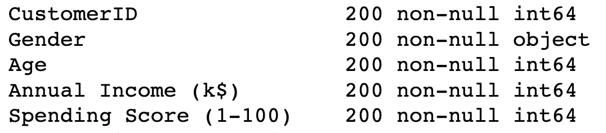

Photo by author

该数据集有 5 列、200 行、0 个重复行和 0 个缺失值。

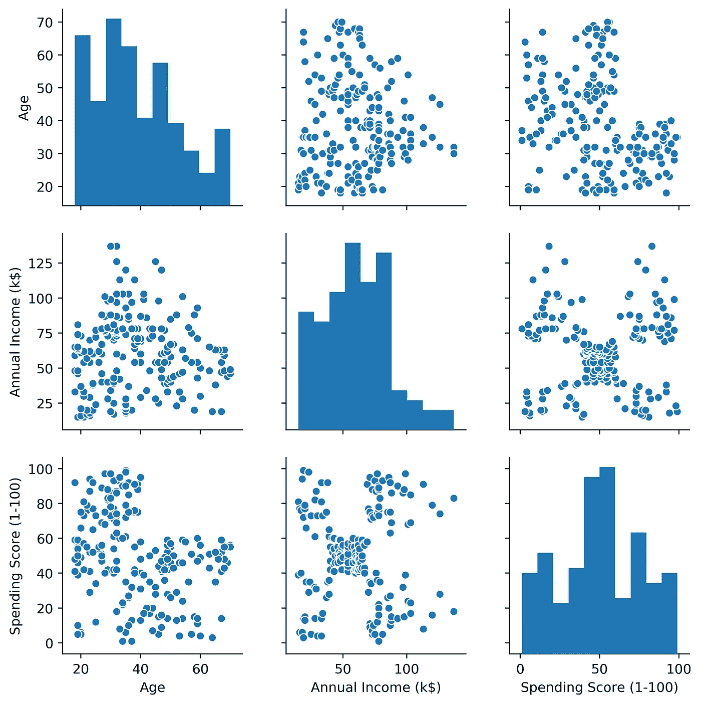

Photo by author

注 1:年龄和年收入稍微偏右，支出得分接近正态分布。

注 2:对于散点图，特征之间没有明显的相关性。

让我们看一下关联热图，看看关联分数。

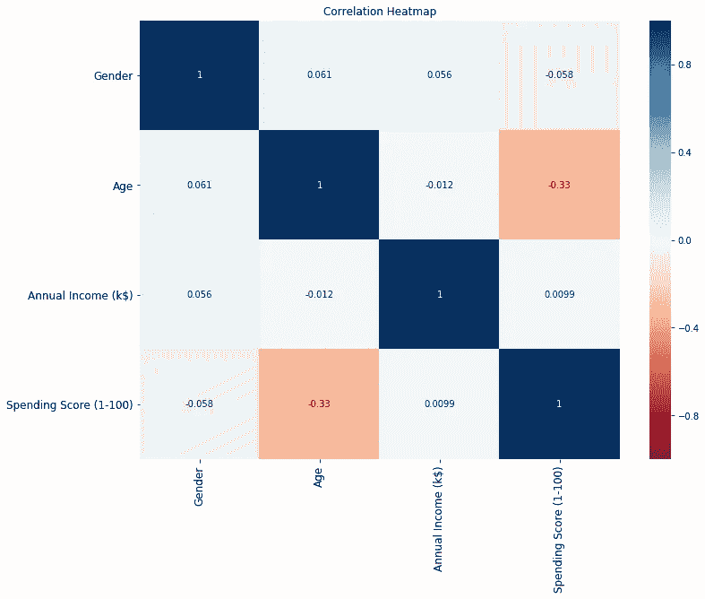

Photo by author

注 1:唯一稍强的相关性是在花费分数和年龄之间，0.33，但它们是负相关的。

> **2。预处理**

年龄和年收入只是稍微偏右，所以我没有归一化。在这里，在评估数据之后，我将:

*   **删除性别，因为性别不是一个连续的特征**
*   **标准化数据**

> **3。选择合适的 K 和型号**

为了选择正确的 K，我使用了两种方法:肘法**和侧影评分**。****

**肘法**

在肘方法中，创建一个 x 轴上的聚类数与 y 轴上聚类中心到每个点的平均距离的关系图。这个图被称为碎石图。平均距离总是随着每个附加的聚类中心而减小。而且，随着集群的减少，这种减少将更加显著。在某种程度上，添加新的聚类将不再会导致平均距离的显著减少。这个点被称为肘部。

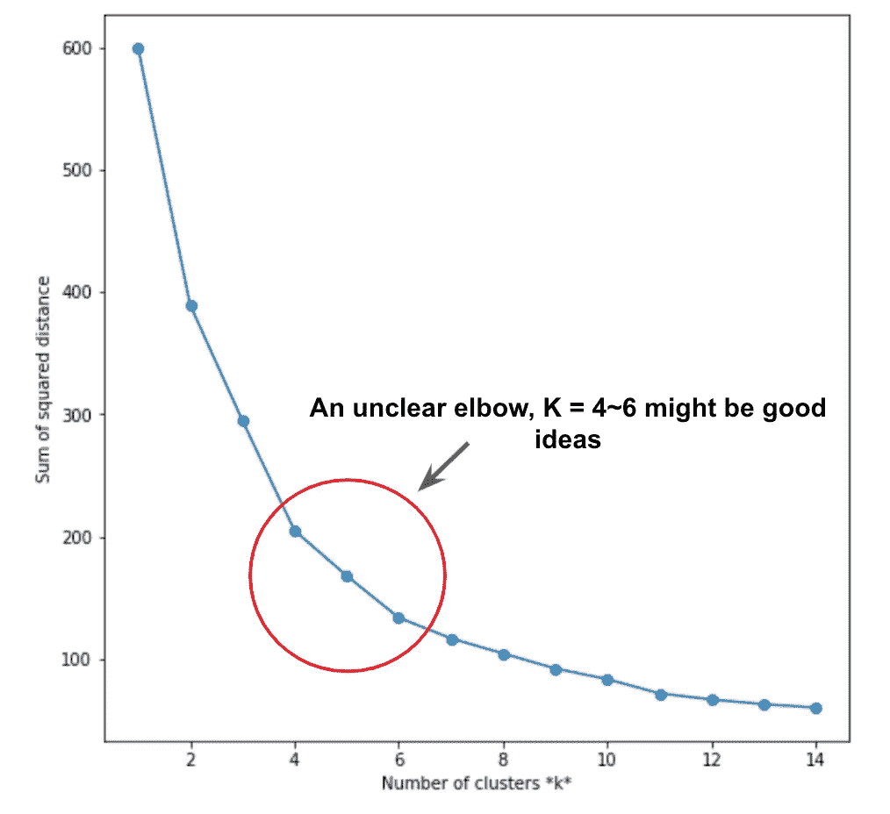

现在，我们可以看到这里的肘方法给了我们一个不清楚的肘，看起来 K = 4~6 可能是个好主意。因此，让我们尝试另一种方法，叫做，**剪影评分。**

**剪影评分**

轮廓分数将计算来自同一聚类中所有数据点的平均距离，比如说 A。来自最近聚类中所有数据点的平均距离，比如说 B。计算系数，(B -A)除以 A 或 B 的最大值，如果 A 大于它将是分母，反之亦然。而**的值将在-1 到 1 之间。**数字越高，k 越好。

在这里，我想做一些更有趣的事情。**剪影评分不仅可以用来选择合适的 k，还可以用来选择性能最好的模型。**因此，我创建了在不同 Ks 中绘制 **KMeans、层次聚类和 GMMs** 剪影得分的函数(我没有使用 DBSCAN 的原因是剪影得分没有噪声的概念，所以即使 DBSCAN 表现很好，它仍然可能得到很低的剪影得分)。这样，我们可以看到哪个聚类在哪个 k 下表现最好。

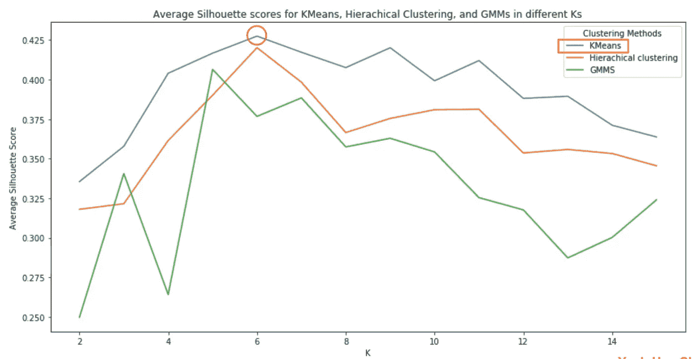

Photo by author

我们可以在这个图中看到:

*   KMeans 在 k=6 时表现最佳，得分为 0.428
*   当 k=6 且得分为 0.42 时，层次聚类的性能最佳
*   当 k=5 且得分为 0.406 时，GMMs 表现最佳

**选模结论:k =6 时，k 表示**

> **4。命名并绘制聚类结果**

让我们运行 k=6 的 KMeans，并计算每个组的汇总统计信息:

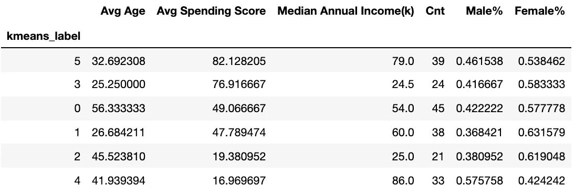

Photo by author

评估结果后，我决定以这种方式命名每个组:

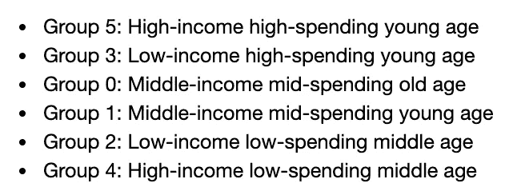

现在，让我们为每组绘制雷达图。

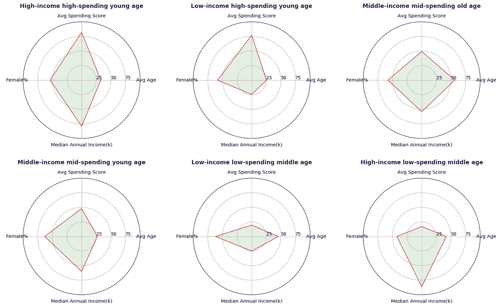

Photo by author

通过雷达图可以更清楚的看到每组的特点。下一步是形成发展战略，我将逐一向你们介绍每一组。

> **5。分析并形成增长战略**

首先，我想列出所有我认为适用于购物中心业务的提高客户终身价值的常见增长策略:

*   **新客户计划**
*   **忠诚度计划**
*   **追加销售/推荐新品牌或高价品牌**
*   **转诊方案**
*   **针对即将流失客户的激励计划**
*   **赢回流失客户的激励计划**

然后，我们可以分析每一组，看看上面列出的哪些增长战略可以适用于他们。

# **第一组**

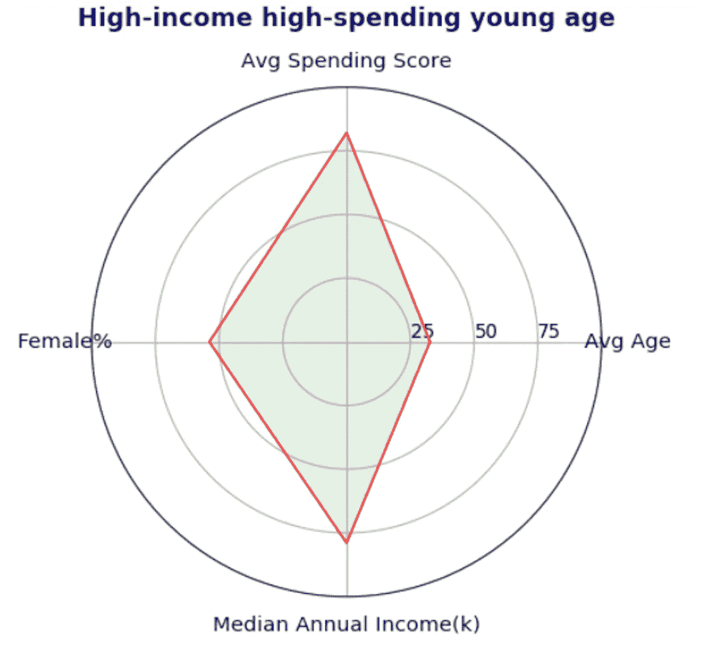

***描述***

这个群体由在购物中心大量消费的富人组成。由于他们非常年轻，他们的收入在未来可能会增加更多，因此保持他们的忠诚度将是主要策略。

***可能的成长策略***

1.  忠诚度计划
2.  向上销售
3.  推荐计划

其次，由于他们有花钱的能力，我们也可以尝试销售更多他们不知道自己需要的高端品牌或新产品。

最后，因为他们在购物中心花了很多钱，我想他们真的很享受在我们购物中心的购物体验。所以，让他们推荐他们的朋友去我们的商场可能是个好主意。此外，他们的朋友也可能是富有和高消费的。

# 第二组

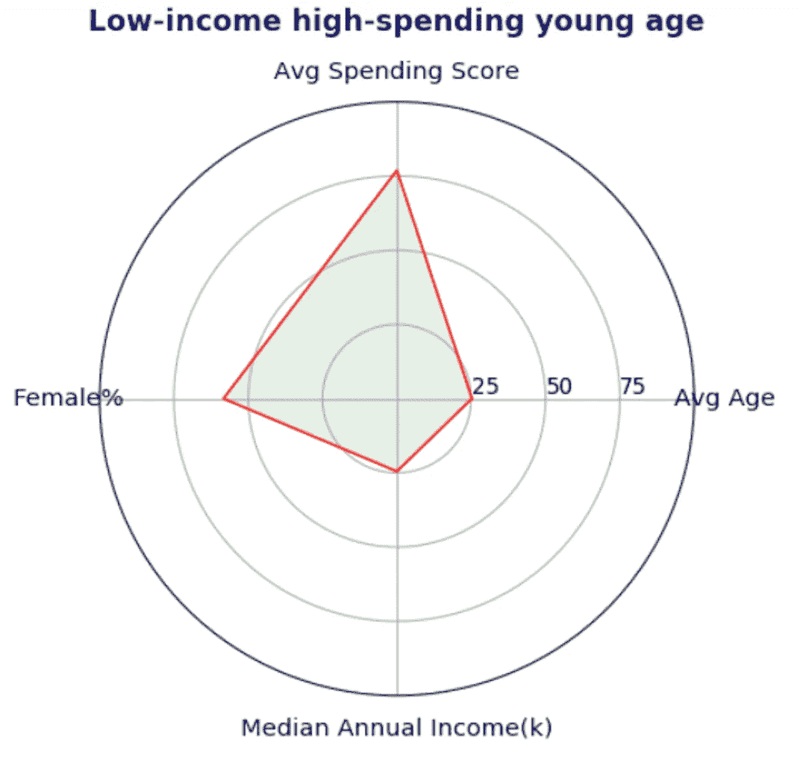

***描述***

第二组由低收入但消费高的顾客组成。而且他们是所有群体中最年轻的。

***可能的成长策略***

1.  推荐计划
2.  忠诚度计划

这个群体的主要策略是推荐计划，原因有三:首先，我们可以看出他们真的很喜欢我们的商场，因为他们是低收入群体，但在我们身上花了很多钱。其次，鉴于他们的财务状况，他们可能比其他群体更看重折扣。第三，他们还很年轻，这意味着他们更有可能在社交媒体上分享东西或邀请他们的朋友来购买产品。

# 第三组

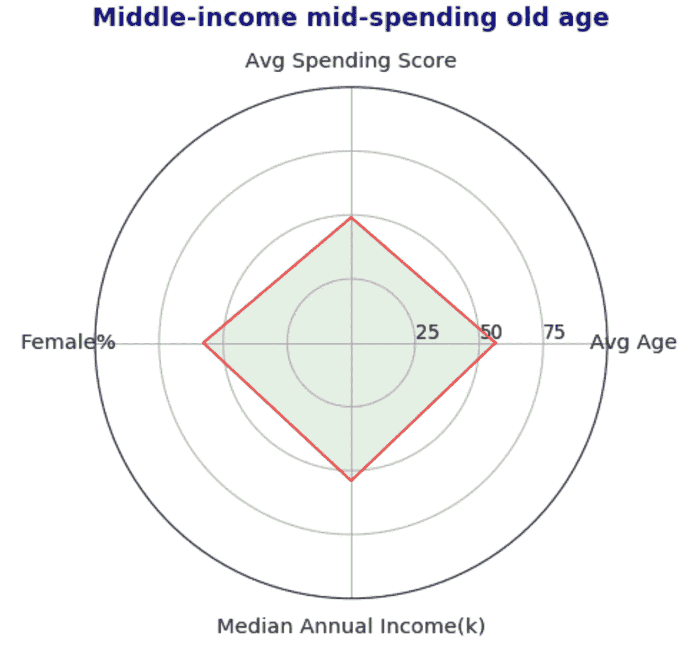

***描述***

第三组由中等收入和中等支出记录的相对老的客户组成。

***可能的增长策略***

1.  忠诚度计划

鉴于有限的信息量，我假设他们已经是长期客户，所以他们的购买行为在未来不会有太大的改变，所以保持他们的忠诚度是这个群体的主要策略。

# 第四组

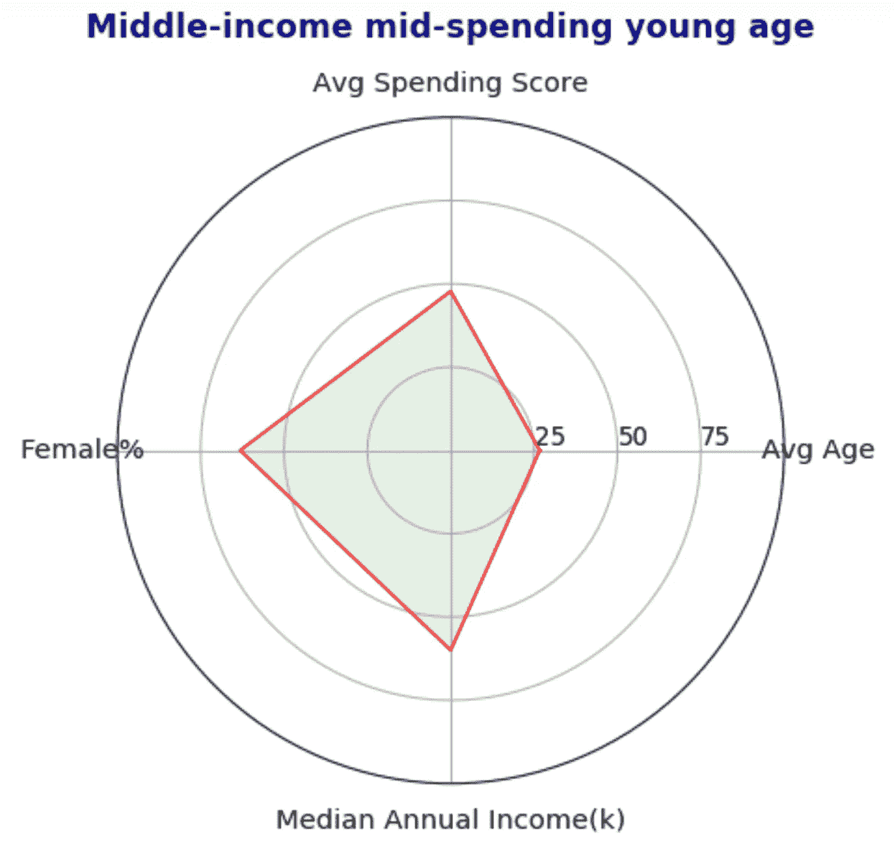

***描述***

第 4 组与第 3 组相似，只是平均年龄更小，女性顾客更多，占该组顾客的 63%。主要战略也是一个忠诚度计划，但重点是女性产品。

**可能的增长战略**

1.  专注于女性产品的忠诚度计划

# 第五组

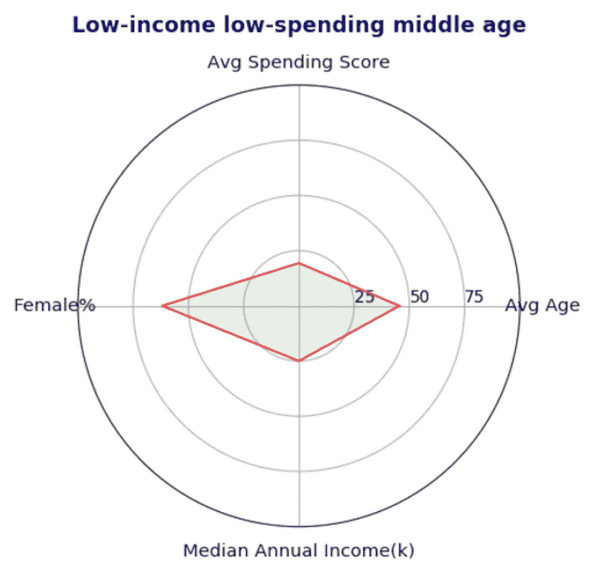

***描述***

第五组是最不理想的一组，因为他们是低消费和低收入的。

***可能的*成长策略**

没有人

***进一步探索方向***

调查他们为什么花费这么少，是因为他们收入低，保持单身，还是我们面临新的竞争对手或其他原因？

# 第六组

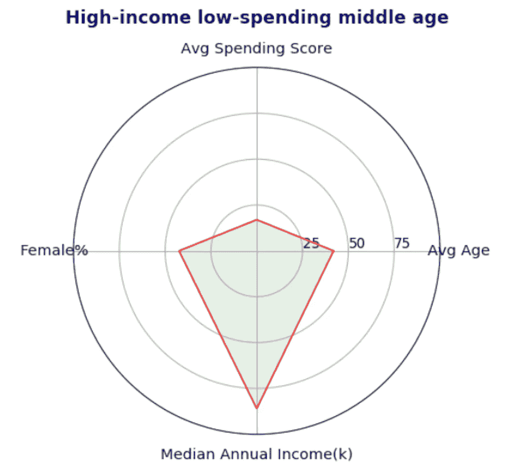

***描述***

第 6 组是高收入但低消费的群体，男性比例为 58%。

***可能的成长策略***

1.  新客户计划
2.  赢回流失客户的激励计划
3.  推荐高价产品

我的三个猜测是:第一，他们只是新顾客，第二，他们是流失的顾客；第三，他们大多在更高端的商场购物。原因值得进一步调查。

> 6.**可能的增长战略总结**

> **忠诚度计划:第 1、2、3、4 组**
> 
> **转诊计划:第 1、2 组**
> 
> **追加销售:第 1 组，第 6 组**
> 
> **新客户/流失客户项目:第 6 组**

让我逐一介绍一下每个策略:

**忠诚度计划:第 1、2、3、4 组**

对于忠诚度计划，我推荐购物中心目标群体 1、2、3 和 4 来保持或增加顾客忠诚度。有几种方法可以形成一个忠诚度计划。一个常见的方法是，我们可以建立，例如，3 至 5 个级别的会员，级别越高，他们有更多的折扣和优惠，并根据每月或每年的消费金额计算状态。

有了这样的激励措施，我们可以预测这些群体中希望保持现状或提升到更高地位的顾客会在我们的商场上花费一定数量的钱，这样我们就可以保持他们的忠诚度。

**转介计划:第 1、2 组**

对于推荐计划，购物中心可以将目标群体 1 和 2 作为目标群体，因为他们是两个消费最多的群体，并且年龄较轻，这意味着他们推荐朋友的机会高于年龄较大的群体。要构建一个推荐方案，我推荐[这篇热点文章](https://blog.hubspot.com/service/customer-referral-program)。

它显示了建立推荐计划的一步一步的过程，包括确定什么是“适合”你的公司，列出可能的客户推荐来源，确定主持你的推荐计划的渠道等。大多数推荐计划的激励措施是折扣或免费产品。

**追加销售:第 1 组，第 6 组**

为了追加销售客户，我们可以瞄准第 1 组和第 6 组，因为他们是收入最高的群体。对于商场企业来说，最常见的沟通和追加销售渠道是电子邮件或短信。我们可以首先探索这些客户经常购买的产品类型，然后运行另一种聚类方法来找到更小的组，并向每个组发送相同产品类型的更高端品牌的折扣促销。

**新客户/流失客户项目:第 6 组**

最后，第六组是一个不寻常的群体，他们花得很少，但赚得很多。我们可以进一步调查他们花费如此之少的真正原因。因为他们有潜力增加我们的 GMV，所以固定这个群体有很高的可能回报。如果他们中的大多数是流失的客户，我们可以尝试使用电子邮件或短信给他们打电话，让他们享受他们还是我们的客户时经常购买的产品的折扣。

如果他们大多数是新客户，那么我们可以建立一个新客户计划。而新客户计划的核心就是让他们尽快了解我们商场或者我们特色产品的价值。为此，我们可以向他们推销我们最受欢迎的打折商品，或者让他们在第一个月成为我们最高级别的会员，这样他们就可以立即体验到成为我们商场重要顾客的核心好处。

# 关于作者

John(Yueh-Han) Chen 目前是计算机科学专业的大二学生，主修数据科学、产品分析和用户增长。([在 Linkedin 上跟我打招呼](https://www.linkedin.com/in/yueh-han-chen/))。)

引用作品:

马德琳·拉普兰特-杜贝。*如何建立客户推荐计划*热点。2021 年 6 月 14 日。[https://brianbalfour . com/landing/p-customer-acquisition-hybrid](https://brianbalfour.com/landing/p-customer-acquisition-hybrid)