# 为您的文档提供简单、清晰的版本控制

> 原文：<https://medium.com/geekculture/manage-the-revisions-of-your-documents-with-svn-4e2a4d2e5618?source=collection_archive---------22----------------------->

为了让所有参与者保持同步，跟踪项目中每个文档的变更是非常重要的。在这篇文章中，我们将看到一些编码工具，如 SVN，是如何被用于这一目的的。

我们将从描述版本和配置控制的原则开始。然后，我将指导您安装和使用应用于项目文档管理的 SVN。

# 配置控制

我们已经在关于文档内容组织的前一篇文章中讨论了如何跟踪文档的变化。如果每个用户都记得激活 Microsoft Office 修订跟踪工具，那么它在这方面非常有用。

然而，一个项目只有一个文档是非常罕见的。正如我们已经看到的，文档是链接在一起的。例如，一个测试文档依赖于一个需求文档。

我们还介绍了当一个文档发生变化时，依赖于它的其他文档也必须更新。事实上，如果在 V1 修订版中最终确定的需求文档需要做一些更改，该文档的修订版将更改为 V2。由于 V1 版本的测试文件依赖于 V1 的需求文件，因此必须更新到 V2 版本，以符合需求文件的新版本。

这样，我们获得了两种不同的文档配置。第一个引用两个文档的 V1 版本，第二个引用两个文档的 V2 版本。因此，我们所说的配置控制是允许我们将不同文档的不同修订链接在一起的工具。通过扩展，它使我们能够找到在项目时间表的给定时间一起工作的一组有凝聚力的文档。

当然，并非所有文档都会在配置之间发生变化。例如，一些关于标准的文档(例如 ISO)可能是配置的一部分，很少改变。

同时，一些文档可以出现在一个配置中，而不出现在以前的配置中。例如，如果一个文档变得越来越复杂，并且为了更好的可维护性而被分成两个独立的文档，就会发生这种情况。

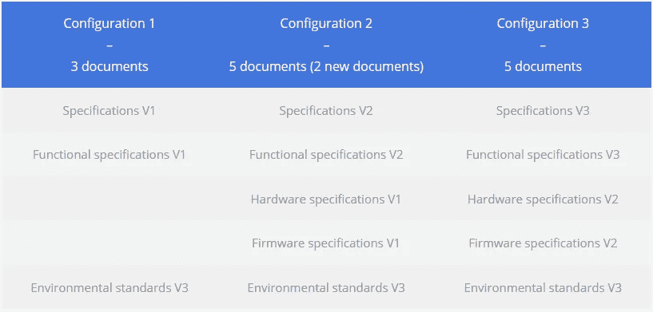

Project’s documents configurations example

文档的版本号可能(而且几乎总是)不同于相应配置的版本号。配置实际上让我们将每个文档的一个修订组合在一起，以“冻结”项目文档的一致状态。

# 使用 SVN 进行文件版本控制

互联网上充斥着你可能已经知道的文档管理系统(DMS 或 EDM)。对于管理成千上万文档的大公司来说，这些工具是正确的选择。

在本文中，我将建议一个可以快速设置的解决方案，它可以直接与 Windows 文件资源管理器集成。Linux 也有类似解决方案，如果您需要，我很荣幸向您介绍。

这个解决方案使用了一款几年前在软件开发界广为人知的软件:SVN(全称 Apache**S**ub**V**ersio**n**)。

LogoSVN

对于阅读本文的软件开发人员来说，如果他们问自己为什么应该使用 SVN 而不是现在显然更流行的 Git，我会说流行不是一切。对于开发人员来说，Git 相对于 SVN 的主要优势在于它是去中心化的。这意味着，虽然明显过于简化，但使用它不需要互联网连接。但是这样做很好，因为程序员处理的文件是原始文本，没有格式化，容易合并。文档文件通常是几乎不可能自动合并的 MSWord 或 pdf。我们将不得不在编辑文件之前锁定它们，这对于像 Git 这样的分散式系统来说是相当困难的。**题外话结束！**

SVN 是一个版本控制系统，创建于 21 世纪初，以接替 CVS。这是一个集中式系统，也就是说，它运行在客户机-服务器结构中。每个客户端(用户、文档贡献者……)在其计算机上保存项目的文档，并且这些文档与服务器同步(就像云中的目录)。然后，用户对文档所做的更改被提交(交付)到服务器，以便其他用户检索文档的新修订。SVN 服务器就像一个“真理之源”，允许每个项目贡献者共享最新的文档。

# SVN 安装和首次提交

要理解如何使用 SVN 来共享一组文档并管理它们的修订和配置，没有什么比实践更好的了。

## 安装乌龟

TortoiseSVN 是 SVN 的客户端软件。它得益于与 Windows 文件资源管理器的良好集成。澄清一下，SVN 是一种技术，一种版本控制的协议，而 TortoiseSVN 是一种允许我们从电脑上使用 SVN 的软件。

让我们从下载 TortoiseSVN 最新版本开始。你会在那里找到它:https://tortoisesvn.net/downloads.html。在我写这篇文章的时候，修订版 1.14.0 是最后一个。单击与您的计算机系统(32 或 64 位)相对应的按钮。下载应该开始。

然后执行下载的文件(在我的例子中它被命名为*TortoiseSVN-1 . 14 . 0 . 28885-x64-SVN-1 . 14 . 0 . MSI*)。点击每个步骤的“下一步”。

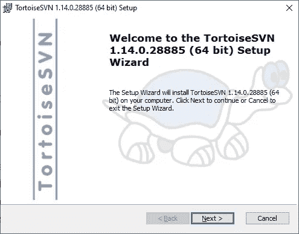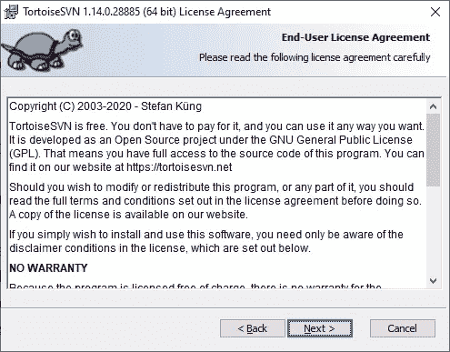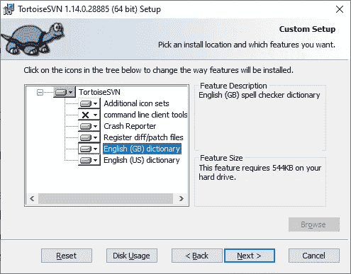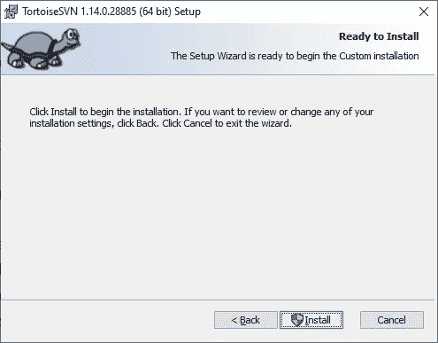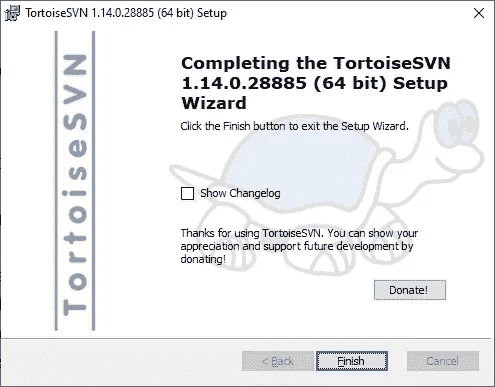

TortoiseSVN installation steps

TortoiseSVN 工具应该出现在计算机的“开始”菜单中:

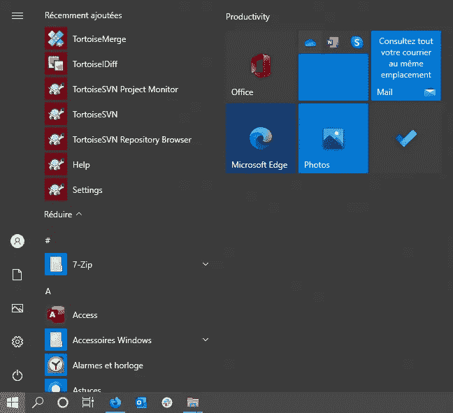

TortoiseSVN in the start menu

以及 Windows 文件资源管理器的上下文菜单中(在资源管理器中右键单击) :

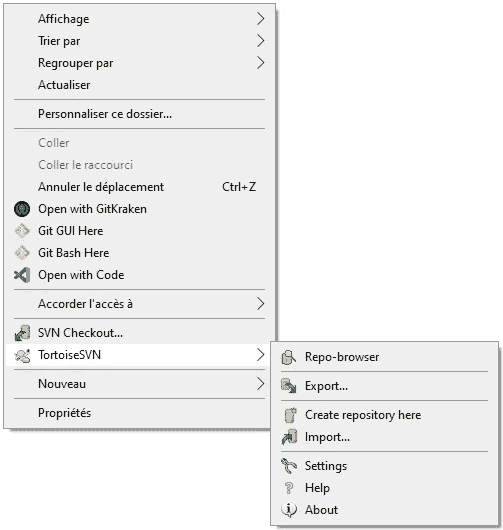

TortoiseSVN in the context menu of Windows file explorer

## 在 RiouxSVN 上创建一个存储库

你应该记得 SVN 遵循的是客户机-服务器体系结构。您刚刚在计算机上安装了客户端软件。是时候在服务器上创建一个存储库了。我们所说的“储存库”就是我们前面谈到的“真理之源”。

在本教程中，我们将使用免费的在线 SVN 库托管服务。前往 [RiouxSVN](https://riouxsvn.com/) 报名。

完成后，进入 https://riouxsvn.com/repositories/[的仓库浏览器](https://riouxsvn.com/repositories/)，点击“创建新仓库…”。

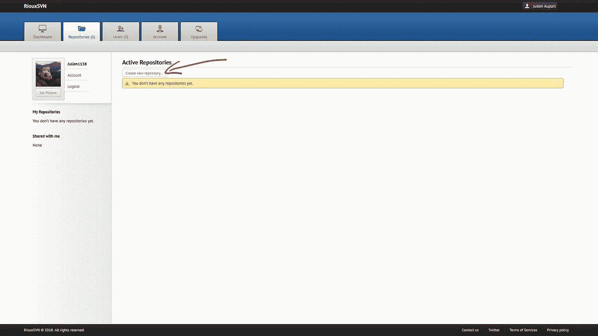

RiouxSVN — Create a new repository 1/6

给它一个标题和名字。选择标题没有规则。该名称只能包含小写字母，不能包含空格。我不是 RiouxSVN 的创造者，不要问我标题和名字的区别，我毫无头绪！但这无关紧要。点击“下一步”。

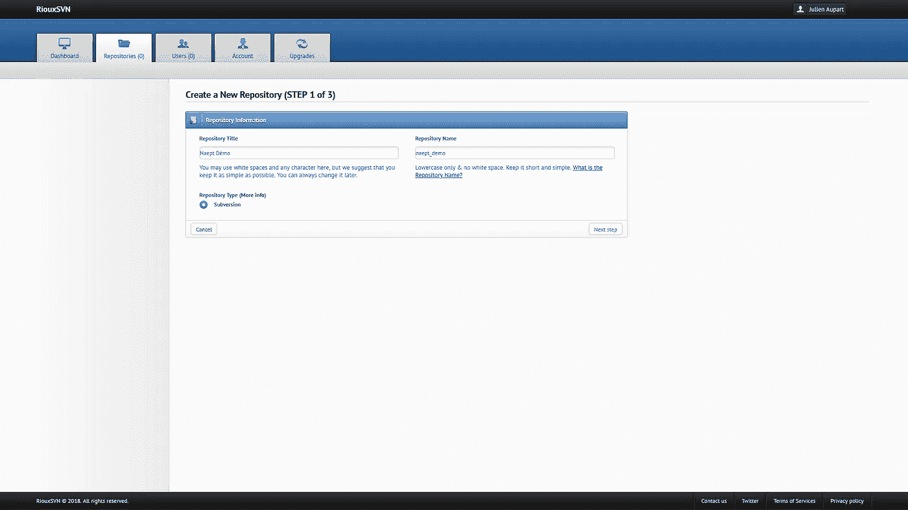

RiouxSVN — Create a new repository 2/6

在下一个屏幕上，选中“创建主干、分支和标签目录”选项。点击“下一步”。

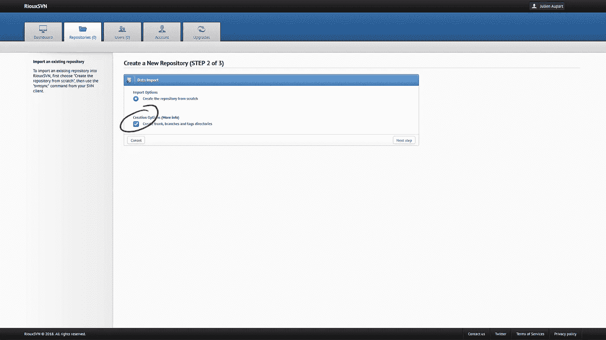

RiouxSVN — Create a new repository 3/6

在此屏幕上，您可以订阅此存储库中的通知。每次用户对存储库进行更改时，您都会收到一封电子邮件。这在某些情况下可能是有用。如果需要，您可以在以后更改此行为。单击“确认创建”以完成存储库的创建。

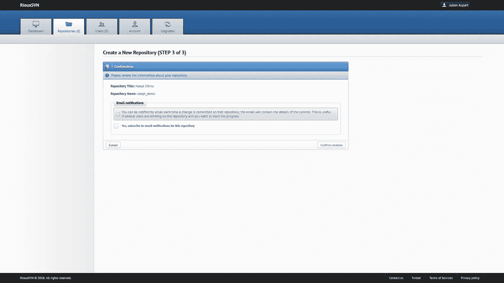

RiouxSVN — Create a new repository 4/6

该存储库现在出现在您的存储库列表中。点击它的标题。

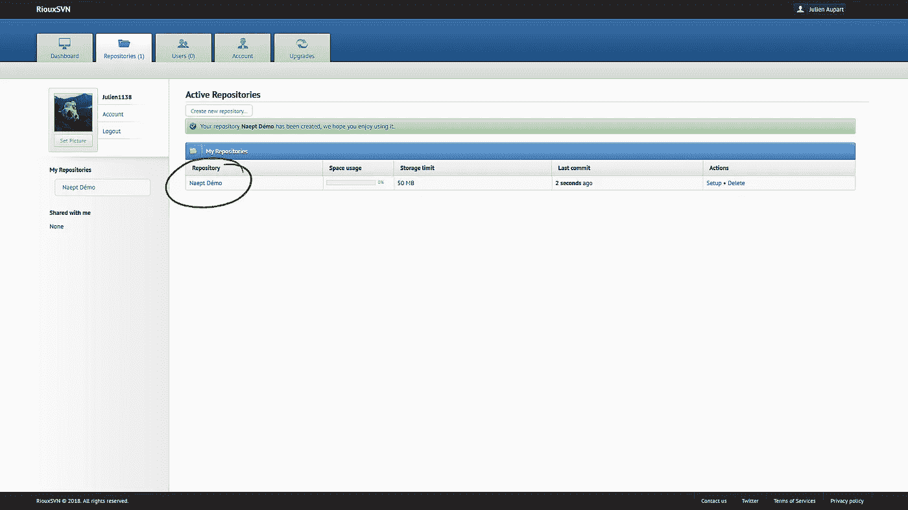

RiouxSVN — Create a new repository 5/6

在这个屏幕上，您将找到刚刚创建的存储库的 URL。复制它(选择它并按 Ctrl+C)。下一步你会用到它。

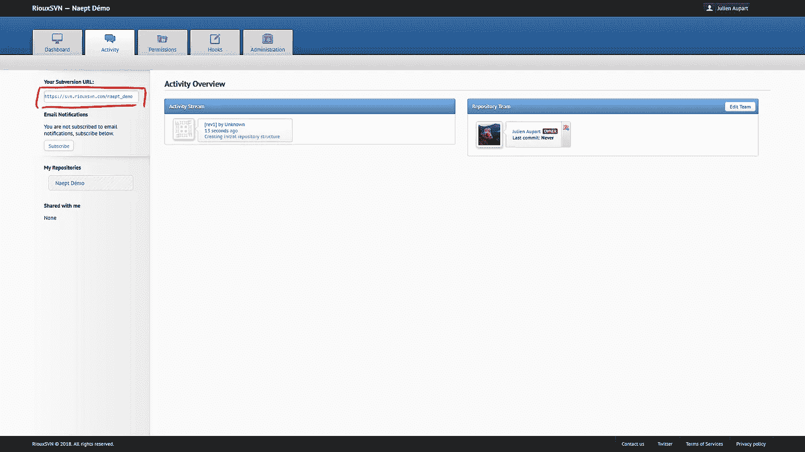

RiouxSVN — Create a new repository 6/6

## 同步服务器和客户端

为本教程项目设置 SVN 的最后一步是使用您的 TortoiseSVN 客户机将您计算机上的一个目录链接到托管在 RiouxSVN 上的存储库(您刚刚创建的那个)。

为此，在计算机上的任意位置为此项目创建一个新目录。如果你不能决定，我们为[写了一篇文章，可以帮助你](https://www.naept.com/en/blog/how-to-organize-all-your-documents/)。然后右击这个目录，选择“SVN 结帐”。将打开一个对话框。这是您应该粘贴(Ctrl+V)在前面步骤中复制的 URL 的位置。然后点击确定。

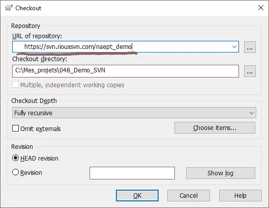

SVN Checkout

您将被要求使用您的 RiouxSVN 帐户登录。如果您不想在每次操作时都重新输入凭据，请不要忘记选中“保存身份验证”选项。点击确定。

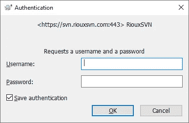

Log in with your RiouxSVN credentials

一个对话框显示已执行的事务。

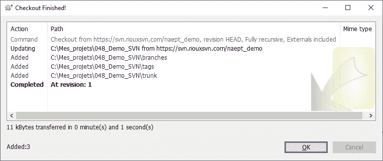

SVN Checkout Finished!

TortoiseSVN 已经将服务器存储库中名为“trunk”、“tags”和“branches”的 3 个子目录复制到您的目录中。您可以在文件资源管理器中看到:

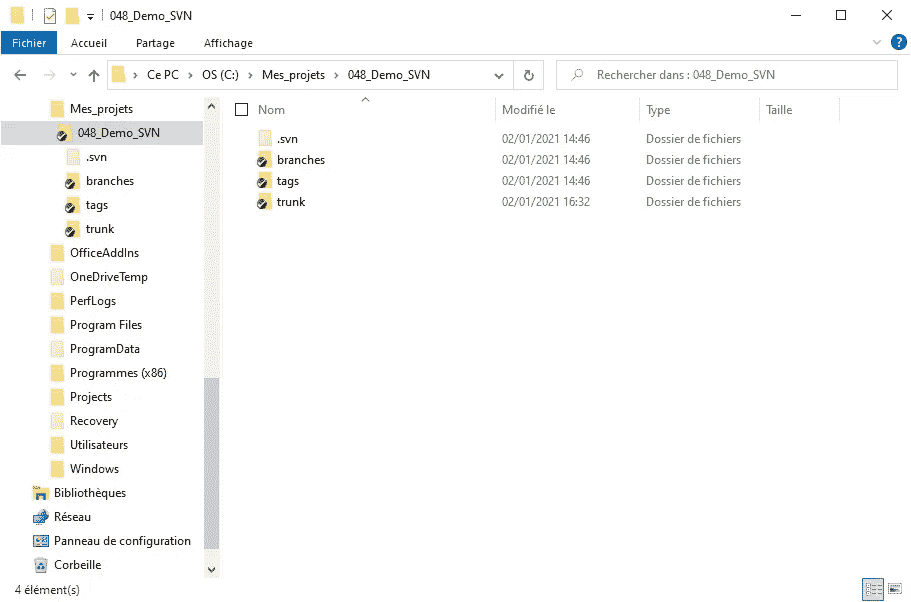

Project directory content after first checkout

的。svn 目录是一个隐藏目录。您可能在文件资源管理器中看不到它。没关系。
“主干”目录是主目录。这将是您的工作空间目录。
“tags”目录是我们在本文开头谈到的不同配置的目录。
“分支”目录在更复杂的项目中很有用。我们将把它留到今天。

如果您没有看到绿色圆圈上的小勾号，请重新启动电脑。TortoiseSVN 在文件浏览器中添加了覆盖图标，以指示存储库的不同文件和目录的同步状态。

## 保存您的第一个文件

我们经常忘记谈论它，但是版本控制软件的主要资产之一是备份。事实上，这些文件都托管在服务器上，以便所有客户端保持最新。由于保存了每个更改，甚至有可能及时旅行并恢复任何给定(过去)日期和时间的每个文件(或文件组)的状态。

让我们想象一下，您刚刚收到了您的这个新项目的一个规范文档。你只需要把它移动到项目目录中。

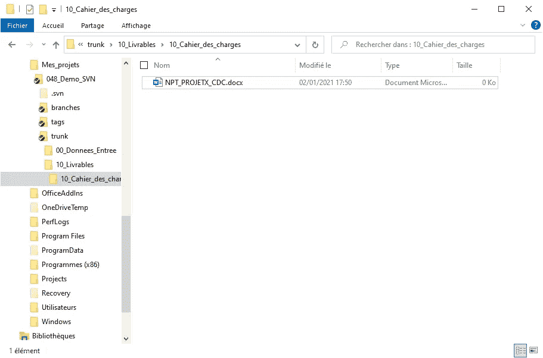

Specification document added to the project directory

现在，您希望将这个新文档以及创建的子目录结构提交到服务器存储库，以便整个团队都可以访问它。为此，右键单击主干目录，然后选择“TortoiseSVN”，然后单击“添加…”。

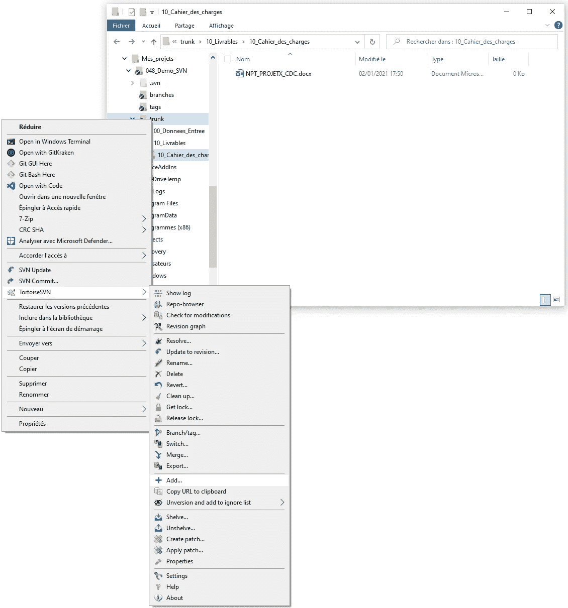

TortoiseSVN — Add files 1/4

将打开一个对话框，让我们选择要添加的文件和目录。默认情况下，所有内容都被选中。让它保持原样。

请注意，如果父目录本身没有添加，则不能添加文件或目录。

点击确定。

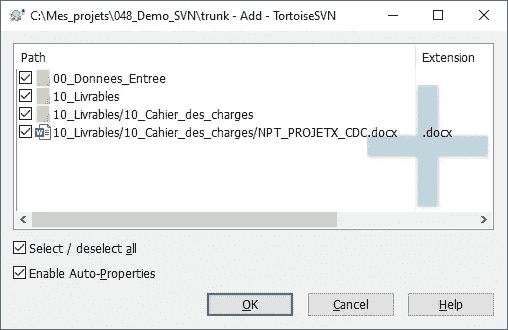

TortoiseSVN — Add files 2/4

TortoiseSVN 再次显示一个对话框，概述已执行的事务。点击确定。

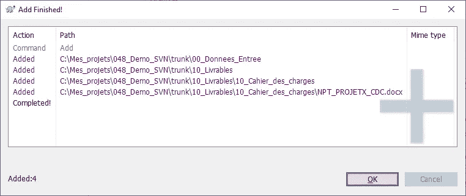

TortoiseSVN — Add files 3/4

您刚刚添加的目录和文件上出现了一个蓝色的“+”号。在“卡车”目录上，绿色圆圈上的勾号变成了红色圆圈上的感叹号。

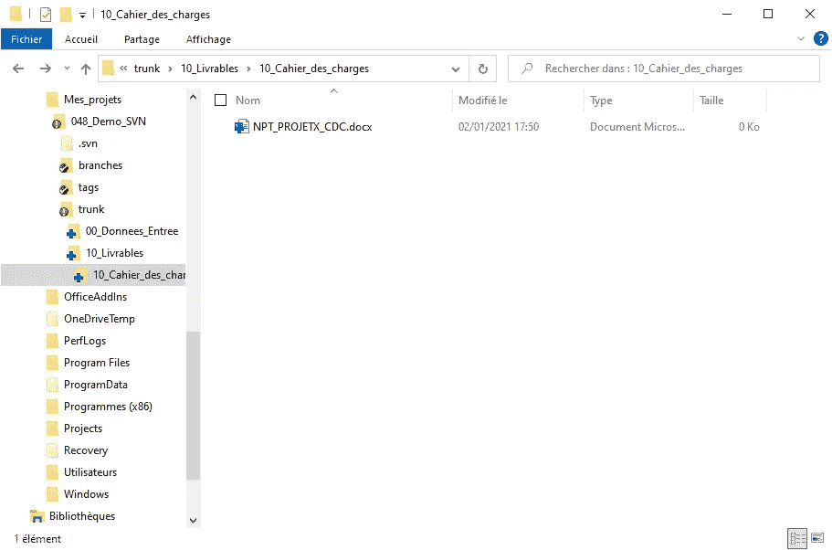

TortoiseSVN — Add files 4/4

蓝色的“+”号意味着 SVN 已经考虑到了这样一个事实，即从现在开始，它需要跟踪对这些文件和目录所做的更改。但是，只要这个“添加”操作没有同步，服务器上就不会更新任何内容。例如，您仍然可以取消这个“添加”操作(右键单击-> TortoiseSVN ->撤消添加)。

但“主干”目录，这是由 SVN 观看，现在显示一个大的蓝色“+”已经出现在你刚才添加的目录和文件。在“truck”目录上，绿色圆圈上的勾号变成了红色圆圈上的感叹号，让我们意识到这个目录中的某个地方发生了变化，这并没有与服务器上的存储库同步。

要实际保存对服务器存储库的更改，右键单击项目目录，然后单击“SVN 提交…”。

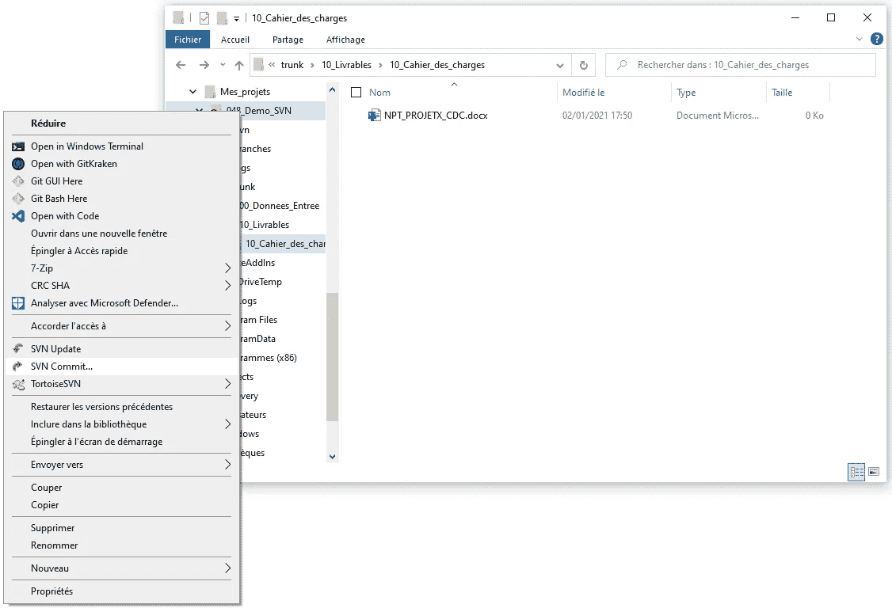

TortoiseSVN — commit changes 1/4

将打开一个对话框，让我们确认将您的更改提交到服务器。它显示一个文本字段来留下消息，以及一个要提交的元素列表。如果您尚未添加文件和目录，您可以在此对话框中添加。

我强烈建议留下一个信息，说明你为什么提交文件的新版本。虽然这不是强制性的，但它对你和你的团队成员来说是无价的帮助。能够记住我们为什么做这些改变是很有帮助的。利用这一点！

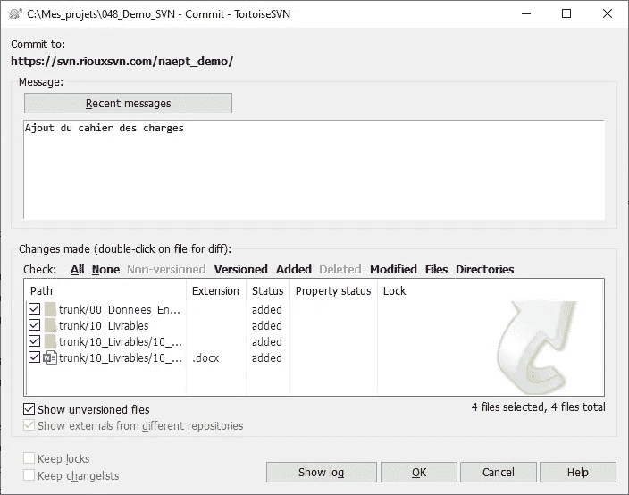

TortoiseSVN — commit changes 2/4

点击确定。

TortoiseSVN 再次显示一个对话框来概括已执行的事务。例如，“提交到 https://svn.riouxsvn.com/naept_demo"”行表示所做的更改被发送到服务器。

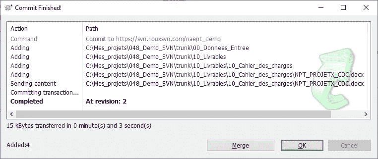

TortoiseSVN — commit changes 3/4

点击确定。

每个乌龟图标覆盖变成绿色。一切都与服务器同步。有点像备份。你的电脑可能会冻结，烧毁，我知道什么？您总是可以检索提交给服务器的内容。

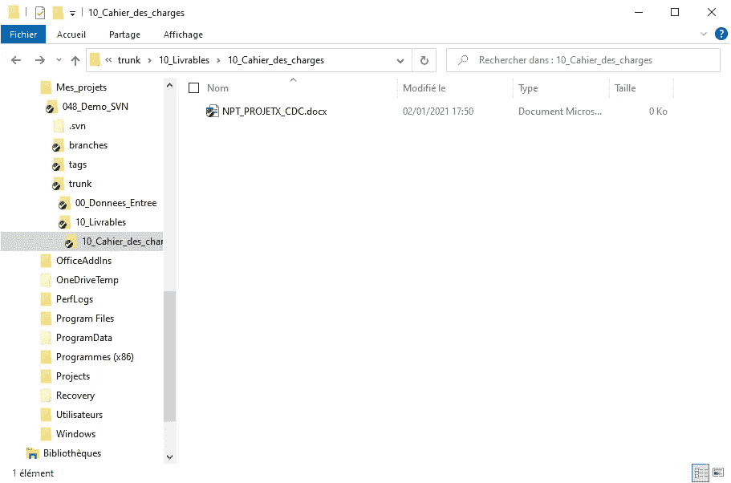

TortoiseSVN — commit changes 4/4

## 更新您的本地副本

让我们假设你的一个同事开始为这个项目写一些软件规范。然后，他将他的更改提交到存储库，因为您订阅了该存储库的通知，所以您会收到一封电子邮件来通知您这一更改。

但是，您的本地项目目录不会自动更新。你必须手动操作。所以在你这边做任何改变之前做这个更新是个好习惯。

要更新您的本地副本，右键单击项目目录，然后单击“SVN 更新”。

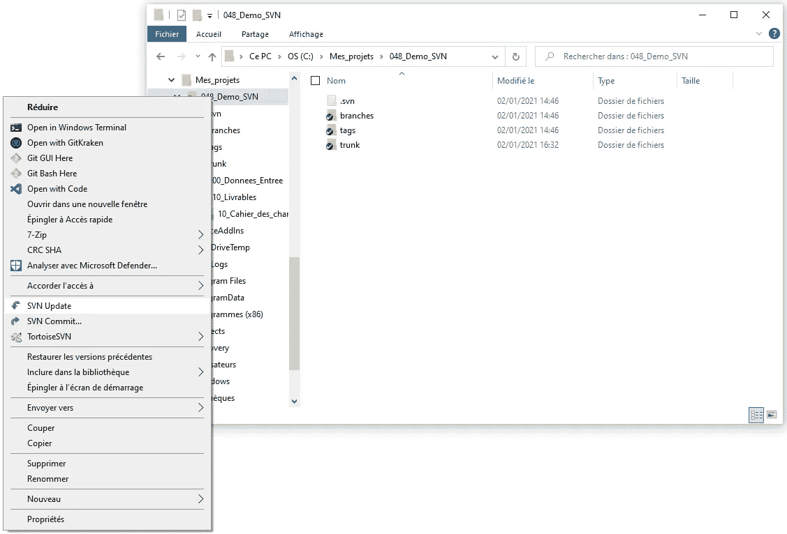

TortoiseSVN — Update your local copy 1/2

和往常一样，TortoiseSVN 显示一个对话框来概括已执行的事务。

TortoiseSVN — Update your local copy 2/2

如果自上次更新以来没有进行任何更改，这个列表显然是空的。

## 处理冲突

如果在更新本地副本之前就开始处理文件，会发生什么情况？

嗯，在更新期间，TortoiseSVN 会用一个冲突通知来提醒我们！其实没什么不好的。你只需要在文件的两个版本中做出选择:你的或者你同事的。我们都知道你会选择哪一个，但是你可怜的同事会白白工作…

对于这种事件，一个好的习惯是在处理文件之前总是锁定它。这样，只要您没有完成更改，团队的其他成员就无法编辑该文档。

第二个好习惯是总是在创建一个空文件后提交它。在某种程度上“保留一个位置”。这样做可以避免一些冲突。

要锁定一个文件，右击它并选择“TortoiseSVN”，然后点击“获取锁定…”。

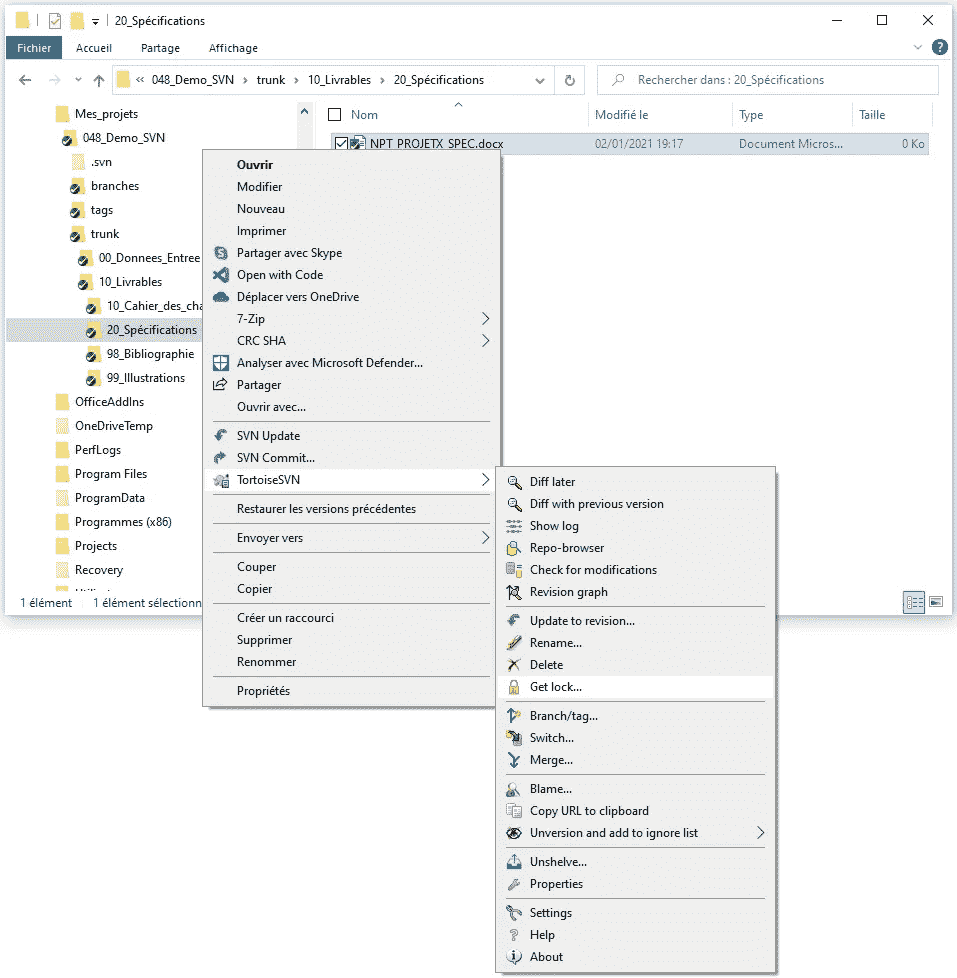

TortoiseSVN — Lock a file 1/3

将打开一个对话框，允许我们确认您要锁定的文件。你可以通过右击一个目录而不是一个文件来锁定许多文件。不要忘记给你的同事留言，让他们知道是谁锁定了文件，以及为什么。

TortoiseSVN — Lock a file 2/3

通常的对话框通知我们锁已经就位。

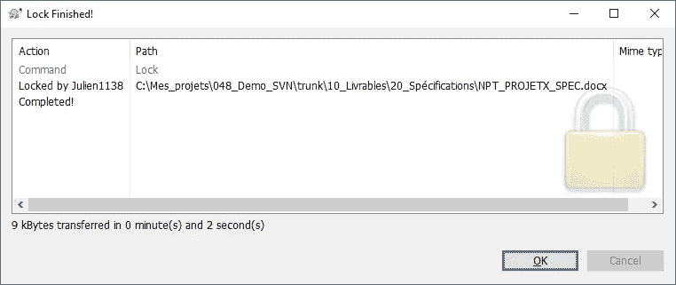

TortoiseSVN — Lock a file 3/3

在涉及该文件的下一次提交期间，SVN 将自动移除该锁。例如，如果您改变了处理该文件的想法，您也可以手动执行。为此，右键单击文件并选择“TortoiseSVN”，然后单击“释放锁定…”。

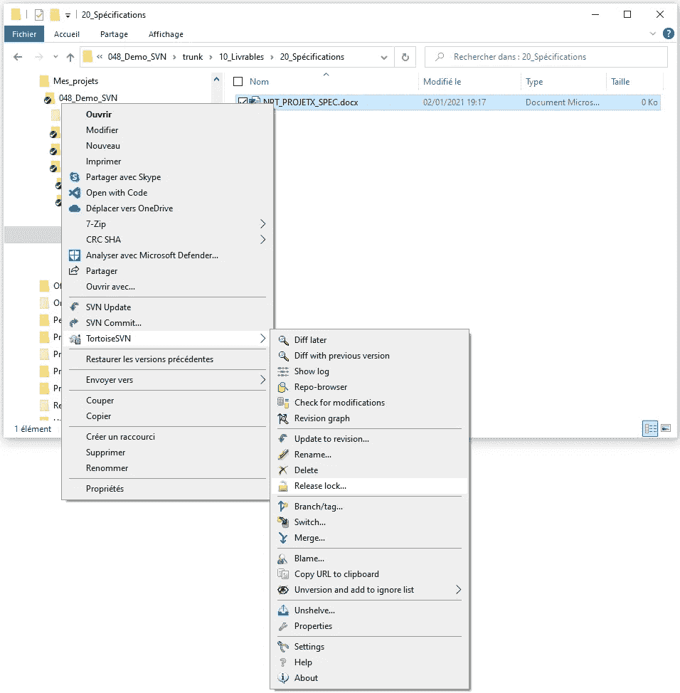

TortoiseSVN — Unlock a file

## 冻结配置

现在，整个团队都同意说，项目的所有文档都已最终确定，并且能够很好地协同工作，是时候创建上述配置了。

按照惯例，配置放在“标签”目录中。简而言之，配置是在给定时间中继目录的副本。

右键点击**“trunk”**目录(不是项目目录)，然后选择“TortoiseSVN”，最后点击“Branch/tag…”

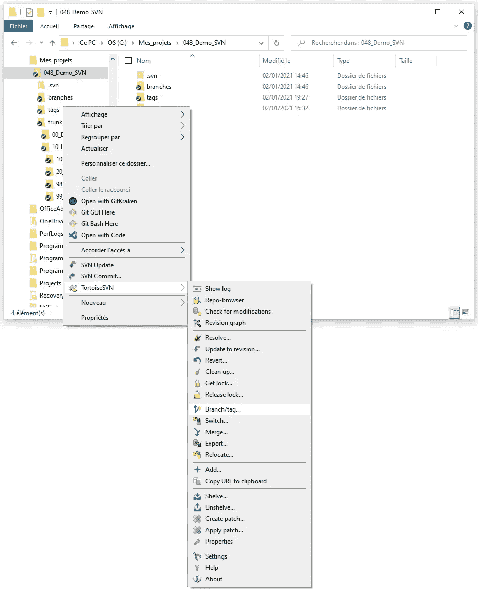

TortoiseSVN — Freeze a configuration 1/4

打开的对话框用于创建分支或标签。以下是如何填写表格来制作新标签。

“To path”字段必须包含“tags/”，后跟您要为此新配置指定的名称。这个名称是自由的，但是必须遵循目录命名规则(以谈论禁用字符为例)。剩下的，就和团队商定一些规则，坚持下去。

至于提交，添加一条描述自上次配置修订以来所做更改的消息。不要吝啬文字和解释。

保持其他字段不变。

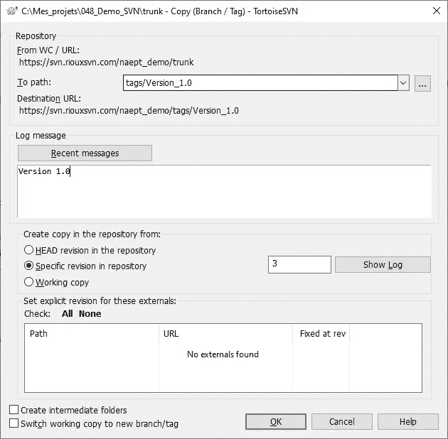

TortoiseSVN — Freeze a configuration 2/4

哦！也许我没有告诉你这个对话框，它概括了已执行的交易？你会注意到，它实际上是 SVN 创建标签的一个副本。

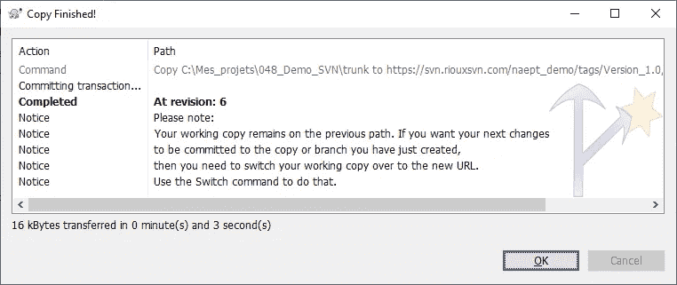

TortoiseSVN — Freeze a configuration 3/4

现在，如果您导航到“tags”目录，您将发现一个新目录，该目录具有您为此配置选择的名称。您可能需要更新您的本地副本(如前所述)以拥有最新的“标签”目录。

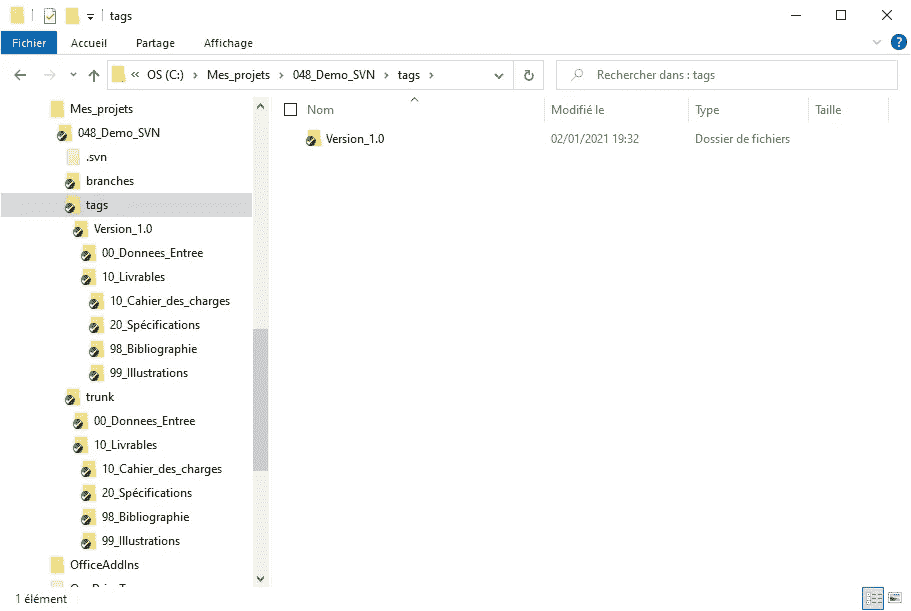

TortoiseSVN — Freeze a configuration 4/4

如果您需要将项目文件发送给客户或公司外部或项目外部的任何人，只需在这个配置目录中选择它们。这将确保它们是成熟和连贯的。

# 结论

这就是 SVN 文档配置控制的介绍。如果你需要的话，我们可以在另一篇文章中更进一步。这第一种方法应该足以处理大多数项目。

要了解更多关于版本控制的信息，我建议您参考 TortoiseSVN 文档，它非常好，有多种语言版本:[https://TortoiseSVN . net/docs/release/TortoiseSVN _ en/tsvn-basics . html](https://tortoisesvn.net/docs/release/TortoiseSVN_en/tsvn-basics.html)

# 你呢？

你用什么软件来管理你的文件？你的团队中有哪些好的实践？

不要犹豫分享和评论这篇文章。

祝您愉快！

*原载于 2021 年 8 月 16 日 https://www.naept.com***。**