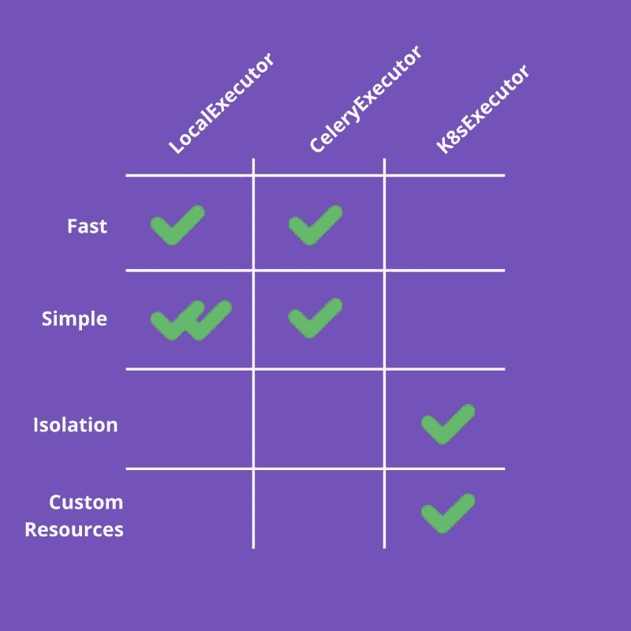
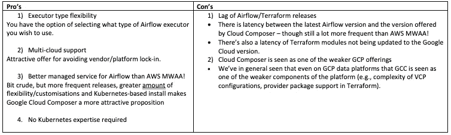
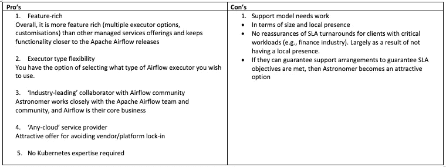
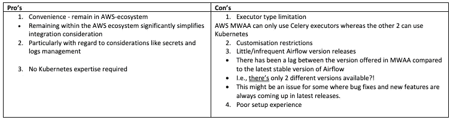

# 气流 2:托管与非托管解决方案？

> 原文：<https://medium.com/geekculture/managed-vs-non-managed-airflow-2-184e7cbb0a3b?source=collection_archive---------1----------------------->

## 气流/最佳实践

## 根据您的需求，您应该选择哪种风格的气流？天文学家？AWS MWAA？GCP·克劳德作曲家？还是自我管理安装？

*注意:以下描述的观点是我个人的观点，不代表我的雇主。*

## 议程

1.  背景
2.  气流 2 安装可用的选项
3.  根据评估标准评估备选方案
4.  气流 2 选项总结
5.  建议

# 1.背景

气流的第 1 版于 2021 年 6 月达到寿命终止(EOL)，不再受气流支持(参见:【airflow.apache.org】气流支持版本)。因此，我们需要根据我们当前的需求和难点，了解设置和安装 Airflow 2 的可用选项。

结果——不是一个简单的决定！为了帮助我们的选择过程，我们在反复试验后，建立了评估的**关键**业务标准。这篇文章旨在分享我们的发现，以帮助你的决策。

# 2.气流 2 安装可用的选项

有四个选项可用于为生产级环境设置气流 2。其中，下面列出的前三个选项是托管服务产品:

1.  天文学家:'*任何云*为气流管理服务
2.  AWS MWAA: AWS 管理的气流服务
3.  谷歌云作曲家:GCP 管理的气流服务
4.  自我管理气流安装

第四个选项是在 Kubernetes 集群上安装和配置您的气流环境。

## 评定标准

如前所述，建立标准并不简单。每个选项都有优点和缺点，并且您的场景会有独特的需求。然而，为了帮助形成评估，我们首先为评估建立了我们的**关键**业务标准。这些建议如下:

**标准 1: ML 工作量要求？**该解决方案能够支持机器学习/数据科学工作负载吗？需要吗？

**标准 2:灵活性—** 托管服务的定制程度如何？有哪些气流执行器类型可用，即 K8s/CeleryK8s 执行器是否可用？气流释放是否经常可用？

**标准 3: K8s 专业知识** —您有多少 K8s 内部知识来支持任何潜在的解决方案？他们的带宽是多少？

**标准 4:价值主张** —一个气流实施提供了哪些其他实施没有的东西？

**标准 5:所需的设置工作** —该值能否证明解决方案所需设置的复杂性？

**标准 6:“本地”开发环境**——该环境的独立版本是否可以轻松配置并安装在用户的机器上？

# 3.根据评估标准评估备选方案

话不多说，让我们来看看四个气流选项与评估标准的对比情况。

> **标准 1: ML 工作量要求？**该解决方案能够支持机器学习/数据科学工作负载吗？需要吗？

## 气流执行器类型

执行器类型的选择对于您希望使用 Airflow 编排的工作负载至关重要。执行器会显著影响任务的吞吐量、可伸缩性和维护。不同类型气流执行器的优点总结如下:

*   **任务执行速度:**k8x executor 需要更多的时间，因为它需要旋转一个 pod，将它分配给一个节点，运行 docker 映像，等等。所以如果你有很多小任务，它可能不是最好的。
*   简单性:local executor 是最简单的一个。非常容易设置和运行，但扩展性不好。K8sExecutor 更具挑战性，因为它依赖于 Kubernetes。
*   隔离:K8sExecutor 为每个任务创建一个 pod。这避免了依赖性冲突并增加了任务执行的可靠性。
*   **定制资源:**如果你真的想管理你的资源，K8sExecutor 是个不错的选择。您可以分配资源(CPU、内存等。)分配给一项任务。

因此，如果您希望使用气流来编排 ML 管道，您需要使用 Kubernetes(或 CeleryKubernetes)执行器。如下所示，鉴于他们是唯一提供 K8s 或 CeleryK8s 执行器的公司，只有天文学家或自管理气流是使用气流运行 MLOps 管道的唯一可行选项:

> **标准 2:灵活性—** 托管服务的定制程度如何？有哪些气流执行器类型可用，即 K8s/CeleryK8s 执行器是否可用？气流释放是否频繁？

## 选择遗嘱执行人类型的能力？

下面显示的是同一个表，列出了哪些产品允许哪些类型的执行者:

如您所见，只有天文学家&自管理安装选项允许您选择所使用的执行器类型。因此，如果您希望使用气流来编排 ML 管道，您将需要使用这两个选项中的任何一个。

受管服务的本质决定了平台工程师根据其环境要求配置安装的选择有限。

## 气流版本发布的频率

这里值得注意的另一件事是托管服务产品的发布频率:

*   天文学家是这里的顶级商店，提供非常有规律的释放
*   Cloud Composer 提供常规/频繁版本，但没有天文学家那么多。
*   AWS MWAA——在这个部门相当糟糕。在撰写本文时，它只提供了三个版本的 Airflow 作为其托管服务产品的一部分:v1.10、2.02 和 2.2.2

如您所见，托管服务的本质导致配置安装的灵活性有限。相比之下，选项 4(自我管理安装)作为非管理服务选项，提供了全面的灵活性。

> **标准 3: K8s 专业知识** —您有多少内部 K8s 专业知识来支持任何潜在的解决方案？他们的带宽是多少？

有点没脑子；只有选项 4 大部分需要 K8s。GCP Cloud Composer 在如何为您的气流集群部署 K8s 方面提供了极大的灵活性。因此，它也是(部分)选项 1 所要求的。

> **标准 4:价值主张**—一个气流实现提供了什么其他实现没有的东西？

**GCP**

*   如果你还没有使用 GCP，GCP 云组件提供的价值还不足以证明最初的 GCP 帐户设置(基础设施/网络/IAM)。

**天文学家**

*   任何云托管解决方案都可以灵活地将气流实施从一个云提供商转移到天文学家生态系统中的另一个云提供商。
*   理论上，天文学家似乎是一个很好的候选人，提供了类似的灵活性。然而，企业级支持是我们用例的基本需求，我们需要保证在 APAC 提供的服务(来自海外资源)将满足我们的需求。如果没有 APAC 多个行业的证明来证明这一点，我们无法考虑这一选择。

**AWS MWAA**

*   留在 AWS 生态系统中大大简化了集成考虑，特别是秘密和日志管理。
*   然而，受管 AWS 气流服务本身是一个折衷的解决方案。参见下面的“标准 5:所需的设置工作”。
*   此外，AWS MWAA 提供的气流版本不允许我们开发气流 RBAC 实现。

**自管理气流安装**

*   自我管理的 Airflow 2 环境提供了所需的最大灵活性，允许您:a)选择所需的执行器类型，b)配置定制的 Airflow RBAC 角色，以及 c)在所需的 Airflow 实例上轻松安装附加库。

> **标准 5:所需的设置工作** —该值能否证明解决方案所需设置的复杂性？

*   GCP 云作曲家:如果你还没有使用 GCP，这不是一个候选选项。基本 GCP 帐户设置所需的金额不足以支持此选项。
*   天文学家:我不能谈论所需的设置工作，因为这需要一份供应商协议。因此，这种评估需要一个技术高峰。
*   AWS MWAA :糟糕的设置体验，与不频繁的发布和缺乏定制联系在一起，使得这个选项只适合你寻找一个快速的“无装饰”气流 2 环境
*   **自我管理气流**:如果你有 K8s 的专业知识，这可能是最好的选择。然而，如果没有，我建议进一步调查天文学家。

> **标准 6:“本地”开发环境**——该环境的独立版本可以很容易地配置并安装在用户的机器上吗？

可以为所有四个选项创建一个“本地”气流开发环境。然而:

*   AWS MWAA:本地开发环境是社区支持的( [GitHub repo link](https://github.com/aws/aws-mwaa-local-runner) )。因此，它很容易出错
*   使用 K8s 自我管理气流是可能的，但一些设置和配置并不简单。需要 K8s 专业知识

## 4.气流 2 选项总结

## 谷歌云作曲家

*   如果你还没有使用 GCP 作为云提供商，Cloud Composer 服务并不是一个足够令人信服的理由。
*   支持 GCP 基金会环境、组织设置、IAM、安全、网络等所需的努力。，不值得使用 Cloud Composer。
*   这是一个比 AWS MWAA 更有吸引力的选择，但前提是你已经在使用 GCP 生态系统。

## 天文学家

没有 APAC 支持模型和支持级别存在的保证，我不能推荐天文学家作为我们用例的候选。然而，如果我们对企业级的支持有信心，那么天文学家就是一个理想的选择。

## AWS MWAA

尽管 AWS 管理的服务产品很方便，但 MWAA 感觉像是一个匆忙上市的产品。特别是，关于有限的/变通的定制、不频繁的发布和糟糕的设置体验。参见我之前关于安装体验的博文:

 [## 审查 AWS MWAA 和如何自动安装

### 即 AWS 的气流管理服务

paulfry999.medium.com](https://paulfry999.medium.com/review-of-aws-mwaa-i-e-aws-managed-service-for-airflow-fc7d78e7cc15) 

如果他们能够提供更频繁的版本发布&解决执行器类型的限制&改进他们的通用用户指南文档(！)，这将大大有助于使 AWS MWAA 成为一个有吸引力的提议。

## 使用 K8s 自我管理气流

**优点:**

*   完全灵活地设计您需要的气流结构
*   完全灵活的安装—没有限制，关于您可以配置什么和不可以配置什么
*   云本地——Kubernetes 本身是一种与云无关的技术
*   执行者的灵活性——对您希望使用的执行者的选择没有限制

**缺点:**

*   要求您的平台工程师具备 K8s 专业知识(和带宽！)

自我管理的气流环境保证了开发的环境可以根据您的需求进行定制和构建。然而，这确实伴随着一个警告，即这个选项确实需要您的团队能够访问具有 K8s 专业知识的平台工程师。

# 5.建议

最终，气流管理服务领域仍有改进的空间:

*   天文学家是一个强有力的竞争者，但需要在 APAC 有更多的存在，并围绕其企业支持模式得到更大的保证
*   如果你还不是 GCP 的用户，Cloud Composer 还不足以成为你迁移的理由(我不确定你是否能证明云网络/安全/RBAC 的额外需求)。特别是如果你已经是一个 AWS 用户，鉴于这两个产品都限制你只能使用芹菜执行器
*   自动气象站 MWAA 是一个非常“没有多余装饰”的选择，更适合那些想要在自动气象站上安装基本气流装置的人(为了留在自动气象站上)。AWS MWAA 需要在其解决方案中提供更大的灵活性和更频繁的 Airflow 版本发布(即不仅仅是 1.10、2.0.1 和 2.2.2)。此外，AWS MWAA 限制您只能使用芹菜执行器

如果您有 Kubernetes 的内部专业知识，我建议您选择非托管安装。这将导致以下结果:

*   拥有工作负载所需的设计规格
*   一个不妥协的解决方案，关于:设置和配置
*   云原生解决方案

本建议附有两项免责声明:

1.  你需要接触 K8s 的专业知识。这些通常是稀缺和有需求的，所以你也需要保证它们的可用性
2.  您的 Kubernetes 开发人员需要对气流概念有所了解，以构建您需要的 K8s 集群(并使用正确的执行器)。

我希望这些都有帮助。从理论上讲，天文学家也是一个不错的选择，但我渴望看到/听到 APAC 更多的使用案例。