# 管理是一场游戏。第二部分

> 原文：<https://medium.com/geekculture/management-as-a-game-part-ii-813f69c90e37?source=collection_archive---------18----------------------->

在这篇文章中， [*JetStyle*](https://jet.style/?utm_source=medium&utm_medium=blog&utm_campaign=article&utm_content=jetstyle) *的首席执行官阿列克谢·库拉科夫将谈论如何建立一个团队，需要雇佣谁，人们为什么要做事，以及如何将事情传递给特定的人。*

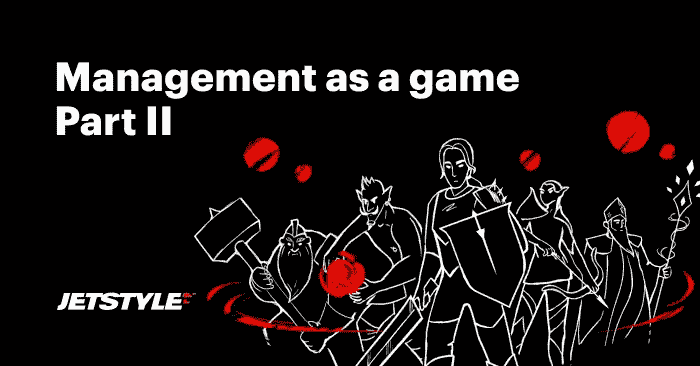

# **功能位置**

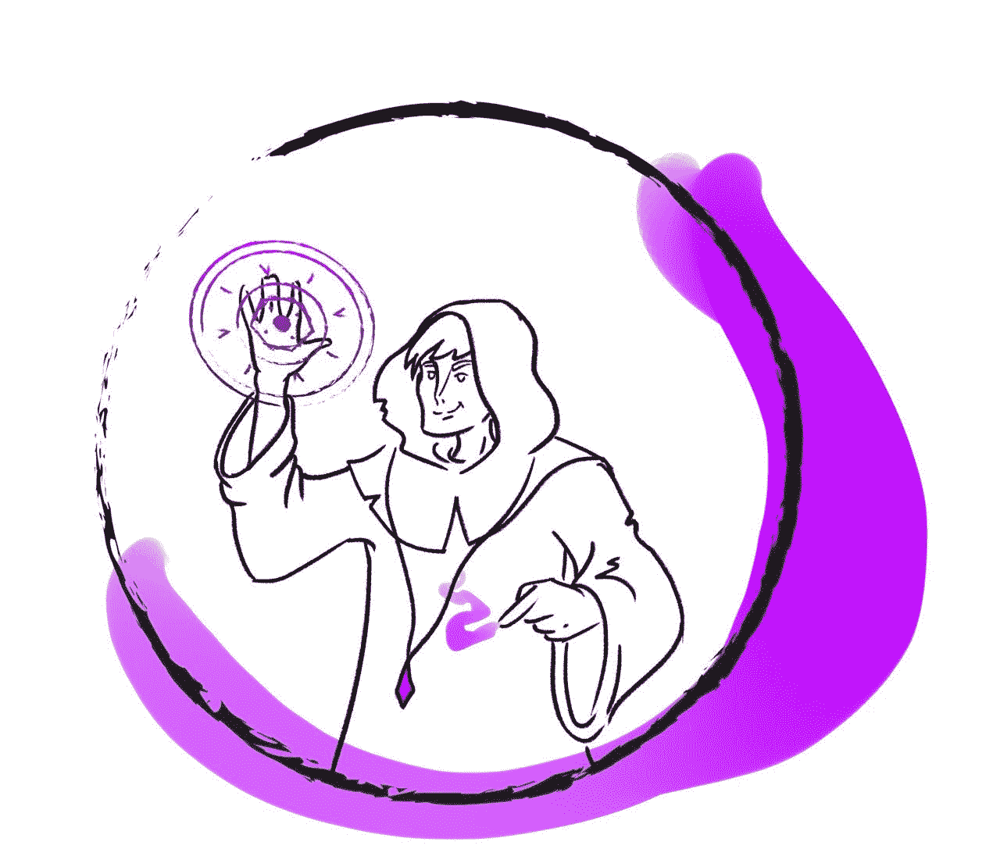

## **魔术师**

魔术师是伙伴，在使用资源方面与矮人相反。魔术师们支持创新。这就是魔术师和矮人之间的典型冲突。

**魔术师:** “我们做了一个多么伟大的实验！我们浪费了很多资源，我们的假设被证明是错误的。(工程师知道，一个被证伪的假设是一个很好的实验。)我们学到了这么多！该死的，这是一个伟大的发现！”

**而矮人是这样的:** “等一下。我为这个伟大的发现付出了 700 万卢布吗？这是什么鬼东西？我想赚钱。”

**而魔术师回答:** “所以，你想开一家科技公司。在一个保证一切都为人所知的地带，你如何做出一项发明？我们需要尽快犯错。”

> 魔术师喜欢先做一些事情。

魔术师是最重要的。他们不在乎这个东西有没有用。他们需要先做些什么，这样该地区的所有其他魔术师都会说:“喂-喂-喂-喂，伙计们，干得好，尊敬。”

## **决策方式**

测试你的想法并实施实验。

## **管理风格**

正在进行的实验。HADI 循环技术是纯粹的魔法。我们必须浪费资源去学习新的东西。

魔术师的问题是，他或她会处理更有趣、更创新的解决方案，而且，总的来说，“他们还没有那样做；我是第一个想出这个东西的。”魔术师不知道如何结束一个过程。通常，魔术师都是完美主义者，他们会继续下去，因为，进行一个实验，他们会找到一个理由再做十个实验:“我会学到更多！”

所以，当你有一个矮人魔术师的时候，这是一个很棒的组合。他或她平衡自己:“我会做实验，但它的目的是让我们受益。”这种道德和职能角色的精确结合是新科技公司领导者的基础。

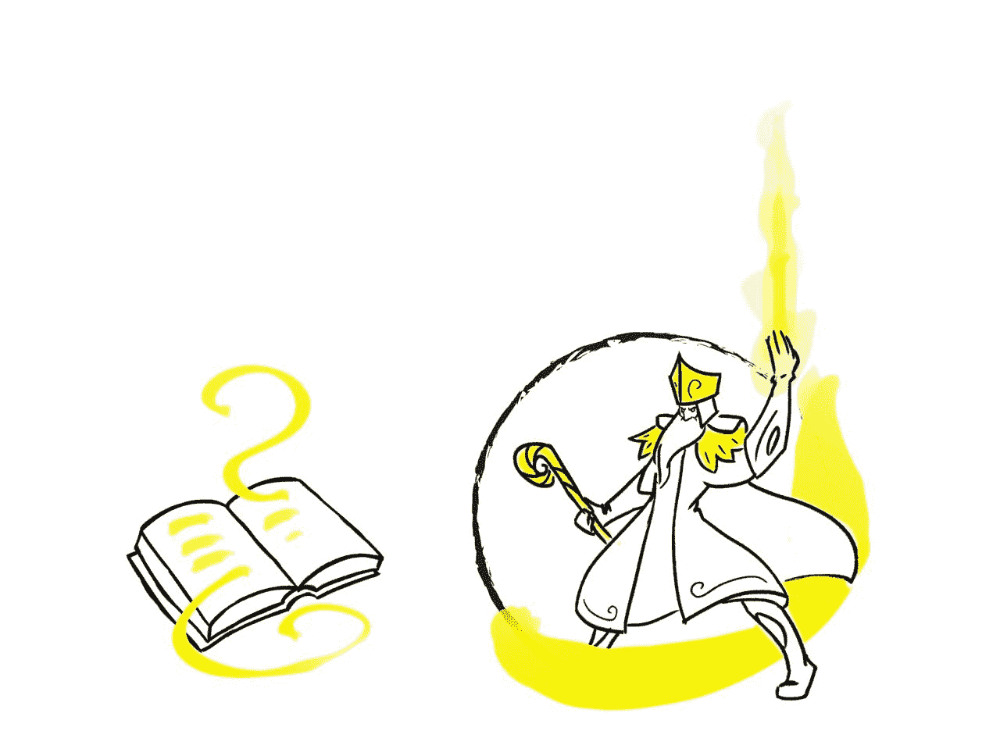

## **牧师**

牧师告诉公司我们是谁，我们是为了什么而存在，我们需要什么样的人，以及谁是不受欢迎的。

> 祭司的主要焦点是使命。

“福音传道者”这个词是牧师们发明的。当一个牧师为某些天意辩护时，他或她会正确或不正确地使用词语，因为这样的概念存在于组织的代码中。“我们的组织是这样的。”

比如 [Rideró](https://ridero.ru/) 的一句话:“我们永远站在作者这边”就是 priestly。作为[里的牧师，我说:“我们就像这样，我们有一些价值观，我们会实现这些价值观。如果有人不认同这些价值观，篝火就在那边。”](https://ridero.ru/)

我现在对你做的事情完全是一个牧师的练习。我在这里布道。我甚至可以增加一点情绪压力，虽然这已经足够了，牧师们通常都很有魅力，是他们价值观的粉丝。在这种情况下，我是在向你宣传法力的重要性。

## **决策方式**

这是一场诉诸共同价值观的争端。牧师们令人厌恶地争论着。如果上帝不允许，你攻击牧师的价值和犯下亵渎，准备好自己被开膛破肚。也有一些事情你不能和他们谈论。都是关于“网上有人错了！”。

## **管理风格**

精神领袖。人们追随牧师，因为他们相信他或她所宣称的真理。

牧师对价值观的批评完全没有准备。

他们的罪很简单——这是异端邪说。他们还没有准备好与异教徒在同一家公司工作，所以他们的自动平衡地位是一个巨魔。如果这样的人非常重视真理，并不断在他们的信仰和事实之间保持平衡，那么他们就不会走极端。你可以向他们解释一些事情，因为他们的信仰是建立在对一些现实的概括之上的。这是我自己在努力练习的。

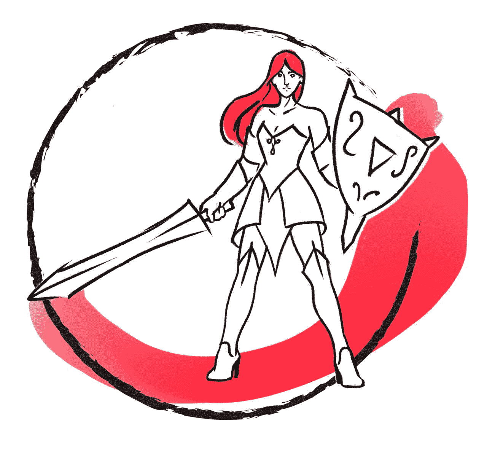

## **勇士**

这些配偶负责扩展外部轮廓。他们不怕说“你好！这些是科比真空吸尘器的东西，因为有人会因为这条线受伤的事实不会困扰勇士。

> 一个战士在克服自己和他人的社会接触时，准备好忍受痛苦。而且通常不是男性。

一个典型的战士是一个女指挥官——像刀片一样锋利，这样你就可以把她从直升机上扔向敌人；不会有幸存者。伟大的团队成员。

战士的关键词是胜利。与矮人不同的是，对于一个战士来说，敲 frags(计算机俚语，意思是“我杀了多少敌人”)只是很重要。战士说，“我今天做了三笔很棒的交易。老实说，我不在乎利润会有多少，对魔术师来说是否有趣，是否会给我们带来利润。三笔交易。我是手提钻。”

战士的目标是用夺取来表述的:我们夺取市场份额，我们夺取世界，当我们掌权时，我们将是最好的。

战士的类别是“我的”和“我们的”“这是我们的利基市场，我们将成为其中的领导者，并将做这些事情来实现这一目标”。我们是否靠它赚钱是另一回事；让矮人自己算算。我们会是最好的。我们在打仗。

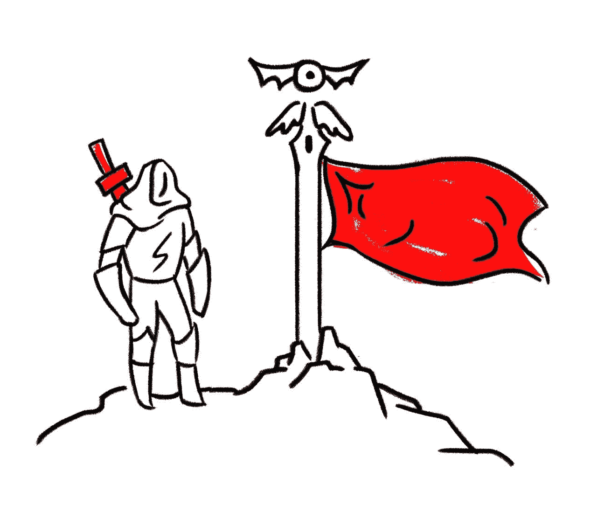

这里我们有一个线性卖方班。他们接到百夫长的命令，然后出发。他们被教导呼唤，行走，忍受痛苦，为胜利欢呼。这纯粹是一件工具性的事情，所以任何积极销售的群体都是这样建立的。

战士热爱胜利，知道如何克服痛苦，抓住别人的财物。他们是非常强硬的谈判者，而且，在谈判时，他们感兴趣的事情如下:你需要赢，你必须声称胜利，另一个结果是失败。他们是来赢的。

## **决策方式**

直接命令。

## **管理风格**

军队。纪律严明:所有下属都有规定；一切都是按照章程做的。

# **诊断学:我们是谁？**

你怎么能了解谁目前在什么位置上？看看一个人如何寻求行动，他们不准备放弃什么。

## **例 1**

这是一个典型的年轻企业家开始创业的故事——例如，刚刚从剑桥大学毕业的工程师。事情是这样的:

1.  巨魔提出想法。

2.魔术师抓住创意。

3.精灵试图塑造一些共同的东西。

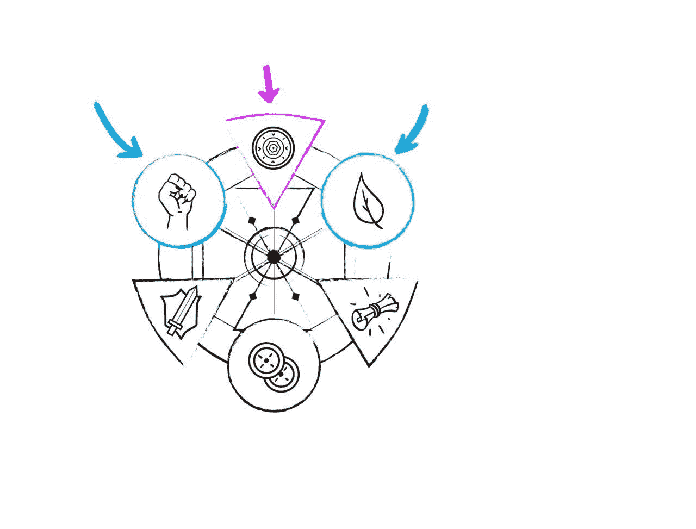

有想法的伴侣。“我们都是一个伟大的团伙。”我们没有钱。都很有意思。我们在宿舍玩得很开心…

这个地方的领导是什么地位？很明显。领导者必须自己平衡团队，并带来团队所缺乏的东西:“好吧，一切都很酷，但如果我们用矮人的逻辑做事，那就太棒了。”

## 示例 2

这种情况经常发生在大型办公室:

1.  魔术师不明白为什么产品销售疲软。

2.战士们抱怨魔术师表演的东西已经过时，不需要了。

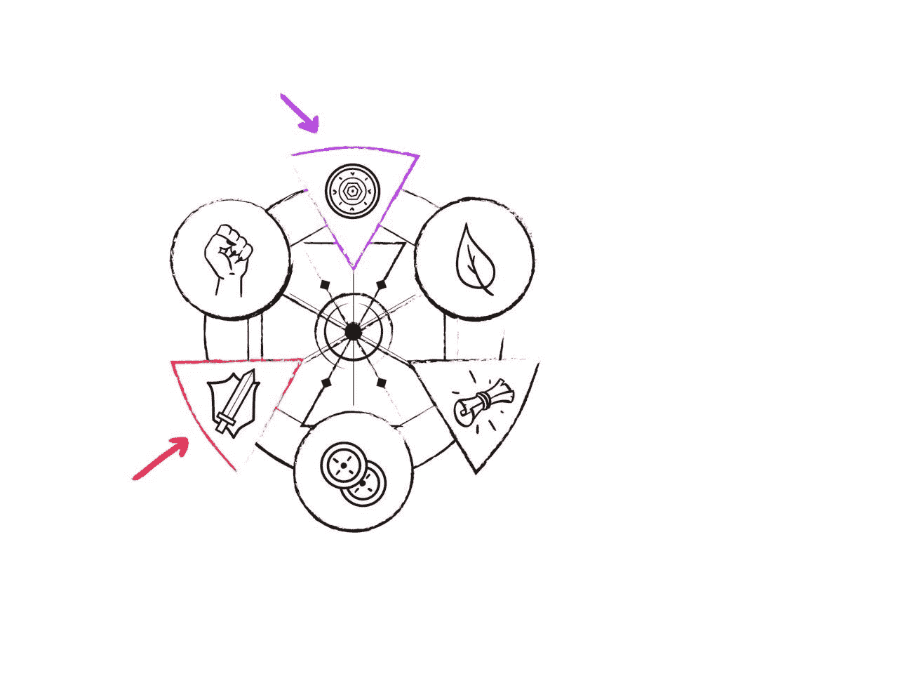

**魔术师:** “我们做出了令人敬畏的产品；只是我们没有卖家，只有马克杯。”

**勇士:** “主啊，他们正在做的事情，第一，充满了 bug，第二，在错误的时间，第三，他们从哪里得到这种东西是任何人都需要的想法？”

这发生在魔术师掌权的时候。例如，在食品公司，魔术师首先做一些东西，然后他们把它卖出去。

如果情况反过来，一切看起来都是这样的:

1.  魔术师抱怨说他们不被允许做任何令人兴奋的事情。

2.勇士不明白魔术师为什么不列队行进。

这是同样的冲突，但是当公司经营销售驱动的业务时。

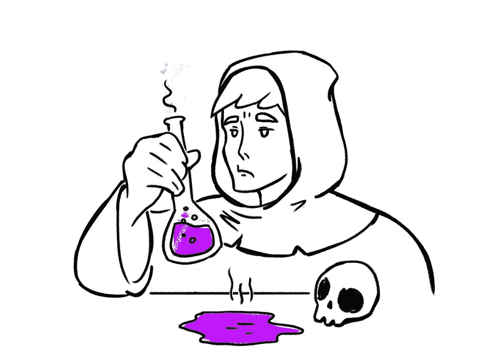

**魔术师:**
“天哪，我们要做什么垃圾，一点都不有趣。现在已经很久没人用这样的堆栈了。这是每个人都做的一件如此普通的事情。如今，我们需要做一些完全不同的事情。”

**战士:** “他们为什么要炫耀？这是他们的工作。他们被告知会有这样的产品发售，让他们去做这样的产品。”

你可能已经猜到牧师应该解决这个问题。

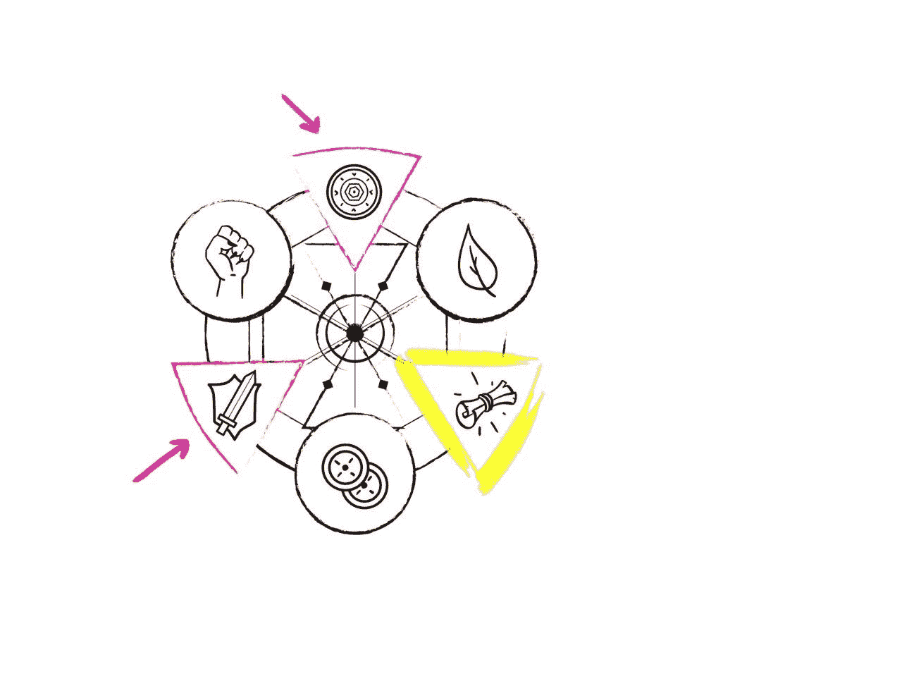

两个人都应该被告知:“看，这是我们的使命。这是我们一起做的事。这是我们共同传递的价值。我们的冲突就是这样解决的。这就是为什么我们需要彼此。这就是我们。”

# 公司发展如何？

周期通常是这样的。魔术师巨魔突然发现了新的东西:“太棒了，我们发明了一项发明。我们发现了真相。也许我们在公司内部发现了什么；我们的大公司不愿意看到一些低效率，我们解决了这种情况。”

之后勇士马上去交易它:“哦，这就是创新。现在我要把它卖给别人。”如果有些事情成功了，那么矮人就开始积累资源。这是从定制开发和首次销售到产品逻辑的过渡，从“我们制作了一个功能”的逻辑到“我们将制作一个流程”的逻辑一项创新被发现，发明的主导价值和第一次胜利出现，允许资源的积累。

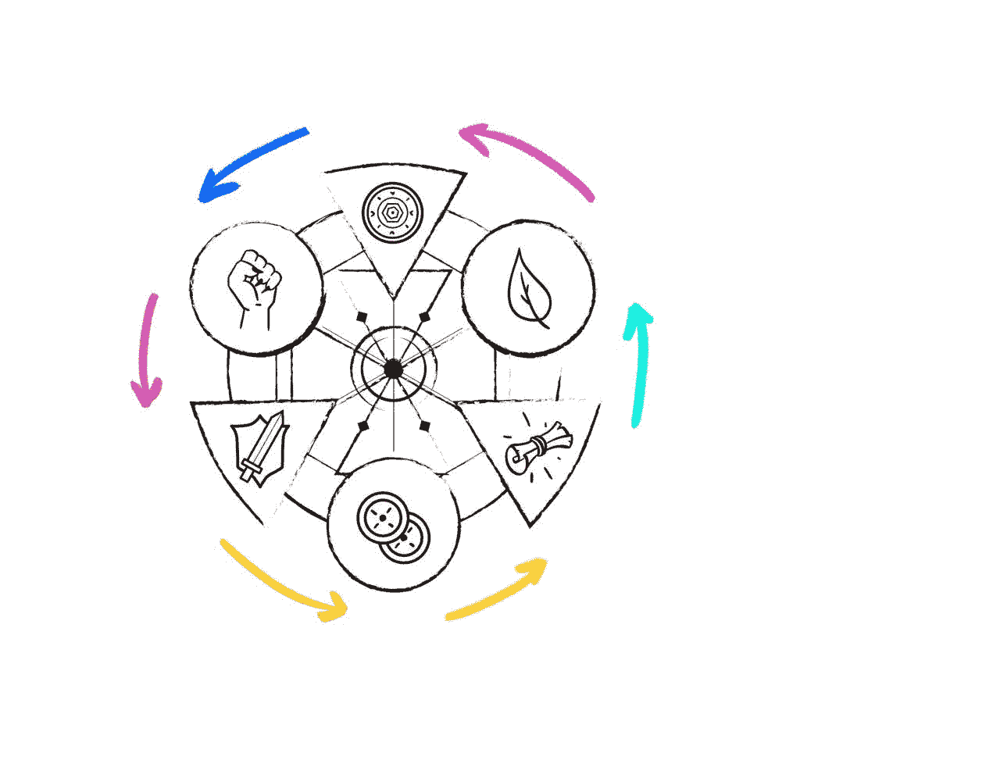

业务加速可以归结为这样一个事实:你被教导要经历这个周期，不是几年，而是几个月。在那之后，如果你做的一切都是正确的，你会很快从一个小的有凝聚力的团队成长为一个公司，如此强大以至于你会在魔术师和矮人之间产生冲突。

这里你又回到了同一个问题:你是谁，你为什么要做这些？你不再是一个可以靠个人感情凝聚起来的小 raid。你需要明白你的使命是什么，你做什么，你不做什么，是什么给了你能量。这时，领袖变成了牧师。

如果一切顺利，并且资源仍在积累，那么您会发现自己处于“一个大家庭”的情况中。一切都很精彩。你创造了一个大象的墓地。

然后你需要进入下一个圈，但是在这一点上有一个小问题。事情是这样的:

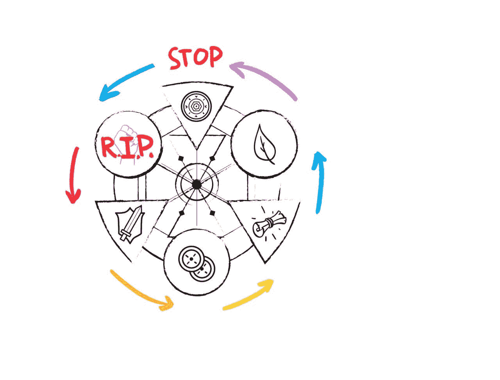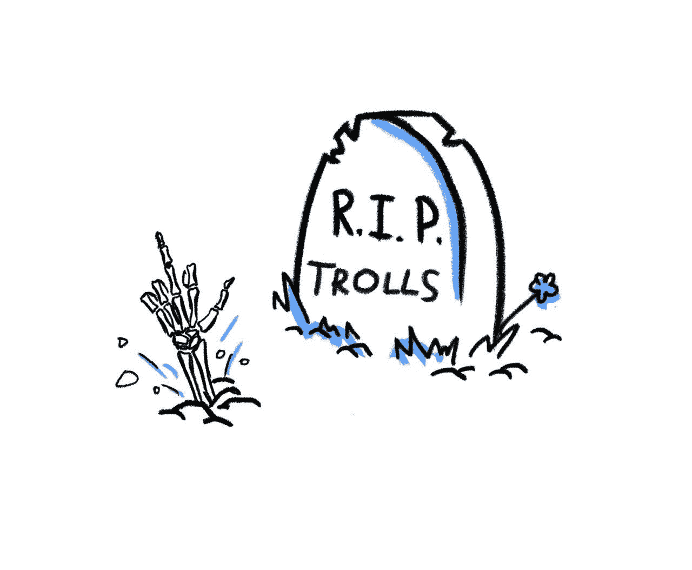

这时，精灵和矮人已经成功地击败了巨魔，因为巨魔说了各种各样不方便的话:“当然，我们是一个大家庭，但是让我们看看事实。亚历克斯无所事事。”或者:“我们当然积累了很多资源，但让我们对自己承认到底是什么，它们流向哪里，以及我们的主要驱动力是什么”。

巨魔对不需要的人说这句话，在不需要的时候说。等到我们都是一个大家庭的时候，管理层大声说出不愉快的事情就完全过时了，也是被禁止的。既不讲团队怎么组织，也不讲业务怎么安排，也不讲公司为什么不会进下一轮。

大量的大公司在这一点上死亡。公司不执行重启。谷歌是伟大的，因为它的几次重新启动。一些办公室依靠领导者的进化而生存，他或她变成了巨魔。之后大家都很受伤，因为他(她)不饶任何人，这个时候公司都在抖。但是当你需要更进一步的时候，你只需要提升真理的伦理。

> 群体的立场是群体共有的伦理+群体喜欢的法力+领导者所持立场的总和。

有领导活动，也有道德规范——它们需要平衡。而当一个领导需要这样做的时候，他(她)改变了他们的领导活动，比如他(她)原来从事销售，现在去了 HR；或者招募人员，现在回去找魔术师——巨魔做一个发明。

# **该系统的附件**

六芒星还有另外一个稍微不同的上层建筑。它有三个角色。任何玩 PC 游戏的人都知道典型的 raid 是如何内置到魔兽世界或任何其他多人游戏中的。

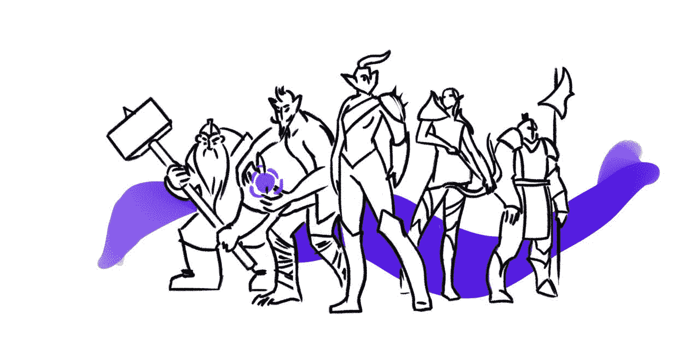

## **坦克**

这是一个单位，其任务是防止导弹到达该集团。“如果有麻烦发生，如果你需要打人，打我。我很坚强，我不会倒下。所有的瘀伤都是我的。”通常，让他们成为一个团队领导者是很好的，因为这样麻烦要么不会发生，要么会袭击他们。

## **DD(伤害经销商)**

它是一个单位，其有效性是以每秒的伤害来衡量的，也就是说，他或她造成的伤害越多，他们就越好。为什么 DD 在 PC 游戏和现实生活中都很好？他或她进步最快；他或她学得最快。

这个计划很简单:你，DD，学习硬技能，如果你不笨，并得到反馈，你学得很快。同时，你知道单位时间内你是有用的。

这是两个清晰的概念。DD 站在坦克后面打击，坦克保护他们不被回击。但通常，在俄罗斯商界，一切都不是那样建立的。

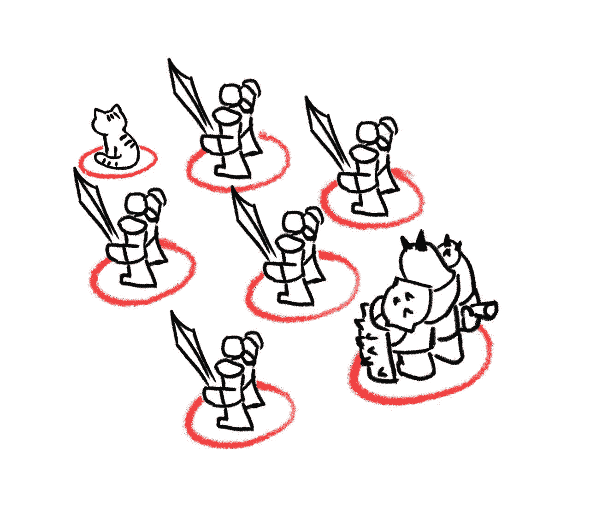

通常，俄罗斯领导人认为表演者应该有麻烦，所以一群人站在经理面前。如果麻烦已经发生了，那么这就是表演者的麻烦。毕竟，经理不是做报告的人。(It 行业往往不是这样；这是一件更酷的事情。)而医者在商界是谁，我们不得而知。通常，一个企业甚至没有这个词，至少在俄语中是这样。

## **治疗者**

这个单位在魔兽世界中处理一个非常特殊的任务。他们的工作是确保坦克不会倒下。他们知道，总有一天，陷入困境的配偶会愚蠢地耗尽力量——因为无论他们的盔甲有多厚，都可能被刺穿，然后他们会在房间里哭泣。如果坦克这个角色是女性的话就更是如此。女人是王牌坦克，但是她们很脆弱，所以她们会崩溃。

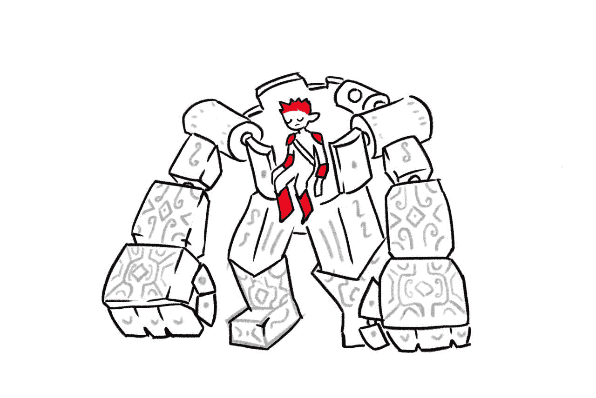

因此，在突袭中，必须有人让坦克看到他或她的工作的意义，这样他或她就有了可以依靠的人，并从死亡中复活。这在我看来，是领导可以理解的立场。

这是我建立突袭的方式。我正在建造一个医疗队。但是很多时候，无论是游戏还是生活，看起来都是这样的:三个 DD 在找一个坦克和一个治疗者，因为 DD 队友很多，既然硬技能很快就被采用，坦克也时不时的被找到。但是医治者非常罕见。

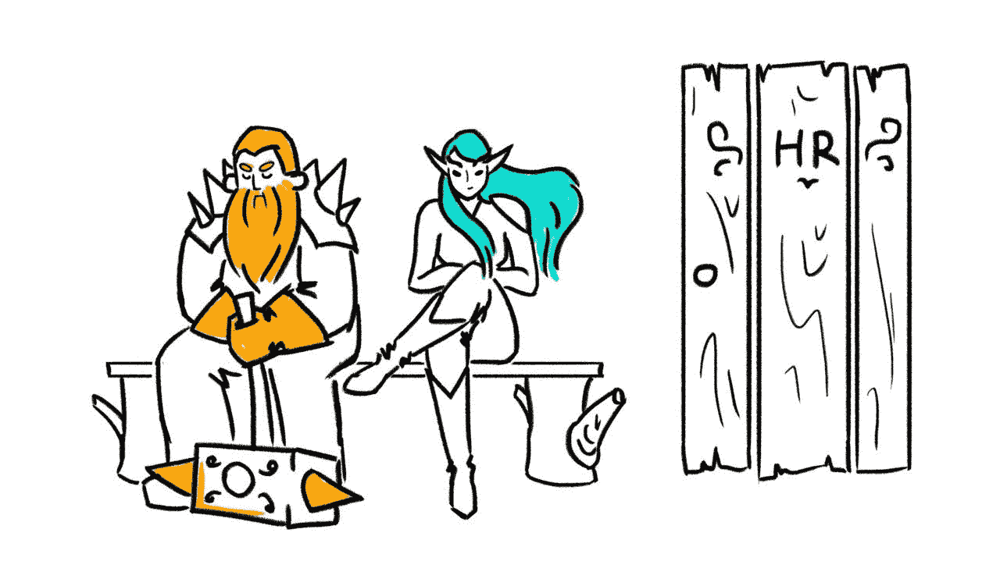

在我看来，突袭的有效配置是这样的:一个治疗者治疗几辆坦克，坦克后面有 DD 群。

这和第一个故事怎么重叠的？事情是这样的:

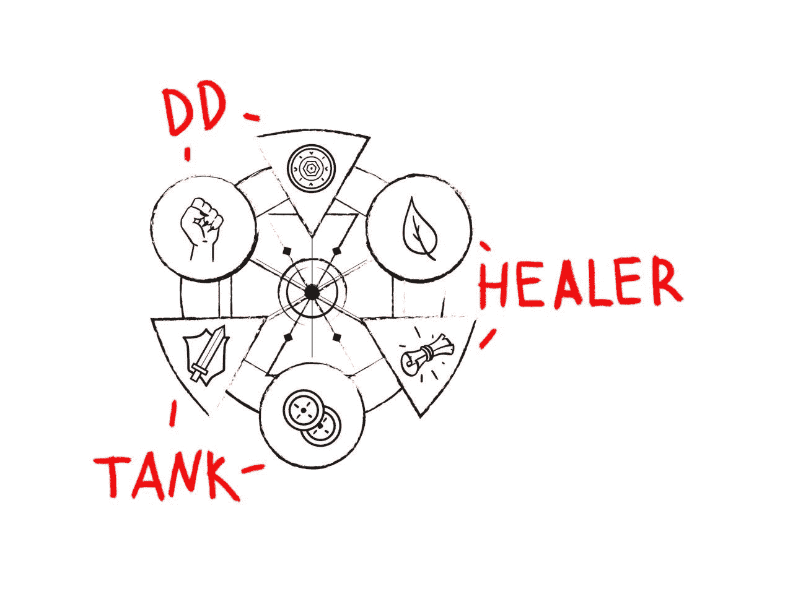

## 一个优秀的 DDs 是一个巨魔魔术师。

他们很好奇。你告诉他们做什么，他们正在做。这里有很多工程工作。还有，伟大的 DD 都是矮人战士，比如 raid 厂商。在现实生活中，在 [JetStyle](https://jet.style/?utm_source=medium&utm_medium=blog&utm_campaign=article&utm_content=jetstyle) DDs 是开发者:设计师、前端开发者、后端开发者等。

## **最佳坦克——矮人战士**

他们需要一场胜利。他们非常理解军事隐喻，因为他们明白他们的任务是保护。在 [JetStyle](https://jet.style/?utm_source=medium&utm_medium=blog&utm_campaign=article&utm_content=jetstyle) 中，这些是项目经理。

**治疗者是精灵-牧师** 在我看来，这就是智能 HR 的作用，一个普通的治疗者在普通的 raid 中表现如何？首先，他或她治疗坦克，然后，如果时间剩余，治疗其余的。因为如果坦克死了，突袭也就完了。在我看来，这是一种可以接受的经营方式。在 [JetStyle](https://jet.style/?utm_source=medium&utm_medium=blog&utm_campaign=article&utm_content=jetstyle) 中，高管们承担了治疗者的角色。

# 结论

一个人在团队工作的过程中不断进化，他或她的角色*可能*改变，但领导者*的角色应该*改变。假设你的公司成长了，现在有了不同的领导业务和不同的领导道德。在这种情况下，你需要一个处于不同位置的领导者:要么你自己改变位置，要么雇佣一个不同的领导者。

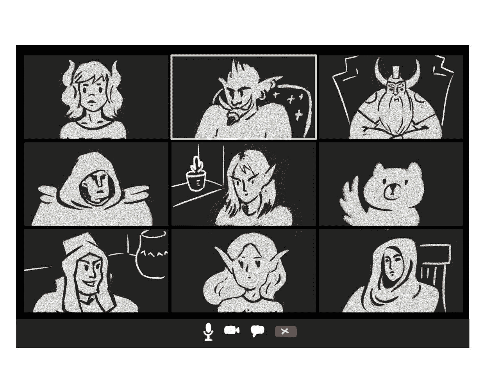

**你喜欢这篇文章吗？** 在脸书上分享它，写下评论——我们将讨论它！