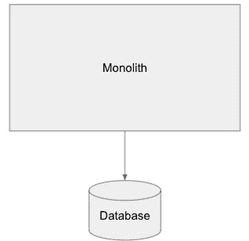
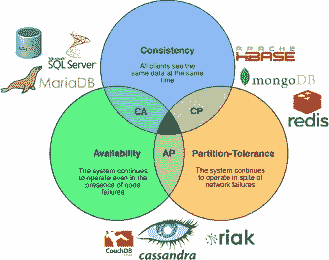
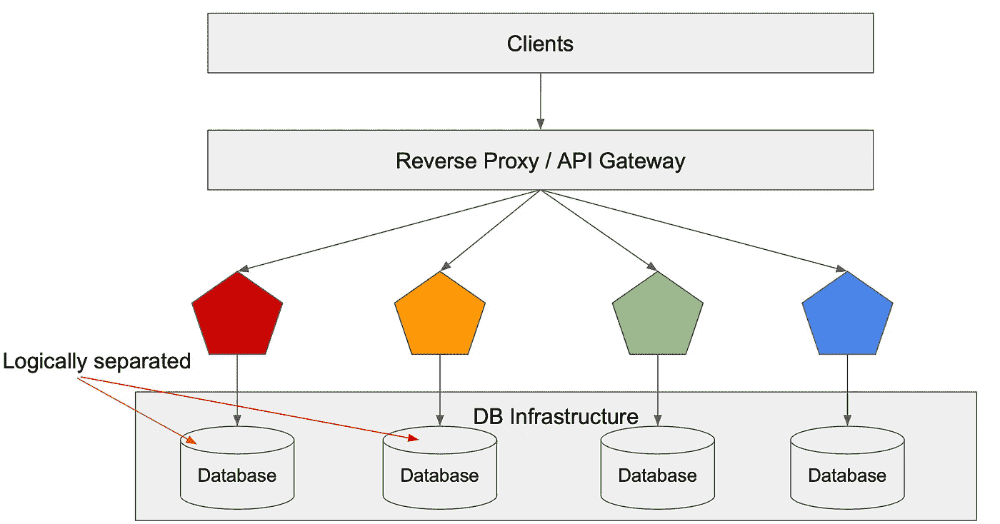
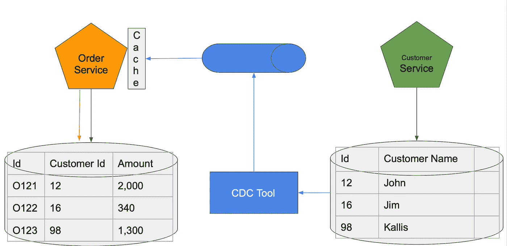
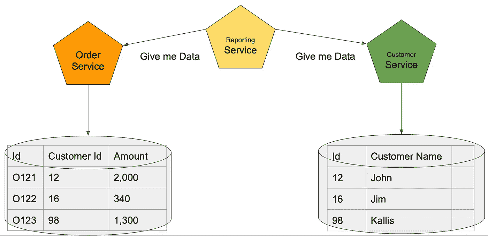
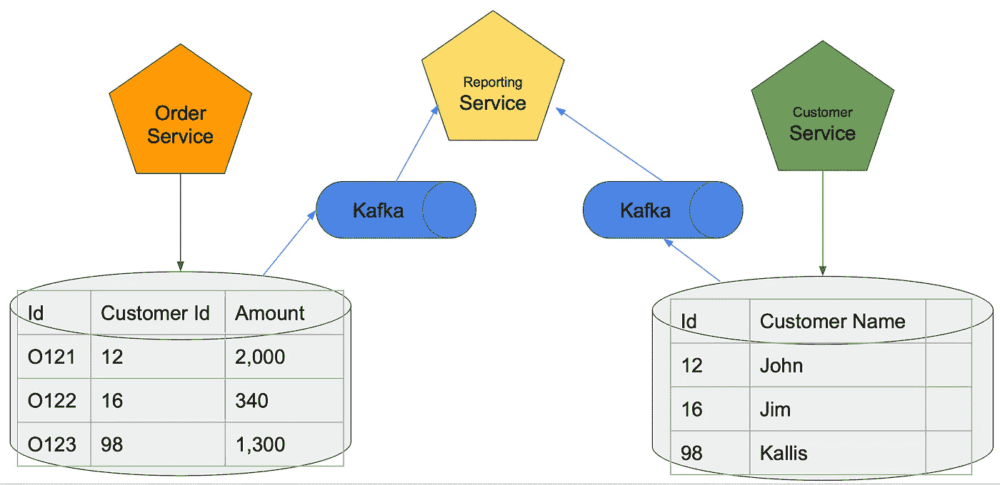
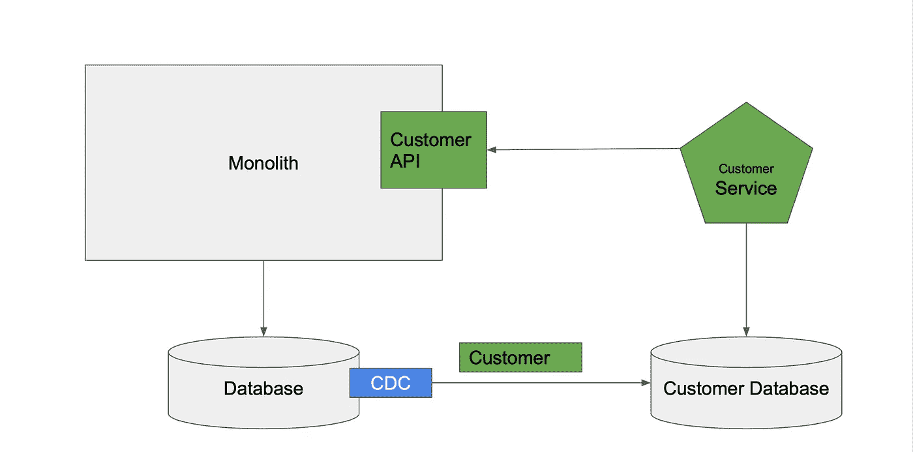

# 管理微服务架构中的数据

> 原文：<https://medium.com/geekculture/managing-data-in-microservices-architecture-fb459bdbf71f?source=collection_archive---------1----------------------->

Image source : ddw-online.com

众所周知，微服务架构有很多优点，比如可伸缩性、易于维护和频繁部署。但是实现这些模式是很棘手的。您可能遇到的挑战之一是管理微服务数据库。服务如何在不失去独立性的情况下存储数据？为您的基于云的应用选择哪些微服务数据库模型？

在今天的博客中，我希望回答这些问题，我将向您解释我们如何在微服务架构中管理数据。大多数人正在从整体架构转向微服务，再转向分布式架构风格。大多数系统都使用整体架构风格。它非常简单，你知道它很容易掌握，或多或少，他们使用一个单一的数据库，所以大多数时候，这个数据库是一个 RDMS(关系数据库管理系统)。

Image 1 : DB usage in Monolithic Application Architecture

谈到关系数据库管理系统，我们有一个救世主。救世主是酸属性的。当您使用具有 acid 属性的数据库时，您不需要太担心数据，因为它使用的是 acid 属性，正如这里提到的，数据库管理系统本身会处理数据的一致性和合法性。

酸代表原子性、一致性、隔离性和持久性；

*   **原子性**:对数据的所有改变都被执行，就好像它们是一个单一的操作
*   **一致性**:数据在事务开始和结束时都处于一致的状态
*   **隔离**:一个事务的中间状态对其他事务是不可见的
*   **持久性**:在事务成功完成后，对数据的更改将持续存在，并且不会被撤消，即使在系统出现故障的情况下也是如此

当我们进入分布式体系结构或分布式数据库管理系统时，我们需要遵循的一个主要原则是 cap 定理。现在在 cap 定理中得到了三个主要方面；

1.  一致性
2.  可用性
3.  分区容差

Image 2: CAP Theorem

最重要的是，在任何给定的数据库中，您只能拥有其中的两个方面。目前市场上还没有一个数据库系统可以在一个数据库中满足这三个方面。例如，当您使用传统的关系数据库时，您就有了一致性和可用性。不过，如果您正在处理一致性和分区容差，那么 **MongoDB** 和 **Redis** 是您需要处理的数据库。同时，如果您正在处理可用性和分区容差，您必须使用 **Couch DB** 或 **Cassandra** 。如您所见，如何选择这个数据库完全取决于您的业务需求或您在分布式体系结构中试图实现的目标。

现在让我们进入微服务的世界。我看到大多数微服务架构都使用反向代理或 API 网关来处理所有的客户端请求。有一组独立的可部署的(微)服务，但不幸的是，所有这些独立的微服务都连接到一个数据库。这是一种好的做法吗？当然不是。

使用共享数据库的微服务的问题:

*   单点故障
*   性能瓶颈
*   服务依赖性
*   不自主

因此，不管这个架构中有多少服务，我们只有一个单点故障:数据库，并且我们有许多性能瓶颈。每当他们想要进行数据查询或数据更新或任何与数据相关的事情时，一切都会成为数据库的瓶颈，因此在这种体系结构和服务依赖性中产生了性能瓶颈。同时，由于我们对数据库的高度依赖，服务部署和更新不是自治的。

自主性是微服务的主要原则之一。使用这种体系结构，您可以使用 CICD 管道执行自治服务部署。这是一个挑战，因为如果你改变任何数据方面，它会影响许多其他微服务。由于数据库依赖性，您将无法在不影响其他微服务的情况下将任何特定的微服务独立部署到生产环境。

## 对此我们能做些什么？

我们可以做的最简单的事情是为每个服务建立一个数据库，或者只建立几个依赖于特定数据库的数据库。

首先，我们可以有一个数据库服务器和逻辑上分离的数据库，如下图所示。

Image 3: SOA is not Microservices

这个比我们以前的建筑风格要好，但是仍然有一些问题。它仍然有一个单点故障；因为我们在一个物理数据库中托管了逻辑上分离的数据库。它有一个吵闹的邻居问题。例如，这个红色的微服务在这个特定的数据库中运行一个代价很高的查询，因为它托管在一个数据库服务器中；该查询的性能影响会影响其他逻辑上分离的数据库。但是这种架构风格的一个优点是经济高效，因为我们不必为不同的数据库实例付费。每当您试图在基础设施上部署您的架构或数据库平台时，这种类型的模型都是合适的。有了它，无论何时出现问题，您都可以密切监控并继续进行所需的任何更改，这对于本地微服务部署来说非常好。

为了解决上述架构中的问题，我们可以使用物理上分离的数据库。由于所有这些数据库在物理上是分离的，一个特定数据库的性能或任何其他故障都不会影响其他数据库。因此，每当你试图在这些服务之间实现数据独立性时，这种特殊的架构是非常好的。但是，这种模型的成本高于单一数据库模型。

Image 4: DB Deployments in separate physical databases

比方说，你想要一个数据库许可证。在这种情况下，您必须为所有这些数据库服务或服务器购买许可证。每当您尝试在云上进行数据部署时，这是一个好方法，因为在这种情况下，您不必维护昂贵的数据库服务器。拥有这种架构的主要优势是数据独立性。

## 接下来的步骤

为了进一步分析这种微服务架构中的问题，我们来看一个例子。假设有两个服务:

1.  订购的服务
2.  客户服务

Image 5: Data in two services

因此，订单服务中会出现一个查询，询问上周购买最多的商品的名称。如果您以传统的数据库架构方式思考，我们可以在客户表和订单表之间加入。
然而，在微服务架构中，两个数据库是分离的，我们不能在两个表之间进行连接。

另一种解决方法是按顺序获取客户 id，并对客户表进行单独查询以检索客户名称。然而，当涉及到微服务架构时，这是一个很大的问题，因为订单服务也依赖于客户表。因此，这种跨服务数据库调用在任何微服务架构中都是不建议的。对此的另一个解决方案是直接呼叫客户服务并说“嘿，给我客户名称 id 的名称或客户名称作为 id”。然后我们可以检索这个客户名称，这是在两个微服务之间检索数据的最合适的方式。

然而，这里还有另一个问题—延迟。一种解决方案是维护服务器端缓存。我们可以在服务器端缓存中去掉来自客服的数据库调用，但是网络调用还在。如果对 customer 表做了任何更改，用这种方式更新 cash 会更容易。此外，这有助于有效的内存管理，因为它是在服务器端。但是，网络调用还在。

另一个解决方案是维护客户端缓存。在设计阶段，我们可以确定在来自客户服务的订单服务中经常需要哪些数据元素，我们可以上传它们或者在客户端将这些数据作为缓存服务进行维护。

这种方法的优点是没有网络调用。因此，在性能和弹性方面也有一定的提高。例如，如果客户服务停止，我们仍然可以在缓存中检索这些数据，因此它不再依赖于客户服务。对于这种频繁访问的数据，这种方法的一个缺点是失效和更新问题。如果对这个客户表进行了更改，更新这个特定的客户端缓存并不简单，也不直接。

## 对于这种数据分离，我们可以使用哪些技术？

执行此操作的最有效方式是使用 CDC(变更数据捕获)工具。一个这样的例子是 Debezium。Debezium 是我们可以使用的一个优秀的 CDC 工具，它支持许多数据库平台。这个工具允许我们检查每个事务的数据库日志并触发一个事件。在捕获数据更改后，您可以将该事件提交到消息代理或简单队列中。订单服务中的缓存服务可以订阅此事件流，并相应地更新缓存。

Image 6 : The usage of the CDC tool

然而，这里有一个小问题。在这里，我们必须考虑最终的一致性。我们不能假设一旦客户服务更新了客户数据库中的任何内容，它就不会立即反映在缓存中。缓存获取更新需要一些时间。这被称为最终一致性，这是分布式数据管理最重要的方面之一。

## 数据报告场景

假设有一个报告服务需要来自这两个服务的数据。

Image 7: The Data Reporting scenario

假设这个特定的报告查询需要 1 亿条记录。当这个特定的报告服务从主微服务本身检索数据时，它可能会影响主微服务或订单服务的性能。因为前面提到的报告服务正在请求 1 亿条记录，同时其他请求也进入了订单服务。因此，它也影响了其他功能。

对于这个 secnario 有什么可用的解决方案。以下是我们面临的问题:

*   高延迟
*   可能会影响其他事务处理器
*   需要获取每个报告请求的数据

假设十个经理在不同的时间请求这个报告十次，我们需要执行这个操作十次来生成报告。那么，我们如何通过使用 CDC 工具，通过更新 Kafka 这样的消息代理来通知所有的更改和报告，从而给出解决方案呢？报告服务可以缓存或保持事件流中的数据更新。在此事件流中，只要 reporting services 需要，您就可以查询此数据。

Image 8: Reporting Scenario with Event streaming or event sourcing

ksqlDB 就是可以用于这种事件流查询的一种技术。因此，这一个与 Kafka streams 等事件流高度匹配，您可以使用 ksqDB 查询所有这些事件流甚至事件源。它与其他常规 SQL 查询非常相似，但唯一的区别是它查询的不是表，而是流处理。

## 整体到微服务的数据迁移

大多数系统都是从整体开始的，最终，当用户数量增加时，他们决定转向微服务。因此，我们在这里可以做的最简单的事情是为客户服务构建一个单独的微服务，并将所有数据元素或数据库移动到一个单独的数据库中，例如客户数据库中。

然而，这可能会有影响。正如马丁·福勒曾经说过的，“如果你进行一次大爆炸式的重写，你唯一能保证的就是一次大爆炸”。我们不能在一夜之间做到这一点，因为移动数据比将代码逻辑移动到单独的微服务中要复杂得多。数据有很高的依赖性，如果数据在移动后损坏，就很难恢复。因此，我们需要逐步计划这一行动。

Image 9: Data and code migration using strangler-fig pattern

首先，我们需要创建一个 API，它公开来自中央数据库的客户数据，然后我们可以创建我们的客户服务来从这个自定义 API 中检索这些数据。请记住，我们在中央数据库中拥有一切，我们可以创建客户数据库，然后我们可以使用 CDC 工具或任何其他 ETL 技术将这些数据移动到客户数据库中。我们可以看到自定义 API 仍然存在，客户服务仍然在获取用于数据检索的客户 API。在这里，我们可以在这两个数据源之间有一些中间灰色期或测试期——来自 API 的数据和客户数据库中的数据。因此，在运行这些测试几周或几个月后，我们可以确保数据的一致性。之后，我们终于可以摆脱这个 API 和中央数据库了。然后我们就可以有一个独立的微服务，有独立的数据源。这是将我们的数据转移到单独的微服务中的最佳方式。当涉及到微服务迁移时，这也被称为扼杀者适应模式。

以下是我在 Youtube 上关于同一主题的视频。

所以我希望现在你对微服务架构中的数据管理有了更好的理解。如果你想了解更多，更深入地研究这个主题，请查阅我提到的书籍，它们列在下面。

 [## 整体到微服务

### 如何理清一个整体系统，并将其迁移到微服务架构？你是如何做到的，而…

books.google.lk](https://books.google.lk/books/about/Monolith_to_Microservices.html?id=iul3wQEACAAJ&redir_esc=y)  [## 重构数据库

### 重构已经在广泛的开发项目中证明了它的价值——帮助软件专业人员改进系统…

books.google.lk](https://books.google.lk/books?id=uj6emAEACAAJ&dq=Refactoring+databases+by+Scott+Ambler&hl=en&sa=X&ved=2ahUKEwiTqt3L8PrwAhVl3jgGHZVlCscQ6AEwAXoECAcQAg)  [## 面向企业的微服务

### 了解在企业应用环境中构建微服务的主要挑战和解决方案…

books.google.lk](https://books.google.lk/books?id=OA14uAEACAAJ&dq=Microservices+for+the+enterprise&hl=en&sa=X&redir_esc=y)