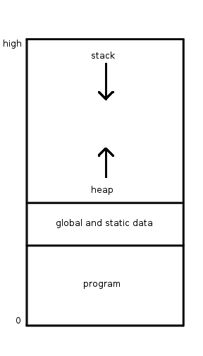

# 使用堆栈和堆管理内存:您需要知道的一切

> 原文：<https://medium.com/geekculture/managing-memory-using-stack-and-heap-all-you-need-to-know-8cb0192f5234?source=collection_archive---------4----------------------->

堆栈和堆都是专用的内存区域，用于动态分配和取消分配数据——还有[个其他内存区域](https://en.wikipedia.org/wiki/Data_segment)可用于在进程初始化时分配静态数据。

在本文中，我们将了解堆栈和堆之间的区别，以及不同的解释和编译编程语言是如何使用它们的。我们还将了解哪些数据通常存储在堆栈中，哪些数据通常存储在堆中，以及原因。

# 堆栈


堆栈是一个 LIFO(后进先出)内存区域，通常用于存储执行函数所需的信息，包括:局部变量、返回地址、为被调用者传递的参数以及实现者可能决定的任何内容。

调用一个函数会使堆栈的大小增加一层，这一层称为堆栈框架，这一层将拥有执行这个特定函数的必要信息，并将执行结果返回给调用函数。

因为对堆栈的操作是以 LIFO 方式进行的，这意味着分配和取消分配只是将索引增加/减少一个特定的长度，现代 cpu 架构提供了专用的寄存器和指令集来操作堆栈。

如果你仔细观察前面的陈述，你会发现它的基本意思如下:

*   您只能分配预先知道其大小的数据——这在理论上适用于动态数据，例如，如果解释器/编译器可以看到在函数的整个生命周期中添加的元素不超过四个，那么解释器/编译器可能会分配一个最初在堆栈上填充了一个元素的数组
*   分配和释放非常简单快速，只需要改变索引
*   读取和修改堆栈中的信息也很简单快速，这是一个索引访问的问题

从编程语言的角度来看，这三点实质上是堆栈的定义特征，这意味着固定大小的数据(例如整数、字符串)通常存储在堆栈中。

一种编程语言是否可能决定只放固定大小的数据或动态大小的数据是一个实现细节，但是通常许多编程语言将决定只把固定大小的数据放在堆栈上，因为确定动态大小的数据的最大大小是不容易/不可行的。

看看下面这个用想象力丰富的语言编写的函数——它看起来很像 javascript:

```
function mySum() { const arr = [] arr.push(1, 2); return arr[0] + arr[1]}
```

这里的数组`arr`是动态大小的，但是编译器/解释器可能决定看到它的最大大小为 2，这取决于在堆栈或堆上分配数组的实现，但是我们的函数通常要复杂得多，所以想想这个例子:

```
function myMultiplication() { const arr = [1,2] return multi(arr)}
```

因为数组的大小是动态的，所以我们不知道 multi 会对它做什么。本质上，虽然在堆栈上分配是为了知道某个数据的最大大小，但实际上很难区分初始大小和最大大小，因此通常只有固定初始大小的数据才会在堆栈上分配。当然总会有一些例外，例如 C 中的[可变长度数组](https://en.wikipedia.org/wiki/Variable-length_array)被分配到堆栈上，即使它们是动态大小的数据。

> **堆栈与调用堆栈**完全不同，调用堆栈是语言相关的，不同语言之间它做什么和如何做有很大不同。堆栈是一个 LIFO 内存区域，它适合于实现某些调用堆栈功能，但也可以用于实现者认为合适的任何事情，例如反转字符串。

调用堆栈通常与堆栈相关联，因为使用堆栈来支持调用堆栈的功能是有意义的，但情况并非总是如此，仅有堆栈可能是不够的。

让我们以这段 javascript 代码为例:

```
function outer() {
  const z = 3;
  function inner() {
    console.log(z)
  } setTimeout(inner, 10)
}
```

现在如果你运行`outer`，会发生什么？当`inner`运行时，`outer`已经执行完了，`inner`应该抛出一个错误还是只记录 3？

如果 Javascript 内存模型要在堆栈上分配`z`变量，那么当`outer`完成执行时`z`将被释放，而`inner`将抛出一个错误。然而`inner`实际上会记录 3，本质上这是一个闭包的例子，闭包是一个不被栈直接支持的特性；应该用栈之外的东西来实现它，甚至完全不用栈来实现它。

# 垃圾堆

如果堆栈通常用于分配固定大小的数据，那么堆通常用于分配动态大小的数据。与堆栈不同，分配和释放需要的不仅仅是增加/减少一个索引。

堆和栈都是内存中的连续区域，通常它们以相反的方向增长，并且彼此相邻。



An example of stack and heap layout in a memory region

这意味着你可以很容易地把它们想象成一个数组。举个例子，我们的堆是一个从 0 到 99 的 100 个槽的数组。假设该进程请求 10 个槽，然后 20 个，然后 30 个，然后该进程请求释放前 10 个槽。所以我们会有这样的东西`[10 empty slots, 20 used slots, 30 used slots, 40 empty slots]`，现在假设进程需要 50 个线性槽，我们的堆有 50 个空槽(前 10 个和后 40 个)，但是现在虽然堆有 50 个空槽，但是它不能将它们授予进程。

我刚才描述的是一个称为内存碎片的问题，必须解决这个问题才能使堆分配有效，解决这个问题需要分配和取消分配时的开销，这是为什么在堆栈中分配和取消分配更有效的主要原因——当然，除此之外，在堆栈中分配和取消分配可能有硬件支持。

由于这种开销，现代编程语言试图动态地分配和释放堆栈上容易/可行的东西，以及堆上的其他东西。

**这篇文章对你有用吗？拍手声👏它，并帮助他人找到这篇文章。**