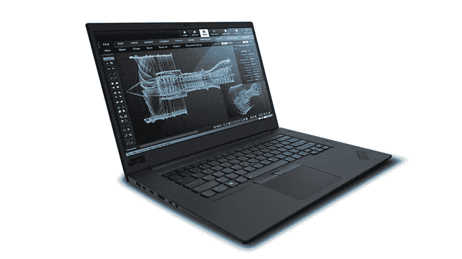
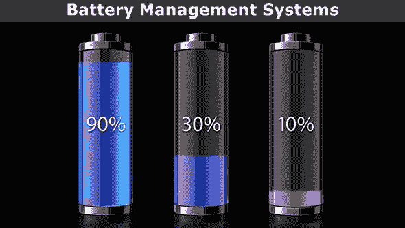
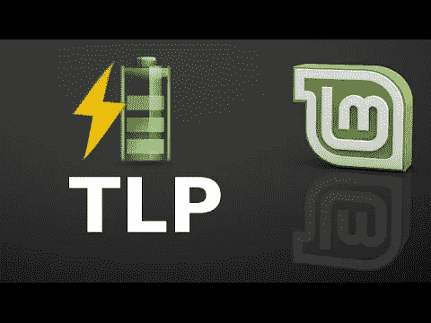

# 用 TLP 在 Debian Linux 下管理你的 Thinkpad 电池

> 原文：<https://medium.com/geekculture/managing-your-thinkpad-battery-under-debian-linux-with-tlp-d0822c42c69c?source=collection_archive---------0----------------------->



Image by [Lenovo](https://www.cnet.com/tags/lenovo/) from [CNET](https://www.cnet.com/reviews/lenovo-thinkpad-p1-preview/)

L [aptop 电池](https://www.digitaltrends.com/computing/how-to-care-for-your-laptops-battery/)是为了处理特定的充电周期而制造的，通常在 500 个完整周期左右，有时甚至更多。本质上，充电周期等于一次完全放电至 0 %,然后再充电至 100%。放电下降到 50 %,然后回到 100 %,相当于半个周期。随着时间的推移，每个充电周期都会降低电池的设计容量，这意味着在其他条件不变的情况下，放电次数越少，电池的续航时间越长。


Image source unknown

在你必须更换电池之前，你可以将 ThinkPad 的电池设置为最长运行时间(小时)或最长寿命(年)。正常默认设置保持电池充满电。当电池电量下降到 96%以下时，该设置开始充电，并在 100%时停止。电池运行时间取决于电源计划设置。您可以设置多个预定义的电源计划，也可以创建自己的电源计划。为了获得最佳运行时间，请从最长电池寿命电源计划开始。

电池寿命受年龄、充电周期、充满电的时间和高温的影响。为了在很少使用电池时获得最长的使用寿命，请设置自定义充电阈值，在 40%容量时开始充电，在 50%容量时停止充电，并保持 ThinkPad 冷却。如果电池使用比较频繁，将启动阈值设置在 85%左右，并在 90%时停止。与保持电池充满电相比，这仍然有利于延长电池寿命。



Image by [Boris Roz](https://stock.adobe.com/contributor/201269065/boris-roz) from [Adobe Stock](https://stock.adobe.com/images/batteries/16792329)

[TLP](https://linrunner.de/tlp/) 是一款免费的开源、功能丰富的命令行工具，用于高级电源管理，有助于优化由 Linux 驱动的笔记本电脑的电池寿命。它可以在所有品牌的笔记本电脑上运行，默认配置已经过调整，可以有效可靠地维持电池寿命，以便您可以安装和使用它。

它通过允许您配置诸如 CPU、磁盘、USB 小工具、PCI 组件、无线电设备等设备的方式来执行节能。当您的笔记本电脑使用电池时，应该使用电源。

TLP 为您带来了先进的 Linux 电源管理的好处，而无需了解每一个技术细节。它的默认配置已经针对电池寿命进行了优化，这样您就可以安装后忘记它。然而，它是高度可定制的，以满足您的特定要求。



Image by [Linux Mind](https://www.youtube.com/channel/UCdhFR7qIzP2PEuUtmWenXqw) from [YouTube](https://www.youtube.com/)

TLP 软件包[可用于 Arch、Debian、Fedora、Gentoo、OpenSUSE、Ubuntu 等等。更新包数据:](https://linrunner.de/tlp/installation/index.html)

```
sudo apt update
```

安装以下软件包:

*   **tlp** *(主)——*省电
*   **tlp-rdw** *(主)—* 可选—无线电设备向导

您可以通过软件包管理工具或终端命令安装上述软件包:

```
apt install tlp tlp-rdw
```

一旦安装了 TLP，其配置文件是/etc/default/tlp，您将有以下命令可以使用:

*   tlp —应用笔记本电脑节能设置
*   tlp-stat —显示所有节能设置
*   tlp-pcilist —显示 PCI Express 设备数据
*   tlp-usblist —用于查看 USB 设备数据

它应该作为服务自动启动，您可以使用 [systemctl](https://www.tecmint.com/manage-services-using-systemd-and-systemctl-in-linux/) 命令检查它是否在 SystemD 下运行。

```
$ sudo systemctl status tlp
```

服务开始运行后，您必须重新启动系统才能开始使用它。但是您可以通过使用 [Sudo](https://www.tecmint.com/su-vs-sudo-and-how-to-configure-sudo-in-linux/) 命令手动应用当前的笔记本电脑节能设置来防止这种情况，就像这样。

```
$ sudo tlp start
```

然后，使用以下命令确认它是否运行，该命令实际上显示了系统信息和 TLP 状态。

```
$ sudo tlp-stat -s
```