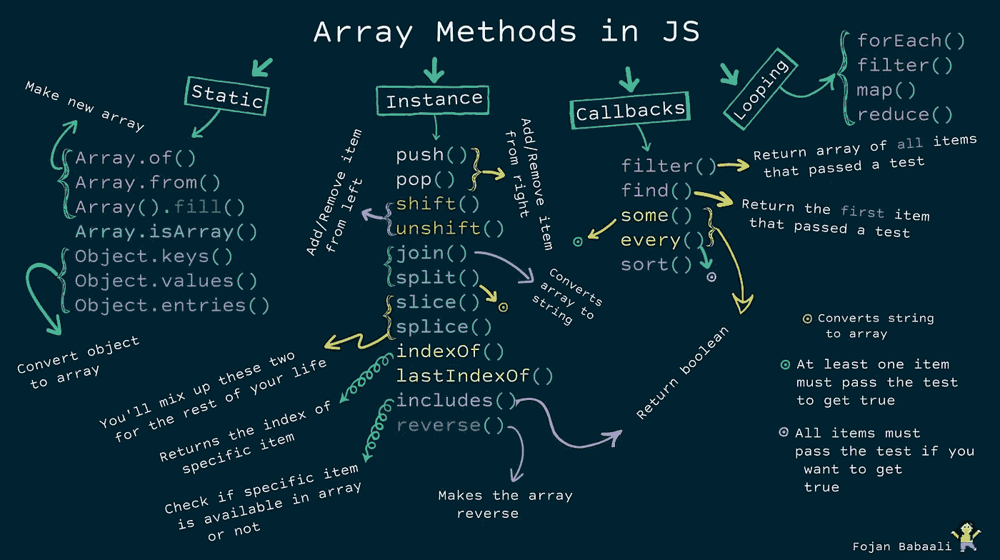
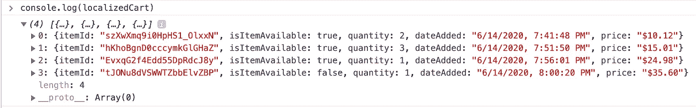
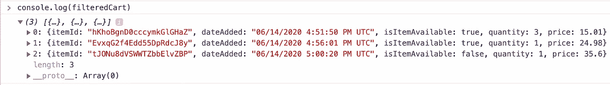
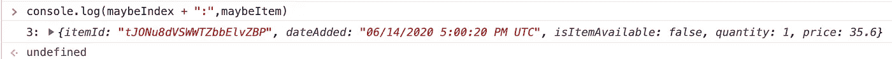
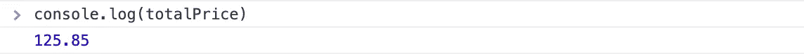

# 在 JavaScript 中操作数组

> 原文：<https://medium.com/geekculture/manipulating-arrays-in-javascript-dc07045d3dce?source=collection_archive---------4----------------------->



Image by Fojan Babaali

**数据处理**本质上是指调整数据，使其更容易阅读、理解和使用。无论你是渲染用户界面，从应用程序接口获取数据，还是从文件中读取数据，你都必须在各种 JavaScript 应用程序中操作数据。

如果您在 JavaScript 项目上工作得足够多，您会注意到以[数组](https://developer.mozilla.org/en-US/docs/Web/JavaScript/Reference/Global_Objects/Array)的形式看到数据是非常常见的。毫无疑问，有大量关于 JavaScript 数组的资源，任何阅读本文*的人都可能知道如何对数组执行基本操作。*然而，本文的主要目的是向您介绍不同的 JavaScript 数组方法和实践，它们可以用来实现[更简单、更整洁的代码](/geekculture/writing-clean-javascript-es6-edition-834e83abc746)。

# 从基础开始

在这一节中，我将简要介绍一些用于创建、访问或变更数组的常见静态和实例数组方法。对于大多数读者来说，这一部分的内容可能听起来非常基础或高级，但是，在更深入地探讨更高级的主题之前，了解它是很重要的。

> 如果您对以下概念感到满意，请跳到下一节！

## 静态方法

这些方法用于创建新数组或将现有的可迭代和类似数组的对象转换为数组。

## 突变方法

以下方法是实例方法或原型方法。在特定的数组实例上调用它们来应用突变。

**其他实例方法**

这些是其他不会改变数组的纯实例方法。

# 质疑传统循环

当考虑数组时，迭代通常是脑海中出现的第一个词。我们迭代数组，对每个值应用相同的逻辑*。在这一点上，似乎我们想要应用于数组成员的任何东西都可以通过使用传统循环及其所有变体(即`for,` `for-of`和`.forEach()`循环)来实现。*

下面是一些使用传统循环非常好的例子:

但是如果我们需要做更多的事情，比如修改或过滤数组元素，那该怎么办呢？我们当然可以使用传统的循环，但是我们不能做得更好吗？

在下一节中，我将介绍传统循环的更好的替代方案，为了简单起见，每个替代方案都将与`.forEach()`方法进行比较。

对于以下示例，我们将使用该数据集作为参考:

> 注意，为了可读性，我将大量使用带有隐式返回 的 [*箭头函数，以防你不熟悉。*](https://developer.mozilla.org/en-US/docs/Web/JavaScript/Reference/Functions/Arrow_functions)

# 取代传统的循环

## 。地图()

顾名思义，`[Array.protoype.map()](https://developer.mozilla.org/en-US/docs/Web/JavaScript/Reference/Global_Objects/Array/map)`在对每个元素应用一些逻辑后，将当前数组的元素映射到一个新数组。假设您收到了以前的购物车数据，其中包括 UTC 时间戳和价格(以数字形式)，并且您需要根据用户的浏览器设置本地化您的数据:

如您所见，`.map()`的使用提供了一个非常优雅的解决方案，使我们不必创建一个空数组，也不必将每个修改过的元素放入数组中。



## 。过滤器()

`[Array.prototype.filter()](https://developer.mozilla.org/en-US/docs/Web/JavaScript/Reference/Global_Objects/Array/filter)`是另一种方法，它返回一个新的元素数组，每个元素都满足所提供的测试条件。使用相同的购物车数据，假设我们想要过滤价格大于或等于$15.00 的所有元素:

预期结果将是:



## 。find() &。findIndex()

`[Array.prototype.find()](https://developer.mozilla.org/en-US/docs/Web/JavaScript/Reference/Global_Objects/Array/find)`和`[Array.prototype.findIndex()](https://developer.mozilla.org/en-US/docs/Web/JavaScript/Reference/Global_Objects/Array/findIndex)`都是不言自明的。第一个方法返回满足给定测试条件的第一个元素的值，而第二个方法返回该元素的索引。在下面的示例中，我们感兴趣的是找到数量小于 2 的第一个元素的索引和值:

结果是:



## 。减少()

`[Array.prototype.reduce()](https://developer.mozilla.org/en-US/docs/Web/JavaScript/Reference/Global_Objects/Array/Reduce)`是一个非常有用的方法，它将一些逻辑应用于每次迭代，同时累积所有先前迭代的结果。在这个上下文中，“累加器”可以是一个新的对象、数组或简单的变量。在本例中，我们感兴趣的是计算所有购物车商品的总价:

我们减速器的结果是:



> 显然，`.reduce()`有比计算总和更强大的用例，然而，我选择在本文中保持例子简单，以涵盖尽可能多的概念。

## 。every() &。一些()

`[Array.prototype.every()](https://developer.mozilla.org/en-US/docs/Web/JavaScript/Reference/Global_Objects/Array/every)`和`[Array.prototype.some()](https://developer.mozilla.org/en-US/docs/Web/JavaScript/Reference/Global_Objects/Array/some)`分别检查**每个**或**部分**元件是否满足一个测试条件*。当你只对一个“*是或否*”的答案而不是实际值感兴趣时，应该使用这些方法来代替`.filter()`和`.find()`——显然还有传统的循环。*

## *。排序()*

*本节要介绍的最后一个方法是`[Array.prototype.sort()](https://developer.mozilla.org/en-US/docs/Web/JavaScript/Reference/Global_Objects/Array/sort)`，它将一个比较器函数作为参数，并返回一个排序后的数组。当没有提供自定义比较器时，默认的排序顺序是升序。*

## *链接方法*

*现在我们已经看到了数组方法的不同做法，让我们一起使用它们。假设您必须修改购物车数组以满足以下约束:*

*   *所有项目都应标记为可用*
*   *我们只想呈现`itemId`和`netPrice`*
*   *物品应该按照数量的升序排列*

*我们可以通过链接数组方法轻松实现所有约束:*

> *请记住，过度链接可能会增加时间复杂度并影响性能，因此请确保优化这些调用。*

# *好处:使用 ES6 功能*

## *解构*

```
*const [apple, banana, cherries] = ["🍏", "🍌", "🍒"];console.log(apple); *// 🍏* console.log(banana); *// 🍌* console.log(cherries); *// 🍒**
```

## *默认值*

```
*const [apple, banana, cherries, mango = "🥭"] = ["🍏", "🍌", "🍒"];console.log(mango); *// 🥭**
```

## *跳过值*

```
*const [apple, , cherries] = ["🍏", "🍌", "🍒"];console.log(apple); *// 🍏* console.log(cherries); *// 🍒**
```

## *传播算子*

```
*const [apple, ...others] = ["🍏", "🍌", "🍒"];console.log(apple); *// 🍏* console.log(others); *// ["🍌", "🍒"]**
```

*这是一个关于使用合适的数组方法进行数据操作的综合指南。我肯定没有涵盖所有内容，但我确保我提到了最常用的方法。如果你觉得这篇文章有用，不妨喜欢一下[我之前的文章](/geekculture/writing-clean-javascript-es6-edition-834e83abc746)。*

*[](http://buymeacoffee.com/jalkhurfan)

Support me to write more!*