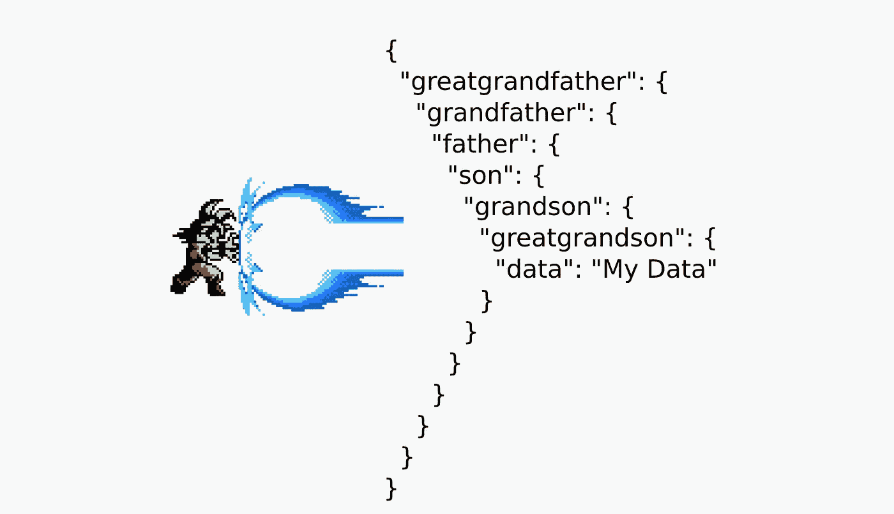

# 用 JavaScript 和 Ruby 操作嵌套对象值

> 原文：<https://medium.com/geekculture/manipulating-nested-object-values-with-javascript-and-ruby-64cb25861a68?source=collection_archive---------24----------------------->



作为一名开发人员，你经常需要操纵对象，像 Ruby 和 JavaScript 这样的编程语言可以在这个过程中给你很大的帮助，但有时你会遇到不那么容易解决的问题。

我已经遇到了两个嵌套对象的企业问题，花费了我相当多的时间，我想分享这些问题以及如何解决它们，以防有人经历类似的事情。

## **问题 1:**
使用 JavaScript 对象创建菜单

在这种情况下，应用程序没有计划增长这么多，所以没有使用数据库来保存菜单选项。然后使用一个对象，每当需要创建一个菜单时，这个对象就会被编辑。

这看起来很容易，但它有一个陷阱，根据你使用的库，你需要为每个菜单选项设置一个标识符“id ”,这样就不会发生意外的情况。
阅读 [*React 列表和按键*](https://reactjs.org/docs/lists-and-keys.html) 更能理解我在说什么。

示例:

```
/* this is just a example menu, the original is much bigger */
const menu = { 
  sales: {
     description: “Sales”,
     url: ‘/sales’
  },
  purchases: {
    description: “Purchases”,
    url: ‘/purchases’
  },
  settings: [{
    globalConfiguration: {
      description: “Global configuration”,
      url: ‘/settings/global-configuration’,
      order: 1,
    },
    user: {
      description: “Add User”,
      url: ‘/settings/user’,
      order: 2,
    }
  }]
}
```

你一定在想，所以只需在每个选项中输入 id，“是啊”这是一个好主意，但最初的菜单有二十多个选项，在某些情况下，有必要移动选项的顺序。所以有人认为为什么不自动添加 id，这就是所发生的事情。

代码:

```
let count = 1
const addObjectKey = (obj, keyName = 'id') => {
  if(Array.isArray(obj)) {
    obj.forEach(addObjectKey);
  } else if (obj && typeof obj === "object") {
     if (obj && obj.description) {
       obj[keyName] = count
     }
     Object.keys(obj).forEach(k => addObjectKey(obj[k]))
     count++
  }
  return obj
}addObjectKey(menu)
```

结果:

```
// The id key was added
{ 
  sales: {
     description: “Sales”,
     url: ‘/sales’,
     id: 1
  },
  purchases: {
    description: “Purchases”,
    url: ‘/purchases’,
    id: 2
  },
  settings: [{
    globalConfiguration: {
      description: “Global configuration”,
      url: ‘/settings/global-configuration’,
      order: 1,
      id: 3 
    },
    user: {
      description: “Add User”,
      url: ‘/settings/user’,
      order: 2,
      id: 4
   }
  }]
}
```

## 问题 2:
标准化 Rest API 测试请求

一天，一个在 QA 工作的朋友打电话给我，就他工作的公司的一个问题向我寻求帮助。该公司已经开始与 QA 合作，并面临一些问题，问题是开发人员没有标准化 API 请求返回的值。当出现错误或警告时，每个请求返回不同的 JSON 模式，当电子邮件无效时，它返回一种方式，当密码无效时，它返回另一种方式，以此类推。

示例:

```
# Request fail
{
  "message": "Api request failed"
}# Request with invalid E-mail
{
  "errors": {
    "email": "Invalid E-mail"
  }
}# Request without password
{
  "password": "Enter password"
}
```

于是我就问当时的开发者为什么不标准化，得到的回答是，因为这已经是一个很大的项目，不是一朝一夕可以改变的。所以我说，谁将不得不标准化它将是你，在某种程度上，将是可扩展的，以便不会导致问题，在未来当你不得不作出改变。

然而，还有另一个障碍，他在测试中使用的主要编程语言是 Ruby，而我一生中从未见过 Ruby 代码。秘诀是不要因为你不懂语言就害怕面对编程问题。“知道如何编程比知道一门编程语言更重要”。

代码:

```
def addKeyInNestedHash(hash, keyName = "message")
  get_value = ''
  hash.each do |k, v|
   if v.class == Hash
     hash = addKeyInNestedHash(v, keyName)
   else
     hash = hash.clone 
     hash.delete(k)
     hash[keyName] = v
   end
  end
  return hash
end# Convert JSON to hash
hashAPI = JSON.parse(getRequestAPI)addKeyInNestedHash(hashAPI).to_json
```

结果:

```
# Now it’s easy to create a test cases# Request fail
{
  "message": "Api request failed"
}# Request with invalid E-mail
{
  "message": "Invalid E-mail" 
}# Request without password
{
  "message": "Enter password"
}
```