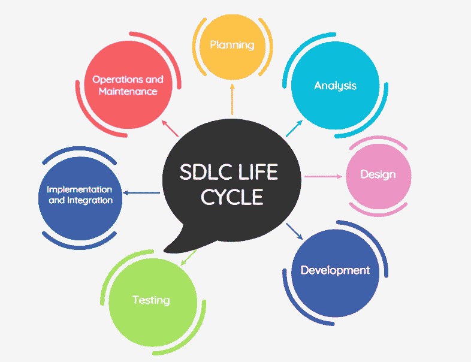

# 手动软件测试

> 原文：<https://medium.com/geekculture/manual-software-testing-94aad9e066ce?source=collection_archive---------19----------------------->

Photo by [ThisIsEngineering](https://www.pexels.com/@thisisengineering?utm_content=attributionCopyText&utm_medium=referral&utm_source=pexels) from [Pexels](https://www.pexels.com/photo/female-engineer-controlling-flight-simulator-3862132/?utm_content=attributionCopyText&utm_medium=referral&utm_source=pexels)

手动测试是一种软件测试，在这种测试中，测试用例是手工运行的，而不是使用自动化工具。测试用例定义了测试一个系统需要做什么。它指定了诸如必须在系统中执行的活动或必须输入到系统中的输入数据值，以及测试用例执行过程中的预期结果。手动软件测试不需要自动化测试工具的专业知识，只需要理解手动测试过程

检查员从最终用户的角度手动执行所有的测试用例。它检查应用程序是否按照需求规范中的描述运行。需求跟踪矩阵[RTM]是一个保证所有测试用例都被覆盖的文档。它是在测试执行过程之前创建的，以保证给定需求的测试用例不会被忽略。创建和执行测试用例是为了完成几乎 100%的软件应用程序。他们的报告同样是手动创建的。手动测试不需要自动化测试工具的专业知识，只需要理解手动测试过程

# 重要

手工测试是最基本的评估方法之一，因为它可以检测出明显的和隐藏的软件缺陷。缺陷被定义为预期输出和软件提供的输出之间的差异。如果测试人员发现了软件中的缺陷，他会与开发人员沟通，开发人员随后会修复缺陷，并将应用程序返回给测试人员进行重新测试。

在对每一个新生产的产品进行自动化测试之前，都需要进行手动测试。尽管测试需要大量的时间和工作，但它确保了程序没有错误。

总而言之，手动测试的主要目标是:

*   保证应用程序没有错误，
*   保证其按照规定的功能要求运行。

这种测试确保系统是高质量的，并且客户收到的是无缺陷的产品。

如果你正在寻找一个职业服务专家来寻找软件测试方面的技术工作，你可以试试 [JAS 应用服务](https://www.careerist.com/jas)。

# 手动软件测试的类型

*   **白盒测试**:白盒测试是由开发人员执行的，他们在将每一段代码交给测试工程师之前都会对其进行验证。由于开发人员在测试期间可以访问代码，所以它也被称为白盒测试。
*   **黑盒测试**:测试工程师根据客户或委托人的需求，进行黑盒测试，以检验产品或软件的功能。测试时代码是不可见的，这就是为什么它被称为黑盒测试。
*   **灰盒测试**:灰盒测试结合了白盒和黑盒测试。它可以由熟悉编码和测试的人来进行。
*   **验收测试**:验收测试，也称为用户验收测试或 UAT，用于确定应用程序在多大程度上符合用户的需求和期望。一旦所有的 bug 都被修复，就会进行测试。在验收测试期间，产品应该是市场现成的，因为这种形式的测试是为了向用户提供一个软件应用程序在日常生活中的外观和行为的清晰画面。验收测试应由客户或产品用户进行。
*   **Beta 测试** : Beta 测试是一种典型的方法，用于在向更广泛的人群提供产品之前，在试运行期间收集真实用户的意见。它使软件团队能够通过真实的应用场景从不同的用户那里获得重要的见解。根据内部团队测试的结果，产品可以推出进行 beta 测试。在这个阶段，应该预计应用程序可以处理大量的流量，特别是如果测试版测试受众是开放的。私有和公开测试的现实可能需要广泛的计划。在私有或封闭的 beta 测试期间，应用程序的访问权限被授予有限的一组用户，这些用户可能是通过提交和批准程序被选择和指定的。而另一方面，在公开测试期间，任何对使用未发布形式的应用程序感兴趣的人都可以参与产品的评审。公开测试的好处是它允许来自不同用户的反馈。
*   探索性测试:这种类型的测试几乎没有规则。在进行测试时，检查员可以“探索”并了解应用程序，而不是遵循每个测试用例的固定协议。这种测试技术可以根据团队的需要应用于整个开发和测试阶段。由于缺乏纪律，它经常由测试人员之外的人进行，例如艺术家、产品经理或开发人员

# 如何进行手工软件测试？

*   为了识别测试区域，测试人员首先检查所有与软件相关的试卷。
*   然后，他或她分析需求文档，以确保满足客户的所有需求。
*   之后，他或她根据需求规格建立测试用例。
*   所有测试用例都是通过黑盒和白盒测试手动运行的。
*   如果在整个测试阶段发现任何问题，测试团队会通知开发团队。
*   开发团队解决问题，并将软件交给测试团队进行重新测试。

# 软件开发生命周期

软件开发生命周期(SDLC)的核心是一种项目管理方法。它定义了项目从概念到部署和后期维护所需的各个阶段。

SDLC 的主要阶段如下:

*   **规划**:规划阶段是开发者对即将到来的项目进行规划的阶段。它有助于识别任何当前系统的问题和大小，以及确定未来系统的目标。它还建立了项目时间表，这对于商业产品的开发是至关重要的，因为它预计将在特定的日期发布到市场上。
*   **分析**:分析阶段包括收集新系统所需的所有精确细节，以及开发最初的原型概念。开发人员分析细节，例如定义任何原型系统需求，审查现有原型的替代方案，进行研究和分析以确定最终用户的需求，等等。
*   **设计**:在设计阶段，开发人员将定义整个系统的细节，以及特定领域，如系统和用户界面、网络和网络需求以及数据库。他们将把生成的 SRS 文档转换成更符合逻辑的形式，以便以后用计算机语言实现。将创建操作、培训和维护计划，以便开发人员知道他们需要在周期的每个阶段完成什么。一旦完成，开发经理将创建一个设计文档，用于 SDLC 的后续阶段。
*   **开发**:开发阶段是开发人员实际开始编码，根据设计文档和先前建立的标准构建应用程序的阶段。产品程序代码是根据设计文档标准编写的。开发人员应遵守企业制定的任何代码标准。C++、PHP 和其他编程语言是开发人员使用的编程语言的一些例子。基于项目目标和需求，开发人员将选择合适的编程代码来使用。
*   **测试**:在测试阶段，开发人员检查他们的软件，并记下任何需要记录、纠正和重新检查的问题或缺陷。测试可以是非常短暂的阶段，也可以是非常漫长的阶段，这取决于开发人员的专业知识、软件的复杂性以及最终用户的偏好。
*   **实现和集成**:通过开发人员的倡议，各种模块将被集成到核心源代码中，通常通过使用培训环境来发现进一步的缺陷。信息系统将被集成并最终放置到其周围环境中。一旦这一阶段完成，应用程序将有可能上市，并可以分发给任何最终用户。
*   **操作和维护**:一旦产品向公众发布，开发者必须进入维护模式，并开始执行任何必要的操作，以解决最终用户发现的问题。开发人员负责实现软件部署后可能需要的任何更改。这可能包括处理在发布前无法修补的遗留缺陷，或者修复由于用户投诉而出现的新问题。

# 手工软件测试的利与弊

优点:

*   **不需要编程专业知识**:当实现黑盒方法时，几乎不需要任何编程知识。
*   **促进 GUI 设计的测试** : MT 可以用来测试动态变化的 GUI 设计。
*   **解决用户界面问题**:由于测试人员与应用程序进行交互，就好像他们是真正的用户一样，所以他们能够识别可用性和用户界面问题。
*   **百分之百无 bug 保证**:保证产品完全无 Bug。
*   **性价比**:实惠。
*   **使用简单**:对于新测试人员来说，学习起来很简单。

缺点:

*   **人力资源需求**:需要大量的个人。
*   **没有证据**:由于测试人员基于他们的能力和专业知识创建测试用例，没有证据证明他们是否覆盖了所有的功能。
*   **单次使用**:测试用例只有一次使用，不能重复使用。测试人员必须为每个新的软件创建不同的测试用例。
*   **兼容性问题**:当两个团队合作时，可能很难理解彼此的目标，这会误导整个过程。
*   耗时:测试需要大量的时间和工作。

如果你觉得这篇文章有帮助，那么请把它发给其他人。

https://youtu.be/OSwuhYfMwWY ✅learn 过着社交焦虑的生活⇾