# 这是什么？它将如何改变写作的世界？

> 原文：<https://medium.com/geekculture/manuscripts-ai-what-is-it-and-how-is-it-gonna-change-the-world-of-writing-ede655e16077?source=collection_archive---------6----------------------->

[link](https://manuscripts.ai)

所以，准确地说，我是一个作家/技术作家，如果你们以前读过我的文章，现在你们可能会发现我喜欢做疯狂的人工智能只是为了好玩。

所以，有一个叫 mauscripts.ai 的网站，我在这家公司做首席 AIML 工程师。所以有一天，我们的首席技术官找到我，他向我解释了公司的情况，我被说服了。现在让我告诉你这家公司是什么，以及它是如何基于人工智能的文本编辑器的未来。

因此，当你进入[约稿. ai](https://app.manuscripts.ai) 时，你会看到这个可爱的页面。

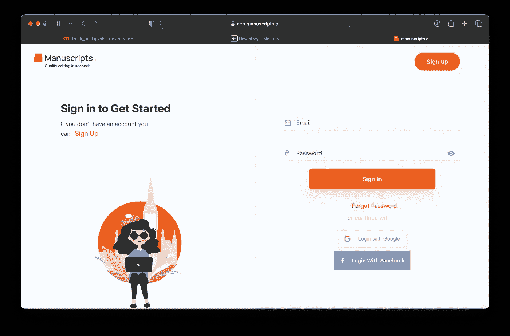

你可以登录或注册，甚至使用谷歌或 facebook 登录

我有一个 ID，所以我会登录。

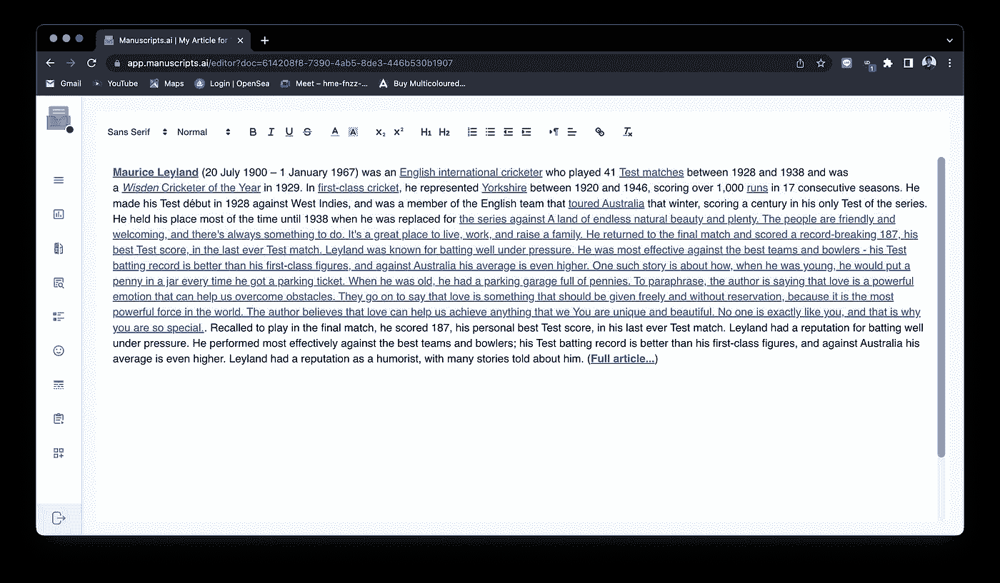

登录后，如果你点击新文档，你会看到这个编辑器页面。

# **现在让我们看看特色:**

你可以通过选择文本的一部分来进行深层次的剽窃检查:

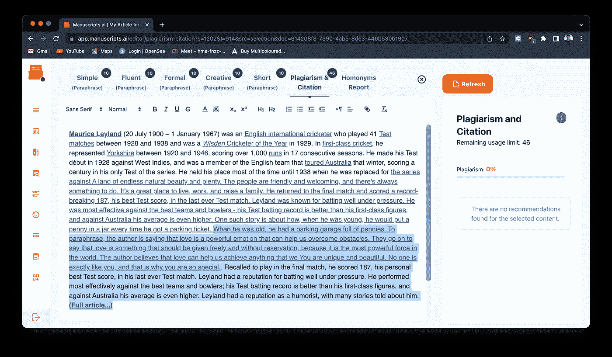

只需点击一个按钮，你就可以解释任何数量的数据(代码将被认为是你的功劳)。人工智能可以从选定的文本中添加或删除部分内容，而不会丢失文本的价值。你可以把你的文章解释成 5 种不同的类型。

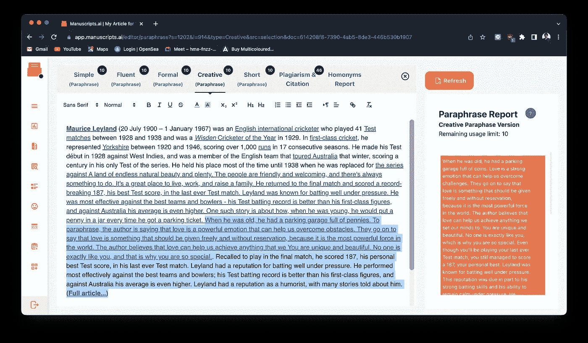

只需点击一下，您就可以在几秒钟内生成同音异义词报告:

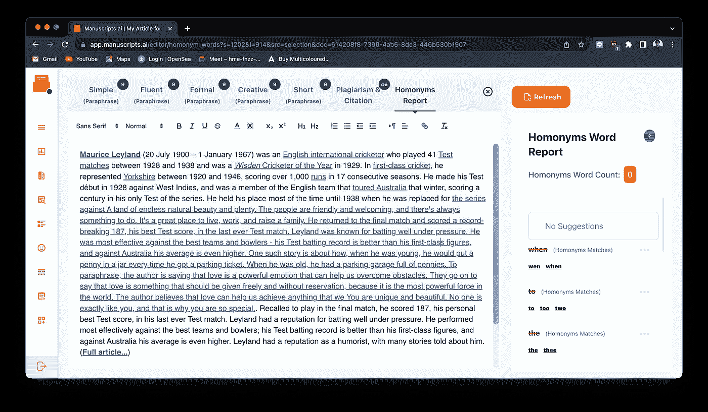

您可以在几秒钟内生成超过 25 个参数的文章摘要报告:

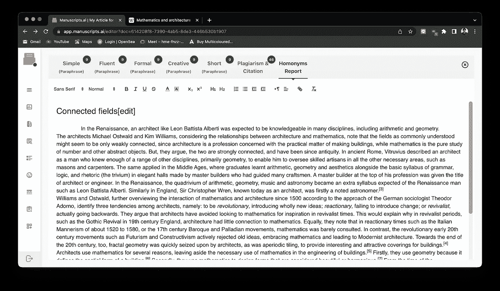

你可以比较两篇文章，找出它们在质量方面的差异:

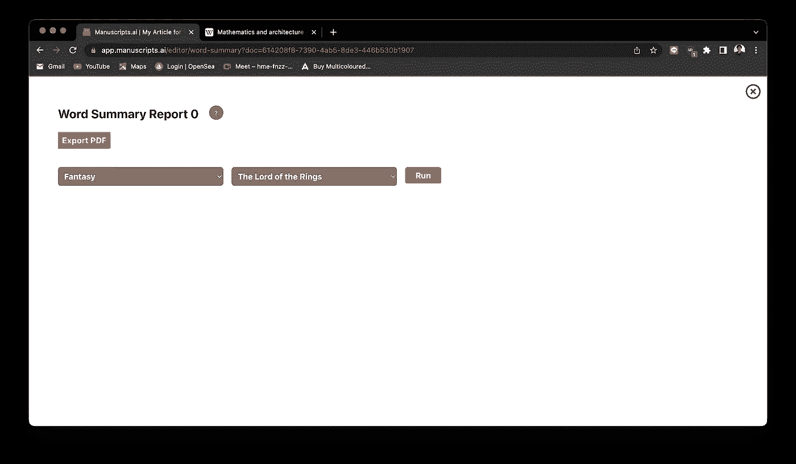

与任何其他文本编辑器相比，您可以更详细地检查文本可读性分数:

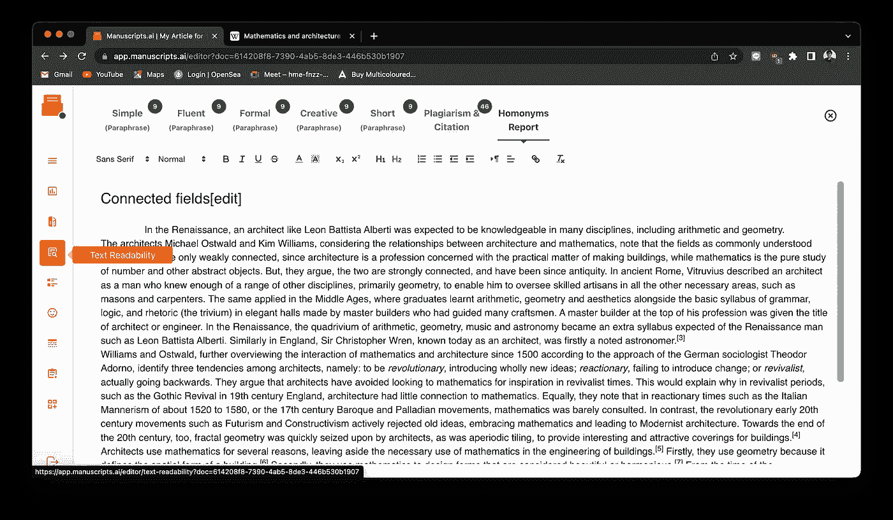

您可以为您的文章生成风格计量报告:

你可以为你的文章生成情感分析报告:

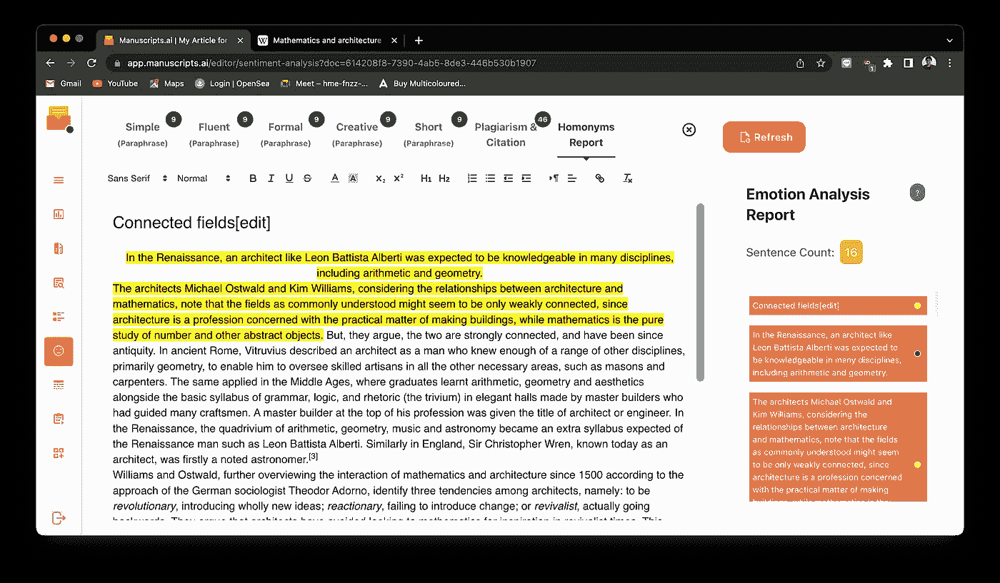

你可以给文章中的每一个词贴上标签，找出它到底是什么:

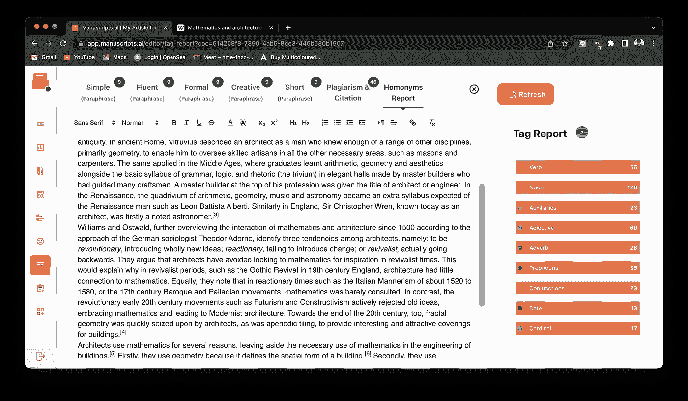

这是我最喜欢的功能。你可以生成一个叫做交互式报告的东西，它可以准确地识别段落中每一个内容的重要性，并且可以实时完成:

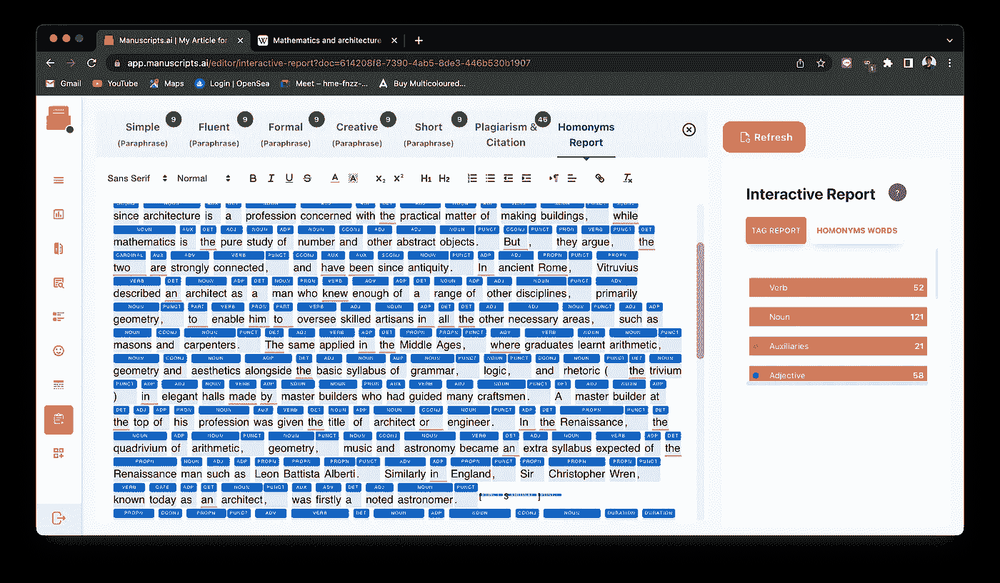

Ahh soo cool

以下是附加功能:

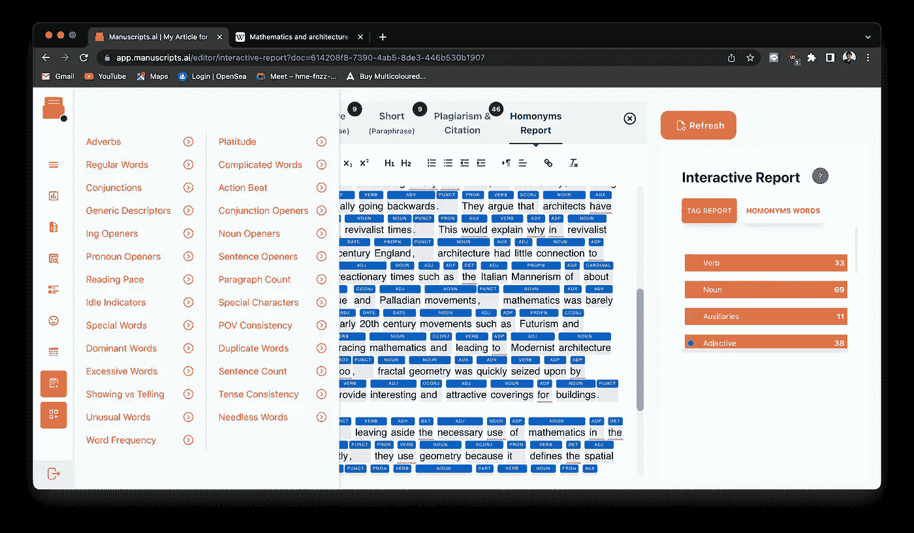

因此，结论是该网站仍处于核心开发阶段，但从他们的进展来看，非常有前途，我真的认为手稿可以接管一些主要的文本编辑公司。

[如果你喜欢这篇文章，请关注我的 medium。](/@eeman.majumder)

更多内容请查看我的 github:

 [## GitHub-eeman 1113/AI-to-make-wierd-Spotify-播放列表-](https://github.com/Eeman1113/AI-to-make-wierd-spotify-playlists-) 

关于我的每日 AIML 更新，请在 twitter 上关注我:

感谢阅读😁，下周见👋🏼