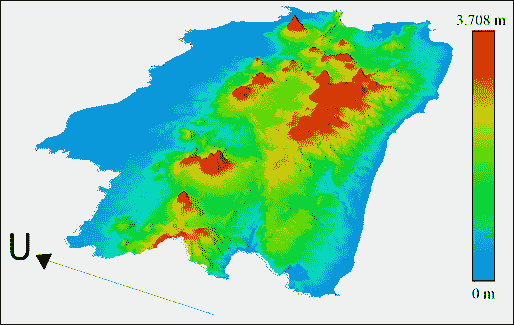
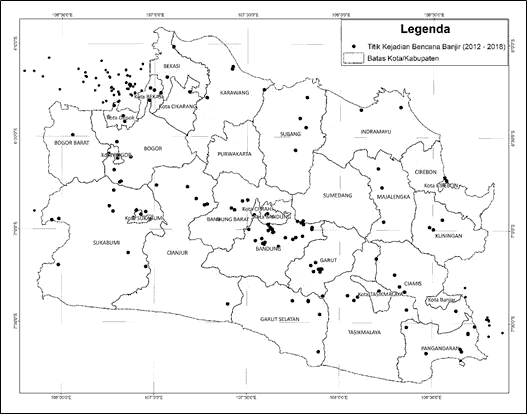
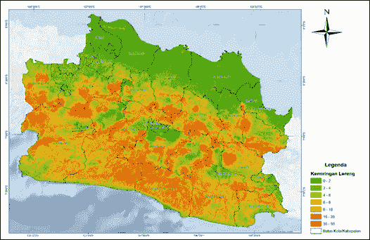
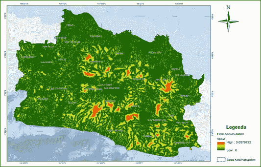
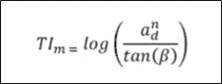
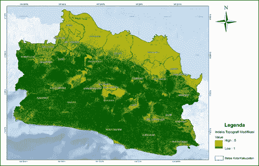
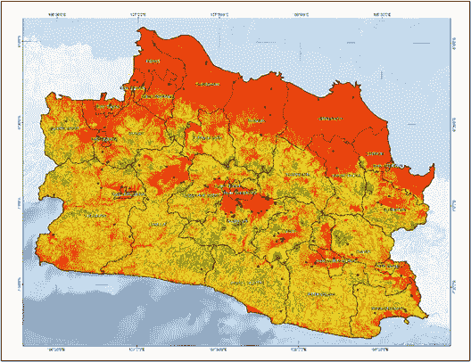
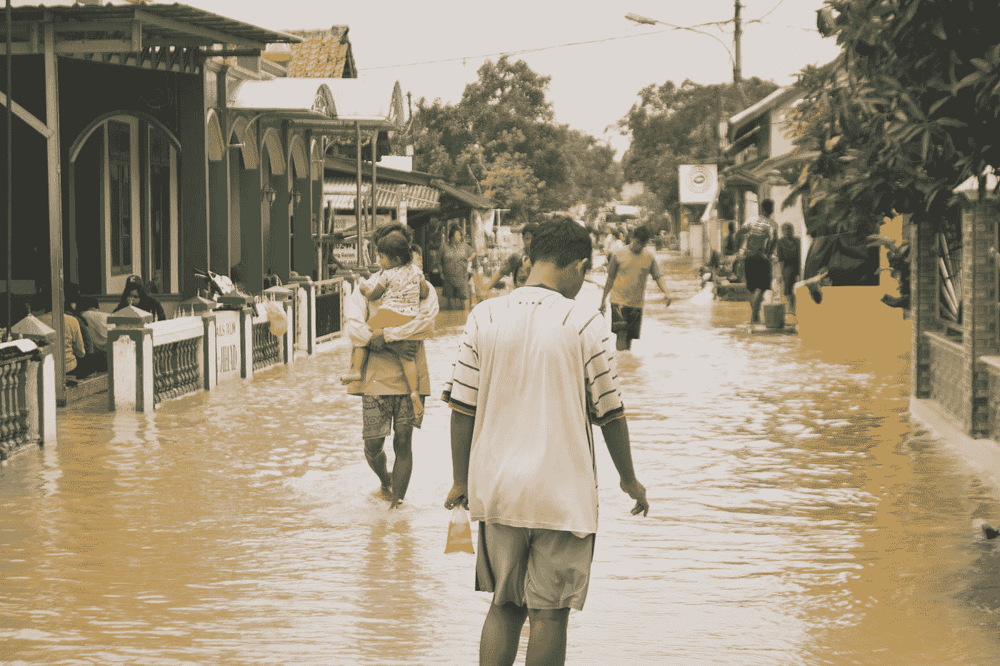

# 如何使用 ArcGIS 创建洪水风险图

> 原文：<https://medium.com/geekculture/map-of-flood-disasters-in-west-java-indonesia-d52a4d1c3a77?source=collection_archive---------12----------------------->

## 地理信息系统

## 印度尼西亚西爪哇省研究案例

Photo by [Wahyu Maulana](https://unsplash.com/@mauwahyu?utm_source=medium&utm_medium=referral) on [Unsplash](https://unsplash.com?utm_source=medium&utm_medium=referral)

> 印度尼西亚的洪水是一年一度的灾难。
> 
> 尽管与其他灾害相比，洪水造成的风险影响相对较低，但它们发生的频率较高。

我想展示一下我是如何使用 [ArcGIS](https://www.esri.com/en-us/arcgis/about-arcgis/overview) 软件制作印尼西爪哇省的洪水风险地图的。

# 我是如何制作洪水地图的？

Photo by [Annie Spratt](https://unsplash.com/@anniespratt?utm_source=medium&utm_medium=referral) on [Unsplash](https://unsplash.com?utm_source=medium&utm_medium=referral)

# 资料组

我用的初始数据是[**DEM-SRTM**](https://www.usgs.gov/centers/eros/science/usgs-eros-archive-digital-elevation-shuttle-radar-topography-mission-srtm-1-arc?qt-science_center_objects=0#qt-science_center_objects)**(*数字高程模型* : *穿梭雷达地形模型)* 1 *弧秒* (30 米)，是我从 **USGS** ( *地球探索者美国地质勘探局)*网站得到的。**

****

**3D Visualization of DEM SRTM West Java Area (Author’s Property)**

**为了验证地图，我使用了 2012-2018 年发生在西爪哇的洪水历史数据，这些数据是我从印度尼西亚国家灾害管理局(BNPB)获得的。**

****

**Historical Data Map of West Java Floods during 2012–2018 (Author’s Property)**

# **工作流程**

**洪水脆弱性因子按**坡度**、**主要河网、**、[、MTWI 、](https://en.wikipedia.org/wiki/Topographic_wetness_index)、 **(** 、*修正地形湿润指数)*、**值排列。****

**使用 ArcGIS 中的 [**坡度**](https://desktop.arcgis.com/en/arcmap/10.3/tools/spatial-analyst-toolbox/slope.htm) 工具计算坡度图。**

****

**Slope Map of West Java with Units of Degrees (Author’s Property)**

**利用一些函数计算出主要河网图。首先， [**填充**](https://desktop.arcgis.com/en/arcmap/10.3/tools/spatial-analyst-toolbox/fill.htm) 功能用于校正 SRTM DEM 数据中的每个像素。下面使用的函数是 [**流向**](https://desktop.arcgis.com/en/arcmap/10.3/tools/spatial-analyst-toolbox/flow-direction.htm) 通过计算高度差或坡度来确定流向。我用的最后一个函数是 [**流量累加**](https://desktop.arcgis.com/en/arcmap/10.3/tools/spatial-analyst-toolbox/flow-accumulation.htm) 来确定河网的形状，它是基于流向函数的结果计算出来的。**

**流向函数形成的河网结果将被输入 [**欧氏距离**](https://desktop.arcgis.com/en/arcmap/10.3/tools/spatial-analyst-toolbox/euclidean-distance.htm) 函数。即在栅格格式的数据上创建缓冲区(覆盖对象的图层)，缓冲区距离为 1 千米。结果是具有 1 公里缓冲区的主要河流网络的地图**

****

**Main River Network Map of West Java (Author’s Property)**

**最后，使用以下公式计算 MTWI 值:**

****

**其中 ***ad*** 为基于 DEM 数据分析(取决于 DEM 分辨率)的等高线单位长度的流量面积或流量累积值， **tan (β)** 为坡角(基于 DEM 数据分析)， **n** 为由公式 **n = 0.016 x 0.46** 计算的指数值，其中 x 为 DEM 分辨率。**

**该 MTWI 值描述了基于重力的水在某一点积聚的趋势，在该点处水总是流向较低的地方。这就是为什么 MTWI 值在非常平坦的斜坡上更重要，在陡坡上更次要。**

**洪水风险指数是根据洪水易发区的坡度和离河流的距离，采用 [**模糊隶属度**](https://desktop.arcgis.com/en/arcmap/10.3/tools/spatial-analyst-toolbox/fuzzy-membership.htm) 方法估算的。**

****

**Modified Topography Wetness Index (MTWI) Map of West Java (Author’s Property)**

**在创建了三个主要地图:坡度地图、主要河流网络地图和 MTWI 地图之后，下一步是将[**模糊隶属度**](https://desktop.arcgis.com/en/arcmap/10.3/tools/spatial-analyst-toolbox/fuzzy-membership.htm) 函数应用于这些地图中的每一个。该模糊隶属函数为地图中的每个数据分配一个从 0 到 1 的加权值。**

**你可以通过下面的链接了解更多关于模糊成员的工作原理。**

** [## 模糊成员身份的工作原理-帮助| ArcGIS for Desktop

### 可通过 Spatial Analyst 许可获得。模糊隶属度工具将输入数据重新分类或转换为 0 到 1…

desktop.arcgis.com](https://desktop.arcgis.com/en/arcmap/10.3/tools/spatial-analyst-toolbox/how-fuzzy-membership-works.htm) 

# 结果

Flood Hazard Map of West Java Province, Indonesia (Author’s Property)

根据易受洪水影响的程度，西爪哇省被分为 5 个易受洪水影响的级别，从不易受洪水影响的地区开始。

根据国家灾害管理局(BNPB)2012-2018 年西爪哇洪水的历史数据地图，我发现洪水事件点和洪水易发地图之间有几个联系:

*   高易损区有**洪水事件点；这意味着该区域可以被确认为具有高度脆弱性的区域。**
*   高易损区无**洪水事件点；这可能是因为用于分析洪水脆弱性区域的方法是基于坡度和主要河流网络的计算。在西爪哇北部，几乎所有地区都是高度脆弱区，但并非所有地区都有洪水点。**
*   中、低易损区有**洪水事件点**；这可以解释为除了湿度水平(静水的可能性)、斜坡和主要河流网络之外的引发洪水的因素所导致的异常。导致洪水的另一个因素是该地区降雨量很高。
*   中、低易损区无洪水事件点；这意味着该区域可以被验证为具有中低脆弱性级别。该地区具有制作洪水风险图的以下因素:低湿度(积水的可能性)、陡坡或广阔的河流网络。因此，该地区属于低度到中度脆弱区。

# 我对洪水灾害的缓解建议

Photo by [Misbahul Aulia](https://unsplash.com/@auliamisbahul?utm_source=medium&utm_medium=referral) on [Unsplash](https://unsplash.com?utm_source=medium&utm_medium=referral)

根据上面的地图，我推荐了一些针对洪水灾害的缓解方案，例如:

*   修复或建造排水系统(水道和河流)
*   增加集水区域
*   在洪水易发地区建立和安装预警系统(EWS)
*   执行有关当局可能导致洪水的行动的法规和法律
*   提高社区在防洪方面的社会化程度。** 

# **最后的话**

****

**Photo by [Dikaseva](https://unsplash.com/@dikaseva?utm_source=medium&utm_medium=referral) on [Unsplash](https://unsplash.com?utm_source=medium&utm_medium=referral)**

**恭喜你坚持到了这一步！希望你从这篇文章中学到了一些新的东西。希望这篇文章能给你关于洪水风险图的参考。**

**如果你喜欢这些内容，请关注我的媒体账户，以获得关于我未来帖子的通知！**

# **关于我**

**毕业于 Padjadjaran 大学的地质工程专业，在各个方面不断发展和挑战自己，渴望学习，乐于接受新的体验。目前在 Grouu Baby Food 担任数据分析师实习生。**

**查看 [Ariq' GitHub](https://github.com/ariqmuh) 了解更多关于他的信息！最后，如果您有任何疑问或需要讨论的话题，请通过 [LinkedIn](https://www.linkedin.com/in/muhammad-ariq/) 联系 Ariq。**

# ****参考文献****

**BNPB。2016.印度尼西亚风险投资公司(RBI) 。BNPB。**

**Irawan，M.F .，Hidayat，y .和 Tjahjono，B. 2018。*万隆的阿罗汗和约旦银行*。茂物:IPB 的 Jurnal Ilmu Tanah dan Lingkungan。**

**[https://www . research gate . net/project/Delineation-of-Flood-pound-propelling-eased-area-using-geometric-Methods](https://www.researchgate.net/project/Delineation-of-Flood-Prone-Areas-using-Geomorphic-Methods)**