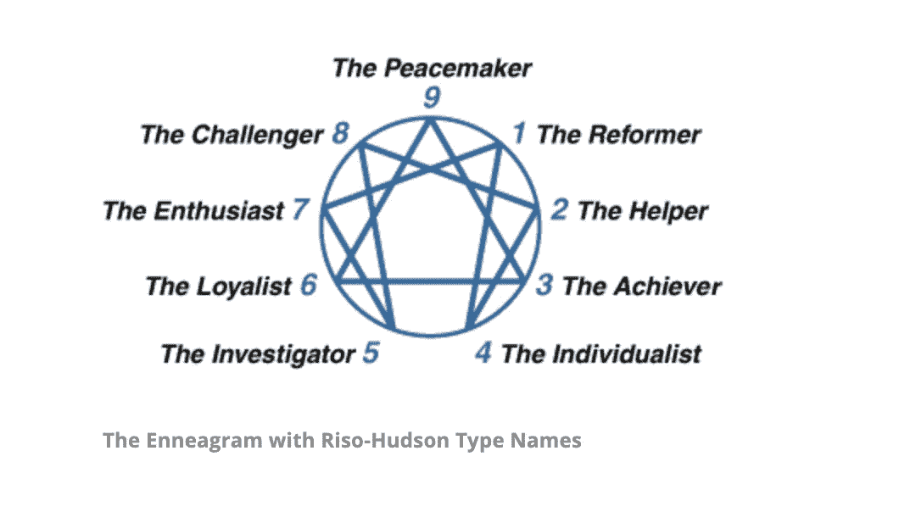
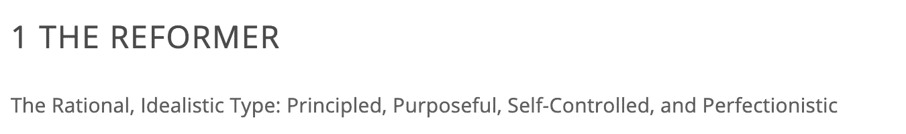
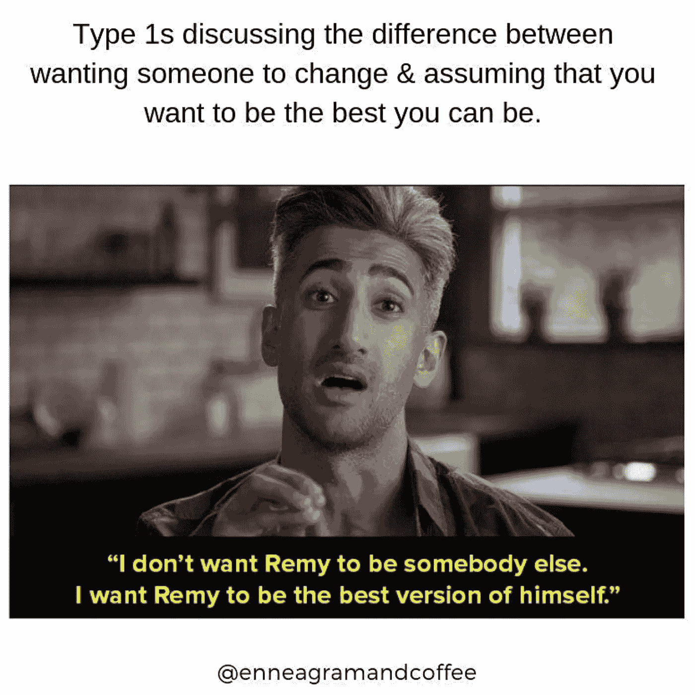
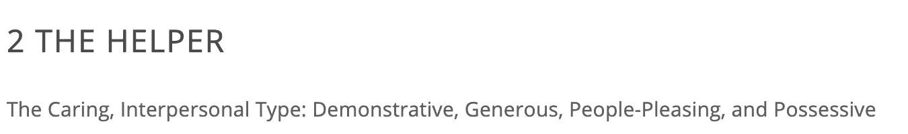
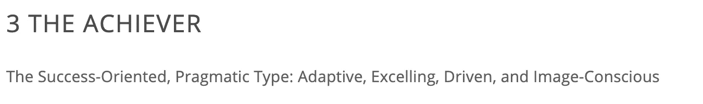
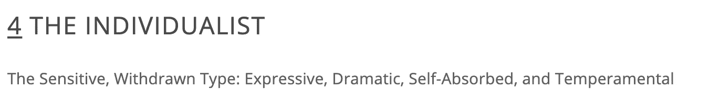
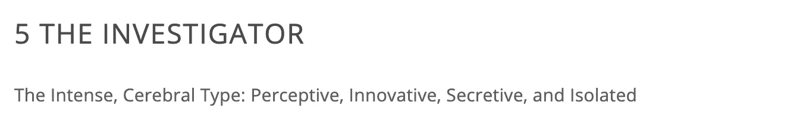
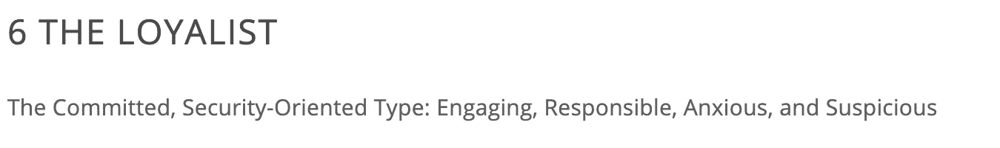
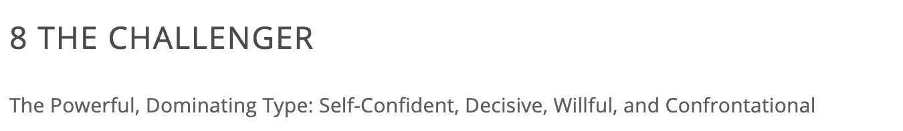
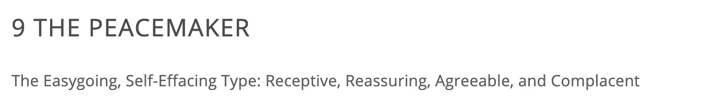

# 将九元图类型映射到数据科学工具

> 原文：<https://medium.com/geekculture/mapping-enneagram-types-to-data-science-tools-573954cbc1a0?source=collection_archive---------20----------------------->

## 拟人化数据科学工具…为什么不呢？

作为一名 type 8，我带着成为 BuzzFeed 作者的不那么秘密的附带任务通过了 Flatiron 的加速数据科学训练营，为我最近一直在使用的一些数据科学工具提供 Enneagram 类型似乎是正确的事情。*所有九型人格图的图片和描述都要感谢九型人格图研究所(Enneagram Institute)——如果你对九型人格图不熟悉，它实际上是九种人格类型的分类。

[型](https://www.enneagraminstitute.com/type-1)的特点是他们的主要动机是追求更高，证明自己，并改善周围的一切，这与[的简单估算者](https://scikit-learn.org/stable/modules/generated/sklearn.impute.SimpleImputer.html)不同。在构建模型时，我们使用简单的估算器来帮助计算空数据。简单估算器在一列中找到所有的 null 或空数据，并简单地用平均值(也称为中值、众数或常数)替换它们，以帮助我们的模型更好地执行，就像一个典型的自我控制、完美主义的九型图一样。

第二类人在这里看到人们最好的一面，只是想要被爱。如果你在和一个第二类型的人约会，你可能会说，“哇，我真的很爱她，但是裴太天真了。”她想假设人们最好的一面，这就是为什么她就像朴素贝叶斯分类器一样，假设不同的预测者相互独立，但内心深处知道这不可能是真的！

“自信、迷人、有魅力”的三型生活在对自己毫无价值的恐惧中，这让他们无止境地追求自我价值。 [One Hot Encoder](https://scikit-learn.org/stable/modules/generated/sklearn.preprocessing.OneHotEncoder.html) 无疑是我们常驻的第三类数据科学工具。OHE 将看似毫无价值的变量转化为在模型中更有效的东西！OHE 显然也发现自己客观上很有吸引力。

四型性格的人活着是为了发现他们自己和他们的真实身份，同时也非常有表现力和气质。你听说过[混乱矩阵](https://scikit-learn.org/stable/modules/generated/sklearn.metrics.confusion_matrix.html)吗？！混淆矩阵通过向我们显示我们的结果何时是真阳性、真阴性、假阳性或假阴性，向我们显示谁是真正的结果，同时具有表达性和迷惑性，体现了第四类的核心。

[第五类人](https://www.enneagraminstitute.com/type-5)努力变得有能力、有竞争力并理解他们周围的世界，就像我们信赖的 L [线性回归](https://scikit-learn.org/stable/modules/generated/sklearn.linear_model.LinearRegression.html)也是“警觉的、有洞察力的、好奇的”线性回归模型帮助我们调查和深入了解我们的数据，以了解什么是相互作用的，以及它如何帮助我们最好地预测我们的目标。

几个[类型六](https://www.enneagraminstitute.com/type-6)关键特征是“感受到他人的支持，有确定感和信心，测试他人对他们的态度”。我们的 type six 数据科学工具是一种叫做 [K 近邻](https://scikit-learn.org/stable/modules/generated/sklearn.neighbors.KNeighborsClassifier.html)的分类算法。KNN 的工作原理是让数据了解在特定“邻居”或远离它的其他数据。

[七型](https://www.enneagraminstitute.com/type-7)以“外向、乐观、多才多艺、自然”的形象面对世界这种多才多艺的外向性可以归功于 sklearn，一个非常有用的 python 库。多才多艺外向是因为你可以看到这里提到的其他所有工具都来自 sklearn！热情，乐观，自发因为 sklearn 充满了惊喜，给了我们寻找答案的希望！

果断而又对抗的八型性格深深害怕被他人控制，寻求保护自己。这些都是我们的便捷测试 [rain-test split](https://scikit-learn.org/stable/modules/generated/sklearn.model_selection.train_test_split.html) 的特点，通过拆分来面对我们的数据，但同时也在这个过程中保护它，这样错误的数据就不会被操纵！最后，我们的训练测试分割也像 type 8 一样具有决定性，因为它帮助我们最终建立我们最好的模型。

[九型](https://www.enneagraminstitute.com/type-9)以稳定、有创造力和乐观著称，就像我们最喜欢的可视化工具——可信赖的 [Seaborn](https://seaborn.pydata.org/tutorial.html) 一样。当我们不必使用 matplotlib 并看到更有吸引力的可视化时，Seaborn 给我们带来了安宁。