# 用 tilemaps 绘制路线。

> 原文：<https://medium.com/geekculture/mapping-out-the-way-with-tilemaps-2ee49a79ea61?source=collection_archive---------47----------------------->

## 目的:介绍 Unity 中的 tile map

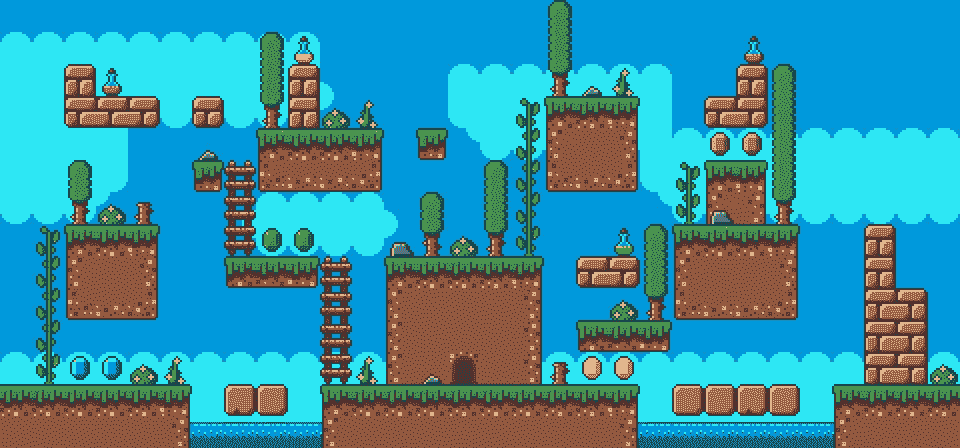

在 2d 游戏中，有时在关卡中使用一个叫 Tilemaps 的东西会容易得多，这使得排列资产成为一件不费力气的事情。我们不需要在三维空间里移动物体，只需点击一个盒子，一切都为我们完成了。所以在这个游戏中，我们将设置 tilemap，这样我们就可以开始绘制游戏的关卡了。

我使用的是 unity 2019.2.12f1，如果您使用的是不同的版本，这可能会对您有所不同，但应该仍然有很多是相同的。

首先，我们需要做好 2D 贴图的项目准备，这包括从包管理器安装 2D 精灵和 2D 贴图编辑器。通过进入窗口>软件包管理器打开软件包管理器。

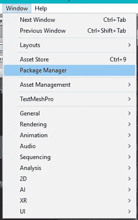

现在搜索 2D，这将显示我们需要的 2 个软件包，并在窗口的右下角选择安装。

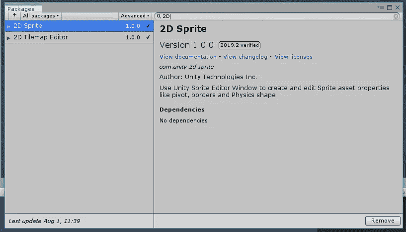

这两个都安装好了，我们就可以开始准备其他的东西了。

现在我们应该可以访问瓷砖面板了。这将会被大量使用来建造关卡，所以建议将它停靠并能够方便地访问它。窗口> 2D >拼贴调色板。

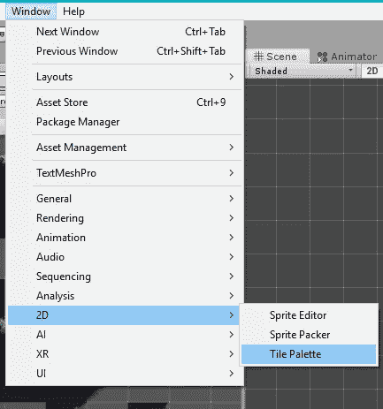

在窗口为它打开后，将它停靠在某个有用的地方，这是我在场景中使用它的方式。

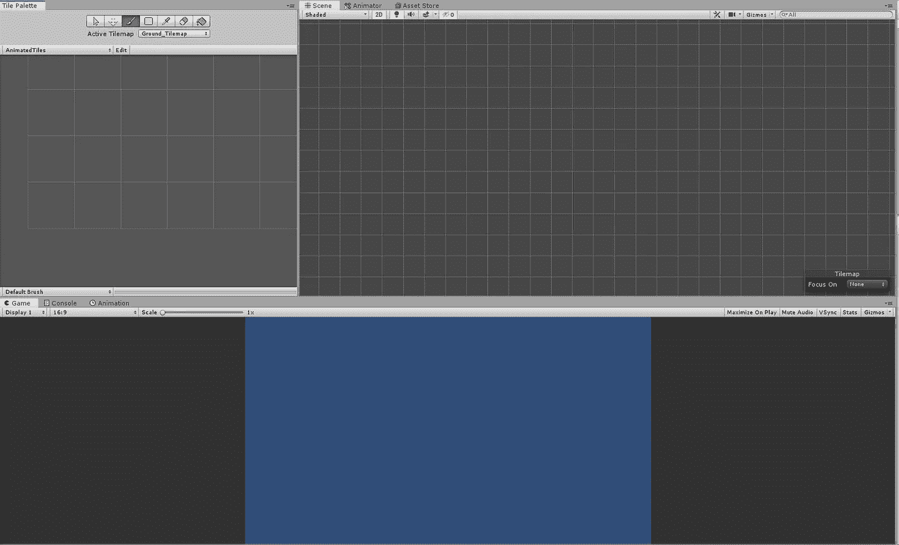

现在我们可以为地面物体创建一个新的 tilemap。点击创建新的调色板，给它一个名字。

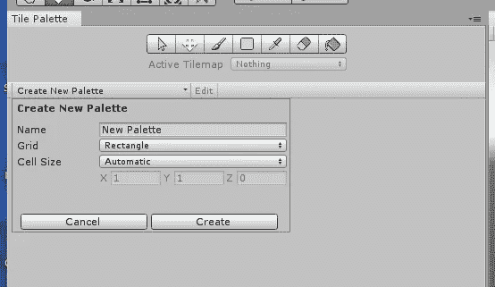

为了保持有序，我们可以为 Tilemaps 创建一个文件夹，然后为调色板创建另一个文件夹。

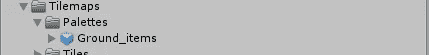

完成后，我们现在可以将地面的瓷砖分类并添加到地面项目中，然后我们可以开始绘制关卡。

这里我将使用这张图片作为背景。

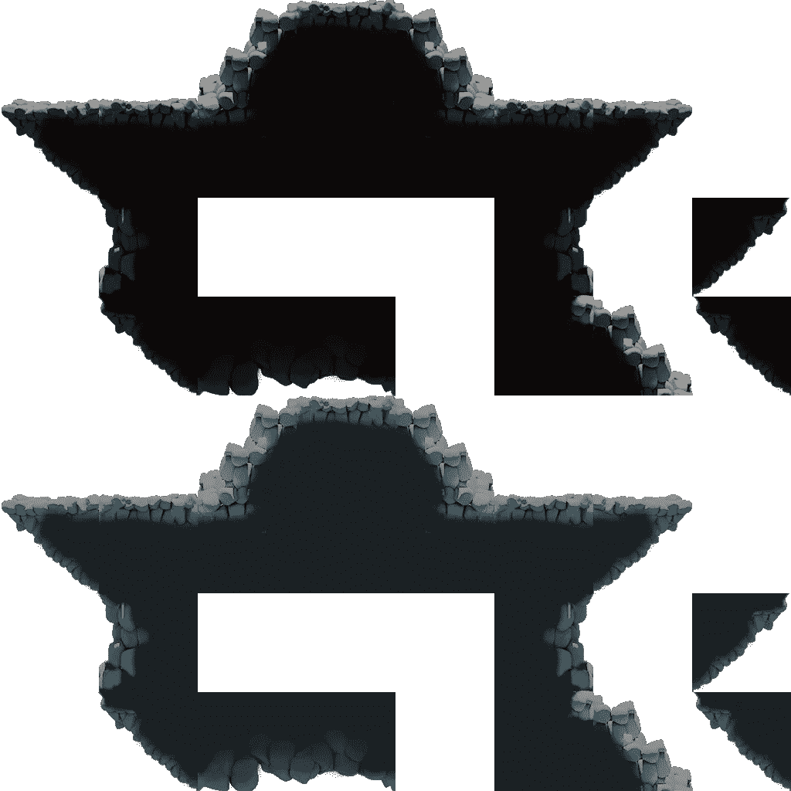

点击它，进入检查器中的属性，我们可以将其更改为 2D 和倍数，知道瓷砖是 128 x 128，我们可以将每单位的像素更改为 128。

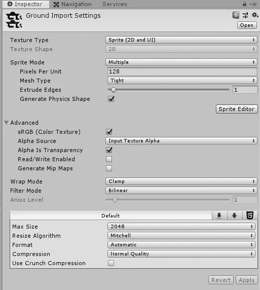

现在把它们分成不同的瓷砖。点击“精灵编辑器”按钮，这将打开一个新的窗口，我们可以将它们分开。

打开后，将切片类型更改为“按像元大小栅格”，并为 X 和 y 输入 128。

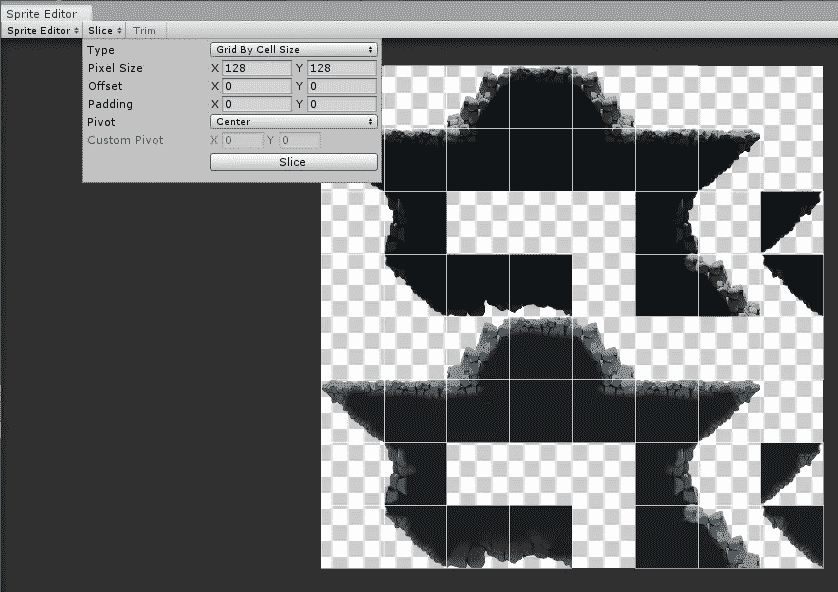

最后，单击窗口右上角的应用。

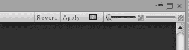

现在，当您单击地面旁边的箭头时，它会显示所有已制作瓷砖的列表。

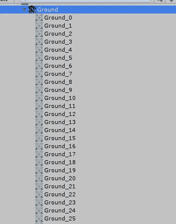

准备好要使用的图块后，我们现在可以将它们拖动到我们之前制作的 Ground_items 调色板中，它会要求选择一个文件夹，这样它就可以将它们存储为图块。在 Tilemaps 下创建另一个文件夹，命名为 Tiles，然后创建另一个文件夹，命名为 Ground 并保存。这将把事情分开，使以后的事情更容易。

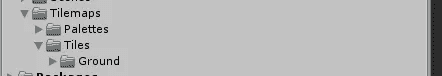

所有这些都成功完成后，它应该看起来像这样。

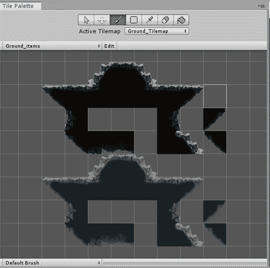

有了它，我们应该可以立刻开始绘制关卡。

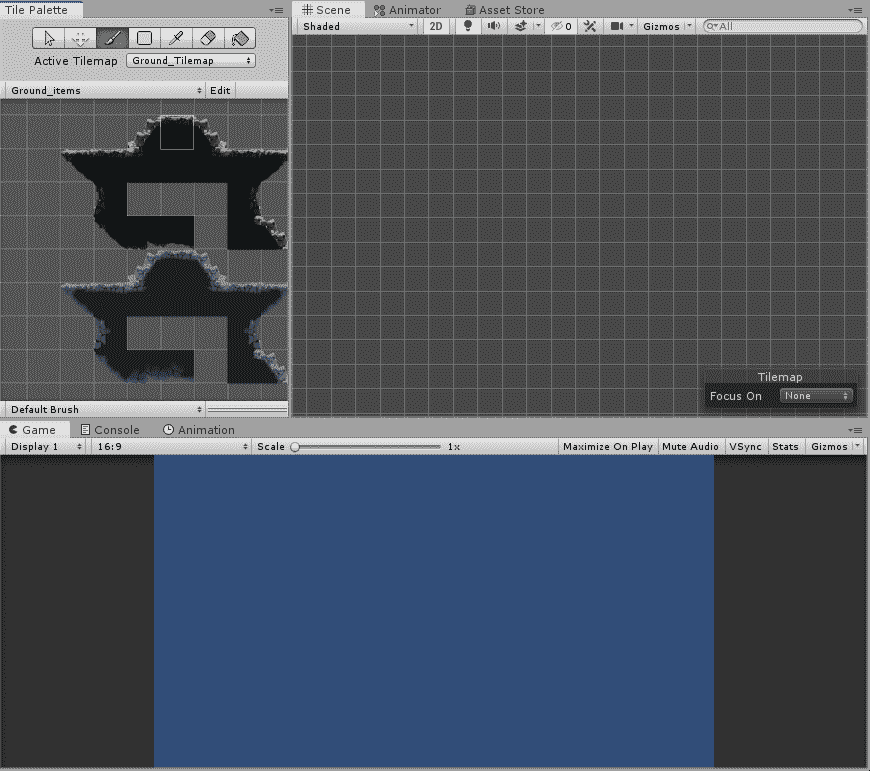

这样，我们就有了使用 tilemap 调色板开始制作关卡的基础，下次我们可以看看动画瓷砖。下一集再见！