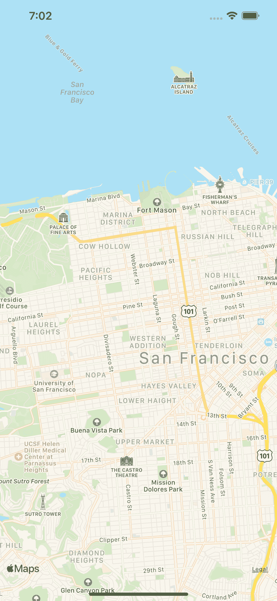
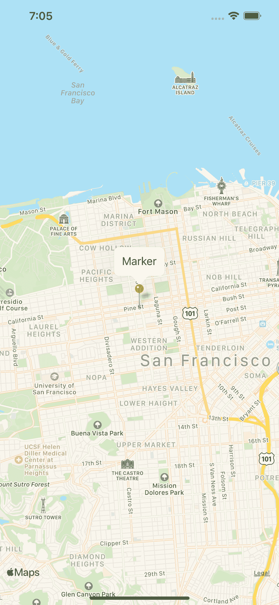

# Expo 中的 MapView/React Native

> 原文：<https://medium.com/geekculture/mapview-in-expo-react-native-5aa69eb81519?source=collection_archive---------4----------------------->

在本文中，我们将展示如何开始使用 react-native-maps 库在 expo 中实现地图。如果你使用 expo，你不需要做额外的步骤来实现 map，如果你单独使用 react native，你需要遵循额外的步骤来链接依赖项。

为了在 expo 中实现地图，我们需要库 react-native-maps。

react-native-maps 提供了一个地图组件，在 iOS 上使用苹果地图或谷歌地图，在 Android 上使用谷歌地图。Expo 在 react-community/react-native-maps 上使用 react-native-maps。

要在 expo 中安装，我们需要运行以下命令

# 装置

```
expo install react-native-maps
```

# 基本设置

```
import React, { useState } from 'react';
import { View, StyleSheet } from 'react-native';
import MapView from 'react-native-maps';const App = () => {
  const [mapRegion, setmapRegion] = useState({
    latitude: 37.78825,
    longitude: -122.4324,
    latitudeDelta: 0.0922,
    longitudeDelta: 0.0421,
  }); return (
    <View style={styles.container}>
      <MapView
        style={{ alignSelf: 'stretch', height: '100%' }}
        region={mapRegion}
      />
    </View>
  );
};
export default App;const styles = StyleSheet.create({
  container: {
    flex: 1,
  },
});
```

我们需要的唯一属性是地图要显示的区域

该区域由中心坐标和要显示的坐标范围定义。

当我们启动应用程序时，这是我们将要看到的屏幕。显示我们在区域属性中指定的坐标的地图。



# 标记

如果我们想在地图中实现一个标记来显示一个方向或者指向地图中的某个地方，我们需要导入标记组件

```
import { Marker } from 'react-native-maps';import React, { useState } from 'react';
import { View, StyleSheet } from 'react-native';
import MapView, { Marker } from 'react-native-maps';
const App = () => {
  const [mapRegion, setmapRegion] = useState({
    latitude: 37.78825,
    longitude: -122.4324,
    latitudeDelta: 0.0922,
    longitudeDelta: 0.0421,
  }); return (
    <View style={styles.container}>
      <MapView
        style={{ alignSelf: 'stretch', height: '100%' }}
        region={mapRegion}
      >
        <Marker coordinate={mapRegion} title='Marker' />
      </MapView>
    </View>
  );
};
export default App;
const styles = StyleSheet.create({
  container: {
    flex: 1,
  },
});
```



我们可以向标记传递一个标题、一个描述，或者我们可以通过在标记中呈现一个组件来定制它。例如图像或视图。

```
import React, { useState } from 'react';
import { View, StyleSheet,Image } from 'react-native';
import MapView, { Marker } from 'react-native-maps';
const App = () => {
const imageURL = ''
  const [mapRegion, setmapRegion] = useState({
    latitude: 37.78825,
    longitude: -122.4324,
    latitudeDelta: 0.0922,
    longitudeDelta: 0.0421,
  }); return (
    <View style={styles.container}>
      <MapView
        style={{ alignSelf: 'stretch', height: '100%' }}
        region={mapRegion}
      >
        <Marker coordinate={mapRegion}> 
<Image source={{uri:imageURL}} />
 </Marker>
      </MapView>
    </View>
  );
};
export default App;
const styles = StyleSheet.create({
  container: {
    flex: 1,
  },
});
```

# 结论

开始使用 react 原生地图非常简单，我解释了基础知识，但是我们可以做很多事情，比如

*   在地图上画出方向
*   跟随用户的位置
*   显示兴趣点
*   自定义地图
*   使用热图

在接下来的文章中，我们将学习更多关于 react 本地地图和 expo 的东西。

敬请期待！