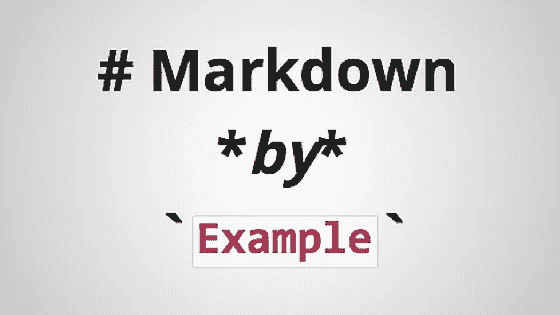

# 降价最佳实践

> 原文：<https://medium.com/geekculture/markdown-best-practices-911be77a1282?source=collection_archive---------22----------------------->

如果你是一个作家，尤其是一个科技作家，有一大堆工具和格式需要考虑。

Markdown

从 DITA 到 Frame，从 LaTeX 到 SGML，从 Confluence 到 MediaWiki，您可能会找到一个适合任何用途的框架。Markdown 是一种不断出现的轻量级编写格式，是其他文件格式的通用语言，也是鼓励开发人员更好地记录代码的诱惑。