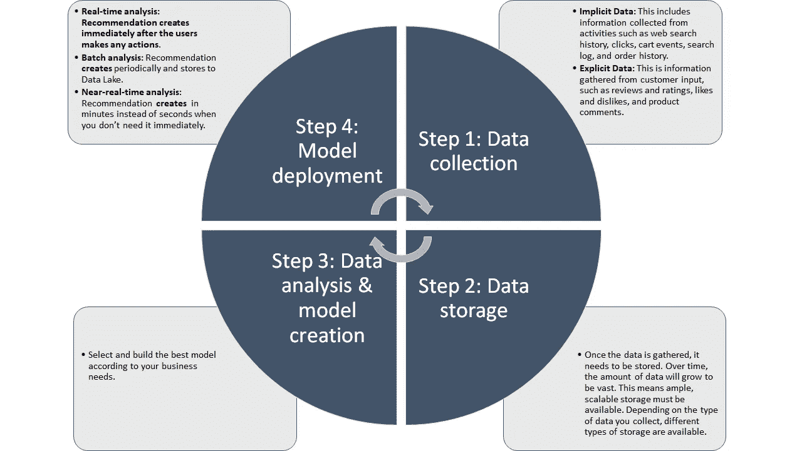
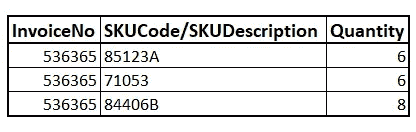
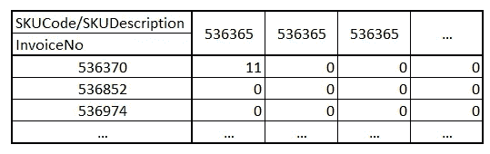
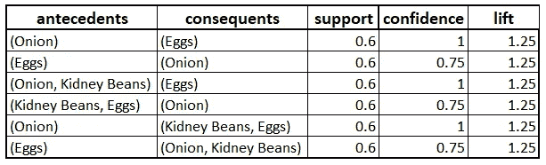
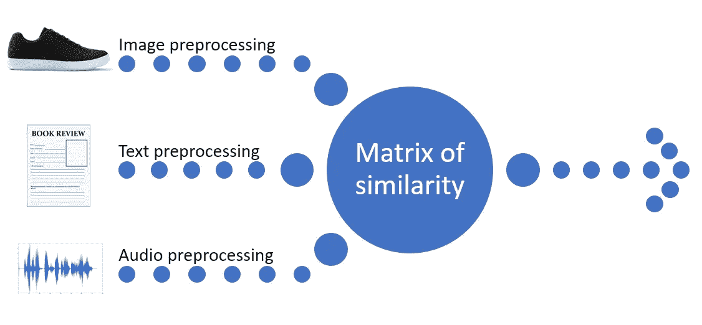
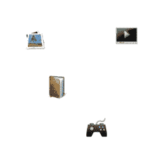
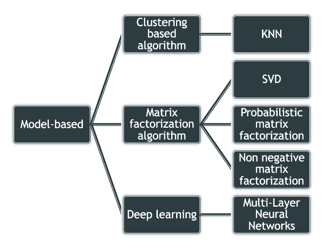
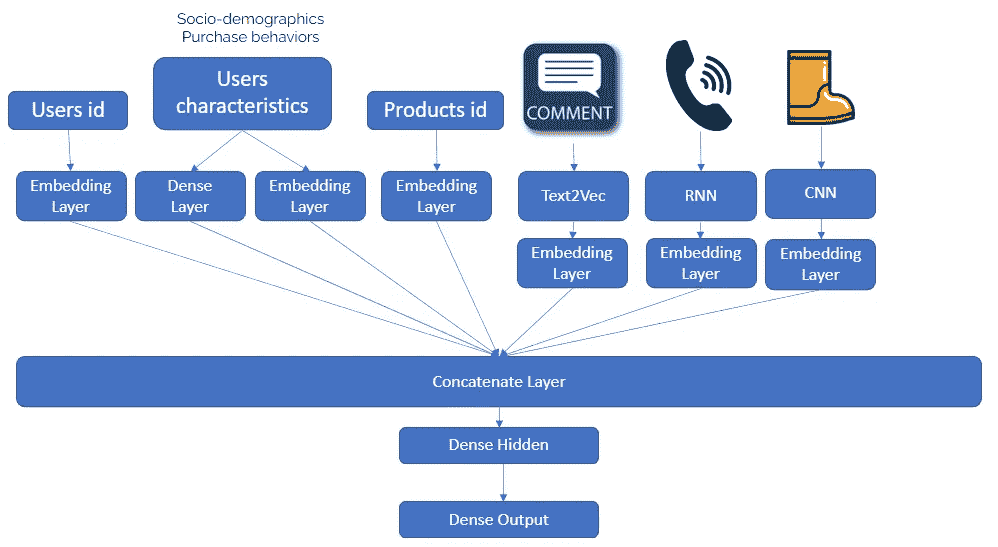
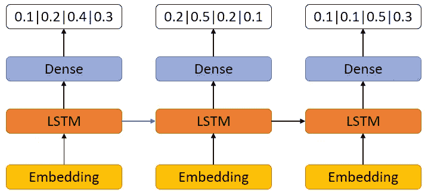
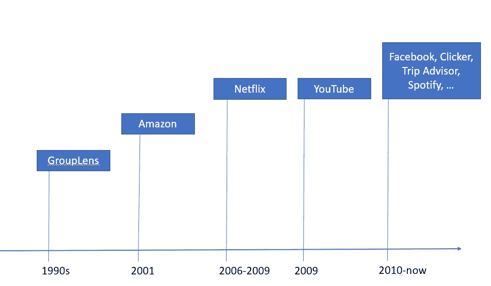

# 营销自动化:推荐系统

> 原文：<https://medium.com/geekculture/marketing-automation-recommendation-systems-ae39d61aa38?source=collection_archive---------5----------------------->

## 在信息噪音和信息过剩的时期，通过所有可能的沟通渠道，准确的推荐是增加客户忠诚度和降低客户流失风险的方法之一。


Photo by [Bernard Hermant](https://unsplash.com/@bernardhermant?utm_source=medium&utm_medium=referral) on [Unsplash](https://unsplash.com?utm_source=medium&utm_medium=referral)

推荐系统是我们数字世界的一个重要特征。如今推荐引擎无处不在。我们每天接触的一些最大的品牌都是围绕一个品牌建立的，包括网飞、亚马逊、谷歌和脸书。亚马逊或阿里巴巴上超过三分之一的购买来自产品推荐。那么，什么是推荐引擎，它是如何工作的？

## 什么是推荐引擎？

推荐引擎是一组数据科学算法，有助于找到与特定用户或客户最相关的项目。在处理了大量数据后，这些算法可以找到进一步帮助提出建议的模式。

这是一个非常好的定义，但对我来说，真正好的推荐系统还应该考虑时间(发送推荐时？)和沟通渠道(什么样的沟通方式最适合特定的客户？).

因此，推荐引擎对这些问题的最佳回答是:

*   有什么推荐给用户？
*   什么时候推荐给用户？
*   如何为用户推荐？

## 推荐引擎是如何工作的？

在下图中，你可以看到推荐引擎有一个循环工作流程。在模型创建之后，我们收集它的反馈结果，然后重新训练或改变我们的模型。



Recommendation Engine workflow (Image by Author)

## 如何根据自己的业务需求和技术能力选择推荐引擎？

我想从一个最简单但对我来说最古老和最常用的方法开始。这种方法不是数据科学算法，而是一种数据挖掘方法。它的名字叫— **关联规则学习。**

## 关联规则挖掘

关联规则挖掘在大量数据项之间或者在零售或电子商务交易中发现有趣的关联和关系。此规则显示商品或服务集在交易中出现的频率。一个典型的例子是基于市场的分析。

关联规则挖掘基于三个主要度量:

*   **Support** 表示商品或服务出现在银行本票中的频率。
*   **信心**是一个指标，表明这个规则有多经常是正确的。
*   **Lift** 显示如果出现物品 X，购买物品 Y 的可能性。

**关联规则分析是**通常基于事务性数据，我们需要的只是下一张表:



Data sample (Image by Author)

我们需要将这些数据预处理成以下格式:



Preprocess sample (Image by Author)

下一步是对我们的数据透视表进行编码，为此我们可以使用如下代码:

```
**def** encode_units(x):
    **if** x <= 0:
        **return** 0
    **if** x >= 1:
        **return** 1

ecode_sample_set = sample_set.applymap(encode_units)
```

该代码只能应用于样本集。这个算法有很多端到端解决方案的实现。例如:

*   [apyori](https://pypi.org/project/apyori/)
*   [mlxtend](https://pypi.org/project/mlxtend/)

这些解决方案都很好，但对我来说，对于真实案例，当我们有大量数据时，我们应该使用 Spark 解决方案。 [FP-growth 算法](https://spark.apache.org/docs/2.2.0/ml-frequent-pattern-mining.html)是用 Pyspark 很好的实现。

我们应该从结果中得到什么？以下是带有结果表的示例:



**Association rule result** (Image by Author)

根据我们的业务任务，我们可以根据任何度量或维度对这个结果进行排序。例如，在检查中最常遇到的产品通常被并排放在商店的货架上，或者在网上商店的推荐中作为附送产品给出。在这种情况下，最常见的位置是在表的顶部，但在底部或中间你可以找到以前可能没有遇到或注意到的相当有趣的组合。

## 我的下一个方法是基于内容的。

设计推荐系统的另一种常用方法是基于内容的过滤。

基于内容的过滤方法基于项目的特征和用户偏好的配置文件。当我们知道一个项目的数据(名称、位置、描述等)时，这种方法是很好的。)，但不是关于用户的。换句话说，这些算法试图推荐与用户过去购买/喜欢/考试或现在在网站上进行的项目相似的项目。​

这种算法的主要问题是——“冷启动”，这意味着我们不能为客户推荐任何东西，直到他/她没有对商品或服务采取任何行动(查看/Ruy/排名/评论)。我们将在接下来的算法中解决这个问题。

这个算法在很多行业都可以很流行，但在我看来，在时尚或者音乐推荐方面最流行。在第一种情况下，我们的数据可以是衣服或鞋子的图像，在第二种情况下，它是一个音轨。

在任何情况下，首先我们应该预处理我们的数据，然后根据某种度量建立相似性矩阵。然后我们可以对它进行排序，找到最相似的项目。



Workflow (Image by Author)

对于这些任务中的任何一项，现在都有许多使用深度学习最新进展的实现选项。

对于图像预处理，我们可以使用任何预训练的神经网络结构，然后使用迁移学习和微调方法来使神经网络适合我们的数据集。根据您的系统能力，我们可以使用以下[架构之一](https://www.mathworks.com/help/deeplearning/ug/pretrained_20b.png)。这个神经网络应该解决下一个任务:

1.  对象检测或语义分割——仅提取衣服或鞋子。
2.  使用提取的图像将其嵌入。

然后保存所有嵌入，以在将来计算彼此之间的距离或与新的距离。为了解决这个任务，我们可以使用 [Faiss](https://engineering.fb.com/2017/03/29/data-infrastructure/faiss-a-library-for-efficient-similarity-search/) 。Faiss 是一个用于高效相似性搜索的库。

对于文本预处理，我们可以使用 BERT 方法的任何实现。

对于音频处理，我们可以仅使用 python 进行简单的信号处理构建，而无需任何深度学习，或者使用 CNN/LSTM 架构来构建音轨嵌入。

这个算法两边都适合。买家可以花更少的时间在数字市场中搜索不同产品的页面。卖家可以更好地了解客户偏好，提供更个性化的买家体验，提高销售额，建立品牌忠诚度。

## **协同过滤**

> 下一个方法可能是最著名和最常用的方法之一。这种方法给推荐系统带来了一场革命。**协作过滤**是一种通过从许多用户(协作)收集偏好或品味信息来对用户的兴趣进行自动预测(过滤)的方法。协同过滤方法的基本假设是，如果人 A 在一个问题上与人 B 有相同的观点，则 A 更有可能在一个不同的问题上与随机选择的人有不同的观点。— [维基](https://en.wikipedia.org/wiki/Collaborative_filtering#:~:text=Collaborative%20filtering%20(CF)%20is%20a%20technique%20used%20by%20recommender%20systems.&text=In%20the%20newer%2C%20narrower%20sense,from%20many%20users%20(collaborating).)



[An example of collaborative filtering based on a rating system](https://en.wikipedia.org/wiki/Recommender_system#/media/File:Collaborative_filtering.gif)

**协同过滤有几种类型:**

*   基于记忆的

这种方法使用用户的评级数据来计算用户或项目之间的相似性。这种方法的典型例子是基于邻居的 CF 和基于项目/基于用户的 top-N 推荐。

基于项目的协作过滤——基于新项目与用户过去评价高的项目的相似性向用户推荐新项目。

基于用户的协同过滤——这种方法旨在找到相似的用户，并根据相似用户的喜好向用户提供推荐。用户之间的相似性是使用余弦相似性或皮尔逊相关来计算的，或者您可以根据您的数据使用任何其他相似性度量。

这种方法的主要优点是结果的可解释性，这是当今任何数据科学算法中的一个重要方面，而且它易于创建模型，易于用新数据重新训练。

它也有一些缺点。由于数据量大且稀疏，导致性能下降。添加新项也是一个重新插入结构中所有元素的问题。

*   基于模型的

在这种方法中，使用不同的数据挖掘、机器学习算法来开发模型，以预测用户对未评级项目的评级。作为模型最常用的算法是降维方法。像奇异值分解、主成分分析这样的方法根据潜在因素将用户项目矩阵压缩成低维表示。使用这种方法的主要优点是，我们将在低维空间中处理一个小得多的矩阵，而不是拥有一个包含大量缺失值的高维矩阵。维数减少可以用于这里描述的基于用户或基于项目的邻域算法。

以下是一些基于模型的方法的层次结构:



Hierarchy of model-based approach (Image by Author)

我们可以在 [Pyspark 实现](https://spark.apache.org/docs/2.2.0/ml-collaborative-filtering.html)中找到一个很好的协同过滤实现。下面是一些例子(Pyspark 文档中的*代码)*:

```
**from** **pyspark.ml.evaluation** **import** RegressionEvaluator
**from** **pyspark.ml.recommendation** **import** ALS
**from** **pyspark.sql** **import** Rowlines = spark.read.text("sample_movielens_ratings.txt").rdd
parts = lines.map(**lambda** row: row.value.split("::"))
ratingsRDD = parts.map(**lambda** p: Row(userId=int(p[0]), movieId=int(p[1]),
                                     rating=float(p[2]), timestamp=long(p[3])))
ratings = spark.createDataFrame(ratingsRDD)
(training, test) = ratings.randomSplit([0.8, 0.2])*# Build the recommendation model using ALS on the training data*
*# Note we set cold start strategy to 'drop' to ensure we don't get NaN evaluation metrics*
als = ALS(maxIter=5, regParam=0.01, userCol="userId", itemCol="movieId", ratingCol="rating",
          coldStartStrategy="drop")
model = als.fit(training)*# Evaluate the model by computing the RMSE on the test data*
predictions = model.transform(test)
evaluator = RegressionEvaluator(metricName="rmse", labelCol="rating",
                                predictionCol="prediction")
rmse = evaluator.evaluate(predictions)
**print**("Root-mean-square error = " + str(rmse))*# Generate top 10 movie recommendations for each user*
userRecs = model.recommendForAllUsers(10)
*# Generate top 10 user recommendations for each movie*
movieRecs = model.recommendForAllItems(10)
```

*   深度学习

当然，也不是没有深度学习)近年来，许多神经和深度学习技术被提出。一些算法通过非线性神经架构来推广传统矩阵分解算法，或者利用新的模型类型，如变分自动编码器。

这里有一些[和](https://github.com/fastai/fastbook/blob/master/08_collab.ipynb)[快速](https://www.fast.ai/)的例子。

此外，我们可以使用更复杂的深度学习方法，例如，混合我们所有可能的数据，建立一个超级复杂的神经网络:



Example of NN architecture (Image by Author)

下面是一些嵌入了用户、项目和项目类型的 Keras 实现:

```
item_input = keras.layers.Input(shape=[1],name='Item')
item_embedding = keras.layers.Embedding(n_items + 1, n_latent_factors_item, name='Movie-Embedding')(item_input)
item_vec = keras.layers.Flatten(name='FlattenMovies')(item_embedding)
item_vec = keras.layers.Dropout(0.25)(item_vec)user_input = keras.layers.Input(shape=[1],name='User')
user_vec = keras.layers.Flatten(name='FlattenUsers')(keras.layers.Embedding(n_users + 1, n_latent_factors_user,name='User-Embedding')(user_input))
user_vec = keras.layers.Dropout(0.25)(user_vec)type_input = keras.layers.Input(shape=[1],name='type')
type_vec = keras.layers.Flatten(name='FlattenType')(keras.layers.Embedding(n_type + 1, n_latent_factors_user_type,name='Type-Embedding')(type_input))
type_vec = keras.layers.Dropout(0.25)(type_vec)#concat = keras.layers.merge([movie_vec, user_vec], mode='concat',name='Concat')
concat  = keras.layers.concatenate([item_vec, user_vec, type_vec],name='DotProduct')
concat_dropout = keras.layers.Dropout(0.25)(concat)
dense = keras.layers.Dense(200,name='FullyConnected')(concat)
dropout_1 = keras.layers.Dropout(0.25,name='Dropout')(dense)
dense_2 = keras.layers.Dense(100,name='FullyConnected-1')(concat)
dropout_2 = keras.layers.Dropout(0.25,name='Dropout')(dense_2)
dense_3 = keras.layers.Dense(50,name='FullyConnected-2')(dense_2)
dropout_3 = keras.layers.Dropout(0.25,name='Dropout')(dense_3)
dense_4 = keras.layers.Dense(20,name='FullyConnected-3', activation='relu')(dense_3)result = keras.layers.Dense(1, activation='relu',name='Activation')(dense_4)
adam = Adam(lr=0.003)
model = keras.Model([user_input, item_input, type_input], result)
model.compile(optimizer=adam,loss= 'mean_absolute_error')Importance of RE
```

这只是在推荐系统中使用深度神经网络的一个例子。根据我们的任务，我们可以使用其他架构，例如，使用具有长期记忆能力的循环网络可能更适合预测下一步行动(下一次购买):



Architecture schema example (Image by Author)

我们可以看到，基于模式的方法可以解决各种类型的问题，其他方法也有各自的优缺点:

**基于模型的算法的优势:**

*   基于模型的 CF 技术解决了基于内存的 CF 算法的缺点，如可扩展性和稀疏性。
*   它还提高了预测性能

**基于模型的算法的缺点:**

*   基于模型的 CF 技术以预测性能为代价提高了可扩展性。
*   建模很贵。

让我们继续分析**混合推荐系统**。

## **混合推荐系统**

混合方法可以通过多种方式实现:

*   分别创建基于内容和基于协作的预测模型，然后将它们的结果组合在一起；
*   将基于内容的能力优势添加到基于协作的模型中；

与仅使用其中一种方法相比，混合方法可以提供更准确的推荐。这些方法还可以解决冷启动和稀疏问题等常见问题。

有几种杂交技术:

*   加权:不同推荐组件的分数以数字方式组合。
*   切换:推荐系统在组件中进行选择，并应用所选的组件。
*   混合:来自不同模型的推荐被一起呈现给用户/客户以选择推荐。
*   特征组合:来自不同知识源的特征被组合，并被给予单个推荐算法。
*   特征扩充:用于计算一组特征的模型之一，然后作为输入传递给另一个模型。
*   级联:模型具有严格的优先级，优先级较低的模型在较高模型的评分中提供推荐关系。
*   元级:一个算法被应用并产生某种模型，然后它是下一个算法使用的输入。

大多数大公司在生产中使用混合方法，它更复杂但更灵活地解决各种各样的任务。

实现这种方法的最著名的例子是网飞。你可以在这篇[文章](https://www.google.com/url?sa=i&url=https%3A%2F%2Fnetflixtechblog.com%2Fsystem-architectures-for-personalization-and-recommendation-e081aa94b5d8&psig=AOvVaw2a0LfMOlgFnSpJilqljTiu&ust=1636445899192000&source=images&cd=vfe&ved=0CAwQjhxqFwoTCND6uKGqiPQCFQAAAAAdAAAAABAX)中读到所有细节。

以上只是推荐系统的基本技术和方法的一小部分。如今这种方法变得更加流行:

*   基于图学习的推荐系统
*   基于强化学习的推荐系统

但是，无论我们使用什么技术和方法，我们都应该记住建立推荐系统的道德因素。

## 推荐系统的伦理方面

*   数据收集。​​
*   用户特征分析。​​
*   数据发布。​​
*   数据过滤/算法不透明。​​
*   行为操纵。​​
*   A/B 测试。​

我们应该如何遵守道德标准:

*   识别和研究个性化过滤的社会心理影响；​
*   帮助人们理解和规范隐私水平(效仿 GDPR 和 CCPA)；​
*   开发一种方法来探测基于用户兴趣提供给用户的信息的主观“有效性”;​
*   与企业信息服务提供商合作，加强道德实践。

## 结论

推荐算法和系统在其开发和使用方面已经走过了漫长的道路。



History of Recommender System (Image by Author)

它们越来越多地被用于更多的用户/客户/客户互动。

*   根据麦肯锡的数据[](https://www.mckinsey.com/industries/retail/our-insights/how-retailers-can-keep-up-with-consumers)**，亚马逊上 35%的购买是他们推荐系统的结果。**
*   **据 [**Alizila**](http://www.alizila.com/at-alibaba-artificial-intelligence-is-changing-how-people-shop-online/) 报道，在 2016 年 11 月 11 日中国全球购物节期间，阿里巴巴利用个性化登陆页面实现了高达 20%的转化率增长。**
*   **推荐负责了人们在 [**YouTube**](https://www.cnet.com/news/youtube-ces-2018-neal-mohan/) 上观看视频的 70%时间。**
*   **根据麦肯锡的数据，人们在网飞观看的 75%来自推荐。**
*   **根据一位高管撰写的文章，使用推荐系统使网飞每年节省大约 10 亿美元:**

> **"*每月客户流失的减少既增加了现有用户的终身价值，又减少了我们为替换被取消的会员而需要获得的新用户数量。我们认为个性化和推荐的综合效果每年为我们节省了超过$1B。***

*   **据麦肯锡[](https://www.mckinsey.com/business-functions/marketing-and-sales/how-we-help-clients/clm-online-retailer)**称，交叉销售和品类渗透技术使销售额增加了 20%，利润增加了 30%。****

****它可以用于个性化营销、在线广告、为客户寻找最佳报价、提供折扣、推荐下一个最佳报价、寻找经常一起购买的物品以进行交叉销售，等等。****

****推荐系统是高效的数据科学解决方案，可以帮助提高客户满意度和保留率，并大幅增加您的业务收入。****