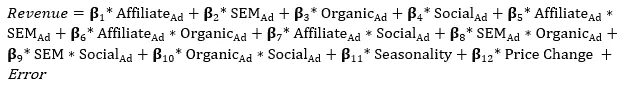
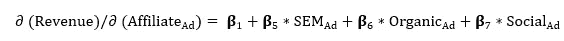

# 通过市场组合建模和 MROIs 优化营销支出

> 原文：<https://medium.com/geekculture/marketing-spend-optimization-by-market-mix-modeling-mrois-af248af80d46?source=collection_archive---------11----------------------->

Photo by [Franki Chamaki](https://unsplash.com/@franki?utm_source=medium&utm_medium=referral) on [Unsplash](https://unsplash.com?utm_source=medium&utm_medium=referral)

# **简介:**

> ***‘我花在广告上的钱一半都浪费了；‘麻烦的是我不知道是哪一半’——约翰·沃纳梅克***

为了增加收入，公司在数字营销上投入了大量资金。这种数字营销支出正在成为公司关注优化资源和提高关键绩效指标(KPI)的热点。广告支出回报(ROAS)、点击率(CTR)、收入、每次收购成本(CPA)是公司每天监控的主要 KPI，用于衡量增量。

公司尝试各种营销渠道，包括联盟营销、搜索引擎营销(SEM)、有机营销、社交营销等。，用于营销他们的产品/服务。他们根据业绩和预测来规划每个渠道的预算。

最难的部分来了，就是衡量营销渠道的绩效。当转换发生时，它会根据适当的归因逻辑归因于某个渠道。但是，顾客旅程在他/她购买产品的决策中起着关键作用，这是单一渠道归因所不能捕捉的。顾客可以在脸书上看到一个广告，然后在 YouTube 上看到同一产品的另一个广告，然后决定购买。在这种情况下，两个广告对购买都有影响。但是我们不知道单单 FB 对顾客决策有多大影响。

我们希望衡量这种类型的互动以及一个渠道对另一个渠道的影响，并最终影响收入。这种测量可以通过开发营销组合模型来实现。

# **营销组合模式:**

> *营销组合建模* *(MMM)* 是对销售和营销时间序列数据进行多元回归等统计分析，以估计各种营销策略(营销组合)对销售的影响，然后预测未来一系列策略的影响—维基百科

# **所需数据:(一个例子)**

1.  按天计算每个营销渠道的支出
2.  [*Adstock*](https://en.wikipedia.org/wiki/Advertising_adstock) 为每个通道使用衰变
3.  每日总收入
4.  季节性因素
5.  价格变动因素

## **数据转换:**

一旦我们通过使用衰减因子得到了每个营销渠道的 Adstock 模型，就可以创建一个所有变量与收入的散点图。这给了我们每个变量如何与因变量相关的概念。如果所有的关系都是线性的，我们就可以走了。但是，如果存在任何非线性关系，我们需要通过使用所需的转换来转换数据。这可以是对数的、指数的等等。

## **回归:**

完成所需的数据转换后，带有交互项的回归方程看起来像这样，

互动术语帮助我们衡量一个营销渠道对另一个营销渠道的影响。选择 Python/R-Programming 来运行这个多元回归。运行回归后，我们需要分析汇总统计数据，以确定对我们的总收入这一因变量有显著影响的变量和交互作用。

现在，去掉对我们的分析在统计上不重要的变量。现在，是时候更多地关注可变系数β值了。对代销商支出系数的解释是，通过增加 1 美元的代销商支出并保持所有其他因素不变，总收入会增加该系数的值。这就是我们如何计算投资的边际回报(MROI)。

由于我们的分析中包含了相互作用项，因此我们需要对每个通道的 MROIs 进行偏导数。MROI 对于加盟渠道的收入从上面的回归方程中得到:

同样，我们可以计算所有其他通道的 MROIs。

营销收入遵循收益递减原则，即*。*

> *“广告量的增加增加了广告触及的观众的百分比，因此增加了需求，但是广告曝光的线性增加不会对需求产生类似的线性影响。通常情况下，每增加一笔广告，对需求增长的影响就会越来越小”——维基百科*

*这种非线性可以通过数据转换来解决。*

## *结论:*

*因此，从这些营销渠道 MROIs，我们可以衡量饱和点，并可以衡量预期的回报。一般来说，具有高 MROI 的营销渠道是我们投资的最佳渠道。这就是我们如何优化营销支出以获得最佳广告支出回报(ROAS)的方法。*