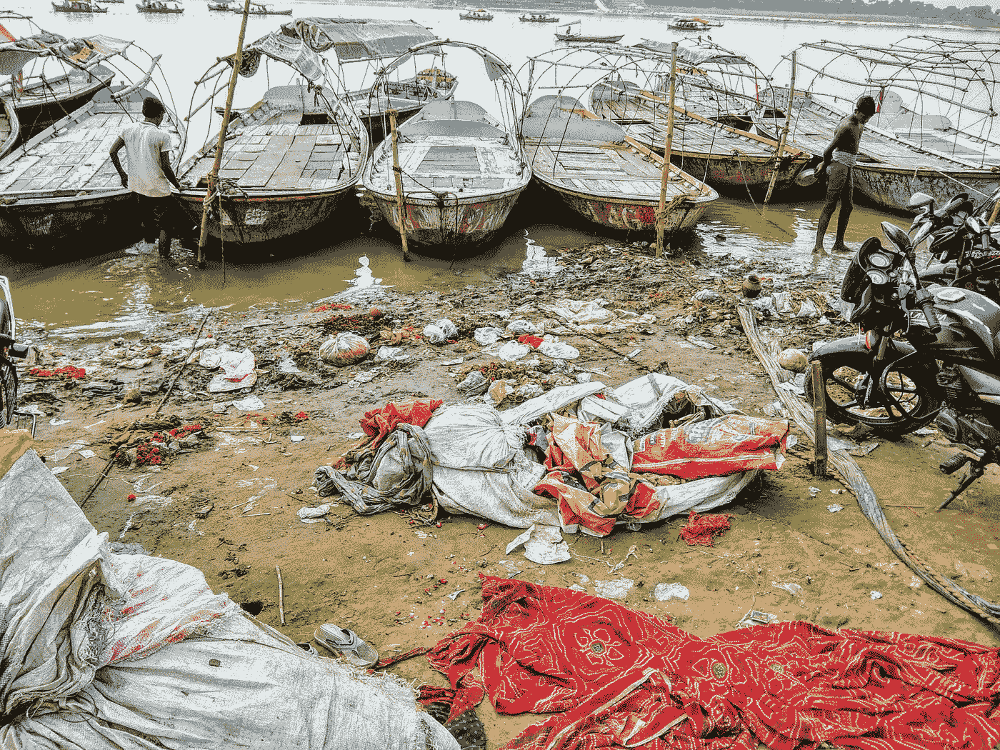
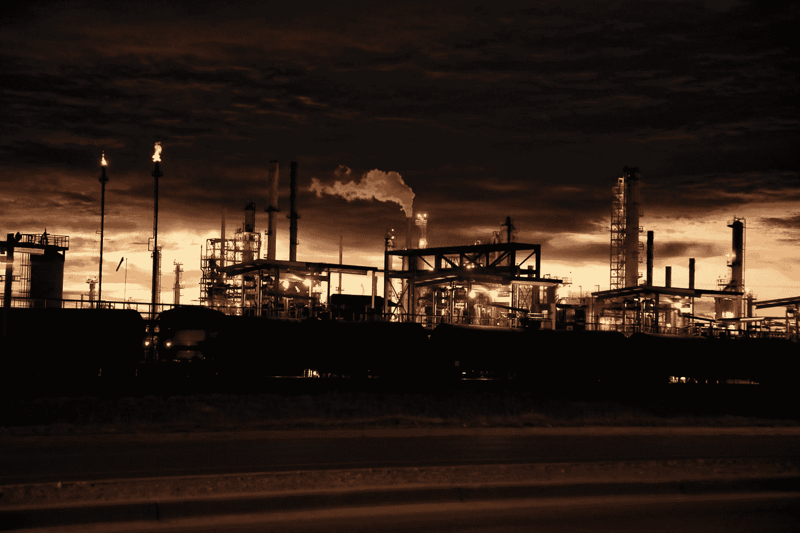
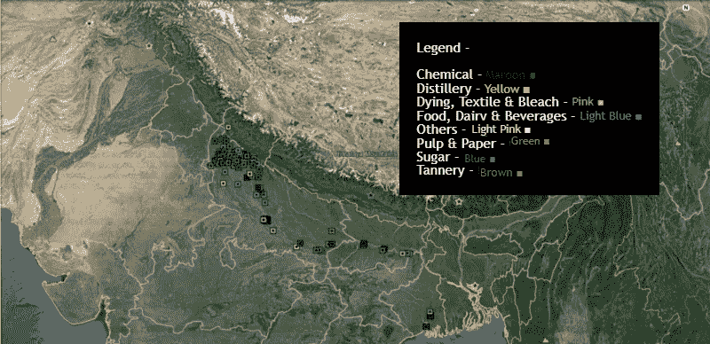
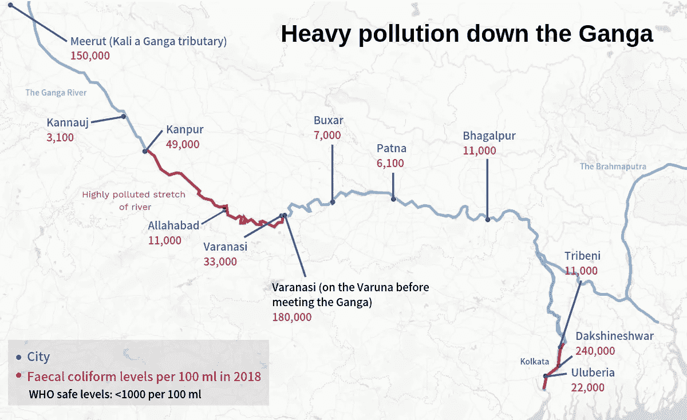
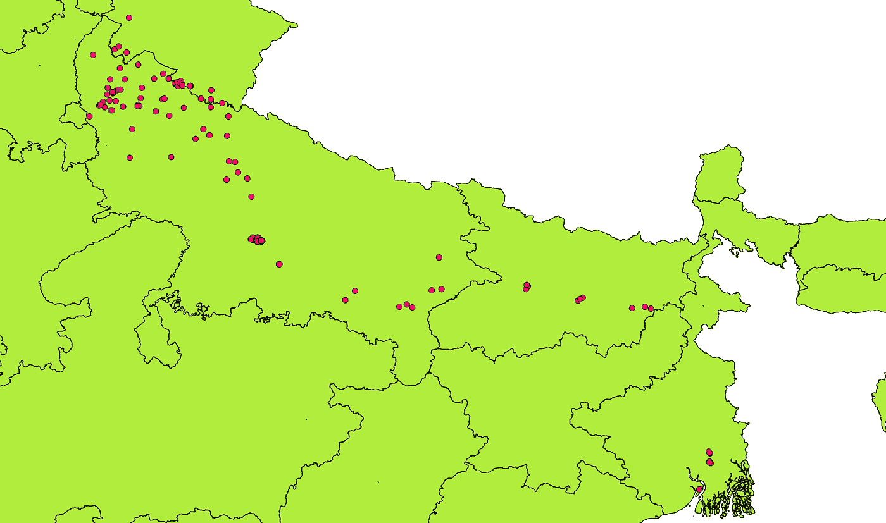
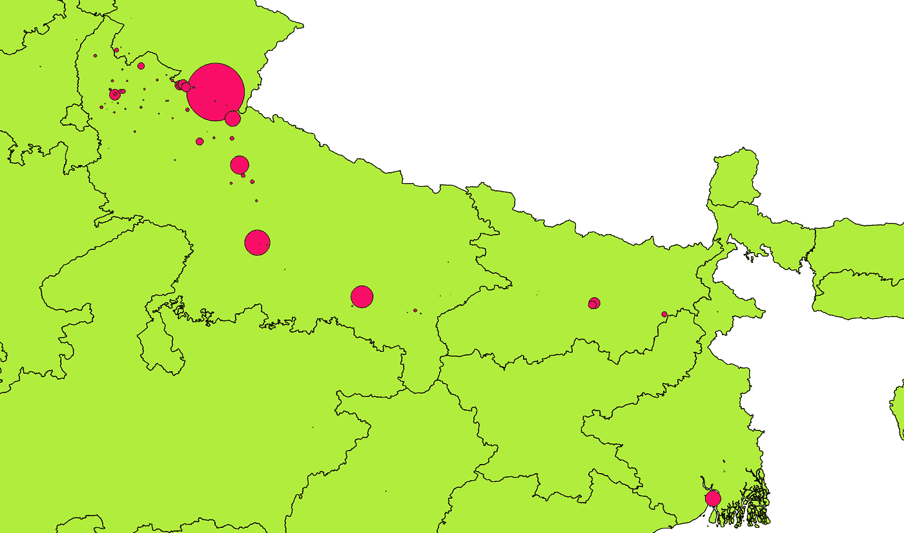
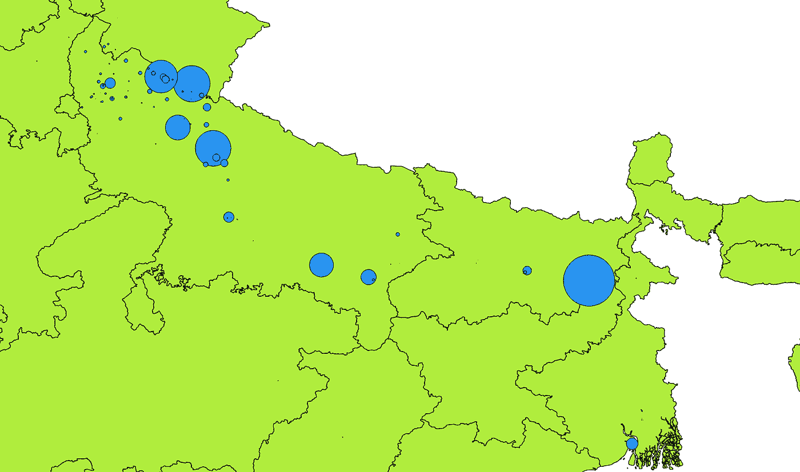

# 用 QGIS 标记恒河沿岸的污染行业

> 原文：<https://medium.com/geekculture/marking-the-polluting-industries-along-ganga-with-qgis-6f63a2e32db0?source=collection_archive---------44----------------------->

## 想象圣河的污染源

A closer look at Ganga in Varanasi | Photo by [ADITYA PRAKASH](https://unsplash.com/@insideshehar?utm_source=medium&utm_medium=referral) on [Unsplash](https://unsplash.com?utm_source=medium&utm_medium=referral)

恒河是世界上最大的河流之一，为世界上人口第二多的国家印度的近 40%的人口服务。

它作为圣河的名声长期以来一直是其信徒对其非凡能力所表现出的永恒信仰的源泉。与其重要性和名声相反，它也是世界上第二大污染河流[*。*](http://www.oceansplasticleanup.com/Oceans_Seas_Rivers/Rivers_Top_Twelve_12_Most_Polluted_In_The_World_2015.htm)

> 2006 年对恒河污染的测量显示，过去 12 年的河水监测显示，每 100 毫升中的粪大肠菌群数量高达 100，000，000 MPN(最可能的数字)。

这项研究的目的是确定工厂的热点区域，然后将它们与污染水平进行比较。我希望这种清晰的分析和结构化的数据概述有助于最终清理消失已久的圣河。

# 介绍

恒河是亚洲的一条跨境河流，流经印度和孟加拉国。恒河是非洲大陆最大的河流之一，也是世界上最重要的河流之一——指的是它所服务的人数——随着时间的推移，恒河正在以指数级的速度遭到破坏。它已经超越了圣洁的年龄，拯救它的需要与日俱增。

> 污染不仅威胁着人类，还威胁着 140 多种鱼类、90 种两栖动物和濒临灭绝的恒河海豚。

A look at the holy trinity of Ganga, Yamuna & Saraswati (Sangam) in Prayagraj | Image by Author

人类和工业废物是这种退化的两个主要原因——这可以被称为在很大程度上是相互关联的。这些因素与宗教传统密切相关，每年节日期间有多达 7000 万人在圣河沐浴。

虽然人类废物指的是垃圾和尸体的沉积(特别是在瓦拉纳西)，但工业废物可以根据它们来自的行业进行更离散的划分。深入分析发现存在以下主要污染行业(按字母顺序排列) :

1.  化学的
2.  酿酒厂
3.  染色、纺织和漂白
4.  食品、乳制品和饮料
5.  纸浆和纸
6.  糖
7.  制革厂

# 数据

## 数据析取

首先要完成的是提取恒河盆地周围所有工业的数据。这将有助于获得废水产生和工业用水消耗的量化图。

几乎在任何地方都找不到这方面的数据，经过几天的搜索，只找到不相关的数据，失望导致决定中断项目。经过几天的休息，一个新的维护良好的网站(与其他印度政府网站相比)引起了注意，它是 [CPCB](https://cpcb.nic.in/) (中央污染控制委员会)。

Photo by [Robin Sommer](https://unsplash.com/@robin_sommer?utm_source=medium&utm_medium=referral) on [Unsplash](https://unsplash.com?utm_source=medium&utm_medium=referral)

最后，在稍微搜索了一下之后，这份名为[污染评估:恒河](https://cpcb.nic.in/upload/NewItems/NewItem_203_Ganga_report.pdf)的报告于 2013 年出炉(现已不可用，可在此处找到)。这份报告有很多相关数据，但最重要的是恒河流域的工厂名单。

## 处理数据

根据这份来自 CPCB 的报告，最终列出了所有工厂及其行业、废水产生量和工业用水量。

然后，使用来自 Google 的[地理编码 API](https://developers.google.com/maps/documentation/geocoding/overview) ，为工厂的名称/地址生成一个坐标列表(经度&纬度)。在这个过程中，结果是 393 个位置的列表。减少的原因主要是因为这些行业中有大量已经关闭——因为数据属于 2013 年，而对于一些行业来说，指定的名称被错误地提及，没有找到。

在此之后，行业的映射按类别进行，给每个类别不同的颜色。接下来，所有这些类别被合并成一个最终的 KML 文件，以便在 QGIS 中进一步使用。

# 形象化

## 使用谷歌地球专业版可视化

在为所有工厂(不同行业)绘制了这些地址后，谷歌地球地图就生成了，这些工厂在北方邦西部和中部的比例很高。

Google Earth Map after plotting all the factories around the Ganga Basin | Image by Author

之后，最终的 KML 被转换成 CSV 数据库，并与工业用水和废水产生的数据相结合。

其次，由于废水产生值的量化数据最初在 0–37120 之间。csv 文件，它在 0-1 的范围内被标准化。同样，工业用水量值的量化数据最初也在 0–70348 之间。csv 文件，然后也在 0-1 的范围内标准化。

A look at pollution in Ganga Basin and major cities leading to most pollution | Source — [India Climate Dialogue Article by Soumya Sarkar](https://indiaclimatedialogue.net/2019/03/11/kumbh-mela-clean-up-wont-save-the-ganga/)

## 使用 QGIS 可视化数据

现在，最后一组工作是将所有数据导入 QGIS，然后从中制作数据点地图。为此，需要一份印度地图的 shapefile(包括克什米尔部分的完整地图，这些部分通常在很多地方被省略了),花了一些时间才找到，但最终在地图库 的 [*Datameet 上找到了。然后，这些工厂地块被叠加在印度的形状上。*](http://projects.datameet.org/maps/states/)

Factory Mapping on the Ganga Basin | Image by Author

接下来，对应于 m /day 中所涵盖的两个方面的量化数据，形成了气泡。气泡的半径从 0-1 个地图单位不等。

Weighted Waste Water Generation (m³/day) in Ganga Basin | Image by Author

Weighted Industrial Water Consumption (m³/day) in Ganga Basin | Image by Author

# 结论

本文试图研究影响圣恒河清洁度的主要区域，正如趋势所表明的，主要问题出现在北方邦的西部和中部，这与河流前方旅程中发现粪大肠菌群的报告相吻合。

Another image of Holy Trinity of Ganga, Yamuna & Saraswati (Sangam, Prayagraj) | Image by Author

但是，在经历了这么多之后，它仍然是这个国家最受喜爱的河流。我希望它能重新焕发活力，这篇文章能有助于寻找其中的一些因素，同时，这里有一张照片，展示了即使周围一片混乱，神圣的恒河(在 Sangam，Prayagraj)看起来是多么美丽。