# Python 中的漫威 vs DC 数据分析

> 原文：<https://medium.com/geekculture/marvel-vs-dc-data-analysis-in-python-e561cac72358?source=collection_archive---------2----------------------->

## MCU vs DC。哪个更好？哪个的高评价电影比较多？基于总值的漫威和 DC 电影分析。


MCU vs DC: Data Analysis

漫威电影与 DC 宇宙，这是一个永无止境的辩论，对不对？当你反对这些电影宇宙中的任何一个时，影迷们都会变得疯狂。但在这篇文章中，我们将根据一些数据对漫威和 DC 进行一场较量。数据永远说明事实。所以，让我们以一杯咖啡开始这场数据战争。

# MCU vs DC

到**下载数据集**的链接在本文末尾。

这个项目的视频教程在这里:

你可以在 **Jupyter Notebook** 、 **Google Colab** 或者其他任何首选编辑器中编写 Python 代码。我会推荐你 Google Colab，因为我用的比较多。

## 代码和分析

*   **导入库**

```
#for mathematical computationimport numpy as np
import pandas as pd
import scipy.stats as stats#for data visualizationimport seaborn as sns
import matplotlib.pyplot as plt
from matplotlib.pyplot import figure
import plotly 
import plotly.express as px
% matplotlib inline
```

*   **让我们加载数据，先睹为快。**

```
df = pd.read_csv("/content/mdc.csv", encoding='latin-1')
df.head()
```

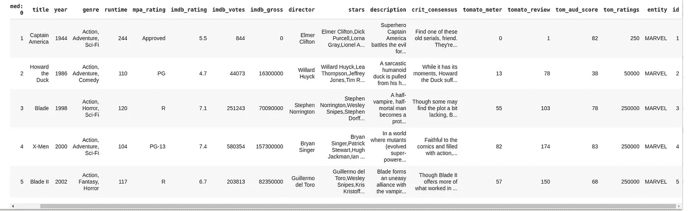

Data Analysis Project for Beginner

我们有电影名称、发行年份、类型、IMDB 评级、IMDB 总值、实体等等。

*   **收集一些更多信息的数据。**

```
df.describe()df.info()
```

检查每一列中的空值。幸运的是，我们的数据集中没有空值。
之后，用每个列的类型属性获得更多关于数据集的信息。

*   **我们拥有的数据的热图**

```
f,ax = plt.subplots(figsize=(14,10))
sns.heatmap(df.corr(), annot=True, fmt=".2f", ax=ax)
plt.show()
```

运行单元格，您会在屏幕上看到类似这样的输出。

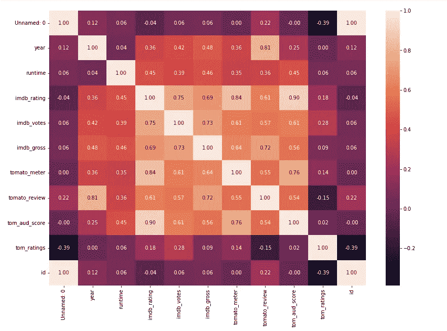

MCU vs DC: Data Analysis

如果你想看漫威电影或 DC 电影，你可以使用数据集的实体。大概是这样的:

```
df[df.entity == 'MARVEL'].tail(5)df[df.entity == 'DC'].tail(5)
```

在 python 单元格中运行上面的代码，您将获得想要的输出。

*   **谁拍的电影多？**

```
fig = plt.figure(figsize = (10,10))
ax = fig.subplots()
df.entity.value_counts().plot(ax=ax, kind='pie')
ax.set_ylabel("")
ax.set_title("MARVEL VS DC (No. of Movies)")
plt.show()
```

上面的代码将给出以下输出:

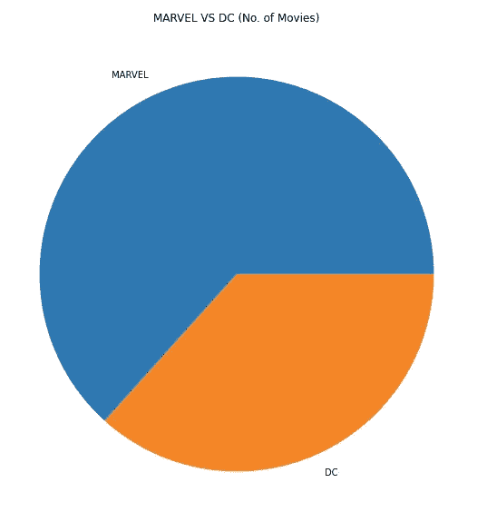

MCU vs DC: Data Analysis and Visualization

上面的饼状图清楚地告诉我们，漫威制作的电影比 DC 多。在这方面，MCU 以较大优势获胜。为什么是 DC？？为什么？？

*   **MCU 更关注电影类型**

```
fig = plt.figure(figsize = (10,10))
ax = fig.subplots()
df[df.entity == 'MARVEL'].genre.value_counts().plot(ax=ax, kind='pie')
ax.set_ylabel("")
ax.set_title("Marvel Movie Genre Type")
plt.show()
```

运行单元格，您会在屏幕上看到类似这样的输出。

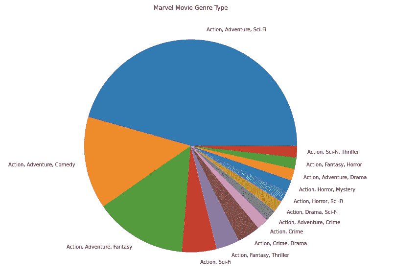

MCU vs DC: Data Analysis and Visualization

正如你所看到的，大多数漫威电影宇宙的类型是动作、冒险、科幻、喜剧和幻想。现在来看看 DC。

*   **MCU 更关注电影类型**

```
fig = plt.figure(figsize = (10,10))
ax = fig.subplots()
df[df.entity == 'DC'].genre.value_counts().plot(ax=ax, kind='pie')
ax.set_ylabel("")
ax.set_title("DC Movie Genre Type")
plt.show()
```

上面的代码将给出以下输出:

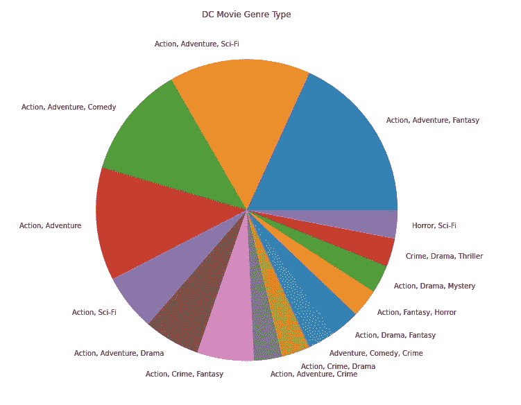

MCU vs DC: Data Analysis and Visualization

你可以看到 DC 电影比漫威电影更加多样化。DC 试图一次接触更多的流派类型。我认为这是 DC 宇宙最好的部分。

*   **根据 IMDB 排名，漫威和 DC 的电影名列前茅:**

```
dc_movies = df[df.entity == 'DC']
marvel_movies = df[df.entity == 'MARVEL']**#Average and highest rated of dc movies**avrg_dc_imdb = dc_movies['imdb_rating'].mean()
highest_dc_imdb = dc_movies['imdb_rating'].max()print("Average: ",avrg_dc_imdb, "\n Highest: ",highest_dc_imdb)**#Average and highest rated of marvel movies**avrg_marvel_imdb = marvel_movies['imdb_rating'].mean()
highest_marvel_imdb = marvel_movies['imdb_rating'].max()print("Average: ",avrg_marvel_imdb, "\n Highest: ",highest_marvel_imdb)
```

上述代码的输出是:

```
###DC###
Average:  6.133333333333335 
 Highest:  9.0###MARVEL####
Average:  6.794736842105261 
 Highest:  8.4
```

DC 电影的平均评分是 6.133，漫威电影的平均评分是 6.794。DC 是有史以来收视率最高的电影之一。

*   **IMDB 评级与 IMDB 总额(漫威和 DC)**

```
plt.scatter(data = marvel_movies, x = 'imdb_rating', y = 'imdb_gross')
plt.scatter(data = dc_movies, x = 'imdb_rating', y = 'imdb_gross')
plt.title('Marvel vs. DC in imdb ratings and gross')
plt.xlabel('IMDb Ratings')
plt.ylabel('IMDb Gross')
plt.legend(['Marvel', 'DC'])
```

上面的代码将给出以下输出。

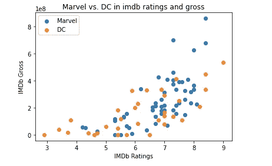

MCU vs DC: Data Analysis and Visualization

就票房而言，很少有漫威电影能与 DC 电影相提并论。

大多数漫威电影的 IMDB 评分在 6.7 到 8.2 之间。

DC 电影的收视率在图表中平均分布。

DC 电影在 IMDB gross 上表现不错，但如果你和漫威相比，它们就差了。

*   **番茄米 vs IMDB 评分(漫威 vs DC)**

```
imdb_vs_tm = sns.lmplot(data=df, x="imdb_rating", y="tomato_meter", hue="entity", height=7)
imdb_vs_tm.set_axis_labels("IMDb Ratings", "Tomato meter Score")
```

上述代码的输出是:

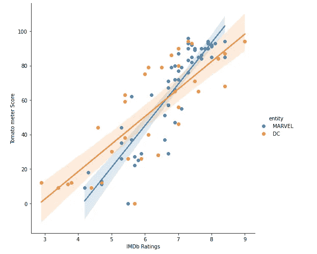

MCU vs DC: Data Analysis and Visualization

*   **基于 IMDB 评分的 DC 最佳电影排行榜**

```
top_dc_movie = dc_movies.groupby('title').sum().sort_values('imdb_rating', ascending=False)
top_dc_movie = top_dc_movie.reset_index()
px.bar(x='title', y ="imdb_rating", data_frame=top_dc_movie)
```

上述代码的输出是:


MCU vs DC: Data Analysis and Visualization

《黑暗骑士》是 DC 收视率最高的电影。它的 IMDB 评级为 9。如果你还没看，那就看吧。你将见证希斯·莱杰爵士的传奇行为。这部电影展示了 DC 宇宙的能力。

*   **基于 IMDB 评分的漫威最佳电影排行榜**

```
top_marvel_movie = marvel_movies.groupby('title').sum().sort_values('imdb_rating', ascending=False)
top_marvel_movie = top_marvel_movie.reset_index()
px.bar(x='title', y ="imdb_rating", data_frame=top_marvel_movie)
```

上述代码的输出是:

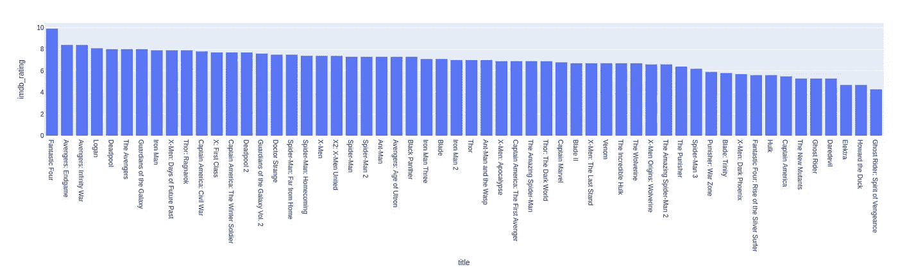

MCU vs DC: Data Analysis and Visualization

《复仇者联盟》是收视率最高的漫威电影。它的 IMDB 评级为 8.4。**数据有一些错误**，这就是为什么它显示了 IMDB 评分最高的神奇四侠。

*   **漫威 vs DC(运行期)**

```
**###Marvel###**
avrg_marvel_runtime = marvel_movies['runtime'].mean()
highest_marvel_runtime = marvel_movies['runtime'].max()**###DC###**
avrg_dc_runtime = dc_movies['runtime'].mean()
highest_dc_runtime = dc_movies['runtime'].max()print("Marvel\nAverage: ",avrg_marvel_runtime, "\n Highest: ",highest_marvel_runtime)
print("DC\nAverage: ",avrg_dc_runtime, "\n Highest: ",highest_dc_runtime)
```

上述代码的输出是:

```
Marvel
Average:  124.54385964912281 
 Highest:  244
DC
Average:  123.45454545454545 
 Highest:  164
```

漫威和 DC 电影的平均播放时间几乎相等。但是他们的最高运行时电影有着巨大的差异。

*   **基于 IMDB 票房的漫威顶级电影**

```
top_marvel_movie_gross = marvel_movies.groupby('title').sum().sort_values('imdb_gross', ascending=False)
top_marvel_movie_gross = top_marvel_movie_gross.reset_index()
px.bar(x='title', y ="imdb_gross", data_frame=top_marvel_movie_gross)
```

上面的代码将给出以下输出。

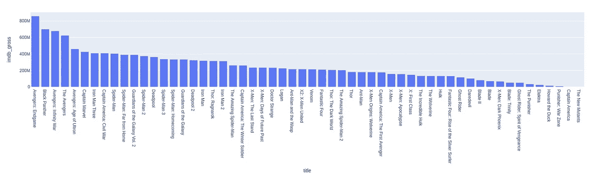

MCU vs DC: Data Analysis and Visualization

众所周知,《复仇者联盟》最终版位居榜首，紧随其后的是《黑豹》、《无限战争》等等。Endgame 的 IMDB 总收入超过 800 美元。

*   **基于 IMDB 票房的 DC 最佳电影**

```
top_dc_movie_gross = dc_movies.groupby('title').sum().sort_values('imdb_gross', ascending=False)
top_dc_movie_gross = top_dc_movie_gross.reset_index()
px.bar(x='title', y ="imdb_gross", data_frame=top_dc_movie_gross)
```

上面的代码将给出以下输出。


MCU vs DC: Data Analysis and Visualization

根据上图，黑暗骑士的 IMDB 总值最高。就收藏总量而言，DC 离漫威很远。为了更清楚地了解情况，请看下图。

*   **漫威和 DC 全年总收入**

```
fig = px.line(df, x="year", y="imdb_gross", color='entity')
fig.show()
```

输出数字是:

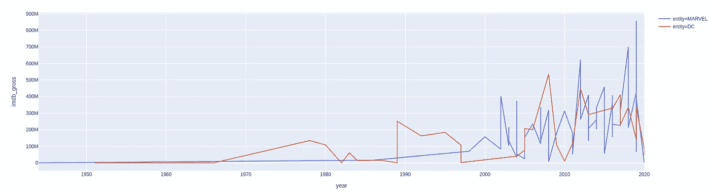

MCU vs DC: Data Analysis and Visualization

过去几年，MCU 的 IMDB 总收藏量远远超过 DC Universe。

*   **漫威或 DC 多久拍一次电影**

```
fig2 = px.line(df, x='year', y='title', color='entity')
fig2.show()
```

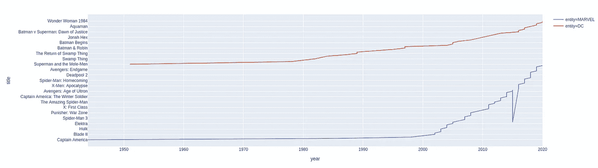

MCU vs DC: Data Analysis and Visualization

从上面的图表中，我们可以得出结论，2002 年以后，与 DC 相比，漫威制作电影更加频繁。也许这就是为什么 DC 的粉丝比漫威少的原因。

我们不能比较这两家电影制作公司，因为谁知道未来。将来，DC 可能会盖过漫威。但最棒的是，在过去的几十年里，这两家制作公司都在制作好电影，娱乐观众。

好了，这篇文章就到这里。

如果这篇文章对你来说很有启发性，一定要关注并分享给你的极客社区。

**Google Colab 链接到的代码是** [**这里是**](https://colab.research.google.com/drive/12DPN0BFYz0Slq2J8m-ney10x8DHWG8zh?usp=sharing) 。

**你可以从这个** [**链接**](https://ninza7.blogspot.com/2021/11/marvel-vs-dc-dataset-for-data-analysis.html) 下载数据集

# 更多数据科学项目

[**顶级网络数据泄露事件(2004–2021):数据分析与可视化**](/mlearning-ai/top-cyber-data-breaches-2004-2021-data-analysis-and-visualization-db61318148f)

[**中型文章数据可视化与分析使用 Python**](/mlearning-ai/medium-articles-data-visualization-and-analysis-using-python-730a538207ab)

[**使用 Python 的 Spotify 数据可视化和分析**](/geekculture/spotify-data-visualization-and-analysis-using-python-4af81c5531a7)

[**IPL 数据分析(2008–2020)使用 Python**](/nerd-for-tech/ipl-data-analysis-2008-2020-using-python-c031d3e1ae0c)

[**用 Jupyter 笔记本进行 Zomato 数据分析**](/nerd-for-tech/zomato-data-analysis-with-jupyter-notebook-6116ea03bd9d)

[**不同国家二氧化碳排放数据分析及可视化**](https://ninza7.medium.com/data-analysis-and-visualization-of-co2-emission-by-different-countries-7d9cadec50a3)

你好，我是 Rohit Kumar Thakur。我对 ***自由职业*** *持开放态度。我构建了* ***react 原生项目*** *和目前正在开发的****Python Django****。请随时通过(****)freelance.rohit7@gmail.com****)*联系我

[](/mlearning-ai/mlearning-ai-submission-suggestions-b51e2b130bfb) [## Mlearning.ai 提交建议

### 如何成为 Mlearning.ai 上的作家

medium.com](/mlearning-ai/mlearning-ai-submission-suggestions-b51e2b130bfb) 

*更多内容请看*[*plain English . io*](http://plainenglish.io/)*。报名参加我们的* [*免费周报在这里*](http://newsletter.plainenglish.io/) *。*