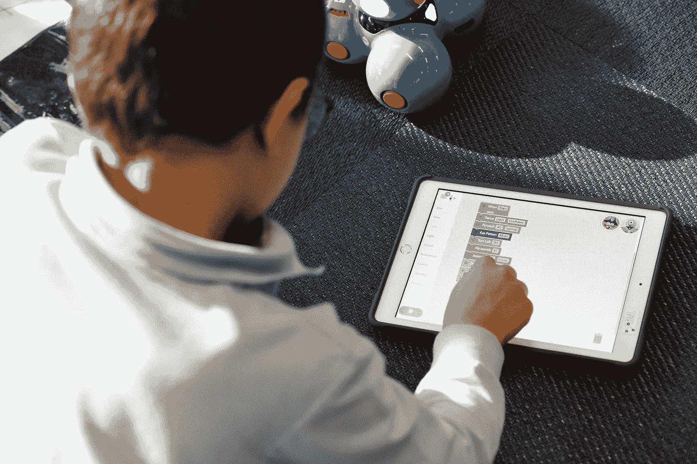

# 大量学校数据泄露表明我们需要更好的隐私政策

> 原文：<https://medium.com/geekculture/massive-school-data-breach-shows-we-need-better-privacy-policies-1f39ef82fb56?source=collection_archive---------53----------------------->

学校是黑客的首选目标，而公共政策也于事无补

Photo by [stem.T4L](https://unsplash.com/@stem_t4l?utm_source=medium&utm_medium=referral) on [Unsplash](https://unsplash.com?utm_source=medium&utm_medium=referral)

(最初发表于 [The Hill](https://thehill.com/opinion/technology/550959-massive-school-data-breach-shows-we-need-better-privacy-policies) ，与 Williamson M. Evers 合著)

加州大学(UC)系统上个月宣布，它遭遇了大规模数据泄露。该区域是一个名为 Accellion 的第三方文件传输应用程序。加州大学只是国际网络攻击的受害者之一，这次攻击可能影响了大约 100 所机构，还包括斯坦福医学院、马里兰大学、科罗拉多大学和迈阿密大学以及纽约的叶史瓦大学。

有多少数据被盗仍不得而知。加州大学在 [FAQ](https://ucnet.universityofcalifornia.edu/news/2021/04/frequently-asked-questions-about-the-accellion-data-breach.html#:~:text=As%20UC%20announced%20previously%2C%20this,identity%20theft%20protection%20through%20Experian.) 中写道，被泄露的信息包括“员工及其家属和受益人、退休人员及其受益人、学生及其家人”，以及其他可能与加州大学有联系的人的姓名、地址、电话号码、出生日期、社会保险号和银行账户信息。

在 11 月的选举之前，[当我们写](https://californiaglobe.com/section-2/proposition-24-fails-students-privacy/)关于加州 24 号提案第 15 部分不应该免除某些与学校相关的企业保护隐私的要求时，我们实际上是独自一人。当涉及到某些学生信息时，该部门免除这些企业遵守加州消费者隐私法的部分规定。根据加州民法典第 1798.105 条，一项重要的豁免允许企业拒绝学生的“被遗忘权”。行使这一权利将允许学生提交删除其数据的请求。

如果允许学生保留更多的个人信息，特别是与第三方相关的信息，那么未来类似的违规行为所造成的损害可能会减轻。“被遗忘的权利”之所以可取，部分原因是许多机构，如学校，有一种愚蠢的倾向，将数据保存在一个几乎没有网络安全保护的集中地方。数据“选择退出”和“选择加入”选项也可以对学校可以向第三方提供多少数据提供更多控制。

此外，教育机构本身应该更好地保护学生和员工的数据。学校拥有大量的个人信息，成为网络罪犯的首要目标。今年三月，黑客入侵了佛罗里达州布劳沃德县公立学校的电脑系统，这是 T2 全国第六大学区。黑客持有这些个人数据，索要 4000 万美元的赎金，但学区无法支付，部分原因是没有一个学区手头有 4000 万美元。受到威胁，黑客[在网上公布了 26000 份被盗文件](https://www.news4jax.com/news/florida/2021/04/20/broward-schools-refuses-to-pay-hackers-private-data-goes-online/)。目前还不清楚这次袭击是否与大学袭击有关。

在 K12 安全信息交换和 K-12 网络安全资源中心最近关于 K-12 网络安全状况的报告中，作者[写道](https://k12cybersecure.com/wp-content/uploads/2021/03/StateofK12Cybersecurity-2020.pdf)“连续第二个日历年，影响美国公立 K-12 学区的所有数据泄露事件中，至少有 75%是由学区供应商和其他合作伙伴参与的安全事件造成的。”从事教育技术工作的贾格尔·亨利在接受《连线》杂志采访时说，“当我看一看的时候，有太多脆弱的东西——只是一堆愚蠢的脆弱。”

事件发生后，我们认识的一名教师注册了一项由加州大学推荐的信用监控服务。监控服务已经在黑网上找到了他的社会安全号码四次。他不得不在主要机构冻结他的信用报告，以使别人更难以他的名义开户，但他仍然担心身份被盗。

尽管存在大规模数据泄露的真实威胁，但加州和其他州未能承认私人诉讼的明确权利，以弥补疏忽的数据持有者造成的损害。很难对那些因疏忽导致身份盗窃等行为的人提起诉讼。电子前沿基金会提出的一个要点是，数据隐私法应该允许“普通人对侵犯他们隐私权的公司提起诉讼。”

强有力的隐私保护并非刀枪不入，网络安全威胁将持续存在。但更好的政策可以帮助保护个人，并为受害者提供补救措施。