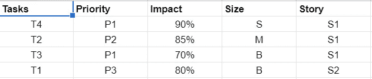

# 优先权的主人

> 原文：<https://medium.com/geekculture/master-of-priority-95a830642772?source=collection_archive---------21----------------------->

## 生产率

## 如何像专业人士一样分清主次

Image from [Shutterstock](https://www.shutterstock.com/image-photo/number-one-priority-marked-red-circle-1183376491)

> 如果有些东西太复杂而无法理解，那么实现起来肯定更复杂。

我们大多数从事过任何类型的项目开发的人都太熟悉项目管理工具了，比如 JIRA、Basecamp、Zepel 和[许多其他的](https://zepel.io/blog/jira-alternative/)。它们都有相似的特性，如果使用得当，会很有用。

有时，这些项目管理工具会妨碍清晰性，这取决于这些工具是如何实现和管理的。一般来说，参与的人越多，事情就越复杂。

在工作中，就像在日常生活中一样，知道下一步该做什么是业余爱好者和专业人士的根本区别。这里有一个简单的策略，让你尽可能轻松地选择下一个任务。

## 项目

首先设定项目目标/大纲。应该尽可能清晰地定义目标。

大多数项目都遵循这种结构:

而项目是最宽泛的大纲，任务是最小的， ***是这个结构中唯一可操作的*** 单元。我们在这里的重点是任务。

## 任务描述

在描述任务时避免使用模糊的语言。尽量简洁，因为这是一个可操作的单元。任务描述的清晰程度与任务完成时间直接相关:描述越清晰，完成任务所需的时间就越少。

任务应该有时间框架，要么使用事先商定的衬衫尺寸，要么使用时间单位。

## 任务大小

…很大程度上取决于任务的复杂性。最好是任何任务都不要那么复杂，这样 1 个工作日内完成不了。

**小**—0–2 小时

**中等**—2-4 小时

**大**—4–8 小时

## 任务优先级

经典的 P1-P4/5，P1 是最高优先级的任务，P4/5 是最低优先级的任务。

设定任务优先级可能会很棘手，因为公司内部的许多人都在干预任务优先级的设定。在我看来，设置任务优先级应该留给开发人员或者其他参与完成任务的人。项目经理和其他利益相关者应该处理设置史诗(特性)的优先次序/优先级，而故事和任务应该留给开发人员来决定，因为他们是最知道应该以什么特定顺序完成任务来完成故事的人。这同样适用于故事的优先排序，以完成史诗/特写。

## 任务影响

**正值** —设定完成一项特定任务对故事结局的贡献百分比(估计值)。

中立——既不在这里，也不在那里，可以延期。

**否定**—没有贡献/与故事无关，目前应该推迟/回避。

## 任务持续时间

…应根据交付团队的估计明确定义。

## 挑选下一个任务

完成这个设置后，选择下一个任务应该很简单。它应该是任务优先级(高优先级优先)、任务影响(高影响优先，避免中性/负面任务)、任务大小(顺序无关紧要，因为所有任务都应该相对较短，< day), and corresponding story (it’s best to finish stories already started first).

Possible task sorting based on Priority, Size, Duration, and story it belongs to.

What’s presented in this article is largely based on [敏捷方法](https://en.wikipedia.org/wiki/Agile_software_development))之间的交叉部分。这里的尝试是让敏捷变得易于理解、简单和足够清晰，因此它不会成为交付团队的效率和速度的障碍。我见过许多团队对抗它和/或以[非常教条的方式](https://www.linkedin.com/pulse/dogmatic-pragmatic-agile-necessary-contradiction-journey-mari%C3%B1a/?trk=portfolio_article-card_title)实现它，这不可避免地导致了生产力的损失。

没有人认为这是开发项目时做事的“唯一方式”。根据我的经验，对于交付团队来说，坚持清晰、简单、定义良好的过程和程序，并确保团队的所有成员都遵循它们，比坚持使用方法的细微差别更重要。

