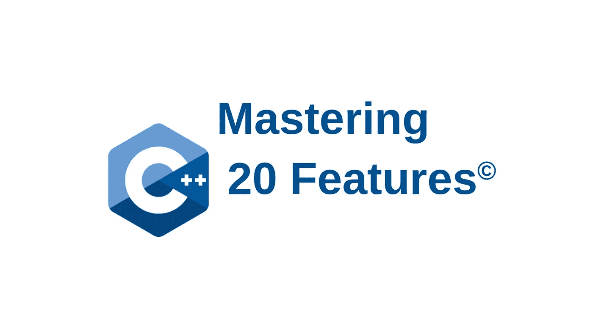

# 掌握 C++20 特性:在线课程

> 原文：<https://medium.com/geekculture/mastering-c-20-features-online-course-9ec9064d9ef9?source=collection_archive---------9----------------------->

# 如何获得在线课程 50%的折扣

如果您是来享受 50%的折扣，那么请向下滚动到定价部分，然后按照以下步骤操作

# 推出在线课程

今天，我和我的妻子 [Anokhi Shah](https://anokhias.medium.com/) ，很高兴地宣布我们的在线课程[掌握 C++20 特性](https://mastering-modern-cpp-features.thinkific.com/courses/mastering-modern-cpp-features)的发布。一年来，我们一直在考虑创建我们自己的在线课程的想法，但直到 2021 年 12 月，我们才做出切实的努力来制定课程的第一个细节，今天我们认为课程在视频讲座、测验和作业方面有足够的材料。

该课程目前有 34 个视频讲座，1 个作业和 1 个测验，分为 4 个章节，我们每天都在不断增加优质内容，涵盖我们向所有尊敬的追随者和学习者承诺的主题。

到目前为止，我们已经涵盖了协程、概念，目前正在编写关于[三路运算符](https://ggulgulia.medium.com/c-20-three-way-comparison-operator-part-1-60e2946ae4a3)的章节。在没有任何外部支持的情况下学习这门课程非常具有挑战性，因为我们在一家新成立的公司中通常要工作 40 个小时，这是非常苛刻的，每天加班 1-1.5 个小时是不可避免的。尽管如此，我和 Anokhi 在周末和工作日下班后非常努力地创建了这个课程，并不断挤出我们的空闲时间来增加课程内容。

# 我们计划涵盖的主题

我们计划涵盖 C++20 中的所有新主题，包括四大特性，即概念、协程、范围、模块、添加和改进，如三向比较运算符、并发特性、lambda 表达式、模板元编程、日期时间库、字符串格式库等。我鼓励大家观看免费的预览视频，Anokhi 将带你浏览我们计划在[课程网站](https://mastering-modern-cpp-features.thinkific.com/courses/mastering-modern-cpp-features)中涉及的主题

# 定价

我们还没有决定课程的定价，但我不想像 Udemy 上的课程那样定价太低，Udemy 通过提供大量折扣和免费优惠券，从作者那里剥夺了课程的定价权。目前，对于我所有的早期课程参与者来说，该课程的购买价格为 49.99 美元。

课程的所有早期参与者都可以在没有任何附加条件的情况下获得全部材料。

## medium 上的前 100 名电子邮件订户可享受 50%的折扣

对于我的前 100 名中型电子邮件订户，我将提供一个 50%折扣的优惠券代码，这意味着他们可以以低至 24.99 美元的价格访问整个课程

## 获得 50%折扣的步骤

1.  转到介质上的[我的个人资料](/@ggulgulia/about)
2.  提供您的电子邮件 id 并点击订阅
3.  在接下来的日子里，我的第一批 100 名订户将每人获得一张个性化优惠券，以 24.99 美元的价格购买课程

# 证书

我们确实计划向课程的每个参与者提供完成证书，但这只会从 4 月份开始，因为整个课程的创建将需要我们花费时间到 2022 年 6 月，这意味着除非我们首先完成创建，否则参与者无法实际完成课程。

# 未来展望

我们头上有这么多事情要做，还有这么多工作要做，很难谈论未来，因为我们已经为接下来的 4 个月计划好了一切。我们决心为我们的课程参与者提供高质量的学习体验，旨在涵盖 C++20 中的所有主题，并提供详细信息，帮助 C++开发人员自信地在生产中使用 C++ 20 功能。

# 对课程的建议和反馈

鉴于这是我们的第一门在线课程，而且我们之前在制作在线视频内容以交付 MOOC 方面毫无经验，我犯了很多错误，每天都在从中吸取教训。本课程仍在准备中，参与者正在我的家庭办公室获取新鲜出炉的视频，我不能保证内容没有错误，但我欢迎对参与者发现的任何错误进行礼貌和尊重的反馈和建设性的批评。

最后，我祝愿我所有的追随者和课程参与者在掌握 C++20 特性的过程中一路顺风。