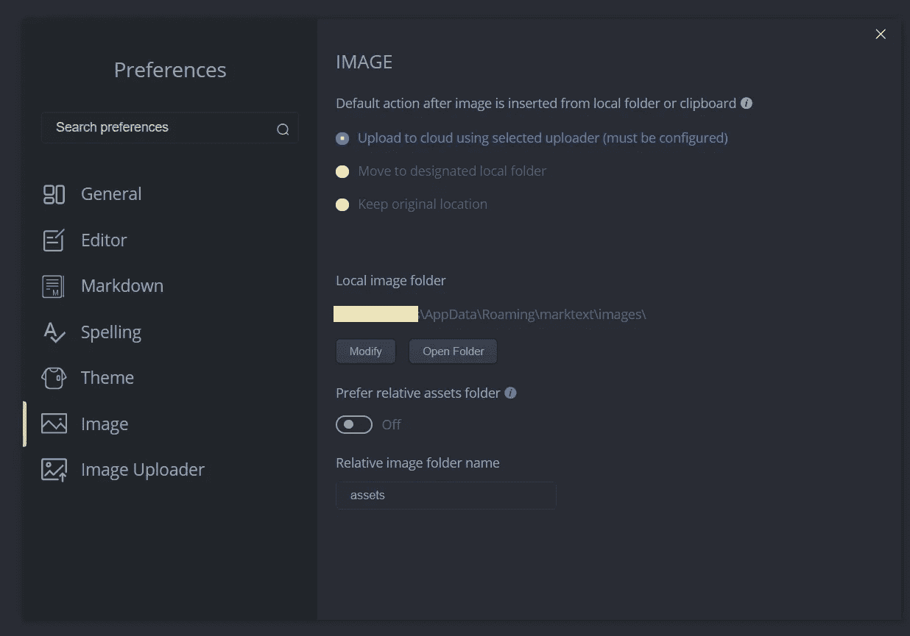
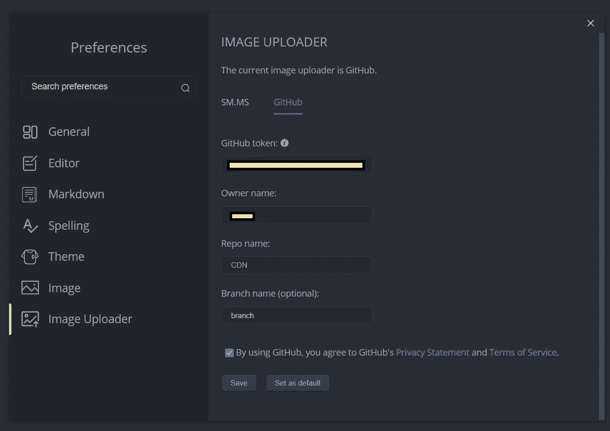

# 掌握降价要领

> 原文：<https://medium.com/geekculture/mastering-markdown-essentials-5a6a92286059?source=collection_archive---------44----------------------->

# 一种跨网络平台编写的语言。


它是一种**轻量级标记语言**，用于使用纯文本编辑器创建格式化文本，并允许 HTML 组件对文本进行样式化。

它是一种易于使用的语法，用于设计所有形式的文字，在 Github 和其他各种平台上的`blogging`、`instant messaging`、`online forums`、`collaborative software`、`documentation pages`和`readme files`中被广泛使用。

我们可以控制文档的显示；将单词格式化为粗体或斜体、添加图像和创建列表只是我们可以在 markdown 中做的一些事情。大多数情况下，它是普通文本，带有一些非字母字符，如`#`或`*`。

我们以文件名结尾的`.md`扩展名保存 markdown 文件。

# 让我们来看一些语法示例:

1.  **正文**

```
It is quite easy to make some words **bold** and other words *italic* with Markdown. You can even [link URL!](http://google.com)
```

1.  **列表**

```
Sometimes you want numbered lists:1\. One
2\. Two
3\. ThreeSometimes you want bullet points:* Start a line with a star
* Profit!Alternatively,- Dashes work just as well
- And if you have sub points, put two spaces before the dash or star:
  - Like this
  - And this
```

1.  **图像**

```
If you want to embed images, this is how you do it:
```

# 语法指南

# 头球

```
# This is an <h1> tag
## This is an <h2> tag
##### This is an <h5> tag
```

# 强调

```
*This text will be italic*
_This will also be italic_**This text will be bold**
__This will also be bold___You **can** combine them_
```

# 列表

整齐的

```
1\. Item 1
1\. Item 2
1\. Item 3
   1\. Item 3a
   1\. Item 3b
```

无序的

```
* Item 1
* Item 2
  * Item 2a
  * Item 2b
```

# 形象

```

Format: 
```

# 链接

```
http://github.com - automatic will be clickable!
[medium](http://medium.com)
```

# 大宗报价

```
As already said:> We're living the future so
> the present is our past.
```

# 内嵌代码

```
I think you should use an
`addr` element here instead.
```

# 分组码

```
```java
public boolean isFnardy(String item) {
  return item.equals("AAA")
      || item.equals("ABA")
      || item.equals("CC")
      || item.equals("FWR");
}```
```

所以，这就是你需要开始做的基础工作。

# 现在我们知道了语法，我可以在哪里写呢？

你可以找到很多在线和离线的降价编辑器。但是我最喜欢的是 T21，你可以看看这个。它适用于所有操作系统平台。

此外，我喜欢这个应用程序的一个最好的特点是，你可以`don't need to upload your images` 到一个单独的源，然后链接到它。

它让你可以选择**将图片直接上传到云端(就像你自己的 CDN)，**多棒啊**。**

您可以使用下面的步骤为自己配置相同的内容。

# 第一步:

从文件选项中打开**首选项**，然后转到图像和图像的`set default`动作。



# 第二步:

然后转到**图像上传器**选项，添加您的 Github [OAuth 令牌](https://github.com/settings/tokens)，您的用户句柄，您想要添加图像的存储库名称，然后单击保存。



就是这样，你的图片会自动上传到目的地。

只需`export your markdown file`并将它上传到您最喜爱的网络目的地。

希望有所帮助。快乐编码😀😀