# 10 分钟掌握 Python

> 原文：<https://medium.com/geekculture/mastering-python-in-10-minutes-17f19d3ecc10?source=collection_archive---------20----------------------->

**Python 是什么？**

Python 是一种解释性编程语言，可用于各种平台，其设计理念专注于代码可读性，是与数据科学、机器学习和物联网(IoT)相关的流行语言之一。Python 具有解释性的优点，也广泛用于原型开发、基础设施管理中的脚本编写以及大型网站的创建。

Quora、Pinterest 和 Spotify 都使用 Python 进行后端 web 开发。所以让我们来了解一下。

**基础知识**

**1。变量**

另一个原因是我们可以以多种方式使用 Python 编码:数据科学、web 开发和机器学习都在这里大放异彩。Quora、Pinterest 和 Spotify 都使用 Python 进行后端 web 开发。所以让我们来了解一下。
Python 变量的编写本身也有一定的规则，即:

*   第一个字符必须是字母或下划线 _
*   后续字符可以是字母、下划线或数字
*   变量名中的字符区分大小写。这意味着小写和大写字母是有区别的。例如，变量 firstName 和 FirstName 是不同的变量。

在 Python 中，定义一个变量并为其设置一个值确实很容易。您只需编写一个变量，然后通过添加一个等号=后跟您要输入的值来填充它。让我们开始吧:

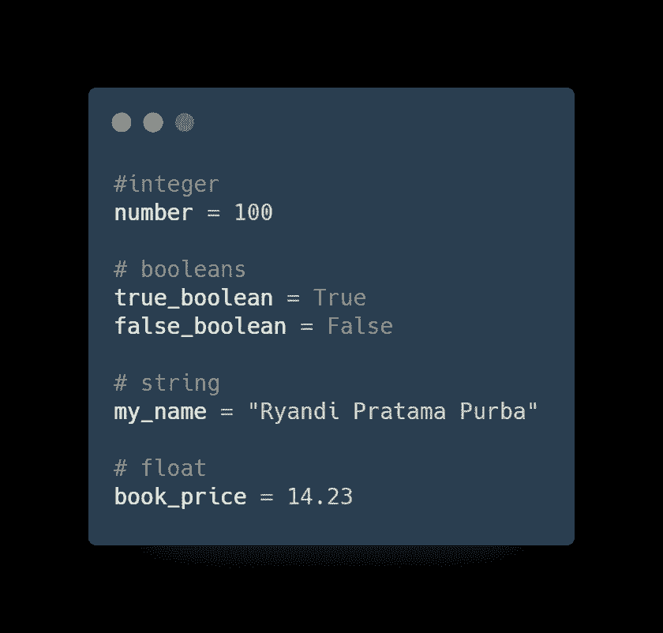

我们还可以使用布尔值(真/假)、整数、字符串、浮点和许多其他数据类型作为它的值。

**2。条件语句**

决策(如果有条件的话)用于预测计划过程中出现的条件，并根据条件决定采取什么行动。

在 python 中，有几个语句/条件，包括 if、else 和 elif。如果条件评估为 True，则 if 条件用于执行代码。

如果条件评估为 False，则不会执行 If 语句/条件。

以下是在 Python 中使用 if 条件的示例:

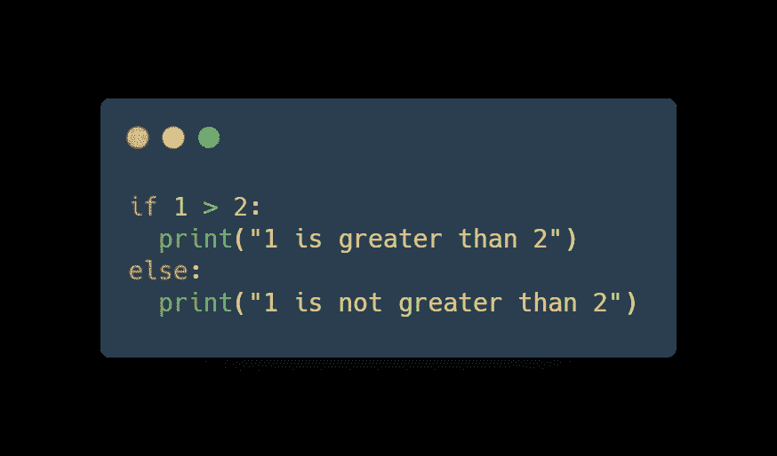

**2** 大于 **1** ，则执行**打印**代码。

如果“ **if** ”表达式为 **false** ，则执行 **else** 语句。

**3。循环/迭代器**

在 Python 编程语言中，重复分为 3 个部分，即:

*   While 循环:当语句为真时，将执行块内的代码。因此，该代码将打印从 **1** 到 **10** 的数字。

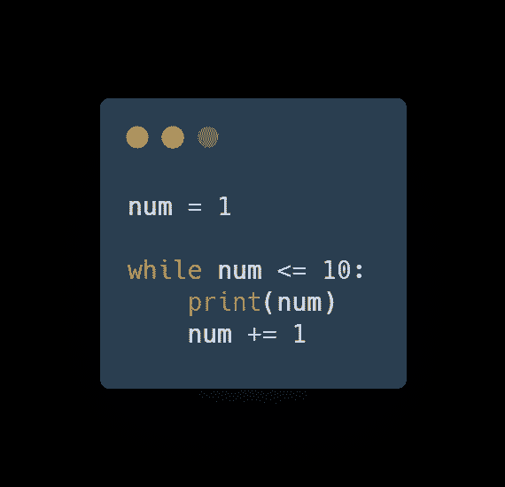

**而**循环需要一个**循环条件。**“如果保持为真，则继续迭代。在这个例子中，当`num`为`11`时，**循环条件**等于`False`。

*   For 循环:Python 的 for 循环能够遍历任意顺序的项，比如列表或字符串。

下面是一个使用 For 循环的例子。

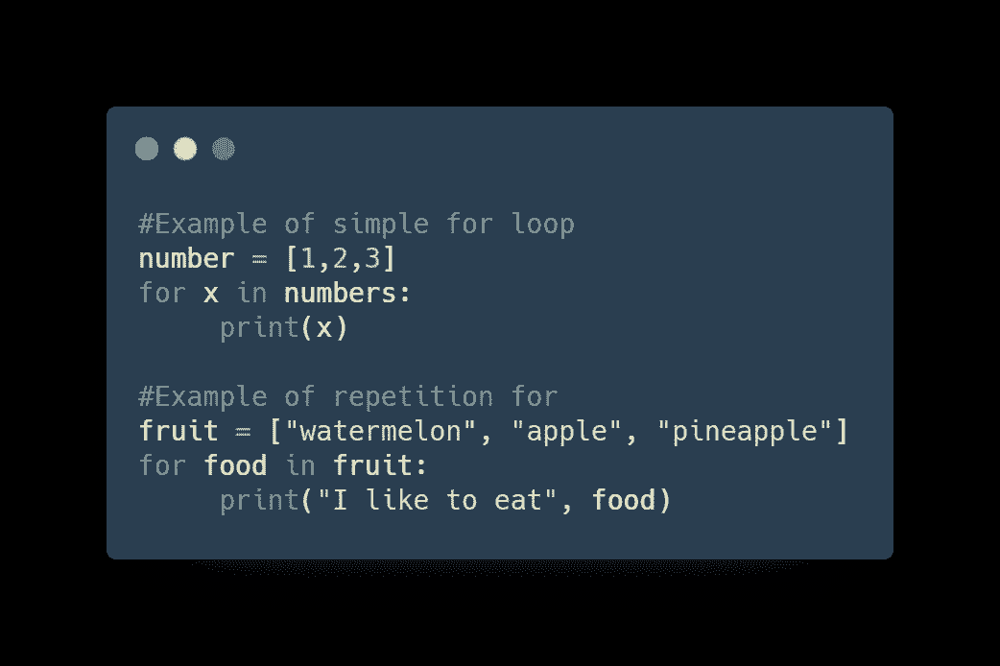

*   嵌套循环:Python 编程语言允许在一个循环中使用另一个循环。以下部分展示了一些例子来说明这个概念。

下面是一个使用嵌套循环的例子

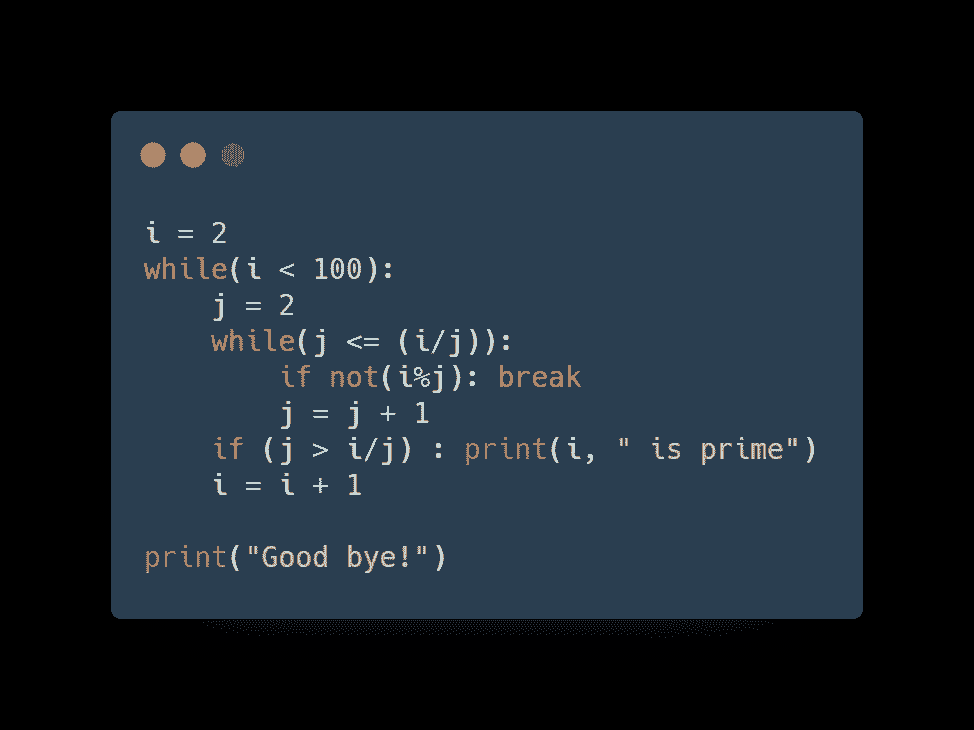

**4。列表:集合|数组|数据结构**

如何在一个变量中存储多个数据？答案是使用列表。List 是 python 中的一种数据结构，能够存储多种数据，比如数组。

*   **如何在 Python 中创建列表**

我们可以像常规变量一样创建一个列表，但是变量的值用方括号([])填充。示例:

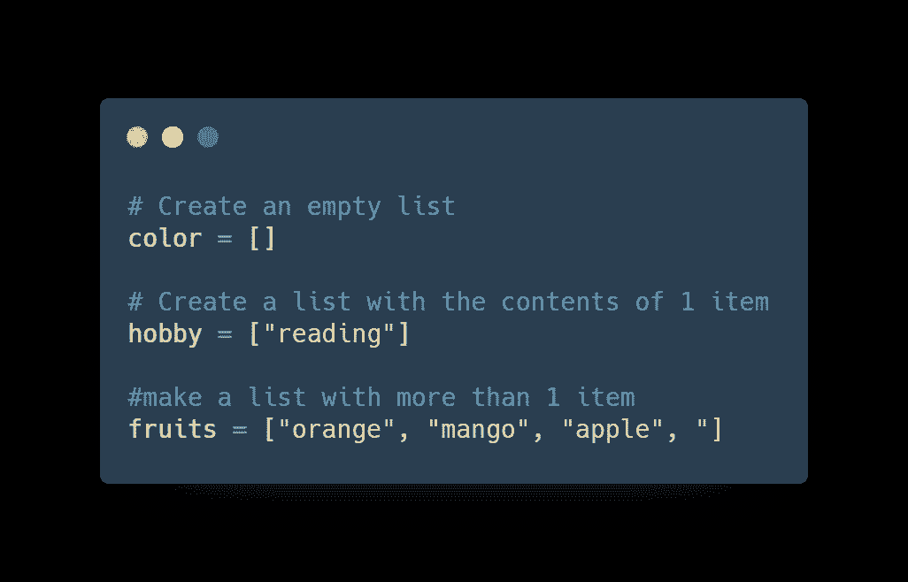

如果列表有多个内容，那么我们可以用逗号分隔。这只是一个基本的列表，然后我会在另一篇文章中更详细地解释这个列表。

**5。字典:键值数据结构**

Python 字典不同于列表或元组。因为每个序列都包含一个键和值。每个键用冒号(:)和它的值分开，项用逗号分开，所有项都用花括号括起来。一个没有条目的空字典，只写了两个花括号，像这样:{ }。

字典值可以是任何类型，但键必须是不可变的数据类型，如字符串、数字或元组。

**访问 Python 字典中的值**
要访问字典元素，可以使用熟悉的方括号和键来获取值。这里有一个简单的例子:

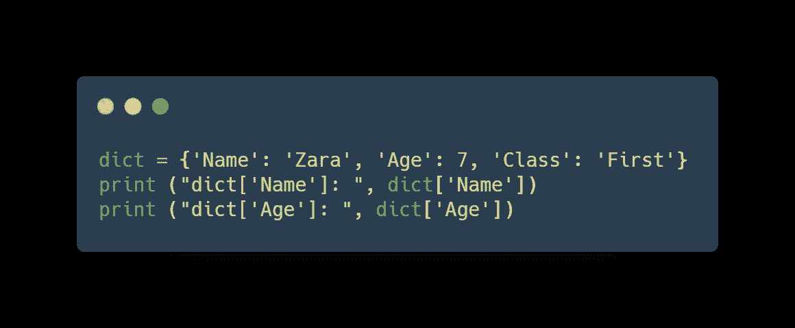

**更新 Python 中的值字典**

您可以通过添加新条目或键值对、修改现有条目或删除现有条目来更新字典，如下面给出的简单示例所示。

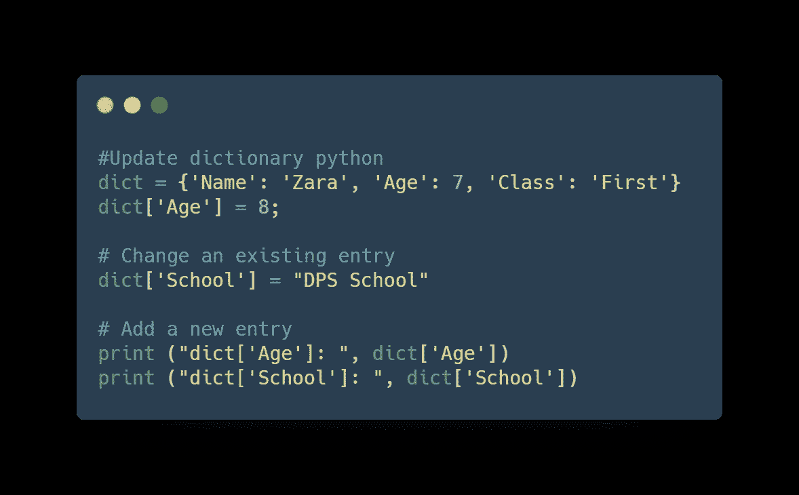

**移除 Python 字典元素**

您可以删除单个字典元素或删除字典的全部内容。您也可以在一次操作中删除整个词典。要显式删除整个字典，只需使用 del 语句。这里有一个简单的例子:

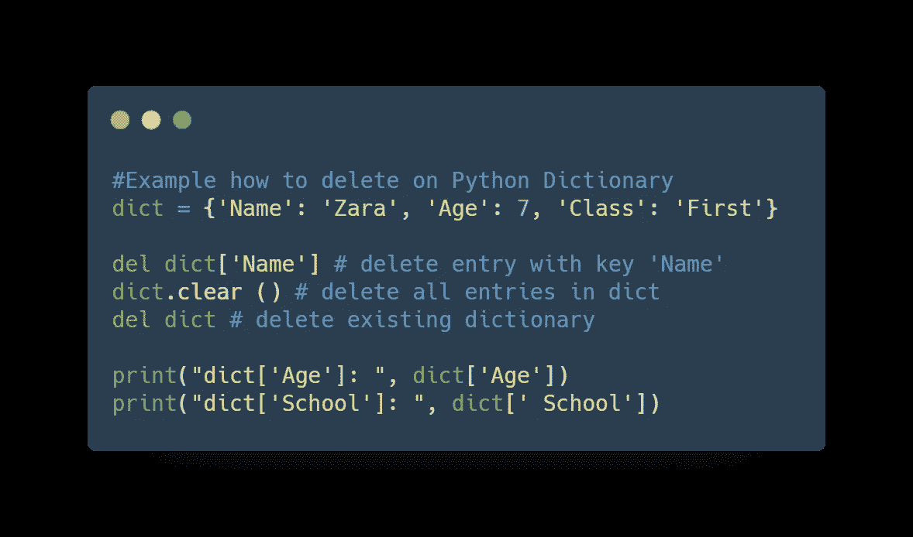

6。对象&类 Python

自从 Python 语言本身被创建以来，Python 一直是一种面向对象的语言。在 Python 中创建和使用类和对象非常容易。本教程将帮助您成为使用 Python 面向对象编程的专家。

如果你以前没有面向对象编程(OOP)的经验，你应该先学习它，这样你就能理解基本概念。

如果你已经理解了 OOP 的基本概念，这里有一个面向对象编程(OOP)的介绍来帮助你。

**OOP 中的术语**

*   **类**——一个用户定义的对象原型，它定义了一组表征该类中任何对象的属性。属性是数据成员(类变量和实例变量)和方法，通过点符号访问。
*   **类变量**——一个类的所有实例共享的变量。类变量定义在类中，但不在类的任何方法中。类变量不像实例变量那样经常使用。
*   **数据成员**——保存与类及其对象相关的数据的类变量或实例变量。
*   **功能重载**—将多个行为分配给特定功能。所执行的操作因涉及的对象或参数的类型而异。
*   **实例变量**——在方法内部定义的变量，只属于类的当前实例。
*   **继承**——将一个类的特征转移到从它派生的其他类。
*   **实例**——某一类的单个对象。例如，属于 Circle 类的对象 obj 是 Circle 类的一个实例。
*   **实例化**—创建一个类的实例。
*   **方法**——在类定义中定义的一种特殊函数。
*   **对象**——由其类定义的数据结构的唯一实例。一个对象包括数据成员(类变量和实例变量)和方法。
*   **操作符过载**—将多个功能分配给特定的操作符。

**创建 Python 类**

class 语句用于创建新的类定义。类名紧跟在关键字 class 之后，后跟一个冒号，如下所示。

`class ClassName:``'Optional class documentation string'`

下面是如何创建和使用类的示例:

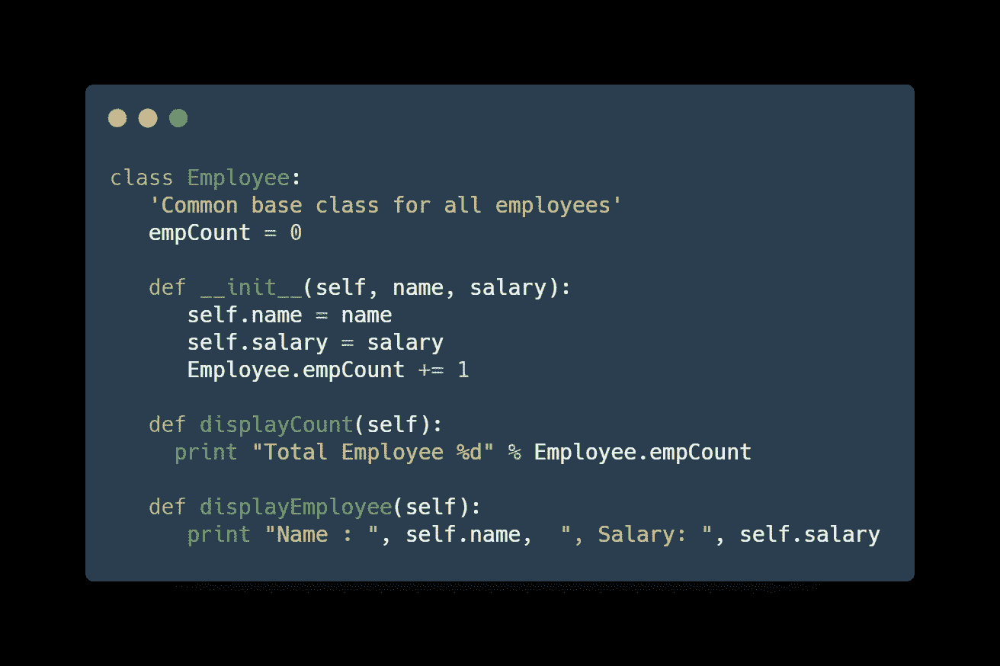

**创建实例对象**

要实例化一个类，可以使用类名调用该类，并传递 init 方法接受的任何参数。

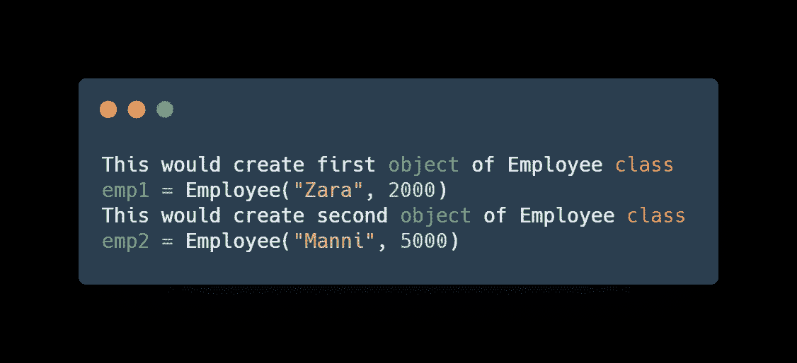

**访问属性**

您可以对对象使用点运算符来访问对象属性。将使用类名访问类变量，如下所示:

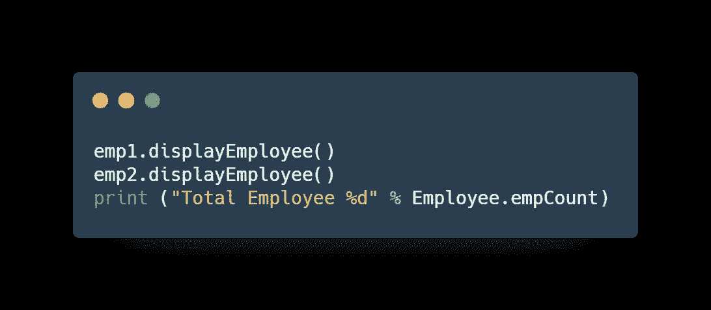

完整的例子，请看下面的代码。

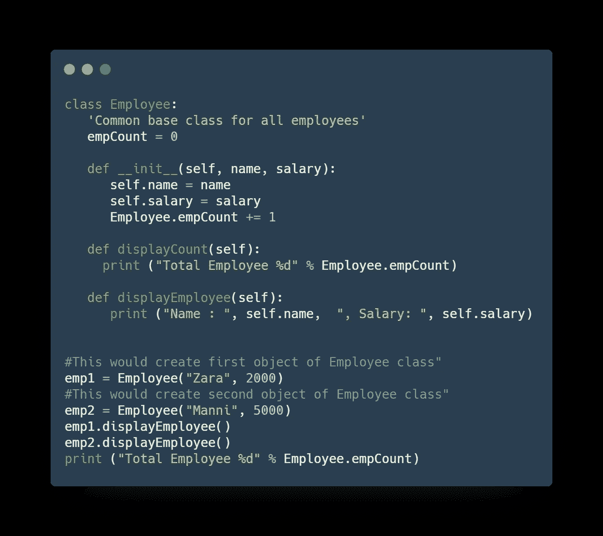

# 就是这样！

我们学到了很多关于 Python 基础的东西:

*   Python 变量的工作原理
*   Python 条件语句如何工作
*   Python 循环(while & for)如何工作
*   如何使用列表:集合|数组
*   字典键值集合
*   对象和类