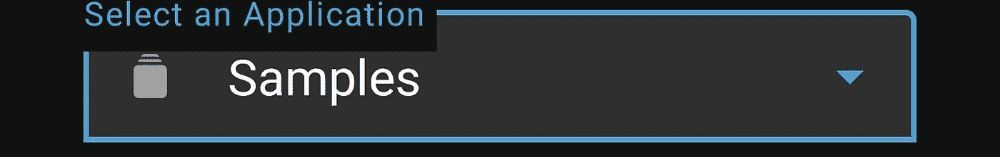
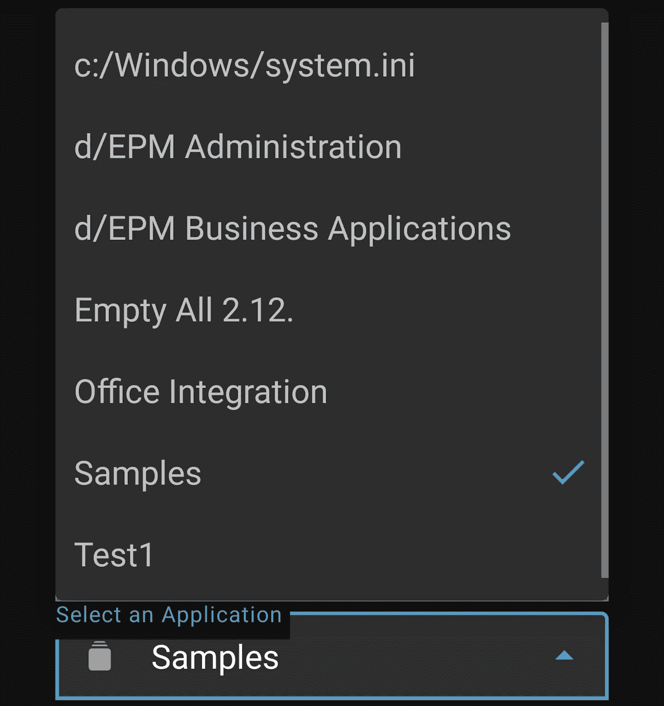
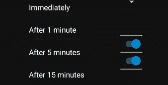

# Android 材质微调器(组合框)

> 原文：<https://medium.com/geekculture/material-spinner-combo-box-for-android-b400bf8ab9d?source=collection_archive---------2----------------------->

Photo by [Denny Müller](https://unsplash.com/@redaquamedia?utm_source=medium&utm_medium=referral) on [Unsplash](https://unsplash.com?utm_source=medium&utm_medium=referral)

当有必要在一个 Android 应用程序中实现一个组合框时，大多数开发人员可能认为这应该是小菜一碟。不幸的是，情况并非如此，正如我们在实现 Android 应用时遇到的许多其他问题一样。在这篇文章中，我将展示如何实现一个带有材质主题的自定义旋转器。结果可能如下所示(取决于您的样式、属性和项目布局):

# 术语

第一件有点令人惊讶的事情是没有组合框类。谷歌决定使用*微调器*关键字，而不是使用这个非常普通的术语。对于有编程桌面应用经验的人来说，这更加令人困惑，因为[微调器是一个选择数字](https://en.wikipedia.org/wiki/Spinner_(computing))的 UI 元素。

在最初的震惊之后，你可以认为*微调*类就可以了。在简单的应用程序中，外观并不重要，只有功能是必要的，这可能是一个快速有效的解决方案。然而，正如你在下面看到的，结果看起来并不太好。 *Spinner* 不遵循材料指南，没有定制空间。

Spinner doesn’t look so nice. Switches are shown below the Spinner and are not its part, but it is difficult to distinguish.

如果你检查材料设计网站，它提到了一个叫做“[暴露下拉菜单](https://www.material.io/components/menus/android#exposed-dropdown-menus)的东西，它使用了 *TextInputLayout* 和 *AutoCompleteTextView* ，让一切更加混乱。我认为这真的很奇怪，实现带有 Material 主题的 Spinner 的唯一官方方式是滥用一个其原始目的完全不同的组件。我从这篇优秀的文章中了解了这些组件，我认为作者的研究是值得的。它还展示了关于手动设置组件样式的一些细节。然而，我使用定制绑定适配器、双向数据绑定和选择跟踪，以不同的、可重用的方式实现了 Spinner。

# 材料旋转器

首先，让我们创建名为 *MaterialSpinner* 的新定制 UI 组件，它扩展了 *AutoCompleteTextView* 。该组件通过监视用户点击来自动跟踪当前所选项的位置，并通知注册的侦听器。稍后，我们还将创建一个自定义适配器，当选择发生变化时，它会自动得到通知。如果以编程方式更新了 *selectedPosition* ，组件会自动通知监听器并更新所选文本。最后，它还支持 *emptyText* XML 属性，如果适配器中没有条目，该属性将用作默认文本。

要启用自定义的 *emptyText* 属性，必须将其声明为 *styleable* 。

接下来，让我们创建一个定制的双向数据绑定适配器，以便能够自动更新所选项。它将根据给定的 *LiveData* 中的值更新所选项目，并在用户选择另一个项目时更新 *LiveData* 。实现双向数据绑定适配器需要三种方法:

*   更新视图的绑定适配器方法
*   反向绑定适配器方法，从视图中检索当前值
*   绑定适配器方法，该方法监听视图中的更改并通知给定的*inversebindinsigner*，以便数据绑定知道发生了更改，并应调用反向绑定适配器来检索当前值

# 材料旋转适配器

第二，我们需要一个定制的适配器，它可以被 *MaterialSpinner* 自动通知选择的改变，并调用*notifydatascethanged()*。它还实现了一些样板方法，即 *getFilter()* ，因为 *AutocompleteTextView* 要求适配器实现 *Filterable* ，即使我们不想要任何过滤。不幸的是，扩展类必须手动处理视图持有者模式(如下例所示)。

# 例子

现在我们所有的组件都准备好了。让我们来看一个如何使用它们的例子。

首先，我们扩展了 *MaterialSpinnerAdapter* 并实现了 *getView()* 方法。虽然 viewholder 模式已经内置在*recycle view*中，但是我们必须使用旧的方式，通过使用标签。对于最近开始 Android 开发并且没有使用*列表视图*经验的人来说，这可能是新的。使用 viewholder 模式对于重用*视图*和避免膨胀新的*视图*影响性能是必要的。

如果绑定对象还不存在( *convertView* 为空)，适配器会将其膨胀，并将其设置为*视图的*标签，以便以后可以访问。否则，它只是从标签中检索对象。最后，它用给定位置的项和该项是否被选中的信息更新绑定对象。绑定对象是从下面显示的 XML 布局中自动生成的。

我们还需要创建一个定制的绑定适配器，它将自动设置*ExampleSpinnerArrayAdapter*和给定的项目列表到 *MaterialSpinner* 。

Spinner 项目布局利用数据绑定方式更新 UI。在本例中，我们只是根据项目更新文本和启用状态。如果该项被选中，它旁边会显示一个标记图标( *isNotGone* 是一个自定义绑定适配器，如果为真，它只是使该项可见，否则就消失)。

最后，我们可以创建显示微调器的布局。正如你所看到的， *MaterialSpinner* 必须由 *TextInputLayout* 包装，它设置诸如提示、图标或框模式等属性。如果需要，可以随意设置这些属性。

为了传递数据，我们使用自定义项绑定适配器，以及 *selectedPosition* 双向数据绑定适配器，这样数据和 UI 都可以双向更新。请注意，等号必须跟在 at 符号后面才能启用双向绑定，即*" @ = { viewmodel . selecteditemposition } "*。*选择编辑位置的*类型应为*可变数据<整数>* 。

# 结论

在 Android 中实现一个好看的旋转器比想象中要困难得多。希望读完这篇文章后，一旦采用了可重用组件，它会更容易理解，实现也会更容易。