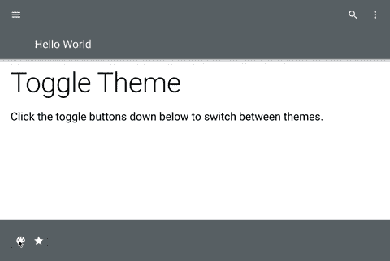

# 材质 UI:使用 React 钩子创建一个自定义的切换主题

> 原文：<https://medium.com/geekculture/material-ui-custom-toggle-theme-using-react-hooks-59a23183a2d9?source=collection_archive---------6----------------------->

我们将使用[材质 UI](https://material-ui.com/) 和 [React 钩子](https://reactjs.org/docs/hooks-intro.html)创建一个自定义的切换主题，该主题保存在本地存储//链接到[源代码](https://github.com/camitta/toggle-theme)



# **简介**

如今，许多网站都提供黑暗模式。鉴于它在 iOS 和大量基本应用程序中无处不在，许多用户现在都认为在明暗模式之间滑动的功能是理所当然的。但是“粉彩糖果”模式在哪里？或者“荧光赛博朋克”模式呢？不要误解我的意思，如果你和我一样，连续几个小时盯着屏幕，黑暗模式是缓解眼睛疲劳的好方法(至少谷歌是这么说的)。然而，作为一个也从异想天开的配色方案中获得前所未有的快乐的人，缺乏选择让人感到压抑。如果有其他可供选择的颜色主题，那该有多好？


Photo by [Sarah Kilian](https://unsplash.com/@rojekilian?utm_source=medium&utm_medium=referral) on [Unsplash](https://unsplash.com?utm_source=medium&utm_medium=referral)

# **从错误中学习**

最近，我加入了一个团队，使用名为 [*议程*](https://your-agenda.herokuapp.com/) 的 [React](https://reactjs.org/) 开发了一个最小协作任务管理工具。我和我的团队顺利地完成了开发过程，达到了我们的 MVP(最小可行产品)目标，这符合我们需要的应用程序基本功能的所有条件。一旦我们达到我们的 MVP，我就开始了我对颜色主题的探索，并开始实现一个定制的切换主题。我很快意识到，我们在组件中使用 Google 的材料 UI 样式覆盖的方式，加上定制的默认样式，造成了切换的严重问题。在一次大的重构之后，我决定在 Material UI 中实现定制的最佳方式是:

1.)使用材质 UI 的[*createmiutheme()*](https://material-ui.com/customization/theming/#createmuitheme-options-args-theme)创建一个主题，并用自定义主题覆盖 [*调色板*](https://material-ui.com/system/palette/#main-content) 对象

2.)在组件端，使用 [*makeStyles()*](https://material-ui.com/styles/api/#makestyles-styles-options-hook) 将主题中的颜色分配给所需的组件

3.)将创建的类名分配给相应的 HTML 元素

有很多方法可以实现自定义的切换主题，根据你的使用情况，你可能想要寻找其他的材料 UI，比如[风格的组件](https://css-tricks.com/a-dark-mode-toggle-with-react-and-themeprovider/)或者仅仅坚持使用可信的 CSS。在*议程*的案例中，我们选择了 Material UI，因为它是专门为 React 构建的，提供了像手套一样适合我们项目的现成组件。

下面我将向你展示我是如何使用材质 UI 在 React 中加入一个自定义的切换主题，同时管理本地存储中的状态。


Photo by [Harpal Singh](https://unsplash.com/@aquatium?utm_source=medium&utm_medium=referral) on [Unsplash](https://unsplash.com?utm_source=medium&utm_medium=referral)

# **但是首先……什么是材质 UI？**

Material UI 是 React 的一个组件库，它使用了开箱后看起来很棒的功能性组件。此外，它还提供工具来轻松定制这些组件，以满足您的需求。最重要的是，Material UI 支持基本的明暗模式，并使两者之间的切换变得轻而易举。

# **还有钩子？**

钩子是 React 16.8 中的新增功能。它们允许您实现状态和其他 React 特性，而不必写出一个类。我使用了[效果钩子](https://reactjs.org/docs/hooks-effect.html)，它允许你在**函数组件**(以前称为“无状态组件”)中执行副作用。这将允许主题在组件不需要重新渲染的情况下切换。

功能组件看起来像这样:

```
*const Example = (props) => {**// You can use Hooks here!**return <div />;**}*
```

或者这个:

```
*function Example(props) {**// You can use Hooks here!**return <div />;**}*
```

如果你不熟悉什么是副作用，你可以把它等同于*组件卸载*、*组件更新*和*组件卸载*的组合。如果你想了解更多关于钩子的细节，这里的**是官方文档的链接。**

# **让我们开始吧**

**如果你想直接跳到 GitHub 源代码，点击[这里](https://github.com/camitta/toggle-theme)。否则，让我们从使用 [Create React app](https://create-react-app.dev/) 设置 React App 开始。我们称这个项目为*切换主题*:**

```
*npx create-react-app toggle-theme**cd toggle-theme*
```

**安装[材质 UI](https://material-ui.com/) 和[材质图标](https://material-ui.com/components/material-icons/):**

```
*npm install @material-ui/core* *@material-ui/icons*
```

**Create React App 是一个优秀的样板文件，允许你在没有构建配置的情况下创建一个应用。由于本文的主要焦点是如何实现自定义切换，我将在文件 *App.js* 中模拟一个简单的主页，带有页眉、页脚、一些文本和几个切换主题的按钮。**

# **自定义主题**

**接下来，我们将使用材质 UI 的*createmiutheme()*创建一个自定义主题。下面是一个“彩色糖果”主题，此外，将有一个“正常”主题和一个“荧光”主题。随意定制你喜欢的。我建议看看[酷派](https://coolors.co/)的漂亮配色 inspo。**

**回到 *App.js* ，在组件端，我们将使用 [*makeStyles()*](https://material-ui.com/styles/api/#makestyles-styles-options-hook) 将我们刚刚创建的自定义主题中的颜色分配给想要的组件。为此，我们将使用 [*className*](https://material-ui.com/customization/components/) 属性覆盖材质 UI 的默认样式。Material UI 为每个组件提供了一个 *className* 属性。**

# **坚持就地储存**

**为了将状态保存到 localStorage，我们需要创建一个自定义主题提供程序，它将当前状态更改为自定义主题，并将其传递给所有子元素。**

**最后，但同样重要的是，我们将需要向切换按钮添加一个事件处理程序，它将在默认主题、*普通主题和我们的自定义主题之间切换主题。***

# ****结论****

**访问 GitHub 上的[源代码](https://github.com/camitta/toggle-theme),并根据自己的意愿自由定制。此外，你可以在这里查看议程的构建版本，这个项目激发了我写这篇文章的灵感。希望这篇教程对你有帮助！**

**如果你喜欢这篇文章，别忘了留下👏。你可以发送多达 50 个👏**

***在*[*LinkedIn*](https://www.linkedin.com/in/allyson-camitta/)上和我联系**