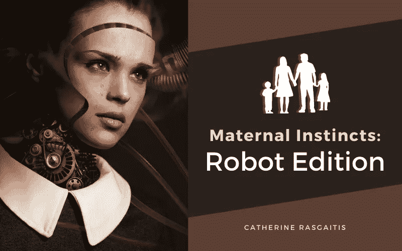

# 母性本能:机器人版

> 原文：<https://medium.com/geekculture/maternal-instincts-robot-edition-9efbf504c531?source=collection_archive---------13----------------------->

## “机器人索菲亚”想要个孩子

photo by [Comfreak](https://pixabay.com/users/comfreak-51581/), courtesy of [Pixabay](https://pixabay.com/photos/robot-woman-face-cry-sad-3010309/)

“机器人索菲亚”对于聚光灯来说并不陌生。2016 年，她在 SXSW(西南偏南艺术节)上的首次公开亮相席卷了机器人界。

当时，索菲娅的对话技巧相当初级，虽然仍然令人印象深刻，但它们很容易被她神秘的人形外表所掩盖。