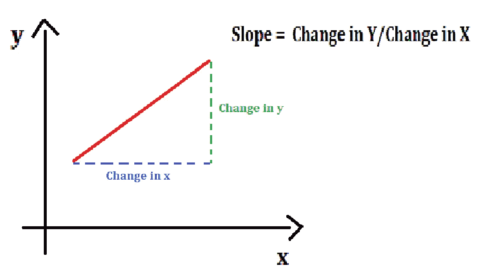
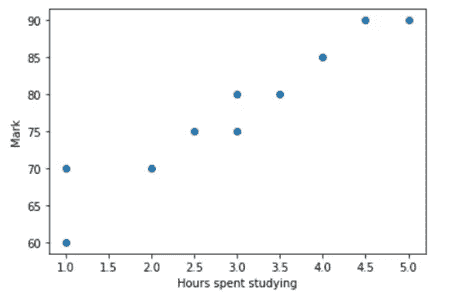
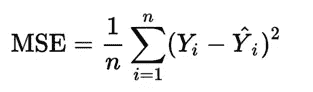
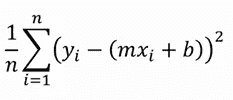
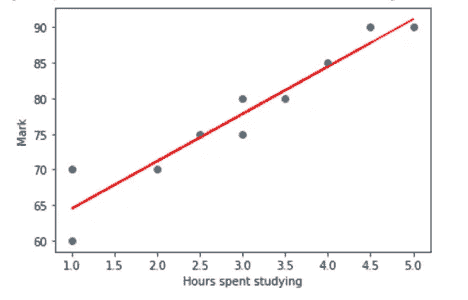
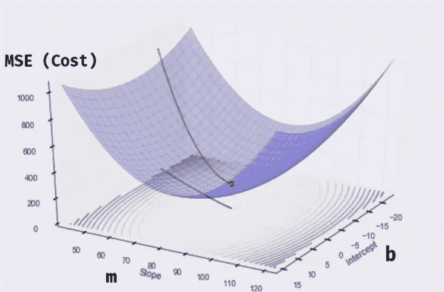
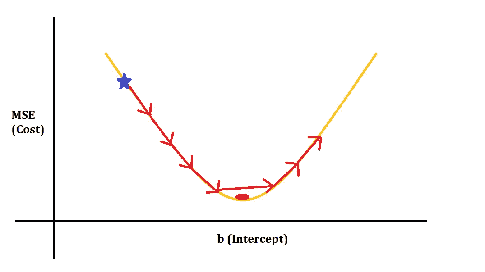
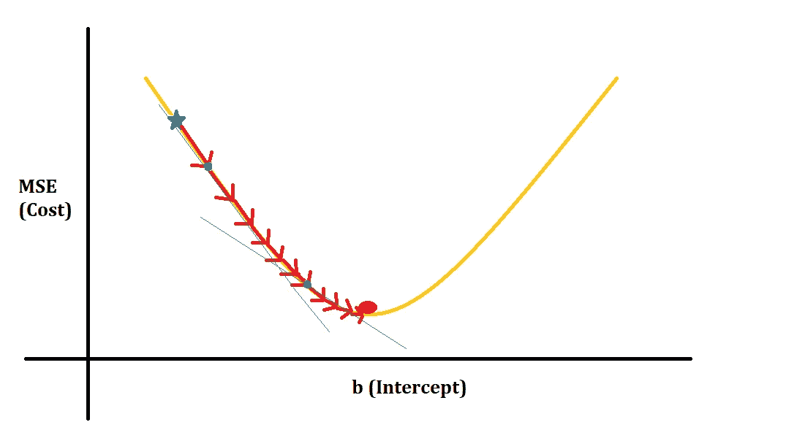
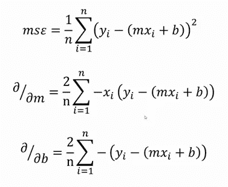

# 梯度下降背后的数学

> 原文：<https://medium.com/geekculture/mathematics-behind-gradient-descent-f2a49a0b714f?source=collection_archive---------2----------------------->

了解梯度下降算法在机器学习中的工作原理。

Photo by [Ales Krivec](https://unsplash.com/@aleskrivec?utm_source=medium&utm_medium=referral) on [Unsplash](https://unsplash.com?utm_source=medium&utm_medium=referral)

如果你是一个机器学习爱好者，你可能会遇到梯度下降算法这个术语，甚至在你的一些模型中使用过它。你会知道这是一个优化算法，并且会使用 sklearn 库来应用它。但是你真的知道引擎盖下发生了什么吗？

本文将讨论梯度下降算法背后的数学直觉，它的各种类型以及如何在机器学习中使用它。

## 简介:

梯度下降是一种优化算法，用于寻找函数(线性回归、逻辑回归等)的参数值。)用于降低成本函数。简单来说，它可以帮助我们找到最合适的线。它是怎么做到的？在深入讨论之前，我们必须知道一些术语的含义。

*   ***衍生物***

为了理解什么是导数，我们必须知道什么是斜率。斜率定义为直线上任意两点之间的垂直变化与水平变化之比(斜率=δy/δx)。它既用来描述方向，也用来描述线有多陡。

Source: Image by author

现在我们知道了，给定直线上的两点，如何求出直线的斜率。但是如何求直线上给定点的斜率呢？这里没什么好衡量的。这就是衍生产品出现的地方。对于导数，我们使用一个小的差值，然后让它缩小到零！

设函数为 f(x ),为了求出这个函数的导数，我们使用斜率公式。x 从 x 变为 x+δx，y 从 f(x)变为 f(x+δx)。然后我们把方程简化后让δx 向零收缩。这样我们就得到了直线上一点的导数。

Source: Image by author

例如，设函数 f(x) = x

然后，为了找到导数或斜率，我们遵循以下步骤:

1.  f(x) = x 和 f(x+δx)=(x+δx)= x+2xδx+(δx)
2.  斜率公式为(f(x+δx)-f(x))/δx
3.  代入斜率方程中第 1 点的方程，斜率公式变为(x+2xδx+(δx)-x)/δx
4.  简化第 3 点中的等式后，我们得到 2x+δx
5.  然后，随着δx 向 0 收缩，斜率= 2x

这样，我们就可以求出曲线上任意一点的导数或斜率。我们在寻找导数的时候，也有一定的规则要遵循。你可以在[这里](https://www.mathsisfun.com/calculus/derivatives-rules.html)的链接上读到它。

*   ***偏导数:***

在数学中，偏导数的定义是“*通过保持其他变量不变来求一个多变量函数相对于一个单变量的导数*”。简单来说，如果一个函数有两个或两个以上的变量，我们通过保持一些变量不变来求导数。

例如，如果函数 f(x) = x + y，那么 f(x)对 x 的偏导数将是 2x + 0(因为 y 是常数)。而 f(x)对 y 的偏导数将是 0 + 2y(因为 y 是常数)。也就是说，

如果 f(x) = x + y，那么，f'ₓ = 2x，f'ᵧ = 2y

偏导数有时也表示为∂.

*   ***成本函数***

让我借助线性回归来解释这一点。为了简单起见，让我们这样来考虑这个问题:我们必须找出一个学生学习了多少小时的分数。当我们为一个虚构的数据集绘制这个图时，我们会得到一个散点图，看起来像这样:

Source: Image by author

我们可以有很多条线来连接这些数据点，但我们需要一条最合适的线。为了找到最佳拟合，我们引入了一个称为成本函数的术语，它就是误差函数。对于每个数据点，我们通过减去实际值和预测值来找到误差，然后对该差值求平方(因此结果不会偏斜，因为该差值也可以是负值)。然后将这些结果加在一起，我们得到最常用的成本函数，*均方误差* (MSE)。寻找它的公式如下:

Mean Squared Error

这里，第一个 y 项代表实际的 y 值，第二个 y 项代表预测的 y 值。预测的 y 由公式 y = mx + b 计算得出，其中 m 是直线的斜率，b 是截距。因此，均方差现在变为:

Mean Squared Error

一旦我们找到给出最小成本函数的线，这将是这个问题的最佳拟合线。

Source: Image by author

## 梯度下降是如何工作的？

既然现在我们知道什么是导数，偏导数和成本函数，我们现在可以学习梯度下降的概念。

梯度下降是一种一阶迭代优化算法，用于寻找可微函数的局部/全局最小值。我们知道，我们必须找到一条成本最低的线，这可以通过梯度下降来实现。但是这是怎么发生的呢？

Source: [Gradient Descent](https://www.infinitycodex.in/data-science-ss-106gradient-descent-and)

为此，我们将首先绘制系数、斜率(m)和截距(b)以及 MSE(成本)之间的 3d 图，如上所示。由于梯度下降算法是一种迭代方法，我们首先随机取 m 和 b 的值，然后改变它，使得成本函数变得越来越小，直到我们达到局部/全局最小值。

1.  首先，让 m = 0 和 b = 0，对于这些，我们得到一个更高的 MSE 值(根据上面的图，该值大约为 1000)。
2.  然后，我们采取一个步骤(这里的步骤指的是系数 m 和 b 的变化)来减小 m 和 b 的值，使得 MSE 减小(大约 900)。这个步骤反复进行，直到我们达到局部/全局最小值。
3.  一旦我们达到局部/全局最小值，我们可以在我们的预测函数中使用 m 和 b 的这个值(y = mx + c)。

现在我们来看看 m 和 b 的值是如何变化的，这样我们每一步得到的 MSE 就变小了。为此，让我们画出 MSE 和截距(b)的曲线图。

Source: Image by author

在上面我画的图中，蓝色的星是 MSE 的起点(值),红色的点是函数的局部/全局最小值。我们必须从蓝星到达红点，为此，我们首先尝试采取固定的步骤。但是正如我们在上面看到的，这种方法并不总是导致达到最小值，因此是无效的，因为梯度下降可能永远不会收敛。因此，我们可以采用另一种方法，每次缩小步长，如下图所示。

Source: Image by author

从上图中我们可以看出，每次我们走一步，步长就不断减小，因此最终梯度下降收敛到局部/全局最小值。但现在的问题是，我们如何采取措施缩小尺寸？

为此，我们必须找到每个点的斜率(或切线),这样我们就知道该往哪个方向走。这个斜率只不过是那个特定点的导数。因此，由于有两个值，斜率(m)和截距(b)，我们必须找到 MSE(成本)相对于 m 和 b 的偏导数。我们已经在上述部分中了解了如何找到偏导数，因此最终结果如下:

Partial derivatives of MSE

除此之外，我们还有另一个称为学习率的参数，它决定了我们采取的步长。

***学习率(*【α】*:***

学习参数(α)是一个超参数，负责确定步长，即系数可以改变多少。通常，用户将设置梯度下降算法的学习速率，并且该速率将在整个算法中保持不变。学习率的最佳值将导致在更少的步骤内更快的收敛。如果这个速率高于最优值，那么算法将发现很难收敛到局部/全局最小值，并且成本倾向于随时间增加。如果值太低，即使收敛到极小值，也要花很多时间。因此有必要找到学习率的最优值。学习率对收敛的影响如下图所示。

Source: [Effect of learning rates on convergence](https://cs231n.github.io/neural-networks-3/)

一旦我们计算了导数并决定了学习速率，我们的下一步就是使用这两个值来改变系数 m 和 b。这是通过以下公式完成的:

*   m = m —学习率* ∂/∂m = m — α * ∂/∂m
*   b = b—学习率* ∂/∂b = b — α * ∂/∂b

## 概观

我们已经涵盖了与梯度下降如何工作相关的所有必要概念。让我们来看一下梯度下降算法的步骤。

***第一步*** :取系数 m 和 b 的一些随机值，计算 MSE(代价函数)。

***第二步:*** 计算 MSE 关于 m 和 b 的偏导数

***第三步:*** 为学习率设定一个值。并使用以下公式计算 m 和 b 的变化。

*   m = m —学习率* ∂/∂m = m — α * ∂/∂m
*   b = b —学习率* ∂/∂b = b — α * ∂/∂b

***第四步:*** 用 m 和 b 的这些值计算新的 MSE。

***第五步:*** 重复第二、三、四步，直到 m 和 b 的变化没有显著降低 MSE(成本)为止。

## 梯度下降的类型

上面讨论的梯度下降算法有三种变体。让我告诉你这两者之间的主要区别。

*   **批量梯度下降:**

假设数据集中有“n”个观察值。使用所有这些“n”个观察值来更新系数值 m 和 b 被称为批量梯度下降。它要求整个数据集在内存中可供算法使用。

*   **随机梯度下降(SGD):**

相比之下，SGD 为数据集中的每个观察值更新 m 和 b 的值。这些系数的频繁更新提供了良好的改善率。然而，它们在计算上比批量梯度下降更昂贵。

*   **小批量梯度下降:**

小批量梯度下降是 SGD 和批量梯度下降的结合。它将数据集分成批次，在每个批次结束时更新系数。

## 结论

在这篇文章的结尾，你会学到梯度下降算法背后的数学直觉，以及它在机器学习中是如何工作的。你也会学到算法的三种变体。

我希望它增加了你对梯度下降的理解，让你对引擎盖后面发生的事情有一个清晰的了解。

感谢您的阅读，如果您觉得这篇文章有用，请分享！