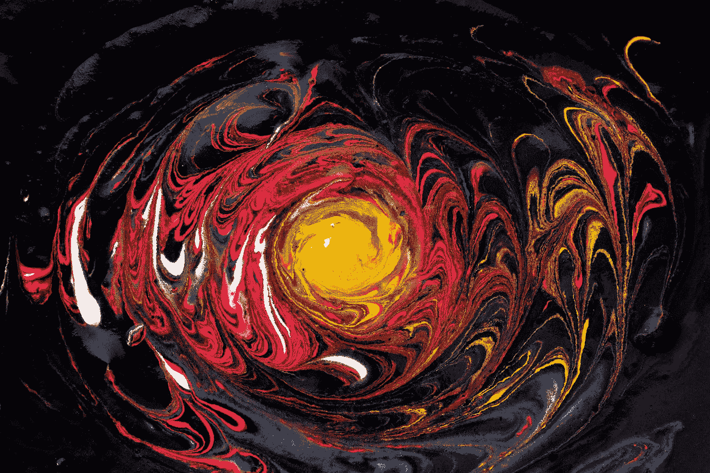

# 价值 250，000，000 美元的硬币首次在区块链融合

> 原文：<https://medium.com/geekculture/matic-coins-worth-250-000-000-seal-first-blockchain-fusion-ce56903dea6d?source=collection_archive---------22----------------------->

Photo by [Daniele Levis Pelusi](https://unsplash.com/@yogidan2012?utm_source=medium&utm_medium=referral) on [Unsplash](https://unsplash.com?utm_source=medium&utm_medium=referral)

多边形和 Matic 硬币继续取得进展。现在，两家区块链的首次全面合并预计将扩大蓬勃发展的第二层协议生态系统，因为 Matic 课程继续其价格上涨。

现在有许多未来潜力很大的加密项目。然而，有更多的项目来保持你的距离…