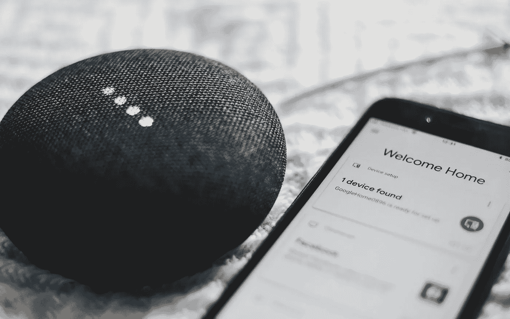

# 终于发布了 Matter 1.0

> 原文：<https://medium.com/geekculture/matter-1-0-available-at-long-last-4784f153a819?source=collection_archive---------1----------------------->

## 期待已久的智能家居无线连接互操作新标准正式发布，现在呢？

After many months of finalizing specs and putting together certification tests, the Connectivity Standards Alliance deems Matter ready for release. Now the actual work begins. (Image: Bence Boros, Unsplash)

距离它上一次亮相已经过去了十个多月——事实上是在 1 月初的 CES 2022 期间——但等待终于结束了:Matter，承诺修复破碎生态系统的标准…