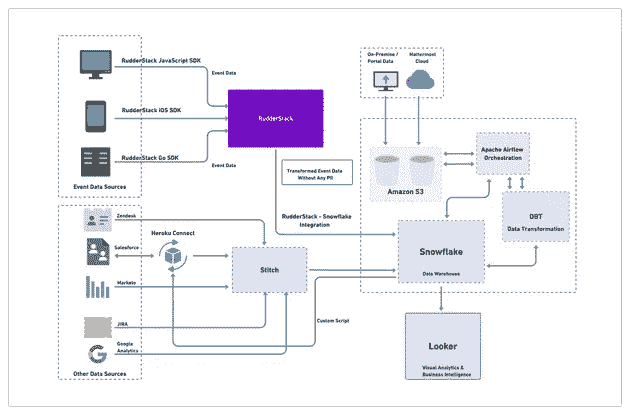

# Mattermost 的数据堆栈解释了:他们如何利用无限的数据进行客户分析

> 原文：<https://medium.com/geekculture/mattermosts-data-stack-explained-how-they-leverage-unlimited-data-for-customer-analytics-33a59f3f4569?source=collection_archive---------38----------------------->

# 概观

这篇文章着眼于 **Mattermost** 的客户数据堆栈，该堆栈允许他们无缝利用多个来源的无限实时数据来推动各种分析用例。我们还研究了该数据堆栈如何符合他们的开源价值观，并符合他们严格的数据隐私和安全要求。

# Mattermost 是谁？

**Mattermost** 是一个开源的消息传递和协作平台，是像 **Slack** 这样的企业业务通信工具的流行替代品。它是为高信任环境而构建的，部署是完全自托管的，并将所有企业范围内的通信集中到一个地方。

正如您对开源工具的期望，它们提供了数百个第三方集成，并连接到流行的 DevOps 和开发人员工作流工具。

# Mattermost 如何使用实时客户数据

Mattermost 是一家高度数据驱动的公司。Mattermost 数据工程主管 Alex Dovenmuehle 表示，跟踪和收集实时事件数据的关键用例之一是执行有效的客户旅程映射。

Alex 说，实时事件使 Mattermost 的团队能够更好地了解客户如何浏览产品以及如何使用产品。然后，这些见解被用来细分他们的受众并建立用户群。他们还对各种与产品相关的功能进行 A/B 测试，并衡量它们对转化率和客户保留率的总体影响。

对于他们的内部用例，Mattermost 团队广泛使用数据模型、可视化仪表板和报告来跟踪他们的性能和整体业务健康的各个方面。这包括财务预测、跟踪他们的 KPI 和关键产品使用指标。

# Mattermost 的数据堆栈:概述

*   云— **AWS**
*   数据收集和同步— [**方向舵堆栈**](http://www.rudderstack.com)**SDK、缝合数据、Heroku 连接、自定义脚本**
*   仓库:**雪花**
*   数据转换和丰富:**舵栈转换，DBT**
*   BI 和数据查询工具集: **Looker**
*   作业编排:**阿帕奇气流**

# 数据如何流经 Mattermost 的数据堆栈

以下是数据如何流经 Mattermost 的客户数据堆栈:

*   Mattermost 利用**ruder stack**的 [web](https://docs.rudderstack.com/rudderstack-sdk-integration-guides/rudderstack-javascript-sdk) 、 [mobile](https://docs.rudderstack.com/rudderstack-sdk-integration-guides/rudderstack-ios-sdk) 和[server](https://docs.rudderstack.com/rudderstack-sdk-integration-guides/rudderstack-go-sdk)SDK 来实时收集用户事件，并将其路由到他们的数据存储基础设施。对于路由，他们利用 RudderStack 的数据仓库 **Snowflake** 的集成。
*   一旦所有数据都被转储到仓库中，他们就使用 **Apache Airflow** 进行作业编排和调度。对于数据丰富和转换，他们利用 **DBT** 将各种来源的所有原始数据转换为聚合数据流。
*   对于业务分析和 BI 用例，Mattermost 使用 **Looker** 在 DBT 数据模型之上构建可视化仪表板和报告。

这是 Mattermost 数据堆栈的可视化:

**Mattermost’s Customer Data Stack (Click to open in a new tab)**

# 数据收集和存储

Mattermost 收集的大量数据来自用户事件，这些事件驱动着他们的大部分分析和其他下游用例。为了从他们的网络和移动应用程序中实时收集这些事件，他们分别使用 RudderStack 的 [JavaScript](https://docs.rudderstack.com/rudderstack-sdk-integration-guides/rudderstack-javascript-sdk) 和[iOS](https://docs.rudderstack.com/rudderstack-sdk-integration-guides/rudderstack-ios-sdk)SDK。对于服务器端事件，他们使用 [Go](https://docs.rudderstack.com/rudderstack-sdk-integration-guides/rudderstack-go-sdk) SDK。

Alex 指出，有了 RudderStack，Mattermost 克服了活动量限制，这是他们与上一家供应商合作时面临的问题。由于供应商的定价模式，他们只能捕获 2%的用户事件数据，这意味着错过了有价值的客户洞察。通过 RudderStack，Mattermost 收集了 100%的活动数据，为他们提供了对客户旅程的丰富见解。

像他们高度信任的客户一样，Mattermost 非常注重数据隐私和安全。因此，所有由 RudderStack 跟踪的事件在被发送到数据仓库之前都被剥离了任何 **PII** ( **个人身份信息**)。他们通过 RudderStack 的转换功能简化了这个清理过程，该功能允许他们去除敏感信息(姓名、电子邮件等)。)在事件流传输中。

> *了解如何使用 RudderStack 转换来* [*保护事件数据中的 PII*](https://rudderstack.com/blog/protect-personally-identifiable-information-pii-using-rudderstack/) *。*

# 其他数据来源

除了客户活动数据之外，Mattermost 还从各种其他来源收集数据，这些来源与营销信息( **Marketo** )、网站指标( **Google Analytics** )、客户支持活动( **Zendesk** )以及各种项目管理组件( **JIRA** )有关，供其内部使用。来自他们内部和云解决方案的数据进入**亚马逊 S3** ，然后进入数据仓库。

为了存储和处理他们的 Salesforce 数据，Mattermost 使用了 **Heroku Connect** —一种流行的数据集成和同步服务。Mattermost 通过 Heroku Connect 将所有销售数据发送到他们的数据仓库，并通过自定义脚本将处理和丰富的数据同步回 Salesforce。通过这种方式，他们的销售团队总能获得关于客户和用户的最新信息。

Mattermost 使用 **Stitch** ，一个流行的 ETL 解决方案，从所有这些云资源中收集数据，然后将其转储到他们的数据仓库中。

# 数据仓储、编排和丰富

为了处理多个高容量数据工作负载，Mattermost 使用**雪花**作为他们的数据仓库。Snowflake 允许他们在其定价结构中将存储与计算使用分离，而不是像 **Redshift** 这样将两者捆绑在一起的其他替代方案。Alex 指出，根据不同团队的需求灵活扩展计算使用是管理其堆栈和基础架构成本的关键。

对于作业调度和编排，Mattermost 使用 **Apache Airflow 的**功能来动态实例化管道。Alex 也很欣赏 Airflow 的集成、及时报警、记录和监控机制。

最后，Mattermost 使用 **DBT** (数据构建工具)来转换和丰富雪花中的数据。Alex 和他的团队利用 DBT 来定义数据源并测试其转换的结果。他们还使用 DBT 的模块化 SQL 查询，可以快速轻松地更新和执行。

# 激活尖端分析的数据

当谈到利用数据模型进行商业智能和可视化时，Mattermost 在 DBT 模型的基础上使用了 **Looker** 。这种将数据建模与数据可视化分离的方法允许他们隐藏数据模型中的任何复杂性。它还使用户可以轻松访问数据，以便快速浏览、控制面板和报告。

此外，由于 DBT 数据模型包含聚合数据，所以 Looker 视图是全面的、丰富的和准确的。这使得他们的团队能够将数据之间的微小联系联系起来，这通常不会被注意到，而这往往是他们发现最有力见解的地方。

除了能够在 Looker 的仪表板之外导入或导出可视化效果，Mattermost 中的团队还可以使用自定义 webhooks 来构建第三方可视化工作流，从而无需使用任何其他外部应用程序。

# 最后

根据 Alex 的说法，构建 Mattermost 数据堆栈背后的主要驱动力是设计一个基础架构，可以将所有数据集中在一个地方，并辅以一些工具，使用户可以在不涉及不必要的技术复杂性的情况下对数据进行操作。

今天，Alex 已经帮助 Mattermost 建立了一个强大的客户数据堆栈，使他们能够获得客户旅程的端到端视图。他们还可以将这种观点转化为有用的见解，以构建改善用户体验的产品，从而促进他们的业务。

# 今天试试方向舵堆栈

开始构建更智能的客户数据管道。使用你所有的客户数据。回答更难的问题。向您的整个客户数据堆栈发送见解。今天就报名参加[舵栈云免费](https://app.rudderlabs.com/signup?type=freetrial)。

加入我们的 [Slack](https://resources.rudderstack.com/join-rudderstack-slack) 与我们的团队聊天，查看我们在 [GitHub](https://github.com/rudderlabs) 上的开源报告，订阅[我们的博客](https://rudderstack.com/blog/)，在社交上关注我们: [Twitter](https://twitter.com/RudderStack) 、 [LinkedIn](https://www.linkedin.com/company/rudderlabs/) 、 [dev.to](https://dev.to/rudderstack) 、 [Medium](https://rudderstack.medium.com/) 、 [YouTube](https://www.youtube.com/channel/UCgV-B77bV_-LOmKYHw8jvBw) 。不要错过任何更新。[立即订阅](https://rudderstack.com/blog/)我们的博客！

*原载于 https://rudderstack.com***。**