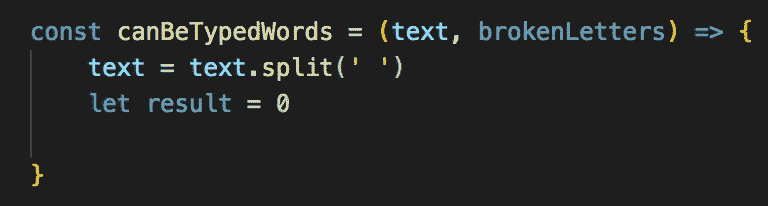
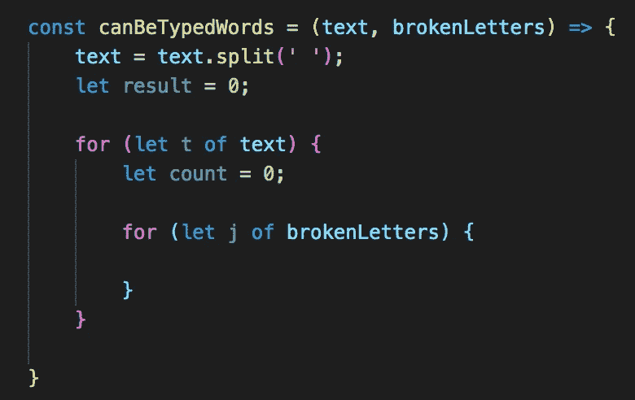
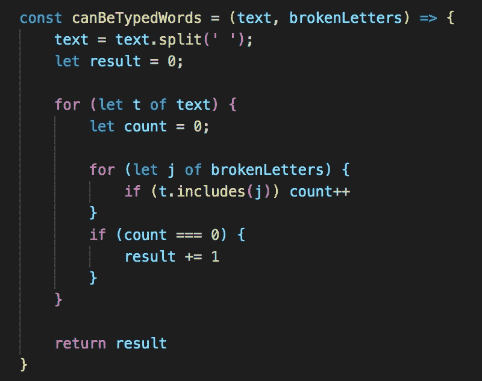

# 可以键入的最大字数:使用 Includes 方法

> 原文：<https://medium.com/geekculture/max-number-of-words-you-can-type-using-the-includes-method-38d0cef037b3?source=collection_archive---------14----------------------->

## 如何使用 includes 方法解决这个有趣的算法问题的演练

其中一些算法问题可能非常有趣。

这一台也没什么不同——想象一下你不得不使用一台键盘坏掉的电脑。那会很不方便，不是吗？

这正是我们现在面临的问题。在这个有趣(但令人沮丧)的世界里，我们必须用一个坏掉的键盘工作，并确定我们能或不能键入哪些单词。

Such a useful keyboard

老实说，我对这个问题的答案是扔掉键盘，去买一个新的:)

但不幸的是，这不是一个可以接受的答案。所以我们现在面临这种困境。问题陈述如下:

*键盘出现故障，一些字母键不起作用。键盘上的所有其它键都工作正常。*

*给定一串由单个空格分隔的* `*text*` *单词(无前导空格或尾随空格)和一串由所有* ***不同的*** *字母键组成的* ***单词数*** *中的* `*text*` *你可以完全使用这个键盘打字。*

*注:此问题在 Leetcode 上，问题# 1935。问题链接:*[*https://leet code . com/problems/maximum-number-of-words-you-can-type/*](https://leetcode.com/problems/maximum-number-of-words-you-can-type/)

在进入代码之前，让我们先计划一下如何处理这个问题。我们开始吧！

# 方法

和许多问题一样，我们有几种方法可以解决这个问题。作为一名新的开发人员，对我来说最有意义的是我们循环遍历两个输入字符串(text & brokenLetters)来检查我们是否有任何重叠。因此，我们需要使用嵌套循环。

1.  将文本转换为字符串数组(用空格分隔)。将其设置为变量。
2.  初始化一个名为 result 的变量(我们将在函数结束时返回这个变量)。将其设置为 0。
3.  在文本输入字符串上循环
4.  初始化外部循环中的计数变量。将其设置为 0。这将帮助我们确定是否需要增加结果计数。
5.  设置内部循环，并在中断的字母输入字符串上循环
6.  检查文本输入是否包括来自断链字母输入的字母。如果是，将计数加 1。
7.  每次迭代后检查 count 是否等于 0(这意味着文本不包括任何损坏的字母)。如果是，将结果增加 1

# 解决方案

现在我们已经有了路线图，让我们来看看代码。

首先，我们需要将文本输入转换成由空格分隔的字符串数组。我们可以使用。拆分方法来实现这一点。

我们还将在这里初始化我们的结果变量:

接下来，我们循环。首先，我们将遍历文本输入字符串，然后初始化一个 count 变量并将其设置为 0。同样，我们将使用它来检查我们是否需要增加我们的结果计数。然后，我们设置一个内部循环来循环 brokenLetters 输入:

接下来，我们将使用。includes 方法来检查文本的每次迭代(或字符串)是否包括我们当前在 brokenLetters 中迭代的字母。如果有匹配，我们将增加计数 1 ->因此说我们将*不能*打出完整的单词，因为单词将包含一个损坏的字母。

相反，如果我们看到 count 是 0，或者我们*能够*打出完整的单词，因为这个单词不包含损坏的字母，我们会将 result 增加 1。

函数结束时返回的结果将给出我们最终的答案:

# 结论

现在你知道了！我们能够在二次时间内用清晰的逐步方法解决这个问题。

我很想听听你的想法！如果你对我目前的方法有更有效的方法或想法，我很乐意在下面的评论区听到你的意见。

下次见！