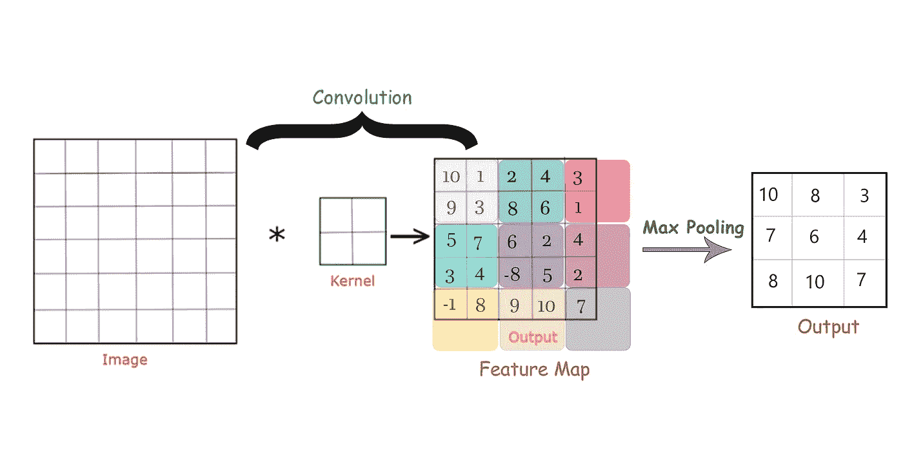
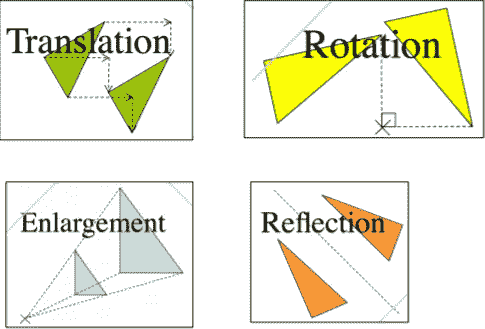
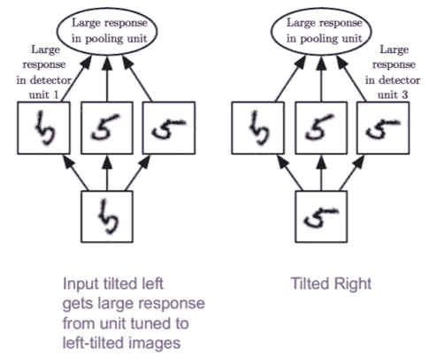

# Max Pooling，为什么用它以及它的优点。

> 原文：<https://medium.com/geekculture/max-pooling-why-use-it-and-its-advantages-5807a0190459?source=collection_archive---------12----------------------->

为了使用卷积和最大池提取最重要的特征，有许多操作被应用于图像。

**Max Pooling** 是一种操作，用于缩小未使用的图像，并使用卷积替换它以提取最重要的特征，这将花费很高的计算成本。因此，我们使用最大池来根据过滤器大小和步幅从特征图中提取最大值。

Max Pooling operation is always done after Convolution (Credit: [Codicals](https://www.instagram.com/codicals_/))

在图像尺寸非常大的情况下，我们必须使用最大池来缩小图像。最大池仅存储最大值的像素。特征图中的这些值正在显示 ***一个特征有多重要以及它的位置。*** 所以，只取最大值意味着提取一个区域中最重要的特征。

> **应用最大池的两个原因:**
> 
> 1. ***通过提取最重要的特征来缩小图像***
> 
> *2. ***去除不变性*** *如平移、旋转和缩放**

*我们一定认为*缩小图像是它唯一的用途*。我会说不。使用最大池比其他池操作(最小池和平均池)有许多优点。*

> *最大池是有利的，因为它增加了平移不变性。它有以下几种类型*
> 
> *1.移位不变性(位置不变性)*
> 
> *2.旋转不变性(旋转不变性)*
> 
> *3.比例不变性(比例不变性(小或大))*

**

*Different Invariances added by Max Pooling (Credit: [Codicals](https://www.instagram.com/codicals_/))*

*你一定在想，在图像中加入不变性有什么重要性。*

*以下是其原因。*

1.  *如果我们关心某个特征是否存在，而不是它的确切位置，那么图像的不变性就很重要。*
2.  *在其他情况下，保留特征的位置更为重要。*

**

*Here is an example to visualize invariance. (Credit: [Codicals](https://www.instagram.com/codicals_/))*

*希望你所有的概念都搞清楚了。我清楚地了解这个主题最大池的用途和优势。*

*敬请关注，继续学习。*