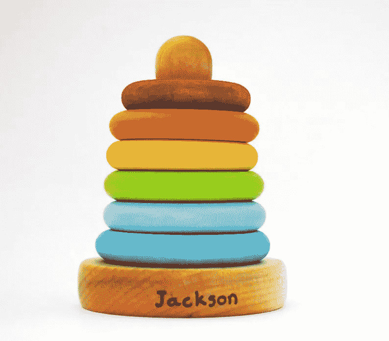
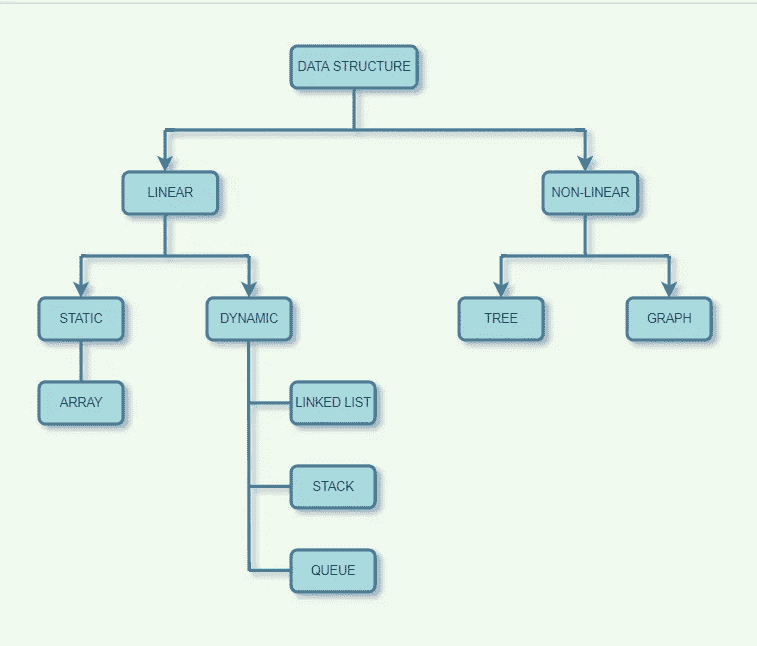

# 最大堆栈问题和解决方案

> 原文：<https://medium.com/geekculture/max-stack-problem-and-solution-a1cd2b088e83?source=collection_archive---------8----------------------->

## 软件工程师生存日记

## 实用的数据结构

source: etsy.com

在上一篇文章中，我谈到了今年的 [HacktoberFest](/@wu.thomas/hacktoberfest-is-live-e322d29a782f) 。今天我想谈谈一些流行的编码面试问题。同时对数据结构主题做一个小小的介绍。让我们开始吧。

Max stack 问题是在招聘一些开发人员角色时，可以测试候选人对数据结构和大 O 概念的逻辑思维的问题。以下是问题陈述:

*设计一个最大堆栈数据结构，支持堆栈操作，支持寻找堆栈的最大元素。*

> 实现`MaxStack`类:
> 
> `MaxStack()`初始化堆栈对象。
> 
> `void push(int x)`将元素`x`推到堆栈上。
> 
> `int pop()`移除栈顶元素并返回。
> 
> `int top()`获取堆栈顶部的元素，但不移除它。
> 
> `int peekMax()`获取堆栈中的最大元素，但不移除它。
> 
> `int popMax()`获取堆栈中的最大元素并删除它。如果有一个以上的最大元件，只移除最上面的**元件。**
> 
> 您必须想出一个解决方案，为每个`top`调用支持`O(1)`，为每个其他调用支持`O(logn)`。

这个要求很重要，这里它要求我们每个调用都有 O(log N ),包括 popMax。因此，像使用堆栈存储这样的传统解决方案是行不通的，因为 popMax 操作需要 O(N)时间。[链接](https://blog.devgenius.io/how-to-solve-max-stack-using-two-stacks-c4ac4cc77922)

重新访问数据结构:

source: mygreatlearning.com

如果要实现堆栈，可以使用线性数据结构之一，如 Array 或 LinkedList。然而，在这种情况下，我们还需要从堆栈中执行 pop/peek max(值),必须考虑一些额外的想法。当谈到最大限度地利用某些项目时，您可以使用非线性数据结构，某些类型的树数据结构是合适的方法。为了快速回答这个问题，我建议在我的类中有两个数据结构，一个用于正常的堆栈操作(例如，自然顺序的 push/pop)，一个用于 max 操作(关于值的 peekMax、popMax)。我会使用平衡的树数据结构来实现每一个，比如 Java Collection 提供的 TreeSet。一棵平衡的树对于保持所有元素以某种指定的顺序动态排序**是完美的。所以，现在一个是秩序，一个是价值观。**

## **算法**

**如前所述，我们需要维护两个平衡的树:一个是按推送顺序的(`orderTree`)，另一个是按值排序的(`valueTree`)。**

**为了实现`push`，我们需要将元素推入两个平衡的树中，`orderTree`和`valueTree`**

**为了实现`top`和`peekMax`，我们只需要为`top`查询返回`orderTree`的最后一个元素值，为`peekMax`返回`valueTree`的最后一个元素值，因为`orderTree`和`valueTree`是按顺序和值排序的。**

**为了实现`pop`和`popMax`，我们调用 TreeSet 的 remove 方法，这是一个性能为 O(log N)的查找和移除方法，用于两个平衡树中的返回元素。对于`pop`，我们先去掉`orderTree`中的最后一个元素，再去掉`valueTree`中的元素。而对于`popMax`，我们首先移除`valueTree`中的最后一个元素，然后移除`orderTree`中的元素。**

****结论****

**我希望我的文章能帮助你更多地思考数据结构设计。如果你喜欢这篇文章，请订阅并关注我的媒体，因为它将有助于扩大受众范围。谢了。**