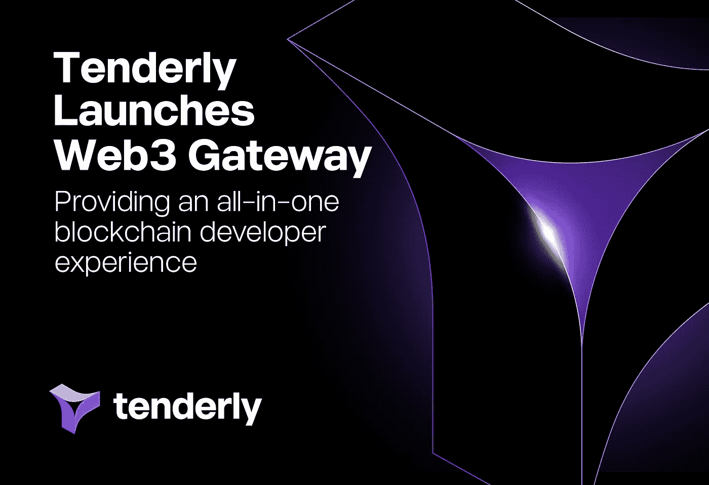

# 最大限度地利用 Web3 领域的商业机会，成为巨头

> 原文：<https://medium.com/geekculture/maximize-the-business-opportunities-in-the-web3-space-to-become-a-magnate-b0bb8b688157?source=collection_archive---------23----------------------->

Business Opportunity

最近，摩根大通在公开的区块链上的**DeFi 空间进行了第一笔交易。这被视为数字领域的一个重大事件，因为像 JP 摩根这样的大公司已经进入了 Web3 领域。区块链的出现为许多这样的场合铺平了道路，这些场合将数字世界推向了全新的高度。区块链科技的崛起对不同领域的各种业务产生了巨大的影响， [**如房地产**](https://www.blockchainappfactory.com/real-estate-tokenization?utm_source=srinivasan&utm_medium=medium&utm_campaign=08nov2022) 、金融、医疗保健和教育。Web3 完全改变了用户之间的交互方式，并为最终用户分散了数据所有权。**

****Web3****

**Web3 是互联网的下一个阶段，基于去中心化的区块链网络、点对点节点和基于令牌的经济。Web3 创造了一个新的去中心化的互联网，没有一个中心化的实体能够控制用户数据。**

**Web3 有自己的一系列挑战。构建和运行一个 [**Web3 协议**](https://en.wikipedia.org/wiki/Web3) 可能是极其昂贵和艰难的任务。开发人员需要运行不稳定的节点，这些节点需要不断更新，但也缺乏简化调试的工具。此外，数据只有原始格式；它需要被团队索引。所有这些复杂性限制了开发者探索 Web3 的真正力量。但是，Web3 网关已经成为解决虚拟世界中所有这些挑战的灵丹妙药。**

****Web3 网关****

**Web3 gateway 是一个快速、安全且易于节点化的解决方案，可帮助开发人员使用一致的数据处理繁重的工作负载。使用这些，智能合约开发人员可以轻松地读取和分析区块链数据。**

****

**tenderly web3 gateway**

****温柔网 3 网关****

**温柔是 Web3 领域的知名品牌，提供关键的 Web3 基础设施，因为它每月运行超过 5 亿次模拟，帮助区块链开发人员构建 Dapps。**

**该公司最近公布了温柔网关。它是温柔平台不可分割的一部分，因为它承诺覆盖整个 Web3 开发服务。现在，Web3 开发人员可以在他们的开发过程中使用 honely 的端到端和内聚的 Web3 网关。**

****首席执行官兼联合创始人安德烈·本西奇说:“我们的目标一直是帮助 Web3 开发者克服不断增长的 Web3 行业开发过程中出现的复杂性。他还补充道，“我们一直希望帮助开发者开发出突破性的产品，同时降低新来者的门槛。”“借助一体化的 [**Web3 开发平台**](https://www.blockchainappfactory.com/web3-development-solutions?utm_source=srinivasan&utm_medium=medium&utm_campaign=08nov2022) ，开发人员拥有了更快构建可靠且引人注目的 Dapps 所需的一切，从而提高了他们团队的速度和协作。”****

******温柔网 3 网关的特点******

*   ****该网关提供了可观察性特性，使开发人员能够更好地了解链上活动，从而使区块链数据更易于使用和访问。这使得开发人员可以更好地控制链上的智能合约。****
*   ****智能合约开发人员可以利用调试器和事务模拟器来减少故障排除时间。****
*   ****它还提供了灵活的 API，包括模拟 API。它通过模拟各种场景来增强用户的信心和体验。****

******Web3 开发******

****Web3 应用程序开发所需的一些基本技术堆栈****

******区块链:**去中心化访问不可变的数字账本，用于存储细节。****

******AI: f** 为多项任务的执行提供顺畅的机器间通信。****

******智能合约:**在平台上运行交易、功能、操作。****

******IPFS:是一种存储设施，使用户能够以安全的方式存储数字资产。******

******Web3 开发服务******

****Web3 的一些突出应用****

******Web3 钱包开发:**分散的 Web3 钱包促进了 Web3 应用中的安全交易和数字资产的存储。****

******Web3 exchange 开发:一个分散的**交换平台，用户可以在这里高效地交换和交易具有世界级性能和安全性的加密货币。****

******Web3 智能合约开发:**智能合约在区块链应用程序上执行交易并促进其操作，消除了对任何中央实体的需要。****

******Web3 流媒体服务:**这个平台让内容创作者能够创作内容并获得报酬。****

******分散自治组织:**智能契约驱动的 Dao 用于不同的业务用例。****

******总结******

****随着 Web3 慢慢开始取代传统的集中式 Web 服务， [**区块链科技**](https://www.blockchainappfactory.com/) 的崛起为加密领域的商机打开了许多大门。如果你是一个企业家，想在 Web3 世界中找到自己的路，与一个专业的 Web3 开发公司合作开发你的程序可以为你的企业创造奇迹。****