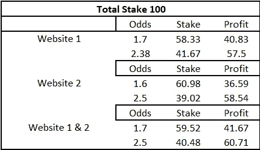

# 愿机会永远对你有利！

> 原文：<https://medium.com/geekculture/may-the-odds-always-be-in-your-favor-b52cd77d5838?source=collection_archive---------16----------------------->

用数学和常识来打赌你会有更大的胜算

Photo by [Keenan Constance](https://unsplash.com/@keenangrams?utm_source=unsplash&utm_medium=referral&utm_content=creditCopyText) on [Unsplash](https://unsplash.com/s/photos/betting?utm_source=unsplash&utm_medium=referral&utm_content=creditCopyText)

我们总是听人们说，赌博是一种主要靠运气和一些技巧的游戏。在扑克桌上数牌，用你的记忆为你的现金存款铺路的日子已经一去不复返了。如今，赌场和其他游戏场所有非常复杂的检查和识别方法。但现在情况发生了变化，随着体育博彩从 Bet365、Dream11 等平台在互联网上获得牵引力，一种新的模式出现了，你可以实际下注，而不会让博彩公司知道你的其他赌注。可以认为是用同样的牌在两个扑克游戏中下注！

## 这是怎么回事？

想象一下，你在比赛开始前打赌英格兰会赢得下一场骨灰测试，但你知道这种情况发生的几率肯定小于 50%。现在你做什么？你可以做的一件事是赌英格兰在一个网站上赢，在另一个网站上输，你必须小心澳大利亚在一个网站上赢，在另一个网站上输。现在这只是一个概率和赔率的游戏。我们称之为套利下注！

> 体育博彩中的套利博彩是一种活动，在这种活动中，你同时对一个事件的所有可能结果下注，以保证利润，无论事件的结果如何。这些赌注也被称为确定赌注、奇迹赌注、确定胜算。听起来不错？

套利是证券交易所交易者的常见做法；交易员通过在一个交易所以特定价格买入股票，在另一个交易所以更高价格卖出同样的股票来保证利润。

这一原则与体育博彩类似，因为博彩交易所的构成——了解博彩交易所与博彩公司的不同——与证券交易所非常相似。体育套利是通过在大街上的多家博彩公司下赌注秘密进行的。然而，博彩交易所和在线博彩已经改变了套利博彩，使这项征税工作变得没有必要。随着门户网站帮助你找到事件的最佳赔率和增加投注平台，这种做法已经看到了指数增长。

大部分时间套利投注是在投注交换网站，如必发或立博或 Betway。这是因为它们是自由市场，赔率不是由庄家设定的。当赔率不是由庄家设定的时候，赔率会更高，因为他们没有考虑过多的因素。超额，也称为庄家保证金或优势，是调整真实赔率的行为，以确保无论比赛结果如何，庄家总是获利。

# 如何进行套利押注

在博彩交易所，有两种套利交易可供利用:

*   赔率套利
*   奖金套利(也称为匹配投注)

# 套利赌博示例

在对市场定价时，博彩公司几乎总是会考虑一个优势，即所有结果的总概率超过 100%。套利系统依赖于不同公司的组合赔率，产生负利润率——小于 100%——所以优势对你有利。

这通常是通过组合来自两个不同博彩提供商的两个博彩报价来实现的。让我们比较一下 Betfair 和 Betway 在骨灰测试赛中的赔率，看看套利交易是如何运作的。

Credits : Self

这是 100 美元的总股份，我们可以看到第一个网站的赔率。如我们所见，我们的总利润为-2.44 英镑，但我们有相当大的几率获得第二个结果。现在我们需要做的就是找到另一个网站，在第一个结果上给我们超过 1.6 的回报。

总赌注保持不变，我们对两种结果有不同的赔率。我们需要做的是检查我们能在结果 1 中赚多少，这能抵消我们从第一个网站预期的损失吗。

现在结合赔率，第二个网站的第一个结果为 1.70，第一个网站的第二个结果为 2.50，将这些数字放在一起，上述 1.19%的差额，尽管很小，但提供了一个我们肯定会利用的机会。随着赔率对你有利，现在的问题是你能投入多少。

上面的例子是套利博彩在网站和应用程序世界中如此受博彩爱好者欢迎的主要原因，这些网站和应用程序为我们提供了多种选择和赔率。尽管赔率很高，但它为我们的投资提供了安全感！

创建一个电子表格来监控您的交易是一个好主意，可以帮助您记录您的投资，许多公司为我们提供了分析赔率的工具，它们也非常有帮助，只要确保您对这些公司的投资不会大幅度抵消您的利润！

一个人必须勤奋、沉着和耐心。有利的利润是很难遇到的，当你设法找到一个，它通常会产生小利润，但当你不能失去它的帮助！:)

干杯！