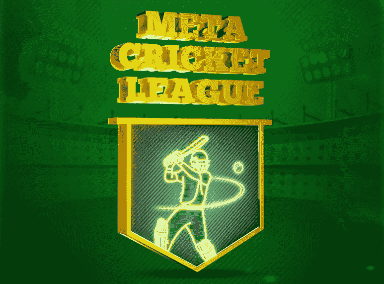
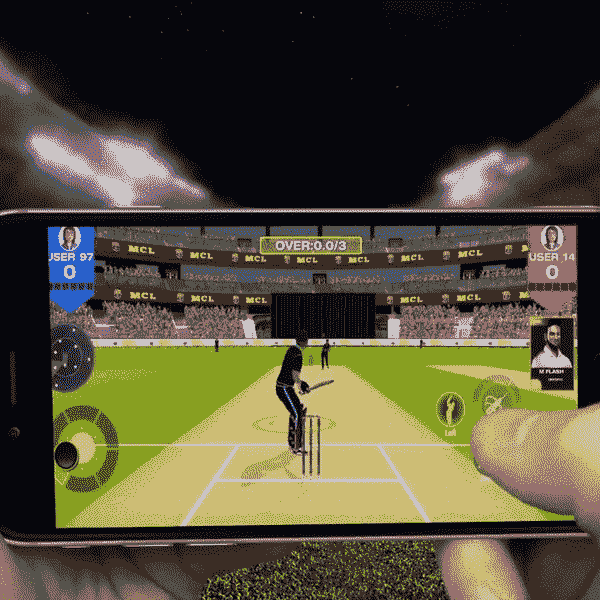

# MCL 游戏-第一次板球 NFT 游戏！

> 原文：<https://medium.com/geekculture/mcl-game-the-first-cricket-nft-game-aab99c3866f9?source=collection_archive---------10----------------------->

在 NFT 游戏的世界里，你可能会遇到基于宠物饲养、怪物战斗、战争、占领领土、种族等等的游戏。Jump.trade 在行业内首次推出了元板球联盟——这是有史以来第一次赢得 NFT 板球比赛。这对板球迷和游戏社区来说是一个有趣的享受，给他们一个通过玩游戏赚钱的机会。有许多 NFT 游戏进入市场和消失，由于他们的计划外和不可预测的赚取和爆发系统。元板球联盟是为板球爱好者开发的东西，可以通过可持续的系统获得乐趣和长期收入。因为这个游戏在这个城市是新的，应该有人负责并解释它的每一个细节。给每一个对游戏感兴趣的人，这就是。

**入门**

NFT 游戏市场是元板球联盟的第一步。作为 Guardianlink 的产品，Jump.trade 是一个用来创建游戏生态系统的东西。要进入 [**元板球联赛**](https://www.jump.trade/mcl-game)——MCL 简而言之，你得拥有 NFTs。当然，这是你在市场上玩任何 NFT 游戏所必须做的。虽然大多数游戏要求你购买 3 个或更多的 NFT，但 MCL 只需要 2 个 NFT。击球手和投球手是打板球所必需的两个要素。

Guardianlink 的主要目标是让每个人都可以使用 NFT，因此这个最低要求以及这些 NFT 的基本价格都标为 25 美元。所有 55，000 份 NFT 在短短 9 分钟内售罄。仅仅几天时间，这些 NFT 的价值就这样涨了 3 倍。这是一个有巨大需求的潜在项目，如果你正在寻找一个可持续的游戏，这就是它。

**游戏玩法**

我们有蝙蝠侠 NFT，保龄球 NFT 和 NFT 蝙蝠。都有不同的类别，在游戏中各有所长。你可以看到他们的稀有性，他们的属性，力量和等级。根据他们的实力，他们被分类为新秀，史诗，传奇，稀有，超稀有，超稀有，和不朽。另一方面，蝙蝠有单支蝙蝠、双支蝙蝠等等。

一旦你拥有了 NFTs，你就有资格玩这个游戏了。在游戏中，你将能够连接到守护者钱包，在那里你会找到你的 NFTs。你必须选择你想玩的 NFT。MCL 是一个 pVp 多人游戏，在这里你可以和其他玩家比赛并和他们对战。一旦你准备好玩，你将被分配一个同样准备好玩的玩家。匹配发生在这样一种方式，只有同等级别的球员相互竞争。

每次你玩游戏，并得分运行，你会得到 JT 点每运行。当你失去三柱门时，你也失去了点。当你的投球手击球时，你也可以得分。排行榜将显示当天的最高得分。您每获得一个 JT 积分，就可以获得美元奖励。这就是你玩板球和挣钱的方式。

**奖励制度**

所以你已经知道你每得一个 JT 分就能挣到钱。每当你赢得一场比赛，你也赢得一个工具箱。游戏基本是打着赚的；也就是说，每次你击球，你得分，每次得分，你得到 JT 点，每一分，你赚美元。

上面提到的工具箱是你更新或升级你的 NFTs 的工具。NFT 有从 1 到 15 的级别，每个类别都有不同的级别。每个 NFT 都可以逐渐升级，这反过来会增加非战斗堡垒的力量和属性。

你可以以更高的价格出售升级后的 NFT。除此之外，还有一个租赁选项，你可以租赁你的 NFT，当你不使用它们时，从中赚取收入。

**贝塔体验**

作为测试运行，游戏有一个封闭的社区测试锦标赛。比赛持续了 2 个小时，玩家有机会赢得高达 **$500 美元**。人们对这个游戏很满意，最终他们得到了一个热身赛联赛，所有的 NFT 持有者都可以玩这个游戏。

期待什么？

这款游戏引起了板球爱好者、游戏玩家和 NFT 交易社区的关注。更新内容包括球场和天气条件，适应性，球员的健康和耐力，以及其他相关内容将很快推出。NFT 体育馆和其他相关的空投物资也将很快投放市场。

随着可持续发展的动力，游戏玩家正奔向 [**元板球联盟**](https://www.jump.trade/mcl-game) ，这将把板球带入元世界。