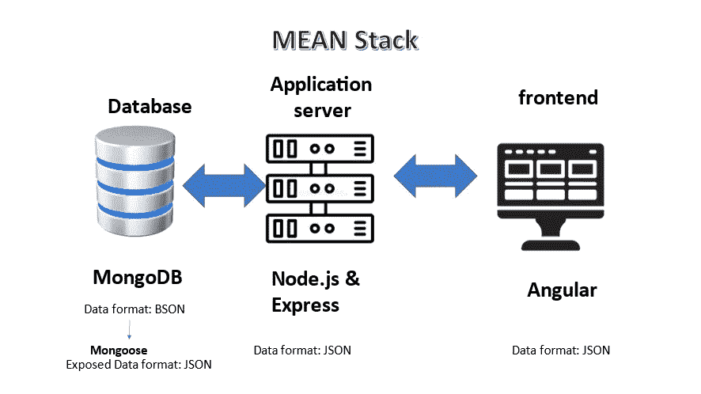
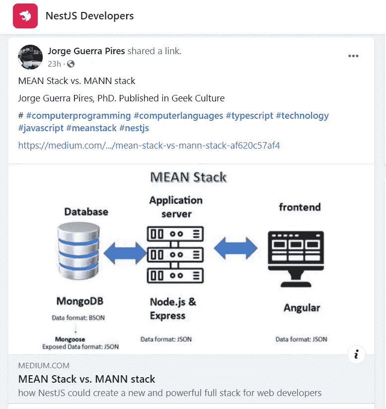
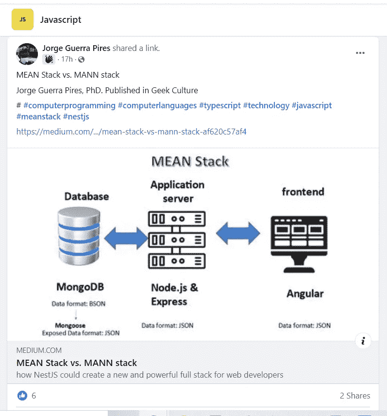
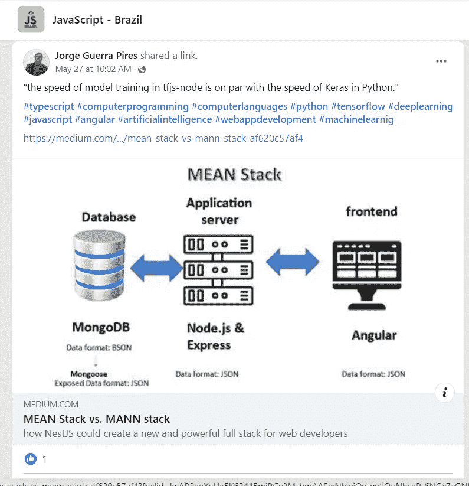

# 平均堆栈与曼恩堆栈

> 原文：<https://medium.com/geekculture/mean-stack-vs-mann-stack-af620c57af4?source=collection_archive---------13----------------------->

> “我们认为深度学习和 JavaScript 应该结合在一起。”[深度学习和 JavaScript](https://www.amazon.com/Deep-Learning-JavaScript-networks-TensorFlow-js/dp/1617296171)
> 
> “tfjs-node[一个针对 TensorFlow.js 优化的 Node.js 中的模型训练速度与 Python 中的 Keras 速度不相上下。”[深度学习和 JavaScript](https://www.amazon.com/Deep-Learning-JavaScript-networks-TensorFlow-js/dp/1617296171) 【今天我们都在讲学习机和 web 应用】，参见我的文章 [JavaScript 和学习机](https://medium.datadriveninvestor.com/why-am-i-considering-seriously-javascript-and-deep-learning-and-i-would-suggest-you-to-do-so-976b7f89b4f0)。

Photo by [Alexander Sinn](https://unsplash.com/@swimstaralex?utm_source=medium&utm_medium=referral) on [Unsplash](https://unsplash.com?utm_source=medium&utm_medium=referral)

我已经开始使用 MEAN Stack(分别是 MongoDB、Express、Angular 和 Node.js)进行 web 编码。主要卖点是:**一种单一的编程语言**(即 JavaScript)和**文件交换格式**(即 JSON) ***用于整个堆栈*** 。的确是真的。

Pires, 2021.

> “Nest.js 与 Angular 有着独特的共生关系，因为它们都是用 TypeScript 编写的。”[杰伊·贝尔、格雷格·马戈兰、大卫·吉哈罗、阿德里安·德·佩雷蒂、帕特里克·豪斯利](https://www.amazon.com/Nest-js-Progressive-Framework-Jay-Bell-ebook/dp/B07KBY31HF)

尽管如此，从一开始我就注意到这个卖点*并没有讲述全部* : **JavaScript 在前端被 TypeScript 取代**！尽管这比不得不从 Python 转向 JavaScript 要好，但这仍然是痛苦的；如果你是初学者，必须掌握两种“不同”的语言可能会让人不知所措。然而最近，大约 2017 年，发布了一个新的框架，即 NestJS 它不同于 Express 主要是因为它不是一个库，和 Angular 一样，它是一个框架。

> 主要卖点是:整个堆栈只有一种编程语言(即 JavaScript)和文件交换格式(即 JSON)。的确是真的。尽管如此，从一开始我就注意到这个卖点并没有说明全部情况:JavaScript 在前端被 TypeScript 取代了！

NestJS 是在 Express 上创建的服务器创建框架，类似 Angular。因此，它在 MEAN stack 中的技术之间创建了一个更好的协同，创建了一个可以称为 MANN stack 的东西！

这一增加带来了一些可能的好处:

*   像 Angular 一样，Nest 也包含了测试的概念；
*   和 Angular 一样，有自己的 CLI
*   这就是一些人所说的渐进式框架，它的意思是，根据互联网上的定义:一次可以从小规模开始，逐步增长！
*   它是用 Typescript 编写的，因此，整个堆栈只有一种语言；

我还没有在我的堆栈中加入这个框架，但是我有很大的期望。最主要的原因，至少对我来说，是和 Angular 相似。有时，当我在 Nest 中编码时，我很难告诉我的大脑我在后端。

**TensorFlow.js: *案例分析***

> “如果您的后端已经用 Node.js 编写，并且您希望将机器学习添加到您的堆栈中，那么使用 tfjs-node 通常是比使用 Python 更好的选择。通过用单一语言编写代码，您可以直接重用大部分代码库，包括那些用于加载和格式化数据的部分。”[深度学习和 JavaScript](https://www.amazon.com/Deep-Learning-JavaScript-networks-TensorFlow-js/dp/1617296171)

前段时间，我已经决定冒险使用 JavaScript 进行深度学习，主要是因为 TensorFlow.js，这是我偶然发现的。我已经使用 TensorFlow.js 对 Angular 进行了编码，但是，可能会出现一些限制:

*   浏览器在计算能力上有局限性；
*   让用户的电脑超载可能不是个好主意；

TensorFlow.js 的一个解决方案是 *tsjs-node* 。我还没有测试，但 Angular 的结果与 Nest 非常相似，显示了有希望的结果。我能够将 JavaScript 中的代码改编成 TypeScript，虽然有一些问题，但没有什么是无法解决的。

因此，使用 Nest 的另一个原因是:**如果你在 JavaScript** ，*中有一个库，你可以在 Nest* 中使用它。

Pires, 2021.

**均值堆栈的其余组件呢？**

正如我们所看到的，棱角分明接近嵌套，这是一个很好的东西。现在，MongoDB 变得更加简单！他们纳入猫鼬，这是更容易连接！快递是 NestJS 的基础！

因此，在我看来，我们已经具备了转变的所有要素！

Posting on Facebook group of NestJS

Posting on Facebook group of JavaScript

# **参考文献**

*   JG 皮雷。MEAN + TensorFlow.js:基于机器学习的 web 应用程序的单一语言、单一数据交换格式！在我从 Medium 选择的关于计算机编程的分析中:Angular、JavaScript、机器学习、TensorFlow.js 等等！第一卷。自行出版:欧罗普雷托，2021 年。[亚马逊上](https://www.amazon.com.br/dp/B09PGT697D/ref=sr_1_1?qid=1640914862&refinements=p_27%3AJorge+Guerra+Pires&s=digital-text&sr=1-1&text=Jorge+Guerra+Pires)
*   Jay Bell 等人的 Nest.js:一个渐进的 Node.js 框架。[在亚马逊上](https://www.amazon.com.br/Nest-js-Progressive-Node-js-Framework-English-ebook/dp/B07KBY31HF/ref=rvi_1/130-2531766-6620013?pd_rd_w=Mee1Z&pf_rd_p=5a5fdb9d-0c9f-4ef8-98d5-3da45c0cade0&pf_rd_r=J309CGP3GDCWHCN97J4C&pd_rd_r=d2b4c3c9-ee87-410b-a179-44dfbcfc990b&pd_rd_wg=ChPUu&pd_rd_i=B07KBY31HF&psc=1)

# 下一步是什么？

*   Angular vs. NestJS:我们需要周围有 Angular 的后端吗？

# 你可能会感兴趣

Angular、单元测试、Figma 和数值分析:使用 Angular Material
[https://www . udemy . com/course/Angular-Unit-Testing-fig ma-and-Numerical-Analysis/？referral code = CEC 8 c 36 e 50 f 431 e 197 ce](https://www.udemy.com/course/angular-unit-testing-figma-and-numerical-analysis/?referralCode=CEC8C36E50F431E197CE)
优惠券(免费获取):free December 21
# JavaScript # typescript # angular # udemcupons # testdrivendevelopment #测试#技术

mongose，测试驱动测试驱动开发，NestJS，Jest:Aprenda sobre o funcionamento do mongose focando em testes
[https://www . udemy . com/course/mongose-Test-Driven-design-NestJS-Jest/？referral code = 4a 71374615821d 1820 be](https://www.udemy.com/course/mongoose-test-driven-design-nestjs-jest/?referralCode=4A71374615821D1820BE)
# MongoDB # mongose # testdrivendevelopment # nestjs # unittesting # udemcourse # udemycoon

===========

购买我们的电子书来支持我的写作吧！
[https://jorgeguerrapires . medium . com/my-selected-assays-from-medium-on-computer-programming-34578 bebb 63 a](https://jorgeguerrapires.medium.com/my-selected-assays-from-medium-on-computer-programming-34578bebb63a)

我从 Medium 中选择的关于计算机编程的分析:Angular，JavaScript，Machine Learning，TensorFlow.js 等等！
[https://www.amazon.com.br/dp/B09PGT697D/ref=sr_1_1?qid = 1640915011&refinements = p _ 27% 3 Jorge+Guerra+Pires&s = digital-text&Sr = 1-1&text = Jorge+Guerra+Pires](https://www.amazon.com.br/dp/B09PGT697D/ref=sr_1_1?qid=1640915011&refinements=p_27%3AJorge+Guerra+Pires&s=digital-text&sr=1-1&text=Jorge+Guerra+Pires)

===
捐款

给我买杯☕☕☕☕☕咖啡或者一本书！！📚📚📚📚📚
如果这些内容对您有用！这是一次性捐赠，没有必要再捐赠了！
[https://www.buymeacoffee.com/jorgepires](https://www.buymeacoffee.com/jorgepires)

现在你也可以支持我的任何项目！🥰🥰
更多信息:[https://jorgeguerrabrazil . wix site . com/ideacodinglab/publications](https://jorgeguerrabrazil.wixsite.com/ideacodinglab/publications)

访问我的课程:[https://www.udemy.com/user/jorge-guerra-pires/](https://www.udemy.com/user/jorge-guerra-pires/)