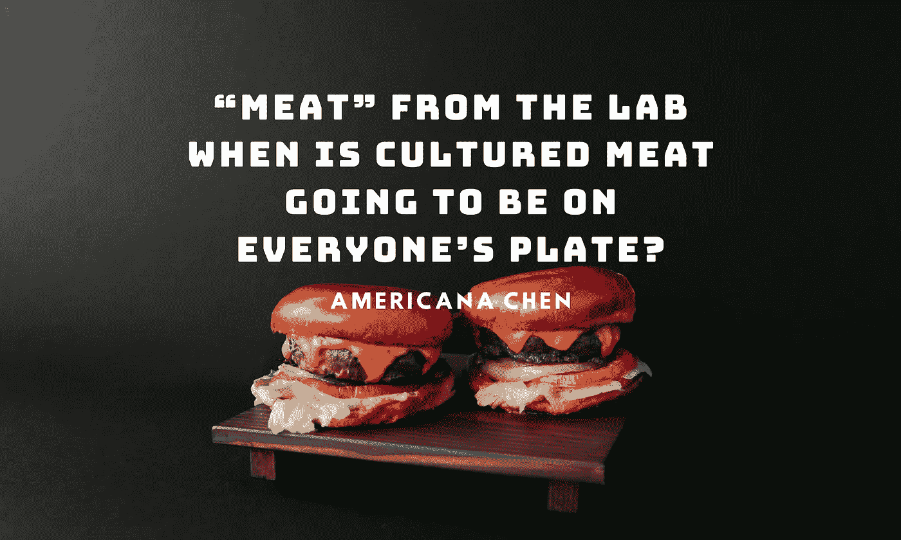

# 来自实验室的“肉”:什么时候养殖肉会出现在每个人的餐桌上？

> 原文：<https://medium.com/geekculture/meat-from-the-lab-when-is-cultured-meat-going-to-be-on-everyones-plate-8b90f9ab32f1?source=collection_archive---------15----------------------->

> “它有一种淡而无味的味道。当我咬下它时，我对它的密度印象深刻。”

这是美食作家 Josh Schonwald 在 2013 年的一个电视节目中品尝第一块人工养殖肉(实验室培育的肉)时的评论。那时候，那块看起来很普通的汉堡肉饼价值超过 30 万美元，而且…