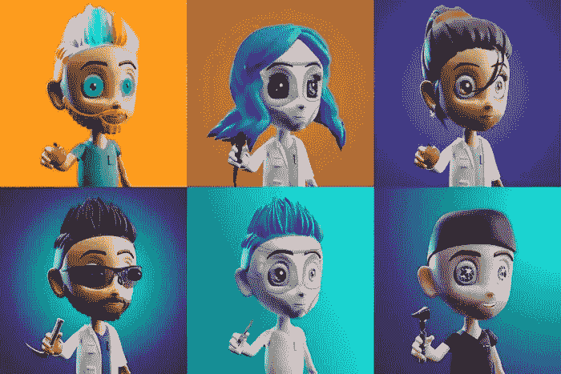
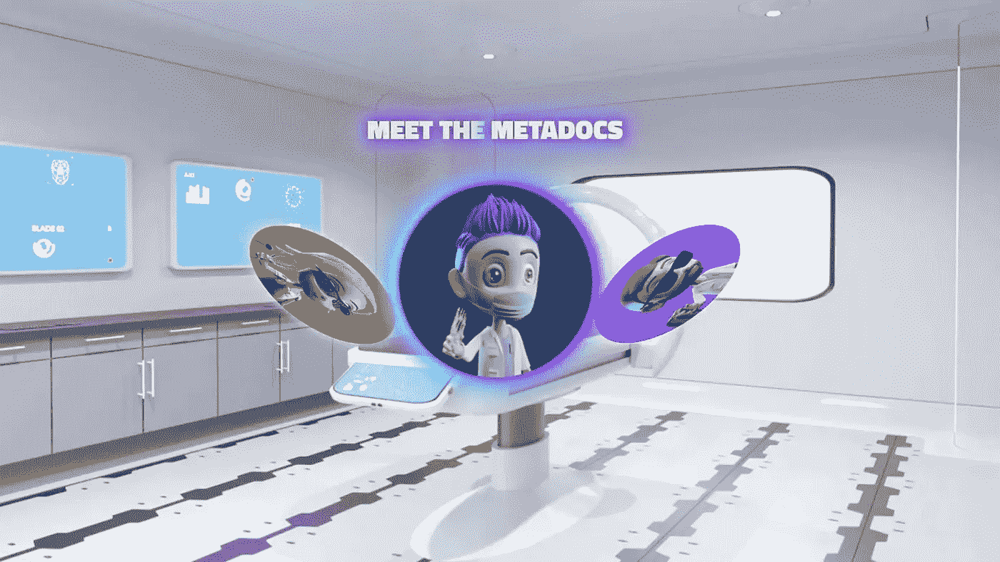

# 医疗 NFT 项目|医生正在退出这个医疗 NFT 项目 2022

> 原文：<https://medium.com/geekculture/medical-nft-project-doctors-are-dropping-out-of-this-medical-nft-project-2022-7169c93bb838?source=collection_archive---------10----------------------->

Medical NFT Project

最近几个月，一个有着多余愿景的医学 NFT 项目 MetaDocs 面临着很多反对。最初提供的实用程序之一是令牌持有者可以访问抖音和 Instagram 等社交媒体上的知名医生。NFT 的所有者可以通过团体问我任何问题(AMA)会议、直接消息、甚至单独的视频聊天与医生互动。MetaDocs NFT 集合的创始人 Sina Jooraboochi 博士希望这个集合可以在元宇宙产生一个功能齐全的诊所，或者简单地说一个 [Web3](https://en.wikipedia.org/wiki/Web3) 远程医疗服务。

# 但是，元数据有什么问题呢？

但是， [MetaDocs](https://www.clearfind.com/guides/products/metadocs) 目前遇到了很多麻烦，其中最重要的一个是它还没有获得远程医疗服务的许可。此外，医生不能提供医疗咨询，除非他们在提供咨询的州获得许可，即使是远程医疗。用户也表达了愤怒，因为他们不想通过 NFTs“获得一般的医疗建议”，NFTs 在发布时的价格为 0.2 ETH 或 570 美元。MetaDocs 文件中提到的几个医生已经退出了这个项目。相比之下，其他一些人声称他们的名字在他们不知情的情况下被涉及，这引发了对可能利用社交媒体医疗名人进行诈骗的指控。其他人则不再引用该项目的问题和公众的反弹。

# 废墟中的教训(比成功的故事更好)

**Medical NFT**

尽管元数据看起来像是一个企业最糟糕的噩梦，但这个项目仍然让我们对在 Web3 领域成功创业有了一些重要的理解。首先，在开发项目代码之前，您应该清楚地列出所有的计划。在这里，有替代路径的精心计划是必要的，因为区块链风险投资不是普通的街头小吃店，如果没有 B 计划，你就无法在广阔的秘密空间中寸步难行。此外，MetaDoc 的大多数失败都是对法律法规的误解或忽视的累积结果，这在拉下帷幕方面发挥了关键作用，尤其是对一家总部位于区块链的企业而言。此外，为你的非功能性食物提供有意义的实用程序仍然是第一要务，因为没有人会花 100 美元买一个 NFT，只是为了获得异国食物的照片(甚至连一盘都没有)。

# 你怎样才能创建一个成功的 NFT 市场企业？

如果你能在深入 NFT 海洋之前考虑到所有这些教训，你也可以为你的 NFT开发一个 NFT 市场并开始行动。在计划创建你的 NFT 市场时，有几件事你应该记住。首先，你应该清楚地决定你的目标市场，并根据你的研究确定一个利基市场。确保你在这种情况下进行广泛的研究，因为这个阶段对你的创业成败起着决定性的作用。此外，虽然选择选择开发商为您的业务，请确保您选择一个可靠的和有经验的区块链开发公司，因为平台将是你的风险投资的脸。

## 结束前的一些想法

因此，如果你了解自己的游戏，你可以选择创建自己的 NFT 市场。外部噪音是不可避免的，为了让潮流转向你这边，你应该小心翼翼地在秘密世界中迈步。为你的非技术人员创建一个 NFT 市场可能是一个很好的商业选择，因为它有助于围绕你的非技术人员容易地建立一个社区，因为所提供的津贴是独一无二的。