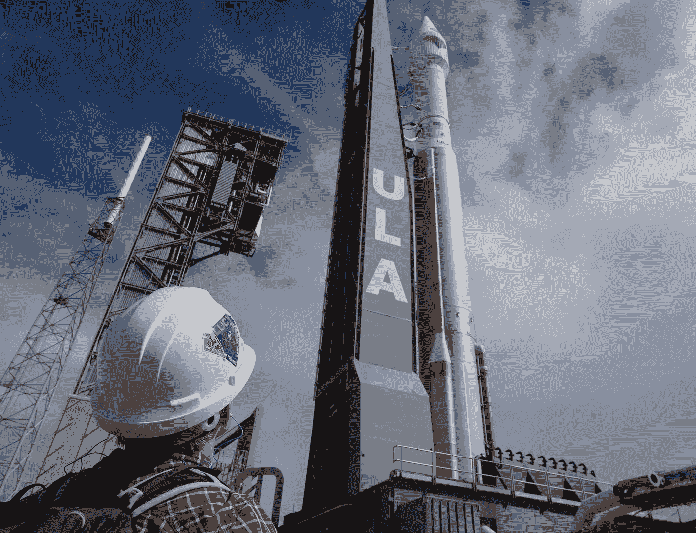
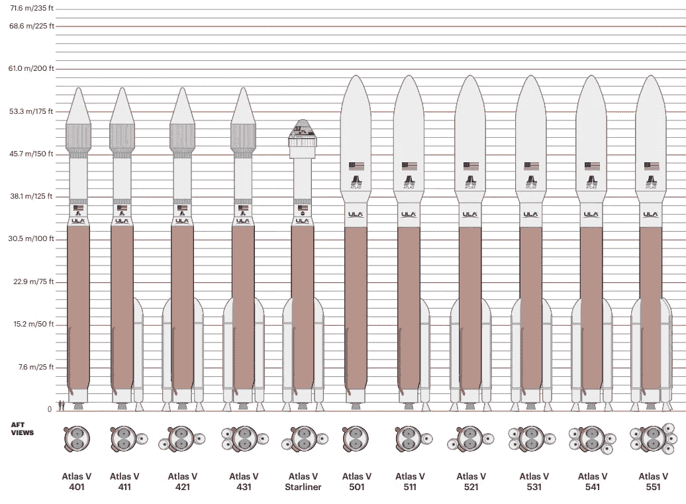

# 认识一下阿特拉斯五号:航天工业的半卡车，它载着露西去了星星

> 原文：<https://medium.com/geekculture/meet-atlas-v-the-semi-truck-of-the-space-industry-that-carried-lucy-to-the-stars-2d46f480a5e9?source=collection_archive---------19----------------------->

## 看看有史以来最可靠的火箭

2021 年 10 月 16 日，露西飞船开始了它为期 12 年的旅程，研究木星的特洛伊小行星。美国宇航局在过去的 6 年里花费了 9 . 81 亿美元来开发和发射露西号宇宙飞船。那么，当你需要有人将这个接近 10 亿美元的科学仪器加速到 67，000 英里/小时，以便它在到达目的地之前可以行驶近 40 亿英里/小时时，你会向谁求助呢？如果是我的钱，我会寄希望于一个有 100%成功率的火箭公司。

在其 15 年的服务中，Atlas V 已经顺利完成了 88 次[飞行任务](https://en.wikipedia.org/wiki/Atlas_V#Atlas_V_launches)，今天早上 Lucy 的成功发射是第 89 次。作为一台独立的机器，Atlas V 的可靠性是无与伦比的。然而，这种重型运载火箭也具有阿特拉斯运载火箭家族的悠久传统，可以追溯到太空竞赛的最初阶段。事实上，是阿特拉斯 LV-3B 火箭首次将约翰·格里恩送入轨道，执行[友谊 7 号](https://en.wikipedia.org/wiki/Mercury-Atlas_6)任务。

Atlas V 不仅因其可靠性而闻名，也因其灵活性而闻名。联合发射联盟提供了 11 种不同配置的 Atlas V。400 系列中的四种配置，500 系列中的六种配置，以及一种用于国际空间站载人 Starliner 任务的配置。今天，Lucy 任务在 401 配置中启动。4 表示火箭整流罩的直径为 4 米，0 表示固体火箭助推器的数量，1 表示运载火箭第二级上的半人马座发动机的数量。

A [diagram](https://www.ulalaunch.com/docs/default-source/rockets/atlas-v-and-delta-iv-technical-summary.pdf) provided by ULA of the various Atlas V configurations

现在，如果你想用 Atlas V 发射你的宇宙飞船，不要抱太大希望。ULA 正式出售了他们最后一枚 Atlas V 火箭。总共还有 27 次发射，之后，ULA 将有希望完成下一代火神运载火箭的开发。火神火箭有望填补阿特拉斯和德尔塔运载火箭留下的空白。然而，像许多其他航天工业项目一样，火神已经面临许多延迟，预计要到 2022 年才能发射。