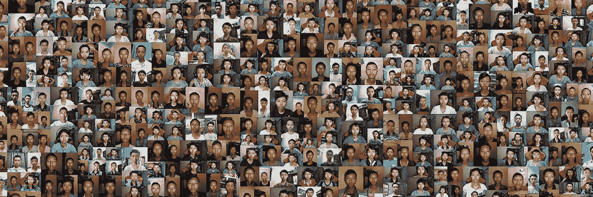

# 认识一下因为一个笑话而成为百万富翁的印度尼西亚人

> 原文：<https://medium.com/geekculture/meet-the-indonesian-who-became-millionaire-thanks-to-a-joke-b5ee1753afea?source=collection_archive---------22----------------------->

Gustaf Al Ghozali [Twitter](https://twitter.com/Ghozali_Ghozalu/header_photo) banner

Gustaf Al Ghozali 靠卖自拍成为百万富翁。

这位计算机专业的学生从 18 岁起就每天给自己拍一张照片。他的想法是制作一个延时录像，在毕业典礼上作为一个笑话来展示。

快进到 2022 年，他将近 1000 张自拍照转换成 NFT，并在……