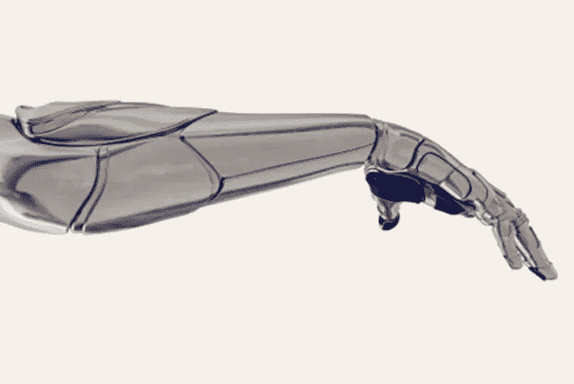

# 见见这只猴子，它能用她的思想控制世界另一端的机器人

> 原文：<https://medium.com/geekculture/meet-the-monkey-that-can-control-a-robot-on-the-other-side-of-the-world-with-just-her-thoughts-f03b0743a9e3?source=collection_archive---------48----------------------->

## 以及它对截瘫/四肢瘫痪患者未来的意义。

Photo by [The Verge](https://www.theverge.com/2013/2/22/4016570/monkey-mentally-controls-robot-7000-miles-away)

雨-机接口科学家[米盖尔·尼科莱利斯](https://www.nicolelislab.net/)是这个令人难以置信的发现背后的人，而[奥罗拉](https://today.duke.edu/2003/10/20031013.html)是让这一切回到原点的猴子。