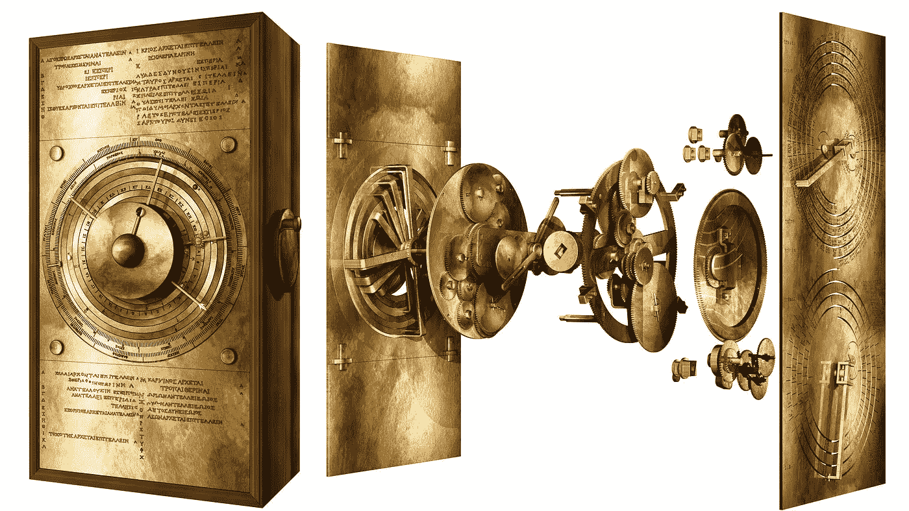
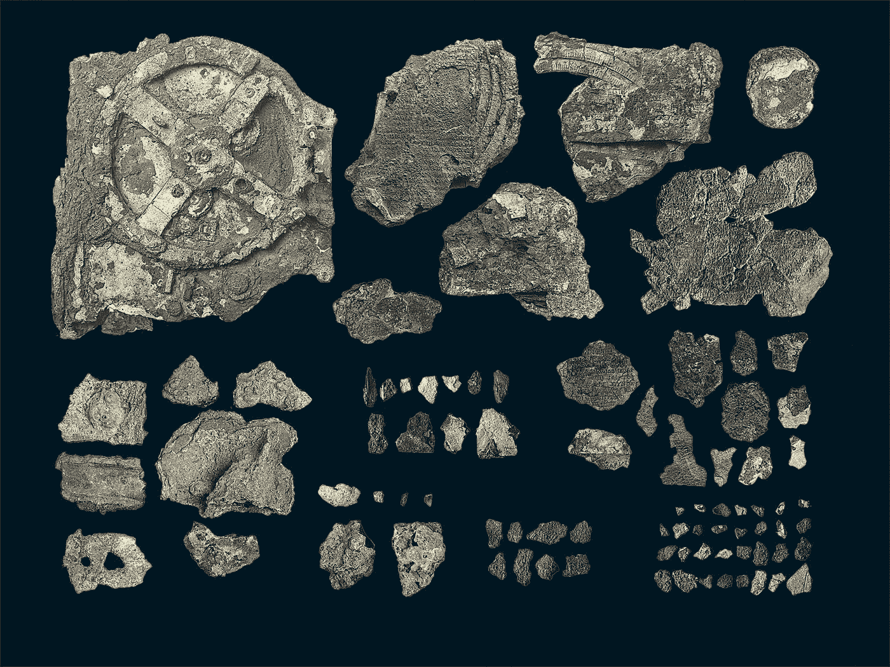
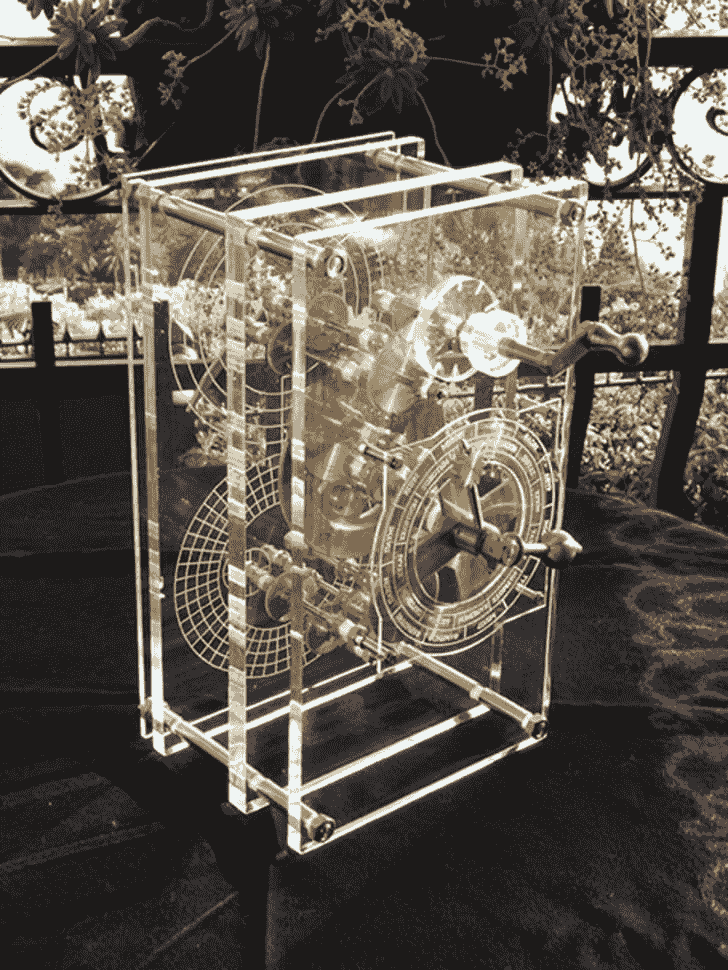
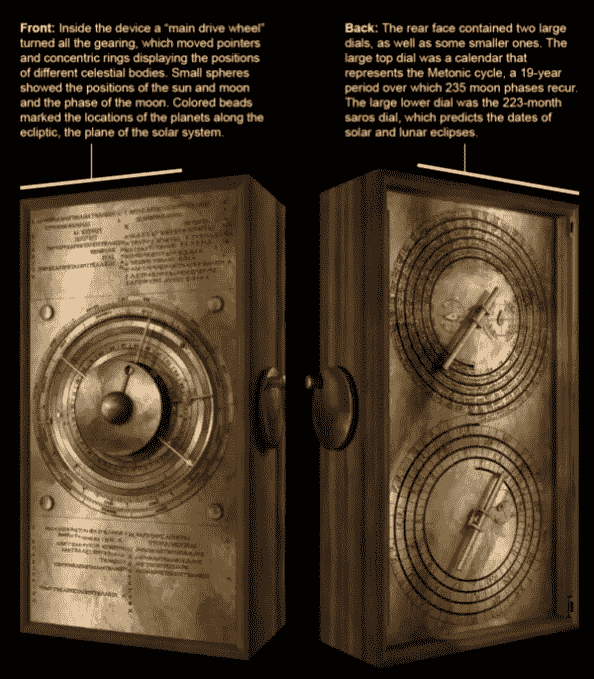
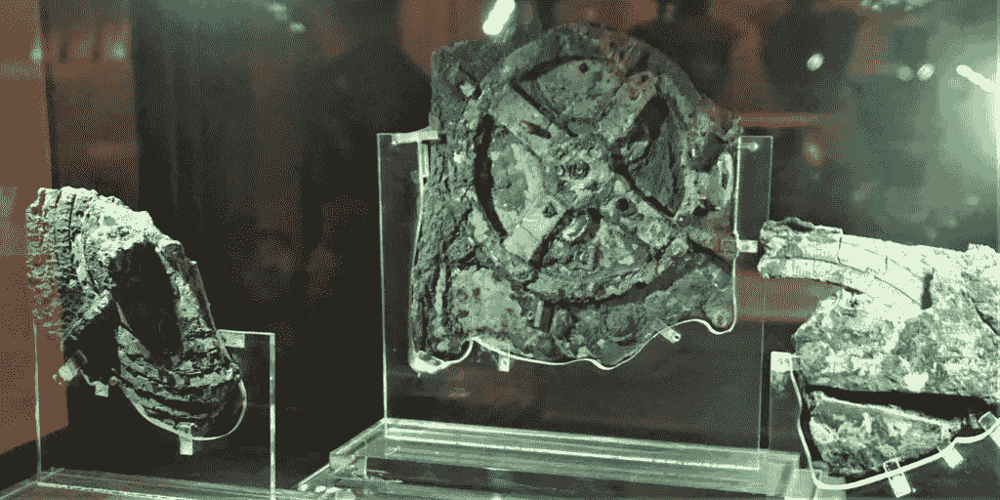
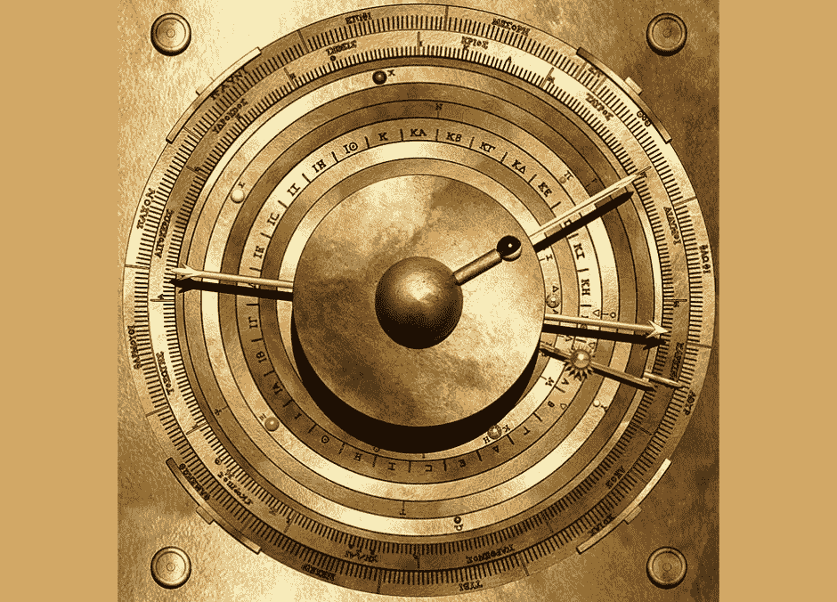
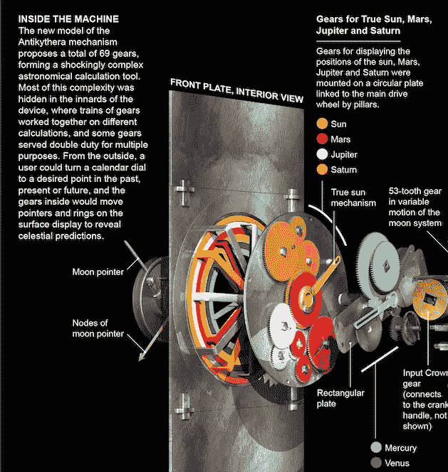
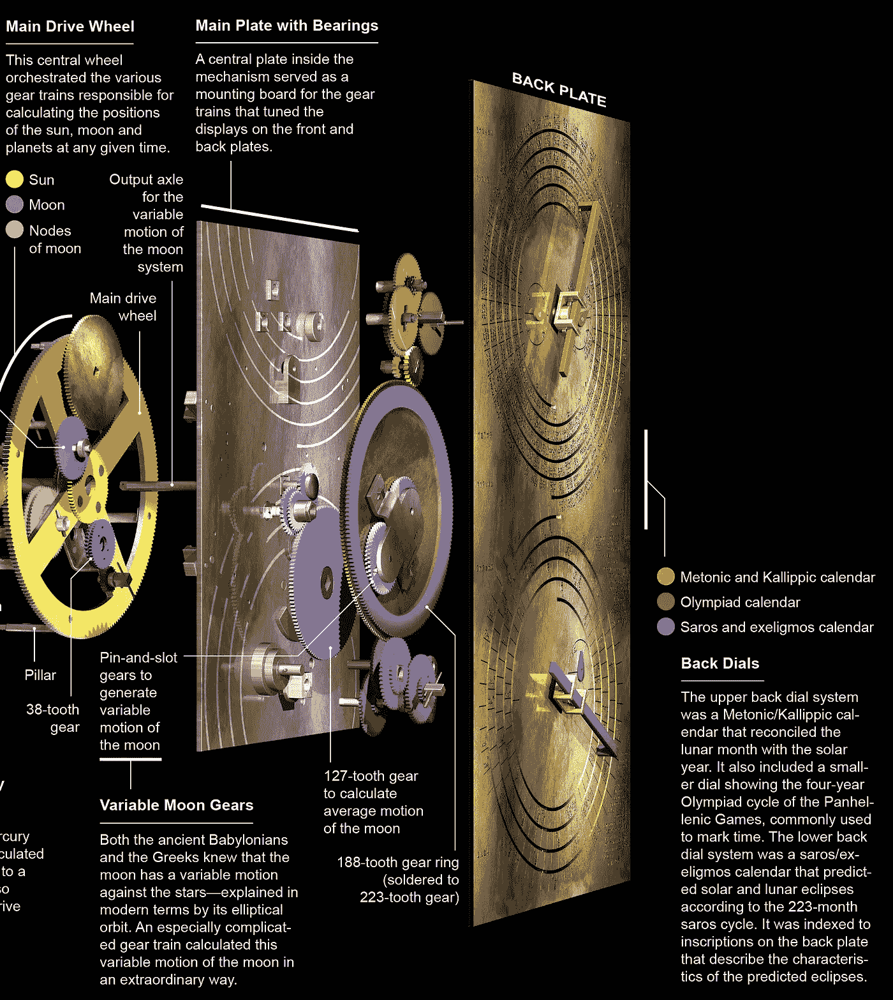

# 认识世界上最古老的计算机:安提基西拉机制

> 原文：<https://medium.com/geekculture/meet-worlds-oldest-computer-the-antikythera-mechanism-6b9e89cd59f7?source=collection_archive---------7----------------------->

在一艘古希腊沉船中发现的这件 2000 多年前的文物几十年来一直吸引着考古学家、古典学家、历史学家和公众。

Source: GI

## 名字里有什么？

安蒂基希拉岛是一个岛屿，意思是“基希拉的对面”，希腊的另一个大岛。公元前 1 世纪，当一艘船在岛屿海岸沉没时，船上载有大量可追溯到早在 3 世纪
的有趣文物。其中一个是安蒂基希拉装置的碎片，它仅占整个装置的三分之一。

82 fragments of the mechanism, SourceL GI

## 谁做的？

三角学的发明者和古代天文学家，**希帕克**。虽然，新的研究显示了两个不同的人在 Antikythera 上的笔迹。这意味着它很可能是在一个企业或车间创造的。

## **有什么了不起的？**

如你所知，机械模拟计算机是与齿轮和杠杆等部件一起设计的，不使用电子部件，不像今天的数字计算机。安蒂基西拉机制因此被称为最早的模拟计算机。

Source: Wikimedia Commons

追溯到公元前 87 年，它被用来提前几十年预测天文位置和日食。它还可以跟踪类似于古代奥运会的 4 年周期的体育比赛。

通过转动手摇曲柄，一个人可以在时间中前进或后退。曲柄使齿轮转动一系列表盘和圆环——上面有希腊黄道十二宫和埃及日历日的铭文和注释。

Source: Scientific American

日历是基于从一个满月到下一个满月的时间，一个特殊的表盘可以让人们想象季节，这对农业很有用。希腊人也相信日食的特征与好的和坏的预兆有关，所以未来也可以用这个装置来预测。

## 我们是如何知道这件事的？

嗯，最初我们不知道这个设备有多革命性。

1959 年，普林斯顿科学历史学家德里克·j·德·索拉普莱斯发现主齿轮在移动以代表日历年。较小的齿轮代表行星、太阳和月亮的运动。物理学家和历史学家德里克·德·索拉·普莱斯于 1974 年首次发表了关于这种机制的文章。但是当他 1983 年去世时，他的工作仍未完成。

> “它是如此完全不同和奇怪，以至于几乎不可能……它是某种带有齿轮系的机器，非常像现代发条闹钟的内部。”—理查德·费曼，著名的物理学家

在这十年中，一项为期 5 年的调查计划从 2014 年开始，到 2019 年结束，另一项计划从 2020 年 5 月开始。

古典主义者亚历山大·琼斯团队在 2016 年进行的一项调查也对该机制做出了新的解释，基于该设备上现存的 3400 个希腊字符。它显然可以跟踪至少 42 个不同的日历事件。此外，行星运动的精确度在 1/500 以内。

## **内置说明书**

在机械装置后面的文字表明，发明者要么留下了如何操作的说明，要么留下了用户所看到的解释。

## 接下来呢？

据**科学** **杂志报道**称，伦敦研究人员最近声称，从用于创建该设备的古代计算中，重现了该设备的设计。

Source: UCL Antikythera Research Team

Source: UCL Antikythera Research Team

但是发表在《科学报告》杂志上的结果仍然是高度理论化的。我们仍然需要找出建造它所需的技术。

好奇的专家们正在努力破译隐藏在机械装置内部的铭文，特别是要了解机械装置的失踪部件，有些已经毁坏，有些可能仍在海底。

要了解更多关于这一古老奇迹的信息，请查看以下深入分析:

# 参考资料:

1.  [https://www . stories . summa char . in/43011-antikythera-mechanism-worlds-first-analog-computer-2021-04-06/](https://www.stories.summachar.in/43011-antikythera-mechanism-worlds-first-analog-computer-2021-04-06/)
2.  [https://www . space . com/scientists-unlock-cosmos-antikythera-mechanism-worlds-first-computer](https://www.space.com/scientists-unlock-cosmos-antikythera-mechanism-worlds-first-computer)
3.  [https://www . mental loss . com/article/81445/15-interfering-facts-about-antikythera-mechanism](https://www.mentalfloss.com/article/81445/15-intriguing-facts-about-antikythera-mechanism)
4.  [https://www . Smithsonian mag . com/history/decoding-antikythera-mechanism-first-computer-180953979/](https://www.smithsonianmag.com/history/decoding-antikythera-mechanism-first-computer-180953979/)
5.  [https://www . scientific American . com/article/an-ancient-Greek-astronomical-calculation-machine-reveals-new-secrets/](https://www.scientificamerican.com/article/an-ancient-greek-astronomical-calculation-machine-reveals-new-secrets/)