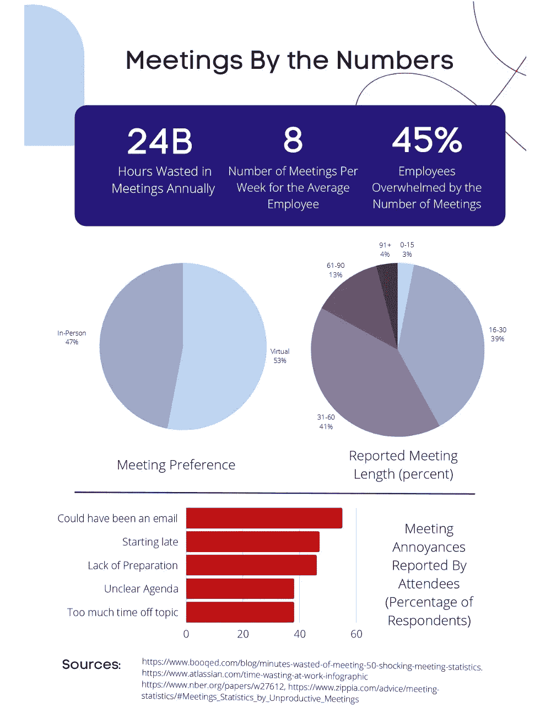

# 远程时代的会议

> 原文：<https://medium.com/geekculture/meetings-in-the-age-of-remote-22f7505e9b35?source=collection_archive---------19----------------------->

在所有有记载的人类历史中，人们一直以这样或那样的形式聚会。在此过程中，这些聚会成了组织工作中的一个主要部分。最近，越来越多的人开始询问他们的目的。随着人们追求更高的效率，以及不断变化、流动性更强的员工队伍，我们在如何见面、见面频率以及如何照顾……