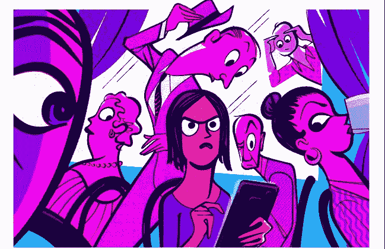
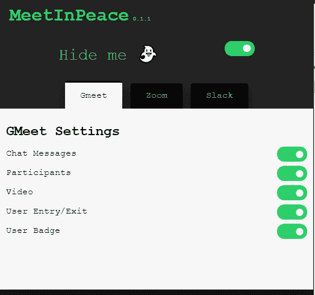
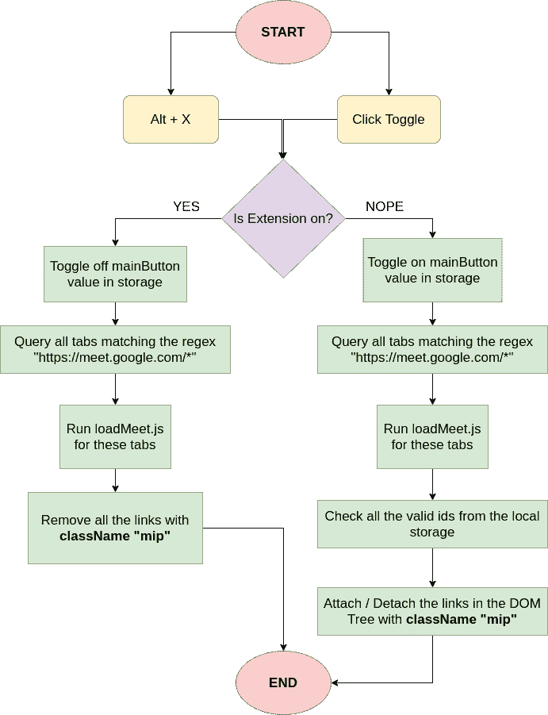
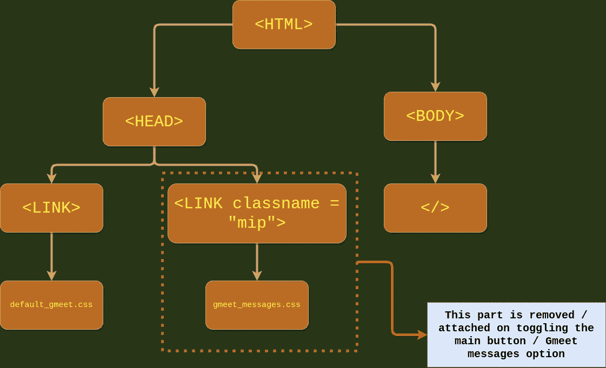
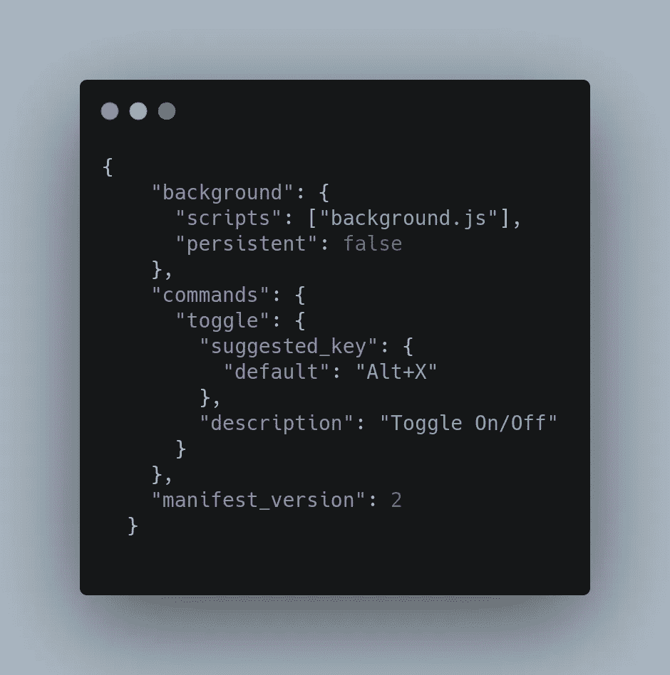
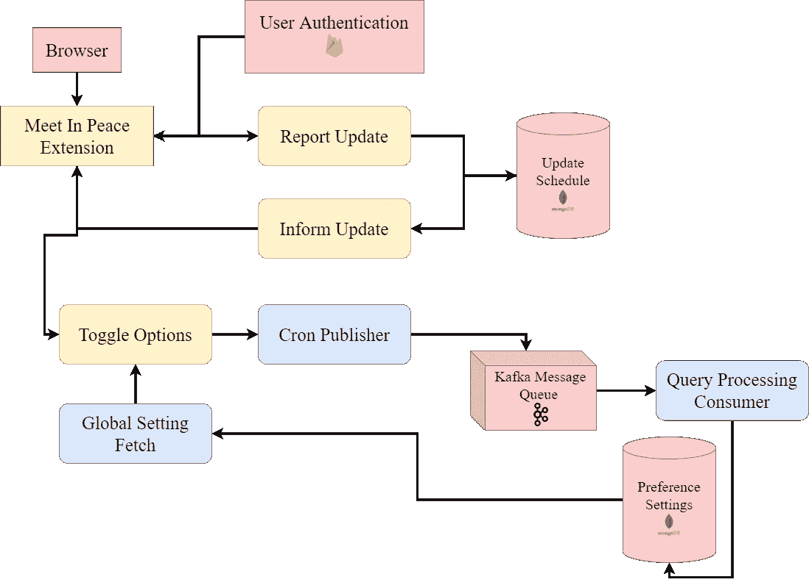

# MeetInPeace |防窥探、专业隐私 Chrome 扩展

> 原文：<https://medium.com/geekculture/meetinpeace-anti-snooping-pro-privacy-chrome-extension-24cad71f1e85?source=collection_archive---------18----------------------->

## 为什么这个浏览器隐私扩展是一个生命的拯救者，智能工程如何扩展它？

## 太久没看书了？🚶

我们赢得了 NIT Durgapur 组织的 **Hackoverflow 4.0** ，这是对我们提交的内容以及我们如何做和为什么做的详细说明。查看 devfolio 提交的更多内容，并通过 Github 链接试用该项目。

Devfolio submission

*   Devfolio link: [相约投稿](https://devfolio.co/submissions/meetinpeace-6489)

 [## uds 5501/和平集会

### 谷歌会议，缩放会议网络应用程序和 Slack 的反窥探浏览器扩展模糊了一切重要的…

github.com](https://github.com/uds5501/meet-in-peace) 

# 🧠产品的构思

你有没有在咖啡馆工作/参加视频电话会议/只是坐在一个位置上和你的朋友在 let's say discord，slack，或者 WhatsApp 上聊天，然后一个陌生人或你的妈妈从后面跳出来，你的屏幕完全可见？听起来像一般的中产阶级家庭，不是吗？

Peeping people

我敢打赌，这种情况发生在你们所有人身上，有那么一刻，你希望你能让屏幕变黑或变模糊，或者让偷窥者消失！

我们不能对你身后的人做些什么，但也许我们可以对屏幕做些什么。

> 怎么样，模糊了所有敏感的地方，如信息，摄像机，参与者和其他团体，你可以用一个简单的热键组合激活，你可以通过悬停在它上面发现关注的地方？

**这正是我们通过构建浏览器扩展所做的，将您从糟糕的时刻中解救出来；)**

# 介绍🥁和平会议

## 这是什么？

这是一个方便的反窥探，专业的隐私，浏览器扩展，以保护你免受每个人在重要会议和谈话中窥视你的屏幕。

MeetInPeace UI

在 0.1.1 版本中，它目前支持 Google Hangouts、Zoom 和 Slack Messaging，您可以模糊掉敏感区域，如消息窗格、视频通话屏幕、您的用户徽章和参与者信息。

## 怎么用？👨‍🏫

1.  转到 [uds5501/meet-in-peace](https://github.com/uds5501/meet-in-peace) 并在您的本地系统中克隆存储库。
2.  转到浏览器的扩展设置，打开开发者模式。(我们目前已经测试了它在 Chrome 和 Brave 浏览器上的运行情况)
3.  点击加载解压缩。
4.  选择`src/`并等待加载。
5.  通过点击(隐藏我旁边的开关)手动打开主开关，或者点击“Alt + X”打开扩展！
6.  专注于会议，没有任何顾虑。

这个视频应该可以帮助你，并作为我们的产品如何工作的小演示

## 现有解决方案？🧰

这么多的描述一定会让你想，“但是 Uddeshya…难道没有更好的方法或类似的产品吗？”

为了解决这个问题，请允许我详细说明您解决这个隐私问题的替代方案。

1.  你可以买一个**过滤网**，它可以在一定的角度范围内隐藏你的屏幕，但价格为 2500 印度卢比。
2.  你可以继续**锁定你的屏幕**，但是这样你**不会完成任何工作**，留在会议中，只是模糊掉你不想让其他人看到的东西怎么样？
3.  你可以试着**把围观者赶走**，但是你做不到不让局面变得尴尬，不是吗？

但是有一个隐私扩展，我想提一下，它是我的团队的灵感:[Whatsapp web 的隐私扩展](https://chrome.google.com/webstore/detail/privacy-extension-for-wha/jbojhlhhggfmmkpefknmbdhlaghehini?hl=en)它是模糊和揭示想法的开源实现，但专门针对 Whatsapp。

# 工程时间！这个扩展是如何工作的？🛠📋

如果非要我用两个字总结的话，那就是“ **DOM 操纵**”。

但是如果你已经做到了，你肯定需要两个以上的词，所以这里是:

## 当前版本[v0.1.1]

当前版本的浏览器扩展查询你的浏览器标签，并在 chrome 存储器中保存某些跟踪变量(如`gmeet_messages`)，这些变量基本上是布尔值，存储你是否想在 google meet 中模糊`messages pane`。

现在，我们将在 DOM 树中创建一个新的`link`元素，它将加载一个名为`gmeet_messages.css`的 CSS 文件，该文件为相关 web 应用程序(这里是 google hangout)中使用的各种类维护自定义样式。

Flow chart for google meet use case

在`on`和`off`之间切换选项，从网页的 DOM 树中附加/分离这个链接节点，从而产生模糊/取消模糊效果！

DOM Tree when extension works

## Alt + X 热键是如何工作的？🔥

它使用 chrome 扩展开发工具提供的后台加载程序工作。你必须指定一个非持久的后台加载脚本来监听一个**命令**(比如一个热键组合，你必须在清单本身中指定)

# hacky 实现中的拦截器😓

例如，目前在实现中有多个阻塞器

1.  没有**跨浏览器数据同步**，你的浏览器数据是本地的。假设我想将设置从 Brave browser 保存到 Mozilla 浏览器，我将无法导入这些设置。为此，我需要使用一个集中的数据存储，并每天更新，这样用户的所有浏览器都是同步的。
2.  你不可能知道为什么 google meet / zoom / slack 不起作用。因为我们使用了类名，它们可能会在相关 web 应用程序的任何生产周期中发生变化，我们该如何处理呢？我们将需要更新 CSS，但我们需要通知用户关于延迟。
3.  团队很小，观察范围也很小，**怎么知道什么时候扩展无效**？我们将需要用户报告来保持相同的跟踪，以便我们可以处理用户报告，并在更新工作的同时发送更新正在进行的通知。

# 再来说说建筑！🏗

因此，考虑到上述问题，我们将需要用一个合适的架构来扩展这个宝贝，我们可能会有一个最终的工作流程来做到这一点。

*   红色的是外部服务，蓝色的是 kafka 出版商和消费者/订户，黄色的代表扩展明确提供的功能。
*   更新的报告和通知将由**从更新时间表 MongoDB 数据库**直接获取来处理。这里使用 mongoDB 是因为报告更新预计不会被经常使用，但是通知更新是一个读负载很重的操作，这使得整个过程更加**读负载重**，因此使用 MongoDB，它可以在以后被分片以处理更高的负载。
*   **用户认证将由 firebase** 自行处理，我们只需即插即用，无需重新发明轮子，因为专家已经为您完成了。
*   首选项的切换和本地存储保存将由浏览器存储处理，但数据库中每次更改的首选项的全局更新必须由一个**写密集型**数据库处理，由于我倾向于使用 no-sql，所以让我们只使用一个 **Kafka 队列**作为我们的消息代理，它将在 24 小时的间隔后获取最新的首选项，这样当我们可以直接通过 mongo 实例获取最新存储的数据时，就不会推送陈旧的数据。

# Arigato Gozaimasu！

感谢您的倾听和博客的结尾，您可以在参考资料中的 GitHub 链接和/或 Devfolio 提交中查看该项目，它在 **Hackoverflow 4.0** 中被选为获胜者！

结束，团队**fu11 队列**。

*   阿希什·辛格
*   乌代什亚·辛格