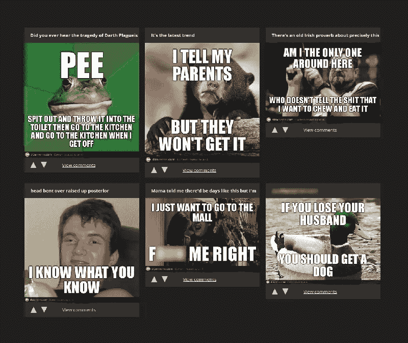
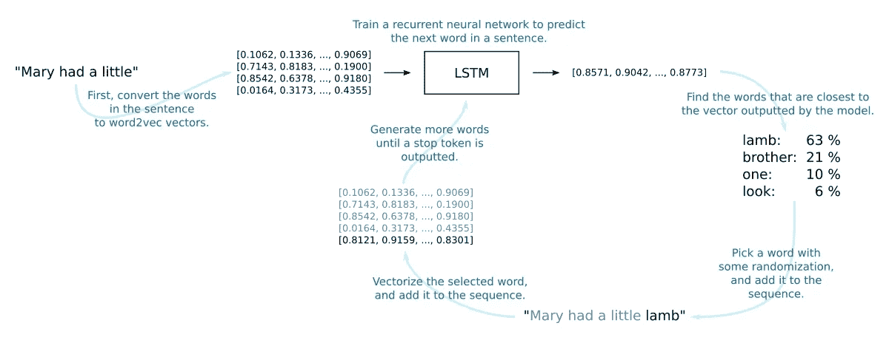
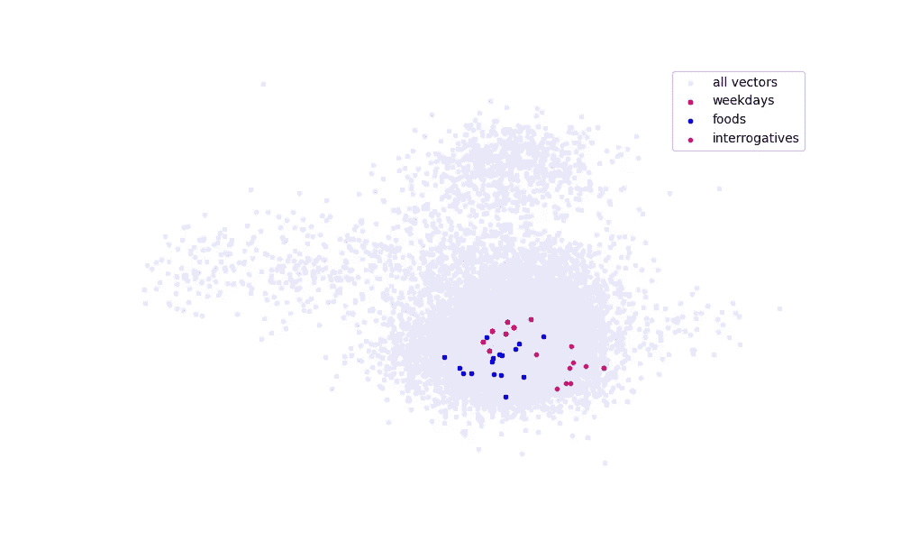
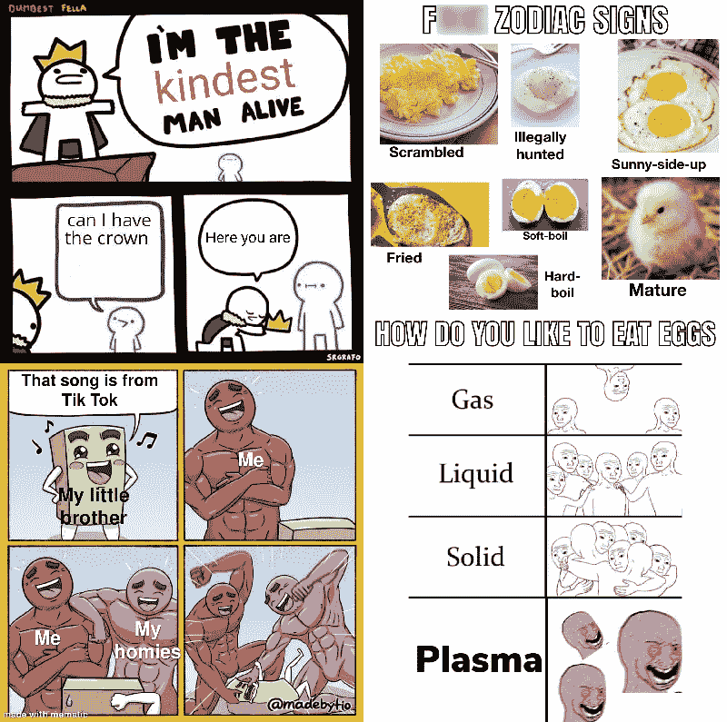
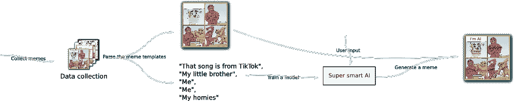

# 迷因对机器

> 原文：<https://medium.com/geekculture/meme-versus-machine-47552a4a5076?source=collection_archive---------45----------------------->

## 第一部分:在 2017 年

早在 2017 年，我就有了这个网站，叫做*slow me。*它用一个“人工智能”来产生迷因，而且它们相当不错。这是在 2017 年，远在用那些讨厌的*geepeetee two*和*three*制造[迷因生成器](https://towardsdatascience.com/ai-memer-using-machine-learning-to-create-funny-memes-12fc1fe543e4)之前。我处于迷因生成技术的前沿。

一切都很棒，迷因生意也蒸蒸日上。

直到我不得不拔掉插头。

这个由四部分组成的系列跟随我回到人工智能迷因生成游戏巅峰的旅程，并向你展示如何做同样的事情。

# O.G. meme AI

Slowmeme 是一个基于用户输入，使用机器学习来生成迷因的网站。

模型的输入是用户选择的标题和模因模板，输出是模因文本。这个生成的文本叠加在迷因图像上，给了我们最终的结果。

以下是 Slowmeme 最优秀作品的几个例子:

Memes generated by the last iteration of the original Slowmeme.

我不是在拍自己的背，但是加油！他们很棒！

早在 2017 年(以及在那之前的几年)，“meme”这个词是少数网络知名图片的同义词，上面叠加着白色的全大写文本。从上面的例子可以明显看出，Slowmeme 就是专门用来生成这种模因的。

Slowmeme 最后一次迭代的内部工作非常简单。在 Slowmeme 的机器学习内部的核心，有几千个 LSTM 节点。这个 seq2seq 模型的基本功能就像教科书一样，可以想象:给模型一个单词序列，它会尝试预测下一个单词。

我试着将 Slowmeme 的内部工作可视化到下图中。

Graphical explanation of the LSTM/word2vec text generation approach employed in Slowmeme’s last version.

总而言之，这是一个非常简单的小东西。

当我开发 Slowmeme 的时候，我只有有限的训练数据，也没有那么强的计算能力。使用迷因语料库中的整个词典作为输入和输出标记 a)在计算上是禁止的，b)对于泛化来说是糟糕的选择。我试图训练一个模型来逐个字符地预测(就像 GPT 模型那样)，但这要么是由于缺乏 GPU 内存或训练数据而过度拟合，要么是输出文本没有以任何有意义的方式真正符合迷因。

这些旧的模因通常包含某些半静态的单词结构，这些结构在模因之间重复(也就是说，在同一个模因模板内)。我尝试的这些一键单词令牌模型和逐个字符模型并没有真正做到这一点。因此，我决定让自己的生活变得简单:不使用前面提到的方法，而是使用单词的向量表示作为输入和输出。

您可以将 word2vec 向量看作矢量化单词的数字形式“含义”:在 word2vec 向量空间中，同义词彼此接近，而完全不相关的单词之间的距离会更大。这使得模型变得更小，同时仍然能产生多少有点连贯的句子，在这里和那里的同义词之间有一些混淆。

假设你们中的许多人不熟悉稍微过时的 word2vec word vectors 技术，那么做一些快速和肮脏的可视化可能是个好主意。下面的代码片段使用大约 10，000 个随机单词的 25 维 word2vec 矢量表示，并使用主成分分析将这 25 维转换为二维。然后我们画出这 10k 个单词，同时突出三个不同的单词组:工作日、食物和疑问词。

代码生成下图。正如我们所看到的，来自相似组的单词确实整齐地出现在大致相同的位置。我用多达 100 万个单词对可视化进行了测试，各组的分离更加明显，但图片不再漂亮了。所以我勉强接受了 10k。我想你已经明白要点了。

A 2D projection of a 25-dimensional word2vec model, made by fitting a PCA model and plotting the transformed word vectors. Only 10k word vectors used in the graph.

所以。这些单词向量是 LSTM 模型的输入和输出。该模型本身被训练成从包含标题、迷因模板标识符和迷因标题的序列中预测下一个单词。

就这样。那是 Slowmeme。这个应用程序创建起来非常简单，生成的迷因超现实但有趣，人们真的很喜欢整个概念。但是后来怎么样了呢？

# 拔掉插头

不幸的是，2017 年 12 月，我将要去印度进行一个交换学期。我的 meme 生成操作中最重要的 GPU 后端是在我壁橱里运行的物理机器上。而且，由于我要在交换学习期间转租公寓，我再也不能自己托管 GPU 后端了。

我研究了从云中租用 GPU 服务器，以保持网站的运行，能够运行该模型的最低规格的机器绝对是 50 美元以上。这是来自一些*真的*可疑的 VPS 提供商，已经不存在了。如果我想要一个类似于我的自托管硬件的 AWS 服务器，我会为托管 Slowmeme 每月支付 200 多美元。

所以，我是一个即将出国留学的穷大学生，想尽可能多地花钱去旅游和喝啤酒——我该怎么做？每月花费 50-200 美元来托管一个只有少数(忠实)用户的愚蠢的 meme 网站的想法在当时是不合理的。当然，该网站为*带来了一些* AdSense 收入，但远远不足以支付庞大的云图形处理器的成本。该企业的净现值严重亏损。

所以我决定终止 Slowmeme。

旧的 Slowmeme。

# 到底什么是迷因？

迷因游戏在过去五年里发生了真正的变化。

就像，当我做《叶老慢镜头》的时候， [/r/AdviceAnimals](https://www.reddit.com/r/AdviceAnimals/) 就是狗屎。如今，不同种类的模因数量激增。即使我们掩盖了简短视频的整个*世界*(抖音舞蹈、/r/wallstreetbets 重新掌握的《华尔街之狼》的迷因版本，等等……)，不同的格式和人们以图片形式创建迷因的方式与 2017 年是不同的游戏。

这些只是我从 Reddit 上找到的几个例子:

Examples of modern memes from /r/memes. From top left to bottom right, credits for the memes go to the following Reddit users: /u/ARTA_THE_KILLER, /r/glizzyMaster108, /u/HeartStoneTV and /u/Meerkat_Mayhem_.

这些没有清晰可见的共同点。除此之外，他们试图搞笑，他们是图片。图片，上面可能有一些文字。

关于我为 O.G. Slowmeme 使用的训练数据的一个小趣闻。Reddit 上有一个机器人可以识别/r/AdviceAnimals 提交的标题和 meme 格式。所以，我没有从 Reddit 上抓取成千上万的模因，并建立一个文本检测管道来解析它们，而是从 Google BigQuery 的 Reddit 评论数据集中下载了这个机器人的评论。SQL 查询花了大约两分钟，运行查询花了大约半分钟。所以，我花了不到五分钟的时间收集了当时所有相关迷因的数据集。

今天的情况并非如此。祝你好运，你能造出一个机器人来注释上面显示的非常简单的迷因。迷因有数不清的不同形式，建立一个产生迷因的管道并不像当时那么容易。

# 新 Slowmeme

我不再拥有 Keras 模型或任何与 GPU 后端进行实际模因生成相关的东西。即使我是，我也不知道备份在哪里。公平地说，结果并没有*那么*惊天动地，以至于我不应该从头开始重新制作整个东西。

接下来的几周我会的。

这个人工智能迷因生成器的新神皇将会和它的前任有很大不同。它将能够不断学习新的模板，而不局限于旧的建议动物格式。我在这个过程中使用的技巧绝对不全是 *AI* ，但我打赌这仍然会是一次有趣的到达终点的旅程。

这个史诗迷因传奇的其余部分将分为以下主题:

1.  收集数据并解析迷因模板
2.  基于用户输入生成迷因
3.  创建新的 web 服务

The Slowmeme project plan.

本系列的后续文章将比这篇介绍性文章更具技术性，但仍然是半开玩笑的。我已经有了大部分(如果不是全部的话)步骤的工作原型，所以我将花点时间来写这个过程，挑选最好的代码片段，并构建最终结果的最终形式。

如果你对机器学习的这个应用感兴趣，那么就订阅我，极客文化，或者给这个页面加书签。我将在上面的主题列表中添加链接，因此您可以在那里找到本系列的其余部分。

下周见！